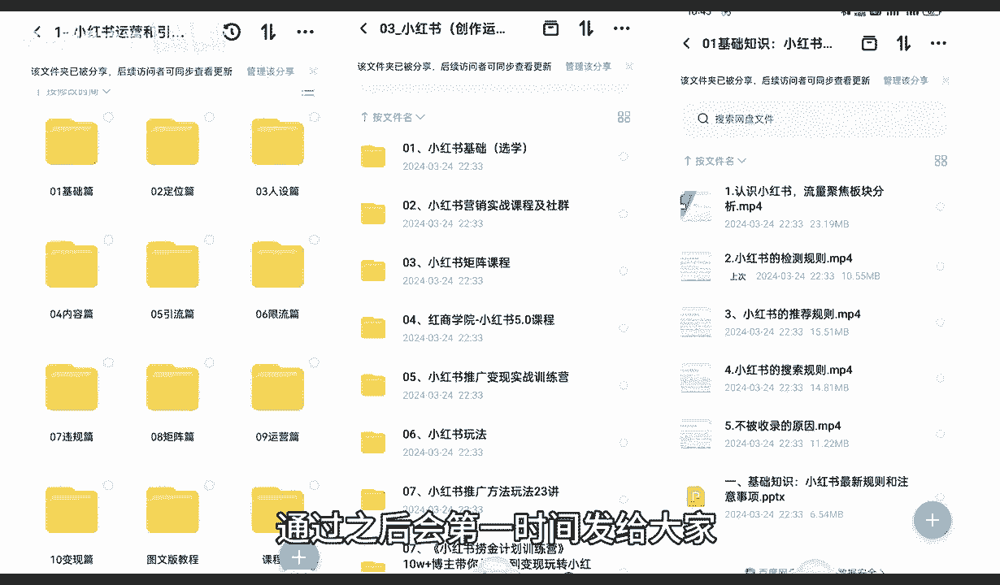
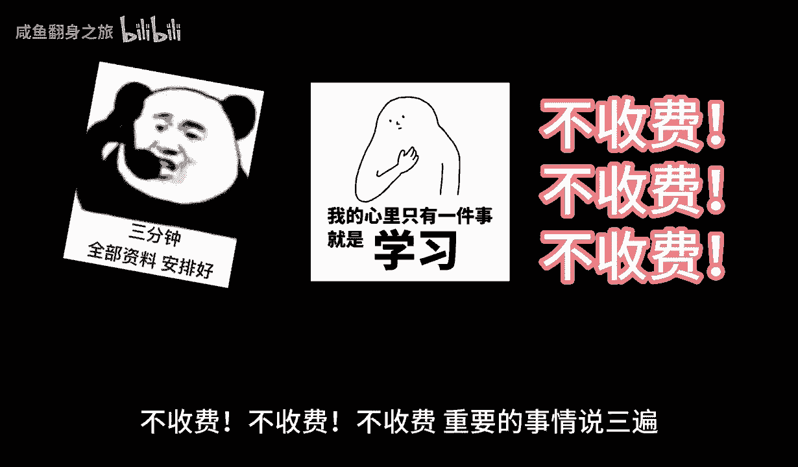

# 【2024版小红书体运营教程】全B站最良心的小红书开店运营高阶教程合集，小红书体开店 起号真的快.jpg - P14：4.2.新手小红书运营-小红书本质（2） - 咸鱼翻身之旅 - BV16bHSeXEea

大家好，今天给大家分享的是小红书全集系列，第二课时小红书本字啊，是接着我们上一节的内容给大家进行讲解，上一节呢主要是讲解了一下小红书，它整体的话和其他三大主平台的一个区分啊，接着我们上节课的内容的话。

是，上节课给大家讲的是生活方式的一个社区分享，它主要的话比较适合的话，就是说嗯做网红博主啊，为什么网红博主的话，他在这个里面的话，就是说只需要我们自己对这某一个方面，某一个行业方面啊有一定的经验。

有一定的了解，或者说有自己的体会，都可以去操作这个生活方式，社区的一个分享内容，简单来说就是我们日常的一个嗯网红博主分类，选择一项我自己感兴趣的，我对这个词，对这一内容很了解的啊，进行一个匹配啊。

我们要匹配系，我们要匹配平台，平台也要匹配，我们如果说你找到的平台不适合你去操作，那说实话啊，你品你在小红书本子里面的话，你都找不到适合自己的一个定位的话，那我就建议的话就不要去做小红书了。

因为那样的话，你把小红书你就算了解透了，你的自身的一个社交应用内容，也包括卖产品也好，做博主也好，或者做其他的也好，你不适用于小红书，那我建议你的话或者说多花点其他的精力啊，去做其他平台可能会好一点。

那第二个内容呢就是内容电商的一个融合体，什么叫内容电商啊，它不同于传统电商平台，小红书的话，它通过高质量的内容来形容，说是说直白了啊，小红书80%到90%的一个，女性用户里面的话。

她的整体定位就一个我们全部定位在这个地方，他通过高质量内容吸引用户，是什么意思呢，其实小红书他这只是给自己的一个评价，我们正常了解的话，就说小红书里面他卖的都是非标品的一个产品，什么叫非标准品产品。

没有品牌自主制造啊，实用，然后自己用过以后有效果的就是小的一个品牌，他会通过这种高质量的一个方式来吸引小红，小红书的一个女性用户来小红书啊，我们进行分享的笔记里面来购买产品，这些内容的话他比较基础。

比较容易激发用户的一个购买欲望，为什么，因为这些产品我们是自己试验过的，我们对它进行了一些一系列的详细讲解，他的图片也好，文章也好，内容也好，它都基本上都是要包括产品的一个价格，适用性，适用范围等等啊。

它和其他的一些平台不一样，其他的平台他只管把产品放上去，图片放上去，大概的一个效果放上去，通过这种方式啊来进行促进成交，小红书在这种成交方式上面，进一步进行了优化啊，这就需要看我们自己的一个文章笔记。

怎么去调整，怎么去写了，就是说他整体来适合的话，就是说我们非标品的一个产品，非常容易在小屋上面去操作啊，就是我们自己的产品，然后的话这个产品没什么品牌，没什么名气，我想从小红书上面给他打上标签啊。

通过小红书这种网络形式的话，把它推广到全国各地，这种方式的话，其实非常适合内容电商的一个融合体啊，也就是小红书平台给我们创造的一个卖货渠道，第三个呢就是说啊精准营销引流量的一个变现。

为什么要叫精准营销与流量变现平台，它小红书平台它是呢是利用大数据和机械啊，学习技术，就说他把别人三个总体的一个数据量，相当于是半拷贝过来了，然后进行的优化啊，对用户的一个行为和兴趣进行深度分析。

实现内容与用户的精准匹配，这种个性化的一个推送机制的话，那就是说我们在前期建立账号的时候，就是小红书账号建立的时候，就已经给我们定型了，他不需要我们再去强行的去做达标啊。

我们刚开始前期小红书创号建立的时候，他就有那么多的一个兴趣选择，那你选择了这几个主体兴趣以后，除非你去手动搜索，其他的一个不是同类型的一个东西呃，内容的话他才会给你推荐。

不然的话他基本上都是会推荐给你选，所选的三个内容，比方说我们刚开始选择的是美妆美食，户外运动，那他基本上给我们推广的就是什么呀，美妆的一个内容，美食的一个龙，还有一个户外运动，其他的很少给我们推。

只有5%的几率啊，所以说我们在创建小红书账号的时候，他基本上上来就给我们定性了啊，就看我们这个账号我们自己怎么去调整，但是作为我们啊，你是想做博主也好，做商家也好，做用户也好啊，账号前期是非常重要的。

所以说在这里面呢，它有一个精准营销与流量变现，他这个是小红书的一个系统，我们了解这个系统以后，就知道小红书前期最重要的是什么，账号权重，只有把账号权重做好了，我们小红书后面你是做店铺也好，做引流也好啊。

做博主也好，你对应的一个兴趣爱好选择对了，那么你的流量会多70%到80，如果说你的兴趣流量没选择对，你本来是做美妆博主的，你选你选的一个兴趣爱好，里面反而没有美妆博主。

你选的其他几个或者前期我们没有打算做，但是账号已经创建了，选择了这种方式以后的话，你再想去做这个博主，他给你推的流量其实是不匹配的啊，所以说内容电商的一个融合体，包括这个精准营销的一个流量变现啊。

他是给我们定位的啊，只有我们定位定准确了以后，我们才好去操作，包括了啊，第四点非漂比例也好，第五点年轻用户的一个主导也好，和信任与社会的一个结构啊，这个都是小红书，他对自己啊。

我现在给大家讲的这个小红书的本字啊，他是不是我打出来的啊，这个我给大家说一下，这个是整个网络系统对他的一个评价，我只是说通过这个评价给大家去进行分析，我们要做什么啊，下面的才是我主要的一个讲课内容。

前面的话，我实际上先大家先了解什么是小红书啊，非标非标品的一个交易特色，就是我刚给大家说的啊，第二点的一个主要内容的一个分支内容，电商的一个融合体，在小红书里面做非标品比做标品效果还好，标品说实话。

别人做卖标品的基本上都是去淘宝拼多多，京东大件京东啊，标品淘宝散货就是拼多多，类似这种，但是我们正常的这种非标品的话，你去拿到另外三个大平台去卖，也不好卖的，所以说非标品在小红书里面是非常非常好做的。

小红书电商侧重的非标品商品啊的一个交易，这个这个类型的商品的话，往往依赖用户的一个口碑，就是我之前跟大家说的，我们产品的一个介绍，它是通过图文并茂，和我们自己用过以后的一个体验啊，传导给另外一个人。

或者说传导给另外一个群体，让他们了解这个产品对自身有什么好处啊，对自身有什么提升，通过这种方式来宣传的一个产品，它和直接卖货是有很大区别的啊，所以说非标品交易的话，在小红书上面是非常好做的。

第五个就是年轻用户主导，什么叫年轻用户主导，小红书的一个用户群体，以年轻追求品质生活的九零后和零零后为主，这个东西都是可以去考证的，你们如随便去百度也好，或者是去谷歌也好。

去其他任何地方去搜索一下小红书，它整体的一个主场和一个消费用户，都是90%以上啊，都是女性用户，而且是18~35岁为主啊，那这一部分人的话，他追求的是什么生活的品质新奇啊，我没自己没见过的东西。

好看的东西，好玩的东西，好吃的东西等等这些，所以说我们在选产品或者选内容的时候，一定要往这个方面去靠啊，18~35岁，李迅喜欢什么，喜欢什么的类型啊，一定要有一定的了解。

最后一个就是信任与社会的一个结构，什么叫信任与社会的结构，就说平台，它强调的是真实性和可控性，鼓励用户发布真实的一个体验，我们自己拍摄的东西，自己制作的东西不要去倒，倒也有权重，但是权重的话。

只要是说没在没有在小红书平台上面出现过，他都会给你展示，但是展示的不多，但是我们如果说发布的是自己创建的一些东西，或者自己创建的一些内容，这些对这些东西的话，其实我们自己制作也好，AI制作也好。

或者其他制作也好，只要你选定的方式，他都有很高的一个流量负责和流量加成啊，然后通过它里面的一个互动点赞评论等方式，构建起了它的一个整体运行系统啊，基于信任的一个社会关系，喜欢你的内容。

他的点赞评论评价啊，收藏越多，那么你所整体展示的账号权重也好，内容权重也好啊，就越高，他通过这种精品的一个产品，给了你一定的流量上升空间，它不像其他的，你比方说你卖商品也好，你在淘宝在拼多多卖商品也好。

你只要要说关键词啊，要做关键词权重，店铺权重，店铺等级，销量评价啊等等这些东西你全部做好以后，你再去推广这个商品，他才会从整个大数据里面分流一部分流量，给你去进行展示，但是你要你本来就是一个新手。

你要从通过这种方式去里面抢流量，那么你的难度是多少，对不对，因为淘宝它是没有技术权重的，拼多多也没有基础权重，你包括去抖音做操作，他也没有继续基础权重，但是小红书不一样，小红书他整体来操作的话。

就说他适应了后面几个阶段，他把所有的流量基本上都平均分流了，它是通过计算你的分数，但是这个分数虽然说也是分数，但是他的分数评价很低，而且他们每一个产品，每一个小红书的一个图文文案，小红书的一个笔记。

他最少给你3000的一个曝光量，只说你这3000曝光量里面，你自己自身有多少一个点击多少，一个展示多少一个收藏架构，你的数据越好，他给你的展示就越高，你也要去淘宝做店。

那么你一个新店新产品上上去以后的话，他给你的展示可能不到50，你去拼多多做的话，基本上不到十个展示，你去抖音做也就50左右，但是可但是小红书他可以给到你，1000~3000的一个基础展示量，当然了。

这1000~3000的技术展示啊，大家还有一个前提啊，就是你前期要把账号的权重做好，还有你前期不做好的话，大概也就500~1000左右，但是你对比拼多多的十个淘宝的50个，抖音的50个来说。

小红书他在这个里面啊，它整体的一个流量分流是不是对我们新用户，或者说我们刚接触网络营销，没赶上时代变化的一些朋友来说，是不是非常大的一个诱惑力，对不对，你本来能展示给十个人看，50个人看的一个产品。

或者说分享分享的一个内容在，但是你在小红书上面的话，你就可以分享给3000个人，这就是小红书本质的一个区别啊，他和其他这种网络运营模式，网络电商平台的一个模式，包括网络宣传的一种自我营销模式啊。

的一个本质区别，所以说我们在做小红书的时候，一定要了解小红书，他对我们用户，对我们商家也好啊，对我们博主也好，对我们的一个引流也好，它对我们整体来说啊，是非常不错的一个发展环境。

但是如果说你要去做其他的，说实话对比小红书蓝队的难度的话，可能是一比五一比十的比例，这个就是小红书的一个整体本质啊，同时呢也是通过这两个的一个分享，让大家了解一下小红书到底适不适合，我们自己去做。

如果说大家不觉得做小红书，听我听我这么说了以后的话，其实小红书也就那样啊，它整体的一个展示权重，展示数据啊，没有淘宝好，没有拼多好，没有抖音好，那么大家可以去操作一下，然后再来考虑小红书，这是实话啊。

但是我认为个人认为的话，后面两到3年的时间，小红书没有太大变化，变变化的情况下，他可以从淘宝也好，拼多多也好，抖音也好，还会继续截流下去啊，他已经截留了那三个平台，30%以上的流量啊。

他还会继续加大力度，这个就是小红书的一个本质好吧，那么下一节课呢，主要给大家讲解一下小红书的一个市场，为什么说是小红书的一个市场呢，小红书的话我们先了解它本质，以后的话就说。

下一步就是了解小红书怎么变现的一个市场，这个里面的话可以把它分为两步，第一个是热门的一个商品，第二个是热门的话题，我们只有了解上，小红书说什么商品在小红书上面好卖啊，什么样的话题在小红书上面才算热门。

只有了解这两个点以后，我们才能去把小红书做好，好吧，那么这一节课这个分享课呢就到这里，下一节课呢给大家讲解一下，小红书整体市场的一个运行，最后呢会给大家一个小福利，整理了小红书运营实操资料。

可以评论区私信的方式领取，通过之后会第一时间发给大家。

注意领取资料，不收费不收费不收费。

