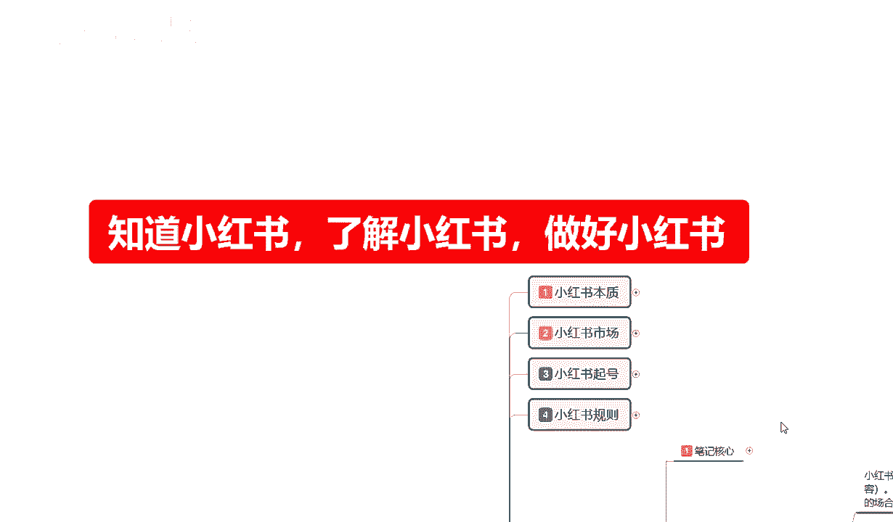

# 【2024版小红书体运营教程】全B站最良心的小红书开店运营高阶教程合集，小红书体开店 起号真的快.jpg - P26：10.新手小红书运营-小红书复制笔记：产品内容 - 咸鱼翻身之旅 - BV16bHSeXEea

大家好，这一集呢给大家分享的是小红书全集系列，分享的第五大课时，小红书笔记的一个复制笔记内容。

废话不多说啊，接着我们上一节课给大家进行的一个分享，内容继续进行一个分享，上节课呢给大家讲到的是产品内容的一个选项，因为整体的话就是说呃，因为后三节都是大课，他的内容分布很多，我们只有了解这些东西以后。

我们才能说是把小红书，你真的想做到我上面给大家啊。

说的好啊。

制造小红书，了解小红书啊，做好小红书，你这些东西你不弄好的话。

你说实话你做不到这三个点嗯，你想在小红书上面赚钱的话，说实话难度是非常大的。

好吧，接着我们上一节课的内容，上节课呢给大家讲解的是，我们复制选项内容里面的一个产品，和我们的一个主题介绍。

这节课的话先给大家讲解一下，我们的一个内容引流，说实话啊，人体的话他的模式都是差不多的啊，你不管是产品引流也好，呃内引流内容也好，分享内容也好，它其实三个三个点大致的都是一样的。

只是说我们的一个侧重点不一样啊，产品内容说实话呃，之前给大家讲的时候，这里面大家了解清楚啊，我说的这个产品内容，我们做的是那个搜索权重啊，大家弄清楚啊，这个是搜索权重啊，通过商品笔记进行发布的啊。

通过你的商品商品里面有一个编辑笔记，从这个方式里面发布的，这个引流内容是做搜索的啊，它不能通过商品比例去发送，因为你做本来做的就是引流内容，你要是做通过商品去发布的话，他没有自然展示的，懂意思吧。

就是你发上去他只有一个基础流量，它没有没有扩大的那种趋势，它本来就不是用来做成交的，所以说我们一定要把这个弄清楚啊，引流内容的话，就是做小红书平台给我们的一个推荐流量，做的好吧，引流内容怎么做呢。

就是说复制笔记的话，所选的内容不一样，所需要的整体必须包括我们所卖的产品啊，小红书是种草平台，我们在有产品的时候也需要发布相关的引产品，引流内容，对产品进行整体的一个介绍，包括这个产品的啊优点。

对其进行无限的放大，就是我这边给大家说的引流内容的一个展示啊，引流内容显示的是产品的优点特点，材质类型等等，就是给产品寄一个完美的精品包装，你把产品把它拆了也很严，就是你像零件一样把它拆分了。

一步一步去讲解，一步一步去优化也行，如果说你没有这种的话，说实话你去那个嗯抖音也好，去淘宝也好，去拼多多也好，你去这三大平台里面找同类的产品，你把别人的细节把它抠下来。

然后自己拿到自己的那个账号里面去编辑好，然后进行发布，其实效果是一样的啊，反正是复制过来的，我也不指望他完全抱起来，他有一部分勾能能给我前进，引来一部分的流量就行啊，但是我们要选择的内容的话。

就是引流内容的显示，显示的是产品的一个优点特点，材质等等，就是说通过这种方式对我的产品进行一个宣传，真对我产品感兴趣或者对同类产品感兴趣的人，他一定会进入我这个引流内容，进入我这个引流内容。

他就会去看我的后台，看我的后台，他就会通过我的后台看到我的产品内容，就是产品笔记，懂我意思吧，这个是把流量引到我们的账号后台，然后观看我们的产品笔记，通过产品笔记在观察我们的商品，然后进行成交。

是通过这种方式来运行的，它的整个模式的话，它是一环套一环的，缺一不可，懂意思吧，然后引流内容的话，他从分享从特点开始到材质结束。

什么意思呢，啊。

引流内容的分享，从特点开始到台词结束，什么意思呢，就是特点介绍产品的重点和特殊性，你比方说耳环对吧，耳环显示一个女性啊外在美，内在美，对不对，大耳环，小耳环，耳钉耳饰对吧，指甲油啊，红色黄色。

蓝色粉色绿色，他们每一个都代表的是不同的意思，对不对，这个就是产品的一个重点和它的一个特殊性，我们选择引流内容分享的时候要往这个方面靠，从特点开始，一直到材质结束，因为材质是安全的，考虑好吧。

优点是什么呢，对比其他同类型产品的一个优点，你不要把别人的这个里面有一个误点啊，任何对比型的产品不要显示它的品牌名称啊，和实际的一个效果，效果可以展示，但是你不能把别人的那种呃，中性化内容给介绍出来。

就是我们去做父子笔记，把别人的东西别人做对比的时候，你把它复制过来了，也不能展示这些东西啊，侵权容易被封号，封电了，没必要好吧，就说有优点进行对比就行，没有优点也可以做啊，但是特点一定要注意一点啊。

特点最重要，材质排结尾，这就是整体的啊，一个小葫芦笔记的思路特点优点缺点类型，才子按照这五个点我们去选择复读笔记的内容，或者说别人有这种方式，我们我需要把它综合一下，你把这些东西材料找资料找过来以后。

从这五个点去进行排序，为什么介绍特点就是对这个产品感兴趣的人，他会进来观看，那么你的产品特点在什么地方，就是第一吸引力，第二吸引力展示产品的优点，第三特意的曝光我们产品的一个缺点，给用户。

让用户觉得我们的宣传不是那么虚假，第四点类型类型是什么，产品本身的类型，或者说是使用方式，给客户介绍这个产品在什么时间，什么地点，通过什么方式进行使用，最后是才子，保证保证我们的材质对人体没有伤害。

或者说对我们的一个嗯不过敏等等，这种类型的让客户有一个安全感，他通过我们引流内容的一个分享，了解到我们的一个产品以后，对我们这个东西真的感兴趣以后，他就会进入我们的一个产品内容。

然后仔仔细观察我们的一个商品，商品观察完以后，他就会去我们的推荐店铺进行成交，这个就是我们整体的一个模式啊。

当然了，我这个给大家选的是复制内容啊，这个还不涉及到我们制作笔记的内容，比如说给大家进行选择的时候，我们制作笔记也可以参照这种方式，只是在这里呢我给大家进行了一个讲解，我们选择父子笔记。

也不能说是完全就是照搬别人的东西，我们也要有自己的思路啊，店铺怎么去做，怎么去优化对吧，知道自己该做什么，选择什么样的一个图片，视频效果，图片文案对吧，我产品该怎么去弄这些，我们只有了解了。

我们才能把整个店铺做好，我们不了解的话，说实话你想把小红书店铺做起来难好吧，这个就是整体引流内容啊，最后一点的一个特点，到材质结束，这里呢也给大家讲解了。

然后第三大点分享内容，分享内容的话其实和引流内容是一样的啊，只是我们把里面的实际内容感想，什么叫实际内容感想呢，我们引流内容做的是特点，优点缺点类型和材质，但是分享内容的话，我们做的就是另外一种。

它是结合嗯，怎么说呢，结合类型这个里面的我们的一个使用方式，往后延伸的呃，内容分享里面我们主要分享的是什么对应商品，对应商品的一个使用，整体的话就是一个产品使用时间，你比方说涂红色指甲油啊。

代表自己的心情怎么怎么样啊，在什么场合使用等等，这些这一类的一些细小的一个变化，你比方说啊我是一个女性，我交了个男朋友，我今天心情不好，我出去玩把他啊也怎么表达我愤怒的心情，我男朋友犯错了等等这一类啊。

然后是服装搭配也好啊，耳环坠饰这种他都有一个信息描述，就看我们自己怎么去包装我们自己的产品了，懂吗，所有的产品它都有包装，对内容分享就是包装，包装再进一步升级，我们不管怎么去讲，拖动了一下。

我把它恢恢复一下啊，就是引流内容我们不管怎么去讲，我们只是说介绍这个产品的一些特点，我们特点介绍完以后的话，分享内容就是你真的要把这个粉丝也好啊，对你用户的一个信任也好。

你只有把这种人牢牢的抓在你自己的手上，你不管是后驱，你做这个账号啊，就是你把这整个一套模式做好以后，你后续不管是做真的去卖商品也好啊，做引流也好，做网红也好，做博主也好对吧。

你想自己去额外的去引导其他平台赚钱也好，你把这几个方式弄好以后都非常好做，他都适用啊，就是说我们在分享内容里面的话，对应的商品的一个使用的人体时间场合，新颖的一个类型，适合的一个风格，结合我自身啊。

胖的女人适合什么样，瘦的女人适合什么样对吧，年轻女性适合什么样，中年人女性适合什么样，在这个里面它都是有划分的，我们要把这几个点弄清楚，我就知道我的分享内容我们要去怎么做，因为我不知道大家的一个产品。

我给大家的话只是说呃，介绍整体的一个小红书的一个，对吧，节奏和思路，我们了解这些东西以后，你整个小红书你才有进步才能做好啊，这个呢就是分享内容，因为分享内容的话，我不会去给大家把他那个呃。

简单来说就是我不会把上面给大家讲过的东西，再再去给大家重复一遍啊，没有那个必要，我们了解实质性的内容就行，就是说我们复制的内容选项，我们不管去怎么做，小红书里面无非三个点，产品引流。

分享分享是为了加固我们群体的一个牢固度，引流内容是展示给自然搜索，给我们带来更多的一个小眼睛，访客和点击产品内容是给用户指引一个方向，我对应的商品去什么地方买，你就算是后期做广告对吧。

你也要挂一个链接上去，我说实话啊，你就算做网红，做博主啊，做引流，你也要给人家一个平台进入你的消费中心吧，你才能做到成交，这个就是整体复制选项的一个内容，就是我们在做小红书的时候啊，说实话你不管怎么选。

我们去复制别人的笔记过来到我店铺里面，我新手前期不会操作，你也要按照这个方式去找找同类型的产品好吧，最后呢啊因为这个复制选项内容的话。

内容是这这么多啊，我呢很多内容都是给大家压缩的，我只讲重点，我不讲废话啊，很多任务都是压缩的，所以说嗯讲的话可能会稍微快一点，最后一点呢就是我们在操作选红书的时候，也不易要一味的需求。

只是说发布产品内容的一个小红书，包括我们复制产品的也是一样，我们需要有自己整体操作的一个思路，才可以长久发展，就是我们选择发布的时候啊，这个的话正常应该是在笔记发布的时候，给大家讲的一些小技巧。

在这里呢给大家提一点，就是我们发布的时候产品内容说实话啊，一天一个我都嫌他的多，基本上都是两天一个啊，就是跟我们商品相关的产品内容，两天一个差不多了，引流内容一天一个是最好的啊，然后再带分享内容。

两天一个就是我们把它结合起来的话，说实话按照小红书账号一天五个笔记，我们只发两个来计算的话啊，我们把它轮播来，就是第一天产品加引流，第二天引流加分享，第三天产品加引流，第四天引流加分享。

按照这种模式无限循环进行一个长久的发展，那么你的店铺数据啊，包括店铺活跃，店铺评分呐啊店铺的一个小眼睛，所有的数据只要说你不是做的太重复的话，它是每天都有进行增长，那么你的权重点也会越来越高。

如果说你今天发两个产品，明天发两个引流，后天发两个分享内容，这种方式去做的话也可以，但是他的权重的话绝对没有，我刚刚给大家建议的这种方式好啊，因为他所吸引的人群是不一样的，你产品内容你每天发两个。

说实在的它效果不大，因为他不在推荐流量里面，它只有50个到70个，正常的一个笔记，就是商品笔记的小眼睛咨询的都没有，能给你点个赞就不错了，好吧，这个就是整个一个复制内容，复制内容选择的一个方式。

下节课呢给大家介绍的是内容修改，就是我们这些啊产品内容选好了，引流内容也选好了，内容分享选好了，但是我们还要把这些复制过来的东西，进行修改啊，下一课节课呢给大家讲解一下。

怎么去修改我们产品选项的一些内容。

