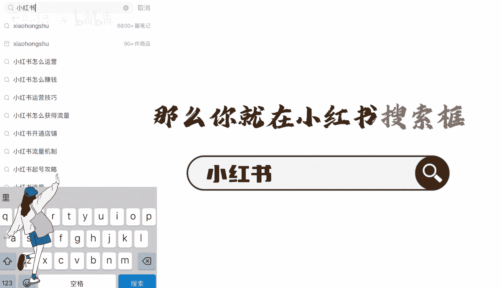
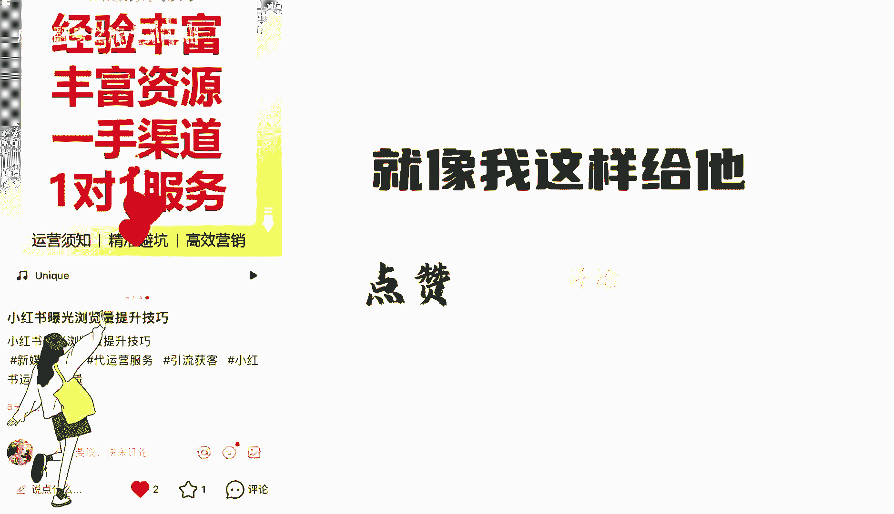

# 【2024版小红书体运营教程】全B站最良心的小红书开店运营高阶教程合集，小红书体开店 起号真的快.jpg - P9：2.4小红书起号-搜索起号法 - 咸鱼翻身之旅 - BV16bHSeXEea

所有人都告诉你，今年必须要做小红书，但从来没有人讲清楚到底怎么做。

你以为做小红书就跟我王二奶发朋友圈似的，随手一拍的照片，配上个自嗨的文案。

刻字，它就不断就能年入100万，结果你发完作品隔2分钟就拿起一看。

卧槽他没有人看，真是乌龟，半走读，憋不住笑了。

今天钱哥教你一个搜索切号法，这个方法全网都没有人见过，小红书起号的核心是在于，如何让系统识别到你是做什么的，我该把你推送给什么样的人群。

这里面就需要一个东西叫用户反馈标签，就是用户的点赞收藏评论关注。

那如何让系统快速的识别到你呢，我们来举个例子。

假如你是做小红书运营培训的，那么你就在小红书搜索框输入小红书。

怎么这个时候下拉框就会弹出一大堆的词汇，这些词就是用户经常搜索的问题。

我们只需要点开它，找到点赞高的内容，洗稿抄它就可以了，但是一定要注意洗稿的内容要超过30%。

不然就会被判搬运，具体怎么抄个屁。

进我粉丝群领取一份指南，做完这些之后呢，发布笔记，这时重点来了，你去找几个人搜索这些关键词，点击最新，看看能不能找到你刚才发布的这个笔记。

如果找到了，就像我这样给他点赞，评论。

收藏关注，让这条笔记前期赛马的时候就给他pk出来，如果没有找到。

就多换几个账号去搜索，这样重复一周的时间，一定会报一条笔记。

只要报了这条笔记，你的号就算起来了，用我这个搜索起号法起的号流量又精准。

