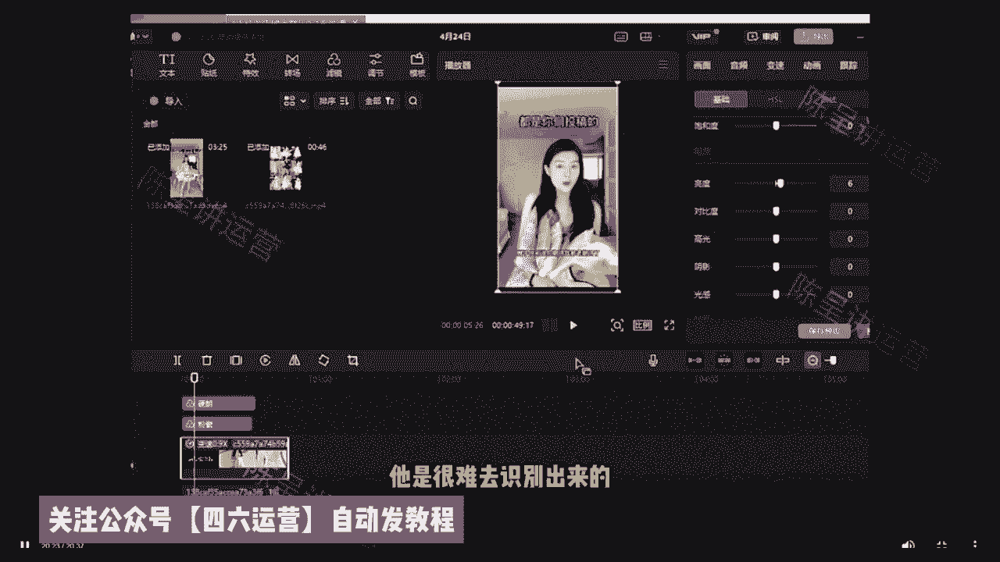
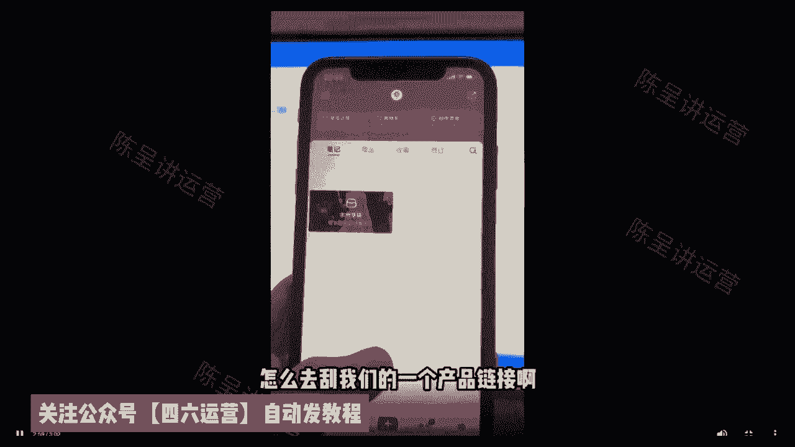

# 【2024版小红书体运营教程】全B站最良心的小红书开店运营高阶教程合集，小红书体开店 起号真的快，赶快点赞收藏起来 - P1 - 追月少女找少男 - BV1Wb421v71T

要说最近什么项目最火啊，那就必须要提到小红书电商，最近几个月呢，几乎整个互联网都在讨论小红书电商，我关注的几个商业博主啊，包括一些付费社群都在讨论他，我朋友圈月入五位数甚至六位数的比比皆是。

这个项目在年初的时候，我其实就有让团队跟进测试，我还在市面上买了一些课程学习，到现在单人单店一个月也能做个一两万块吧，今天我就用一个视频详细的给大家拆解一下，就是小红书电商到底怎么玩。

我会把整个小红书电商的流程，包括一些注意点，比如怎么开店，怎么选品，怎么做流量，一次性给大家讲清楚，你甚至都不用再去看别的相关视频和培训了啊，你就跟着我的视频去按图索骥就足够，你在这个事情上开始盈利了。

视频的结尾呢我还会给大家准备一份资料，里面有我找的课程啊，对你运营小红书电商呢会有很大的帮助，有需要呢直接去拿就可以了，言归正传啊，整个项目的逻辑啊其实也非常简单，它就三件事，第一个呢开店，第二个选品。

第三个流量，我们一个一个来讲，先说开店呃，开店其实没什么好说的啊，首先就是打开小红书，然后点击左上角的菜单图标，再选择创作中心，然后点击更多服务这个选项，选择店铺，点击立即入住就可以了。

你就按他官方要求的提交资料入住就行了，我居然看到有人把小红书开店包装成一个项目，拿出来卖，居然还有不少人买，这也是很奇特，这里跟大家说一下小红书店铺的两种形式，个人店和企业店，其中个人店有两种。

分别是个人店和个体工商户店，个人店只需要身份证，加1000保证金就可以开通了，个体工商户呢还要多一个营业执照，企业店呢就多一点，企业店有三种呃，有包括那个普通的企业店，有专卖店和旗舰店。

企业店都需要营业执照，而且还要缴纳600的年费，我们刚开始运营小红书电商的时候，你直接选择个人店就可以了，我们实测下呀，企业店和个人店一样，平台并没有对企业店有什么流量倾斜。

唯一的区别是个人店你只能开一家，而一份营业执照呢，你可以开三个店，你一个店如果都没做好，你开再多的店都是没有用的，而且小红书电商啊。

我觉得是不适合店群形式去做的，这是因为小红书的流量机制，它的电商自然流占比非常低，那你铺再多的电，再多的货有什么用呢，所以只要你看到有博主跟你讲什么小红书店群，我都觉得是在扯淡，小红书是要做矩阵的哈。

但不是店铺举证，而是账号矩阵，这个后面在流量获取那里，我会跟大家细说，开店的成本呢有这么几个，第一个就是1000块钱的保证金啊，不做了可以退，第二个呢是平台的扣点营业额的5%，第三个呢是支付渠道的费用。

大概呢每单是0。7%，第四个就是自己的流动资金啊，一开始大家做呢可以用无货源的方式去做啊，对资金要求也不高，你刚开始呢准备个2000块，3000块完全够了呃，开完店以后呢，我们下一步就是选品。

我们应该在小红书上卖什么的，选品其实也简单哈哈，在其他平台上的爆款，大概率在小红书上也能爆，目前小红书呢我是推荐三个渠道进行选品的，第一个是通过某东，某宝上面找那种小红书平台调性的爆款产品，呃。

身边有做电商的朋友，他自己在某宝的店铺卖的爆款，搬到小红书上，第一篇笔记就开始出单，第二篇笔记单量就已经破百了，第二个呢是通过某音的那个精选联盟，你在某音的精选联盟排行榜，你可以看到现阶段哪些品卖的好。

只要符合小红书用户调性的产品，直接搬运测试就可以了，第三个就是某多多的这个销量排行榜，选择适合小红书的类目排行榜，从中选择相应的爆品搬运到小红书，整个选品的逻辑，就是我们要利用市场来帮助我们全屏。

而不是自己在那瞎想，我们要借助大卖家的选品能力，来弥补自己选品上的不足，所以我们只要判断一个东西啊，就是这些排行榜上的爆品，是否跟小红书的人群有匹配的可能，如果有，我就搬过来测一下对吧。

相当于是借助了别人的能力来帮我们自己选品，这样反而是最快捷而且是最稳妥的选品方式，肯定比你瞎测成功率要高很多，然后等你这个产品上架以后呢，就到了最重要的环节了，我们应该如何获取流量。

小红书他是个种草平台，你店铺九成以上的流量啊，都是来自你发的发的笔记，这就是为什么我之前说小红书不要铺店群，而要做账号矩阵，尽可能多的发笔记耗流量，它的通路就是用户通过你的笔记。

然后对你推的产品产生兴趣，然后到达你的店铺完成购买，你堆一堆店铺对吧，你铺一堆店铺一个还不如多发笔记，多发几篇笔记的这个效果好，所以怎么在小红书上发笔记对吧，就是你小红书电商是否成功的关键。

小红书这个平台你直接发硬广，我觉得效果非常差对吧，本来小红书的这个用户群体认知就比较高，你直接发广告，你没有办法获得信任的啊，更不要提转化了，你发笔记的时候一定要用一个素人的角度，你知道吧。

就是用户的角度去切入，站在用户的角度去做种草内容，而不是官方视角，这才是真正有效的呃，这种种草笔记怎么做其实也很简单，就是去各大平台的商品评论里找，比如某音某宝，某东的商品买家秀，找到好看的素材。

你直接copy下来用嘛对吧，文案呢在买家评价上去做修改，这些买家的评价就是商品用户的使用体验，天然的适合用来做这个中考笔记，而且可以说是取之不尽了啊，然后啊当你单个账号的SOB跑通了是吧。

我们就可以开始举证引流了啊，通过批量上小红书账号，批量发布笔记给我们的店铺来引流，来放大，那基本上整个小红书的电商的运营啊，就是我上面分享的这些，外面不管多少钱的培训啊，3000块也好，6000块。

1万块也好，其实就是这些东西，有些培训可能还没有讲清楚啊，根据上面的几个点，我给大家准备了一份资料，里面包括了小红书账号的旗号运营的方法，以及一份小红书电商的视频课程，你如果打算经营小红书电商。

你也不用看别的东西，就跟着这份资料走足够，你开始盈利了，有需要的点赞加关注，在评论区回复红书电商，我分享给你，要有自信啊，你是最好滴，知道吗，嗯OK啊，然后的话呃，这节课给大家讲一下。

我们小红书的一个笔记训练啊，然后总共的话这个体系呢有个16节课，然后这节课的话先给大家讲一个啊，第一节，然后我们小红书笔记的一个核心是什么，就是以我们的一个小红书笔记，如果说他要报。

它主要取决于就三个方面，就是我们的一个给大家看一下，就一篇笔记啊，能不能报，主要是取决于三个要素，一个是产品啊，第二个是封面，第三个是标题，因为其实它其实我们的笔记要报，它主要的是要一个点击率。

就是说呃我们平时去刷小红书啊，假如说诶你是刷连衣裙，对不对，你搜索连衣裙之后呢，会出现很多的这种关于连衣裙的笔记出来，就他的第一个笔记的核心因素是他，如果说这本笔记想要获取平台，后续一直给他推推大流量。

他必须得有点击率，所以说我们其实你所就是平台给给你们的啊，就是给商家的，给我们去发笔记，只是给展现，但是买家用户他看到你的笔记之后，能不能点进来，是取决于你整体的一个封面。

然后还有你封面里面的产品是否他喜欢，第三个是标题，所以主要的其实点击率很重要，所以我们的关于是一个产品，一个封面，一个标题，它主要是展示在你的一个展示框那个里面，所以呃这里面呢排名低的肯定是产品。

产品的一个重要性，占到百分之，可以说50以上吧，50以上，然后封面的话占到30%到40，标题的话可能占到10%到20%，里面主要的核心要素就是你整体的这个封面，和你封面里的产品的展示。

是否能够让用户想要感兴趣，想点进来看，所以我们的重要性啊，所以我们一个笔记它到底能不能报，它主要的核心因素就是这三个因素，所以你们只需要去挑好一个好的产品，然后的话去做好一个封面，然后标题去做好一下。

基本上如果说本身你的产品没问题，这篇笔记是能够报的，因为基本上如果说大家你们的写笔记啊，如果如果说小眼睛特别少，大概率都是因为你的产品本身，它不受买家所喜欢，所以他没有点击率，他点不进来，后续的数据。

你像收藏加购，像下单都不可能去啊，有发生，所以我们基本上首先第一个笔记能不能报，主要取决于就是产品封面啊，标题的话可能只占一小部分好，然后这节课的话给大家讲一下，我们小红书的一个封面呃。

跟我们的一个标题到底怎么去创作，因为其实我们这三个要素里面的产品，一个选择呃，在我们其他的课程里面有详细讲解，然后这里的话我就不详细做一个讲解了，然后这里的话主要给大家提供一个。

就是我们是怎么去做一个爆款封面的，然后封面跟标题到底怎么去创作，首先第一个啊就是当你们的小红书的属感，就是我们对于小红书去创作笔记的感觉，你没有起来之前记住一个核心点，不要去原创，对最忌讳的是呃。

本身我是一个刚刚接触这个小红书创作的，一个作者是吧，然后我凭着自己的想法去做这样的，如果说你以前没有过这方面的经验，你没有这方面创作的感觉，你大概率你的创作都是没有一个好的结果的。

所以当我们其实一个对于小红书整体的感觉，没有起来之前，我们称为属感，我们不要去原创，只做一个可以说做一个什么呢，伪原创什么意思呢，就是说不管你是做标题还是做封面，首先一个核心的要素，我们自己先。

我们自己现在也是这么去做的，就你们要找到你的对标同行，你是做连衣裙的啊，你是做女装家的酷的，你是做盆栽的，对不对，不管你是做什么赛道，你去直接在小红书里面去搜索你这个赛道，比如说我怎么去创作一个标题。

你直接去搜索你这个赛道，同行把他们小红书点赞啊，就是过1000的，你可以把它全部都全部的标题，全部复制到表格里面去，然后一个一个去看啊，找到他的铜像，比如说就找到他们类似的地方，然后把他们的一个爆点。

就是这爆款的这个标题的一个东西，因素提取出来啊，我举个例子，比如说啊这里面我举个例子给大家举个例子啊，比如说呃这件啊衣服太好看了，太好看了，然后等等等等，发现小红书里面应该有很多类似的标题。

就这件衣服太好看了，太太适合学生妹妹了，太适合学生了啊穿着，反正他这样的，他的一个人群标签就直接定位到学生了，所以基本上有很多类似这种标题，这里我是举个例子，然后你们反正是直接搜索你自己这个哎同行。

去找到相似的，如果说他有1000个点赞，你甚至可以直接把他的一个标题拿过来用，但是这里面要注意一下，不要一模一样啊，我举个例子，假如说这件衣服太好看了啊，太适合太适合学生了吧，对不对。

然后比如说这个标题它是一个报文的标题，你很想用，这个时候怎么去用呢，你可以把它这个标题记住，做一些修改，就比如说这件衣服太好看了，你把L太好太好太好看了吧，对不对，然后这件衣服太适合学生了。

然后把他感叹号直接删掉，就是你稍微的做一点点修改，或者说里面啊太适合学生，你可以改成什么，改成白领，对不对，反正你稍微的在里面加一些字或者减少一些字，稍微的做一些修改就好了，因为你如果说一模一样的。

很容易会有时候会被限流掉，所以这是一个小细节啊，所以这是标题啊，应该都明白了，对不对，然后封面它的意思是一样的，不管你是创作封面还是标题，你首先记住你的核心因思维是找对标同行，对，不要原创。

因为当你刚刚接触，你对于小红书的属感没那么强的时候，你原创大概率都是错的，所以不管是标题，比如说它们封面对不对，如果说你发现好多的封面，他们都只是一个灰色的背景嗯，加一个样品图拍诶，好多都火了。

这个时候你也可以去模仿他这种形式，去进行一个拍摄，对或者说进行一个混剪对，因为这样的话大概率因为他们如果说能火，起码他的封面肯定是没问题的，如果是封面有问题，他这篇笔记不可能火的很大啊，能不能理解。

所以这里的话记住核心的因素就是，去找到对标同行，去模仿他们的格式去进行你的一个创作啊，这是我们小红书标题啊，一个创作的思维，因为现在我们都在用啊，其实我们不管是做以前的任何平台，我们的思维都是这种思维。

而且效果非常好啊，如果说比如说你做了很久了，比如说你创作了两个月，三个月，四个月，你感觉自己的属感上来了，这个时候你再去原创，因为你比如说你天天去写笔记是吧，然后的话你也做火锅笔记。

你大概自己心中你就会明白哪些笔记他到能火，所以你会慢慢的有熟感之后呢，你就可以进行你自己的一个独立的原创了啊，OK啊然后的话这节课给大家录一下，就是我们如果说去做混剪，然后的话笔记它出现的一个违规。

然后我们怎么去进行一个处理啊，然后首先的话给大家讲一下，就是呃呃如果说你去做笔记，有任何的一个违规啊，系统有提示的，就直接去秒删对，然后的话，因为你如果说你啊笔记违规比较多的话。

你整个上你整个账号他就会被会被直接限流掉，所以如果说你账号出现的限流啊，那样的话我们一般可以去发日常，就比如说拍拍风景啊，拍拍自拍啊之类的一些日常，然后一般来讲的话，一到两天。

然后你的这个账号呢限流就会直接恢复掉，对如果说你违规比较严重，一般的话可能日常也要发个慢的话，可能七天七天左右，所以如果说你像这种，你如果违规的账号啊，呃如果说你也可以直接起新号。

因为基本上如果说七天的话，你要等个七天，其实时间也挺长的，对不对，因为如果说你的本身，现在是一个最新起的一个爆款，对爆款的话，你等个七天，可能这个款式已经被别人抄完了，对不对。

所以基本上如果说你因为爆款等等一些违规的，对不对，然后的话你需要去呃账号被限流了，你可以直接去起个新号，对，你可以直接把你这个本身的爆款直接抄对，抄过来，就你自己抄自己的。

但是你那些素材啦等等也要重新去做一下，那这样的话就可以解决掉我们这个限流的问题，因为其实我们一个爆款，一个产品，它任何产品特别是做那种啊服装类的是吧，他的产品的一个款式热度它是有周期性的。

比如说可能说呃，这个款可能是报个15~30天就不报了，所以你要抓紧时间，如果说你能测出一个爆款出来，所以这里面如果说你要等七天的话，太慢了，所以我们可以直接起星号。

然后把这个如果说这个款式在你老号上能爆，大概率你放到新号上面来，他也是能爆的，因为本身产品是一样的嘛，对然后这里面啊给大家建议一下，因为呃我们其实做混剪啊，是建议大家直接去做视频的。

混剪就是我们去发笔记啊，不要去发那个图文类的，因为如果说你图文类的去帮别人的去发图文，因为图文它重复性比较高，比如说一个爆款，对不对，很多人可能同时在做图文，可能说他发的第一一个人可能说不会有个。

但是如果说你是第五个，第十个，第20个人在做你这个图文，就你这个图片大概率会直接违规掉，约，约是图图片的，就是重复性会比较高一点，所以这里面其实建议大家去做那个视频。

因为视频其实它很难说真的是全部都一模一样，只要你把这个处理好了，因为后面等下会教大家，怎么去做一个素材的一个处理啊，这里所以说我们这里建议大家直接去呃，发笔记的，如果说是做的混剪的话。

建议大家去做视频混剪，就不要尽量的不要发图文，图文的话可能说你要发的话也可以，但是你要就是占比不要太高，因为图文的，他的一个违规的比例会是比较高的啊，然后这就是我们第四个就是笔记违规限流，要怎么去处理。

OK啊，然后然后的话我们啊第五节课教大家，就是就是我们如果说就是我们笔记啊，就是你一直是做非原创的，然后怎么去进阶，就比如说呃我举个例子啊，就比如说你如果说一开始，你刚做这个小红书电商。

我们是不推荐你们去做原创的，因为你原创呢大概率他很难火，所以我你们一定要试，等你们一个非原创做混剪，你把你的这个属感培养起来了，比如说你啊搞了三个月，你应该如果说你做火过，你大概率是明白。

就什么类型的东西在小红书里面发笔记，它是容易火的，这个属感一定得有，就比如说我们经常去啊啊做抖音，或者说做什么短视频，如果说你做的久了，你你的经验肯定比一些刚刚入行的人要多，所以你两个人同时去做的话。

有经验的人，他大概率是比一个新手做一个啊笔记或者视频，更加容易受到市场青睐，更加容易火，所以我们这里呢，反因为现在我们做小红书里面啊，小红书电商店铺，如果说你想要稳定啊。

我们现在都是慢慢的就是同一个非原啊，一个非原创去向原创去过渡，怎么去过渡呢，过渡的前提一定是等你熟感起来了，就比如说我们前面讲的一个笔记微微限流，对不对，因为呃里面刚刚其实在上节课有个点忘记讲了。

就说我们如果说比如说你们去有发一篇笔记，诶，你过了一会儿有原创过来来清投诉你，比如说诶你怎么侵犯我的呢，对不对，然后他会有个提醒，这个时候呢就是平台，一般你可以去看一下这个原创作者的账号。

对你看他有没有这种联系方式，你找到他之后呢，就是你问他就是能不能别投诉我啊，你给他发个红包，对一般的来讲啊，如果说他不愿意啊，一般可能是因为你红包发的不够对，一般可能是一百两百，你看情况去做。

因为假如说你这个笔记正在报是吧，你可以每天为你产生很多利润，对不对，然后他去投诉你，导致你这个笔记瞬间就没啊不出答案了，所以这个时候你可以去跟这个原创作者去协商，对不对。

你发红包给他看看具体的你你怎么去跟他聊，怎么一百两百三百四百，对不对，看你的利润来对，反正是最后你你得受益，原创作者也会受益，一般来讲的话，如果说他是素人的对，如果他他他如果说他是素人的原创作者。

一般来讲你发个红包给他，就是他也还是愿意接受的，就是啊不去投诉你之类的啊，所以这样的话就是比如说诶这个模特很好诶，你下一次诶你如果说你做久了，你肯定会借着很多这种素人的一个拍摄的，一个啊。

一个就是原创者，这个时候如果说你以后是吧，呃你觉得他拍的很好诶，这个时候呢你如果说想就是拿件衣服，就你自己可能说拍不出那种感觉，诶你可以去找别人去帮你拍啊，拍一张拍一组图多少钱多少钱，什么50块钱。

100块钱啊，200块钱啊，如果说你一般来讲很多的原创者还是愿意的啊，因为这个东西他们本身拿小红书去做这个，他们也是为了挣钱嘛，对不对，所以所以说话啊，这是一种方式，因为你靠这种方式呢。

能够积累很多这种原作者啊，你可以找他们去帮你拍，但前提是你要明白啊，因为他拍摄不是他去拍，是是是他去拍，但是你得告诉他他怎么去拍诶，你需要什么样的场景，大概是什么样的样式，然后他给你拍好对。

所以说前提是你要懂得怎么拍对，然后把这个东西告诉这个原作者啊，让他去给你拍一张你心目中所想要的图片，对这样的话就是慢慢的往原创那边去靠，一般来讲啊，就你们如果说啊，如果说你本身做伪原创，做混检。

如果说你有产品在出单，有爆单呢，这个时候呢一般的我们会就是去买样品，你从拼多多淘宝里面，1688里面你可能说买个三四家，对不对，四五家都可以，然后都买回来对比一下质量，价格性价比对不对。

然后的话如果说诶你有一家不错，价格跟质量都合适，你买回来自己看一下对，你可以选择跟他长期合作，这个时候呢就是你慢慢的也会积累，积累自己的一些供应链诶，也会积累一些自己的一个素人博主。

所以一般上你如果说做的久的人，你手上会慢慢的有一些新手不具备的一些资源，在手上，这个时候你去做的话，他更加会容易啊去操作，因为一个平台，现在小红书他也在慢慢的在抓无货源，对不对，也也在打压这个原创。

这如果说我们一开始可能自己没有资源，不懂慢慢的，所以你在做的过程当中，你要借这些资源，慢慢的要让自己可能做了半年，做了一年自己变成一个什么了，变成一个诶有货源啊，自己手上有供应链的啊。

能够去小红书店铺里面打面单的，对不对，然后也会有自己一些一些博主，然后也会懂得自己一些拍摄，因为我是看到有很多的一些爆款的，一些呃笔记啊，他们的拍摄都很简单，比如说我啊有就是有一些学员他们做视频的。

就是他们看到小红书上面有有一种格式很好火，视频的就是一个灰色的背景啊，然后的话摆一个项链，然后拍拍就是有一个很火的博主，他每一篇都这么拍，基本上发个一些片就会报一个一两千的点赞。

甚至是七八千甚至上万的点赞出来，除了这种的话很简单，对不对，诶也不需要人粗脸，你就去准备一个灰色的背景啊，买一张这个布或者说纸之类的，然后自己去淘宝上面或者是特别拼多多上面啊。

1688上面买一些样品回来自己拍，也可以实现原创，所以这样的话就是我们慢慢的，就是从一开始可能说是做混剪，做非原创啊，然后的话可能是做无货源，慢慢的可能你做的久之后，自己变成一个可以做原创的。

也可以做一些那个呃，那有有有这些供应链的啊，所以这是我们就是啊，同一个非原创向原创的一个阶段，去过渡的一个阶段啊，但是前提记住啊，一定是等你这个产品有出单，有报单的时候才去才去操作，或者说啊。

还有一个就是等你的属感培养起来了之后，不然的话就你会啊，有一定的就是这个这风险在里面，因为本身的话现在小红书我们是零成本，对不对，然后的话你们如果说是要啊自啊自己不拍，你要请人去拍的话。

就是他不一定能火对吧，所以你的属感起来之后，你才有自信的去做这个事情啊，来啊好吧，这是我们第五节课啧，呃我们小红书的话一天大概是发多少篇笔记啊，就是我们正常的就是一天大概十篇左右。

就是我们现在自己的店铺的话，基本上多的可能一天发个20篇呃，少的话一般的话可能最少啊，最少最少一天得发个十篇，十篇十篇哦，所以你们如果说做小红书的话，记住啊，你发个一篇两篇呃，你如果说你有款式爆了还好。

但如果说你在测试阶段，你如果说发个一天两天，一天发个一篇两篇的话，就你很难快速能够去把款式测出来，因为你的怎么讲呢，你比如说我两篇，因为我们现在基本上我们大概是一个新款啊，我们是发两篇笔记进行测试。

就如果说你看我如果说一天发十篇，你一天发两篇，就是我我我的效率是你的五倍啊，所以说你如果说七天去测一个款啊，七天去测了七天的话，我们一般上我们可以测额一天五个35个款，但是你七天可能只能吃七个款。

所以我可能火的概率可能比你大，所以我们一般来讲保底啊，就一天十篇左右吧，然后的话你像呃这个看你自己调整啊，一般比如说你想这个款式啊，三个比例去测试也可以是吧，就是我们具体我们现在一个新款。

大概就22223个左右，一般是两个，所以看你一个调整，假如说你觉得就是有三个封面，这个款特别好，哎，你想用三个也不是不行，都可以好吧，这个具体去调整啊，然后的话我这里强调一下啊，就是一般来讲你像啊。

我们如果说发十篇的话，一般你的一个发笔记的间隔时间对，你要去保证在什么呢，呃保证你在一个小时吧，一般我们一般现在我们的店铺啊都是一个小时，然后就给我一个小时发一篇，所以说你们如果说想发20篇的啊。

发这么多的，你们最最最少最少记住啊，你的笔记间隔时间要有半个小时以上，你如果说比如说你定时在八点钟，你疯狂发十篇，发20篇，你很可能这个账号会被直接降权，对或者说你的笔记他会有违规，不会给你推流啊。

因为账号可能你发一天两天还没事，但如果说你发了就是一天啊，一下子发个十篇20篇，可能你这个笔记它本身可能会就是降权，就是不给你推流系统啊，所以不要连续去发啊，啊，这里的话一般来讲。

我们下午发跟晚上发流量会好一些，对上午发的话流量会稍微差一点，所以这是我们一天啊发多少比一个概念啊，给大家稍微的讲一下。

OK啊OK然后这节课给大家讲一讲，就上节课我们讲了呃，关于笔记玩法运营的一个逻辑，然后这节课给大家讲一讲，就是我们一旦确定好了我们的词之后，然后的话我们确定好了我们的一个呃，前面的这些东西之后。

你你都弄懂，弄明白了之后，下一步我们就是要开始去找素材了，对不对，要开始去找素材了，然后找素材的话，这里的话有两种方式吧，就是有两种方式可以去找数，第一种我们用的更多的是什么呢，确定词对，确定词啊。

如果说这里不知道怎么去确定词的啊，确定你的搜索关键词的，可以去看一看我们的一个呃，看一看我们前面的这个认知篇，店铺运营实操的认知篇好吧，为什么确定池呢，因为确定词的前提是因为你这个词的流量大。

比如说你像夏天啊，女生穿的连衣裙是吧，然后的话T恤啊，不管男生女的T恤，就是确定池的前提是你的市场大，你先不去管它竞不竞争的问题，首先要确定它市场大，因为市场大，它的流量呈上升趋势。

这样的话你整个笔记火的概率也会更大，所以这里的话这是第一个，第二个确定好我们的款式对，确定好我们的款式，因为你的款式，因为我们这呃，我因为我们在上节课讲了一下，就是我们的决定。

我们的笔记能不能获得更大的推流，有两个，第一个是我们的封面啊，封面里面能够展示出来的一定是你的款式，对不对，如果说你这个款式很火很爆，能够自带流量，本身你的笔记火的概率就会大。

然后的话我们确定好我们找素材方式之后，这里的话我们通过哪些渠道去进行一个素材，寻找我们的小红书笔记，你要么是发图文，要么是发我们的视频，然后这里的话，我们当下所有你能够去知道的平台都可以去找。

像抖音小红书啊，淘宝的一个淘宝啊，逛逛等等，拼多多的一个淘宝的买家校，因为我们如果是确定好的款式之后，我们需要去连续去发很多篇这个款式啊，如果是爆款的话，我们需要找很多这个款式的一个呃图片。

这里的话我们可以通过啊，平台的一个买家秀里面去找好吧去找，然后这里的话实操给大家去演示一下怎么炒啊，比如说这里我随便找一个词，找一个词啊，仙女连衣裙啊，比如说我找这个词对不对，然后怎么去找呢。

首先的话我们在小红书上面，给大家去演示一下啊，这里的话我进行一个手机投屏，然后大家稍等一下啊，然后我连一个屏幕，OK啊，大家稍等一下啊，这里的话给大家去进行一个投屏，然后教大家怎么去寻找这些素材。

该怎么去找啊，怎么去报啊，可以重新插一下，OK啊，我这里开始投屏啊，稍等一下，OK啊你稍等一下，OK啊，这里已经准备好了啊，然后这里的话给大家去演示一下啊，怎么去找啊，首先的话我们打开小红书。

打开小红书啊，它不像是做这个淘宝，还有抖店，他没有一个做店铺的感觉呃，打开小红书，OK然后可以看看啊，可以看一下，然后这里的话啊我们一样的啊，点开这个，比如说我这里搜索一个，先，啊仙女连衣裙，OK啊。

我搜了这个词之后，对比收入这个词之后，然后首先的话第一个呢，其实我们要去看看什么呢，就是这里有个逻辑啊，然后给大家说一起讲一下吧，就你要去找近期发的，因为你这个综合里面的其实是按照什么呢。

按照其实数据给你去进行排序的啊，排序你比如说我我看你怎么去找呢，第一个你看其实你们每一个比下面，他都有个日期，对不对，日期这里一定是什么近期发的，因为你近期发的他能够去火。

首先说明他们说明他这个笔记他一定有东西，比如说这里啊，像这个3月26发的，然后的话到现在4月24将近一个月了啊，所有有点久啊，有一点远，我们找一下近期的可以看一下啊，你看其实其实你可以看下小红书。

真正火一篇，他能够吃很久，他真的能够吃很久，你看现在很多都是3月份的笔记，3月份笔，你看这4月4的很多都是3月份的笔记是吧，然后还是4月10日我们可以看一下啊，呃这是个视频笔记，如果要。

啊我我们可以看一下啊，啊这这个视频1月30号，然后这里的话我们可以哦，我们可以这里进行一个什么全部，这里有个最新跟最热啊，我们可以点一下最新，因为最新的话可能更多的笔记，他可能都是没什么点赞的。

可以看一看，可以看一下，你可以看到一个小时，发了一个小时就有17个点赞，你像这种笔记啊，你可以多关注一下，首先那你关注一下，这前提呢你要去看一下他这个号，可以看下他这个号，OK啊，稍等一下。

这个好像是断了啊，我重新再连一下，啊这个投屏很不稳定啊，首先啊到时候你们听课的时候，可以把这个投屏等待的时间直接跳过啊，直接跳过，OK啊我这里重新调出来的啊，OK我这里重新调出来，可以看一下。

可以看一下啊，然后可以看一看啊，刚刚我是刚刚我点击了，可以看这个是17个点赞，对不对，就一个小时，这个点赞你看相对其他点已经很好了，然后这里我们可以看一看，这个适合肉肉姐妹的显瘦性，可以看一下这个啊。

看到没有，那其实这个的话，像这种啊呃像这种笔记啊，如果说17个，你可以稍微的你点赞，然后你可以去哎，怎么又断了呀，先让我看一下啊，到时候你们听课的时候，把这个等待的时间直接跳过就可以了。

OK啊然后这里可以看一下啊，然后这里刚刚是11点，我点了一个赞，点了一个赞，就是像这种一个小时，你看这个肩背带裤究竟能有多百搭，志趣宝贝尼克狐尼克，你被捕了呃，呃这个发了挺久的。

所以请像这种一个小时18点赞的啊，17点你你可以稍微的点赞关注一下，如果说你发现它后面点赞趋势很猛，你看他平时点赞也可以看一下他平时点赞的话，呃大概咳啊这个这个这个店铺啊，这个还可以啊，还可以啊。

像如果说他这个你看平时他的点赞16个，两几百个，如果是他这个如果说能报到上千，说明这个视频发的OK的，然后这个素材我们就可以去找啊，我们就可以去拿啊，呃呃呃这里我先点赞一下，然然后面的课程。

然后我教大家怎么去进行一个驱虫，怎么去找品啊，然后的话我们可以配合肉肉姐妹的显瘦，仙女小裙子，身高163，体重160斤，全身胖身材试穿太多的幸福报道拼凑爱的美妙，笑一笑啊，这种是买这种啊。

就是胖胖胖妹妹的一个大码大码的女装啊，像这种啊，女小裙子身高腰，OK然后我们再找一找，我们再找一找啊，嗯像这个其实最新的话，他很多时候你要往前翻一翻，你看这你看这个啊。

这个三个小时有一百一百二十二个点赞，然后我们可以进去再看一下，你像这种有大V的就不用去看大V的，它本身可能账号权重很高，账号权的可能很高，比如我这里可能点一个，哎呦，很烦呀，这个这个为什么总是会断呢。

OK啊我这里吧，这总是会断，不知道为什么，然后可以点一点啊，看一下这个最热啊，刚刚是最新最热，可以看一下，可以看一下这个最热，追着很多看很多很多的很多的，其实你看很多笔记还是吃了很久。

你看这个4月11号的啊，4月11号的有有十几万的点赞，像这种大V的是吧，有十几万粉丝的，所以大概率你们要去看一看，要去看一看好吧，然后去这样去找，然后这是一种方式啊，咳尽量要去找这种最新的最新的。

你像这种，你像这种能不能发呢，也能发也能发，因为其实他是跟当季是比较符合，只是他这个吃的比较久，这里我教大家怎么去看啊，比如说你点击这个进去之后，你看一下他这个笔记，额你看一下他他这个笔记后面他有没有。

你看最近的，你看其实这个笔记推流还可以，你看哎最近的其实一直有推流，像这种一直有推流啊，一直断流，然后我可以其实我们也可以去那里面找，可以看一看，一直有推流，可以看一下是吧，然后最好是找什么样子的呢。

就是你们比如说你们你们去看这个博主，然后诶一个点，假如说啊这里都是十个点赞，十个点赞，十个点赞是突然有一篇几百个上千个点赞，说明这个笔记是OK的，但如果说你像本身有这种粉丝量很多的账号。

他其实你很难去判断它的这个比例到底好不好，因为它本身这个账号他的权重很高，能理解吗，所以基本上你们要去找，就是这样去找啊，比如说我我要找一个最新的吧，就是最新的，所以你们很多时候你们要去啊多去看。

多去看最好的，你们到时候我去教你们去怎么去养养一个素材，养一个素材库，像这种的啊，像这种，你看比如说啊，比如说你像这种发他发的衣服，一个点赞六个九个12个，如果说突然有一篇，比如突然有一篇啊，举个例子。

你看突然有一篇69，甚至说更多，你看它它就比较它的这个，你看它的封面都差不多是吧，但是他的这个款，这个款式肯定比他上面发的这些款式更加吸引，因为他因为他有60多个点赞，可以看到没有。

所以你们去找就是找这种，就是说呃60多个其实还少了，如果说你们要很爆的话，其实你们去看，比如说突然有一篇啊，举个例子我找一找，你看他其实这个号其实很平均，因为这个号其实也算是一个老号。

因为他有1000多个粉丝，所以你们要去，如果说你们要去做这个类目，你们一定要去养一个素材号哎，素材号啊，素材号怎么去养呢，呃呃呃呃这里给大家讲一讲啊，然后怎么去养，比如说啊你要去养小红书的素材号。

对你要去养啊，呃等等一下再讲吧，好吧，我我先把这个抖音等等先讲完好吧，先讲完，等下跟你们讲，然后这里啊抖音怎么去找呢，给大家演示一下，打开抖音，对不对，拿抖音啊，比如说啊比如说我刚刚是仙女啊，连衣裙。

对不对，然后这里的话我们有个视频，点击视频点击视频可以看一下啊，可以看到这里啊，呃这里我们可以做一个筛选，比如说综合排序，最新发布，我们可以选一个最多点赞啊，都可以，然后一周内，唉没有啊。

只有几个只有几个，你看看你看可以看下这个啊，我来了我来了，一样的啊，就我们可以去看一下，因为比如说像像这个的话就很普通对，因为它你看都是这么多站，如果说你像这种博主也是一样的。

就如果说他的这个很多的点赞都是几个，但突然有一篇报了一两千个，这个素材就可以去借鉴一下啊，因为其实我们去素材更好的，还是要去符合抖小红书的逻辑啊，比如我拉不管我得再找一找，比如说像像这个啊。

像这个就比较呃，比如说我可以按照综合培训看，那这就比较多了，可以看一看就比较多了，对不对，比较多的，比如我像这个呃这个品，对不对，这个网络也比较卡，换一个吧，五一出游穿什么。

啊因为因为我这个WIFI是在外面啊，可以看，就这个逻辑也是个逻辑好吧，也是这个逻辑，然后然后这么去找素材，然后假如说啊假如说我找到这这款衣服，怎么怎么去找品呢，我截图啊。

进行一个截图截图之后呢，我去打开我们的拼多多，在这里进行一个以以图找款。

可以看到没有，就是你可以找到这种类似的款，你看一个是类似差不多的，类似差不多的，所以这个时候他是一个什么样的顺序呢，咳首先确定词之后对不对，然后通过词去找到笔记，笔记报的笔记里面有款式。

通过款式再去拼多多上面找到你的品，找到你的品能理解吗，所以说我们设计一个这么一个流程，然后这里呢如果说你这个品它很爆，我们其实可以去里面啊，比如说你看其实这个品的话，可能说呃在呃拼多多上卖的不是很好。

卖的不是很，因为可能说是在抖音上爆的，啧啊这个有点卡啊啊，比如说啊我随便点击一个品进去，然后怎么去，比如说你要去发你，你你要去找这个品的更多的一个素材，怎么去找呢，第一个图片是不是可以用啊。

这个主图是不是可以用第二个在打，如果说这个链接很爆的话，你可以看一下在他的一个行家心得里面，像这些是不是可以用，那这些素材就是我们里面的一个买家秀素材，像这些评价看有没有这种买家烧素材。

一个图片跟主图都可以直接去用，你看都可以直接去用，看到没有都可以直接去，你看这种应该是刷的好吧，都应该是刷的，你看这种都可以直接去用好吧，都可以直接用，然后这就是素材，然后这就是我们的一个素材怎么去找。

然后关于我们就是你能够使你能够想到的平台，你像我们可能还同时用一些软件，比如说像这个汇总数据，对不对，像我们的一个笔记查找是吧，笔记搜索笔记榜单等等啊，我们可以去搜索，比如说像我们刚仙女啊。

关于我们去找素材啊，仙女连衣裙，对不对，然后这些很多很多可以去找好吧，你看这些其实都可以找其，首先你们平台不重要，首先你们要去做，你们一定要去明白逻辑是什么，这里的话再给大家重复强调一遍。

我们去找素材逻辑，第一个是近期发的，然后火的这个火的不能是大V，所以你要去对比一下啊，对比一下，假如说你去看一个博主，他他最近发了十篇，十篇十篇每一篇都是怎么几个点赞，然后然后就是这个图。

就是你看这个这个火可能有个几百个，几百上千个这种大概率，这种笔记他就是可以就是什么，要么就是他的封面封面好啊，用这个款式好，它能够把数据做出来，他能够去有数据做出来。

所以这种笔记我们就可以直接去拿过来用好吧，拿过来去用，然后然后这里给大家讲一讲，就是我们怎么去进行这个呃养养素材还好，这个很重要啊，因为其实你们平时如果说你们去搜的话，你们很难。

因为因为整个不管是抖音啊还是小红书，它是根据你的这个咳笔记的数据，来给你进行推荐的，就比如说是吧，我们这个小红书啊，你搜索你搜索这个词，对不对，为什么说有一些品，比如我们这里点个中全部咳综合综合排名。

为什么说有机品它能够排在前面，为什么，是因为你挣你这段时间你这个品的数据很好，能解吗，很好，所以基本上如果说说，如果说你们想要去找到当下最好的这种素材，你们要去养素材号，怎么去养呢，比如说你准备一个小。

不管是小红书还是抖音是吧，你准备一个号，也准备一个号，去刷这样的，视频啊，或者你的一个呃笔记啊，比如说我比如说我开一个店铺，我是做连衣裙的，我单独用一个号天天去刷连衣裙啊，连连衣裙这个呃这个呃这个笔记。

然后你后面你刷了几天之后，你会发现你只要打开你的抖音或者小红书，还是抖音也好，你他给你推的基本上都是这种相似的笔记，咳咳好吧，然后抖音也是一样的，然后对他进行一个点赞评论，多去看，多去停留等，等。

你刷几天之后，你会发现你刷的短视频，大概率全是你跟你相似的咳，去养一个，去养个素材号，这样的话你后面去找找素材就很方便，就很方便啊，不管是任何平台都这样，因为现在任何平台他都去符合他都符合什么呢。

呃兴趣推荐他一定是给你推荐感兴趣的，他怎么判断你感兴趣的就是这些大数据，好吧，然后那这节课就讲到这里了啊，关于怎么去找一个素材。

OK啊，然后这节课给大家讲一下，我们素材的一个去存手段啊，然后的话我们做任何的素材啊，你从任何平台去找了之后，首先要去对素材进行一个驱虫，不然的话你很容易会有违规，特别是如果说有很多人去使用这个素材。

你同时去发到小红书平台里面去，如果说你不去进行处理，你大概率都会去违规啊，都会违规，然后这里的话啊，然后首先我们第一步去驱虫啊，不管你是去，然后这里给大家去演示一下啊，演示一下啊，不管你是去找小红书啊。

还是说我们的抖音上面去找的素材，比如说我这里演示一下抖音上面啊，然后比如说啊，比如说你像你随便找个素材，比如说这个素材，但有氛围感的仙女裙没有了，滤镜真的好看吗，最近大家艾特我测的这些裙子已经到了。

一起来点这里复制链接，复制链接之后呢，然后我们去啊，到我们的一个龙猫攻击大师里面啊，这个是我们去去水印的一个一个软件，因为你不管去任何平台，首先要去第一件事情，素材找出来之后去进行水印。

不然的话你直接去下载的话，它的是素材上面会会带有这个平台的一个水印，提取之后啊，但有氛围感的仙女裙，没有蓝绿镜真的好看吗，大家艾特我测的这些裙子已经到了，一起来看看实物会不会踩雷吧，保存之后啊。

我稍微把声音放小一点啊，呃。

OK啊然后保存之后我们可以看到啊，然后我们就可以直接拿这个素材了，没有了滤镜真的好看吗，然后一起来看看会不会带任何水印的，这个素材好吧。

这个素材是不会对，不会带任何水印的，然后这里的话啊，然后不管是你们图文也是一样的，图文的话也是一样的，直接去复制链接，然后到里面处理以后，直接提取来保存就可以了，这个是关于我们出水呃，去水印的操作。

然后图片怎么去进行一个驱虫啊，比如说我这里打开小红书啊，我随便去找一个图文素材，比如说额随便去找个图文素材啊，比如像这个啊一样的，我点这里，然后去复制我们的链接，然后到我们的螺纹工具专栏里面。

去进行一个提取对，然后直接去保存啊，保存在相册，然后这里的话啊，因为如果说呃是呃，我在前面的课程讲了，如果说你是去做小红书，首先封面是很重要的，所以的话有的时候我们去用同样的素材。

我不一定五张图片都跟他是一模一样的，我只要去挑挑什么呢，挑它报的封面。

就比如说他这个封面爆了啊，我就主要是用这个封面，然后我可能其他素材我就不去用了。

不用懂我意思吗，所以的话我们要对封面去进行驱虫，怎么去去存呢，这里啊，然后首先的话我们可以用的这个软件醒图啊，醒图你们到时候可以直接去下醒图啊，比如说我刚刚直接去导入我的，稍等一下啊，稍等一下啊。

031030，OK啊然后进来了啊，OK啊，然后你们可以刚刚把那个直接跳过啊，那首先的话我给大家去演示一下啊，然后这里的话怎么去进行一个处理啊，一样的啊，然后我们用这个软件是醒图啊，醒图。

然后我把刚刚我需要用的封面图导进来啊，导进来之后呢，对它进行处理，怎么去处理呢，首先你可以看到，其实下面任何东西都都可以调节啊，比如说我们首先滤镜可以去改啊，可以去加，只要不去大，只要不去什么呢。

不去就是你看起来不便捷的滤镜，你看滤镜哎，你可以去改这个滤镜，可以可以改一个滤镜，然后的话你也可以去合并图层啊，合并图层啊，直接合并，然后的话这样的话我们可以去调节，比如说像我们这些光感对不对。

光感的一个调节啊，还有我们那个智能优化的调节，还有我们局部的调节啊都可以，还有我们的还有我们的一个呃一个截图啊，都可以，然后去去进行什么去进行这些一个调节，比如说光感，然后稍微调大一点是吧。

然后还有我们的一个呃亮度可以调，就是你微调一下，微调一下，然后曝光微调一下是吧，还有我们对比度你都可以微调一下，像像这一些，只要你搞完之后，你看起来你整个图片不那么别扭就可以了，能理解吗。

所以这里的话我们也可以说去加入我们的一个，你看还有特效等等特效啊，还有我们的一些啊文字，还有我们的一些贴纸，你比如说我加一个贴纸哈，你看下边有别扭，然后我加一个贴纸，比如说这里啊。

然后可以自己去放小一点是吧，加一个贴纸放在上面是吧，去进行这些操作啊，所以你所以你大概你调整完之后，你整体如果说你看起来不那么别扭就可以，你像这些呃特效是吧，我把这个移上面一点啊，特效你看这下面很多的。

你像这些都可以去调啊，最好是贴一些纸，然后的话可以加点文字啊之类的，然后的话你调的越好是越越好的，比如说在合调好之后，合并之后，然后直接点下下载下来，就是这些操作啊，OK那保存成功了。

然后我们可以看一看我们的相册里面对不对，那保存成功看看可以看一下哦，刚刚我这个忘记改了，你把这个到时候去掉，这个双击什么图案之类的哇，所以这样的话去对你的图片进行一个驱虫，因为其实你用的你用的这些图片。

你其实你一定要去进行一个处理啊，你处理的越多会越好，因为只要人运用的越多，你就要处理的越多好吧，你这样的话你才能说实现一个驱虫的一个手段，然后然后这里怎么去进行一个图片转视频呢。

比如说啊我这里我用这两张啊，我用这两张图片啊，就是这两张图片作为我的首图，然后但但是你你的视频不可能只有两张图片，这里怎么去做呢，比如说我把这个图片啊，首先我打开拼多多，然后去找一找这个素材。

比如说我这个图片，我首先我识别一下，我识别一下这个这个图片啊，可以看到啊，可以看到你看其实呃识别出来之后呢，OK我识别你看其实你就是个款式，就这个款式啊，应该就是这个款式，就这个款式。

然后这里的话我可以怎么去处理呢，比如说啊哎呃呃呃这个我是不是可以直接用啊，像这一些像这些主图，我是不是可以直接用，像这个没有任何主图，我是不是可以用我我我把它可以把它下载下来。

然后把它下载下来保存啊，保存图片也可以一键保存。

对不对，然后我们也可以去我们的一个买家秀里面啊，比如说像像我们这里面主啊，像我们这个买家秀里面可以看到啊，买家秀里面你看这些组，你看这些图片啊，这个鞋已经找到，已经是已经是这个款式相关的啊。

然后找到图片可以看一看，这个是店铺啊，店铺品，然后我们可以看一下其他的对吧，看下其他的，比如这个啊，你可以看到啊，可以看到我们的下面的很多啊，这种品质哎这个怎么没有链接啊，我看一下啊，商品评价。

就是我们评价里面看有没有像这些图片，你看都可以用，如果说你的款式是类似的，都可以用，找到相似的图片啊，比如说这个啊，比如说这个应该是差不多的，可以直接下载下来保存，对不对，保存嗯。

确呃呃这样去买销里面去找啊，有很多很多可以去找，然后找完之后我大概找个五六张，这个时候我们可以打开我们的一个剪映，去进行一个什么操作呢。

啧这个一键成片啊，我们可以把我们刚刚的这些照片，比如这个这个是吧，然后的话这个把我们做好的这个图片啊，把它放到上面去，然后我如果说做手头的，把这个放到移到前面去是吧，哎等一下啊啊把这个移到前面去。

然后上啊，五对不对，你可以做这五种，然后他可以一键直接成片啊，可以看一下，等不到今天也找不到原点，这时空有很多，Better better，Better，Come correct。

Bring the bring the bring the beat，Beat back slu，选西your salute，Lay lay up and slipping a with。

It's a beautiful night，We're looking for something，对，就是有很多很多这种你们可以去挑一个挑一个，然后你认为觉得还可以的。

然后你可以去找，可以去挑，那这样的话我们就可以把他这个额，就是图文素材转变成我们的视频素材啊，这样去挑好吧，一样的也这样去挑，然后的话视频转图也是一样的，就是你们去把他们的视频下载下来之后。

去进行一个截图，然后找到几张五六张比较好的图文，直接放进去就可以了，记住啊，这里你们去模仿的时候，你们一定要封面，封面不要动好吧，不管是你们去做视频素材还是图，还是你的那个一个什么一个图片素材就做封面。

最好是不要动微调，因为它本身这个素材如果说是报素材的话，它的封面是很重要的，如果说你只是你你换了封面，你可能你就不报了，能理解吗，所以的话啊这里都很简单啊，就如果说呃你们到时候听完这节课，还有不明白的。

你们到时候再来问我，再来问我好吧，然后重点讲一下我们视频素材啊，因为其实呃你们去发素材，我更加是建议你们去发一个视频，但视频同样的发的人比较多，发的比较多，所以这里的话你们一定要去进行一个处理。

怎么去处理呢啊更多的人可能是在视频上面，可能说有一些呃没处理好，可能导致的违规好吧，然后其实图片的话，大概率你们这么去处理一下都没啥问题，然后剪，然后我们需要用到什么剪映啊，然后这里的话我用我。

我用那个电脑的给你们去演示啊，然后我把刚刚那几个视频素材，我发到电脑里面啊，给你们去做一个演示，嗯OK把那刚解就发发到店里给你做个演示啊。

OK啊我我我发一下啊，Ok，然后给大家去做一个我们简易版的一个演示啊。

好这就先不更新了，直接开始创作吧，OK啊，然后你们可以去打开剪映啊，等一下啊，等我这个素材下载一下，我把它提取一下。

啊我把这题放桌面上面啊，稍等一下。

当有氛围感的仙女裙没有了滤镜，真那些纤纤的裙子，OK啊我把它放到桌面上面啊，嗯啊来给大家演示一下啊，给大家演示一下呃，假如说啊，我把这两个素材都放到我的一个，一个桌面里面啊，只放额直接移进来啊。

把你的素材直接从桌面移进来就可以了啊，然后假如说啊举个例子呃，假如说啊假如说这个素材啊是我们要的啊，是我们要的，然后怎么去进行处理呢，首先啊首先我可以把它放大一下，就是基础的处理怎么处理啊，基础的处理。

基础处理的话，我们只需要做几个动作，第一个啊你可以把它减减税，比如说啊就是你像这种啊，你大概率你要听一下，因为这是我是随便找的素材，你像这种素材吧，其实不不是很适合我们去用的这种素材啊，不是很熟的。

我只大概给你们演示一下啊，比如说你先跟进行分段，然后怎么去分段呢啊第一个你把它进行一个，你看这个分割之后调整位置啊，这是第一个，你你们调整完之后，你要去检查一下，检查些什么东西呢。

检查一下就是你你调整完之后，然后你这个东西会不会就是你看起来很别扭，会不会有有问题，懂我意思吧，比如说你比如说你你调整完之后，整个序列打乱了，肯定是不行的啊，你像他这种说话的，像这种他这种说话的。

你你剪完之后，你肯定他可能诶突然变化，像这种就不行，所以你们剪完之后，你们大概要听一下，你调整的能不能听出来有问题，这是第一个，第二个你们可以对它进行什么进行一个裁剪啊。

比如说我们基础编辑里面有个什么呢，有个裁剪啊裁剪，然后可以把它稍微的哎是吧，把它稍微的就是呃裁剪一下是吧，拉一下裁剪一下是吧。

裁剪一下拉一下是吧，稍微的拉一下，然后也可以可以放大一下，比如说这里放大一下啊，我这里随便举个例子，然后这里啊然后这里你你你们也可以不减，然后你们就可能把它放大一下也行是吧也行，大概就是看起来没那么。

其实其实整个驱虫就是在做一些这些手段，让你的整个整个东西，就是本来跟原有的有很大的区别啊，也可以在这里的添加我们的一个呃贴纸，然后特效滤镜啊都可以去添加，比如说像我们滤镜，我下载一个是吧。

那这些学VIP的啊，我下载一个不好，下单的时候，我都以为到三亚了，如实测评是吧，我加一个滤镜对不对，然后我可以把它放长一点，然后看一下有没有什么问题，可以看一下，看加个滤镜对不对，我也可以加两层对。

然后你这边的那种，反正单看就你这些手段，你处理的越多越好，你只要是不影响你正常观看的一个美观，像滤镜是吧，可以去加啊，你像我们的一个特效是吧，如果说你加了特效呢，它不影响你的美观。

比如说我加一个特效是吧，加个小白雪，这种就不行，因为你加了之后应该看看不清的，像这种特效就不行啊，就删掉，就是你加完之后，你要检查一下，你看起来是不是很别扭，就如果说不影响美观就可以，你像等等。

像这一些呃。

像这边的一些啊画面啊，动画是吧变速，然后音频画面等等啊，缩放等等，像这些都可以去弄，都可以去弄啊。

都可以去加，然后这里的话我主要讲什么，讲什么点呢，还有一个还有一个也可以抽帧是吧，你们点击抽帧，然后也可以说这里还有一个什么基础的剪辑，比如说像像镜像，对不对，也可以就你们多去进行一个调整镜像是吧。

像一些呃定向，然后我们的一个抽帧抽帧是什么意思呢，比如说我这里啊我放大放大放大放大放大之后，你可以看到啊，放大很大之后，然后我这里啊我点击分封盖额封顶，你看一帧，把这一帧删掉删掉对，然后你听起来了。

删掉之后呢，它其实不影响你整体的，不不影响你整体的这个这个看着就可以了，比如这里你看是不是就是其实你抽了一帧之后，它是很小的一个画面，它不它不影响你整个整个视频的一个节奏。

然后不会说抽了一声之后听起来就很奇怪，像这种就没啥问题，就没啥问题好吧，就没啥问题，然后主要讲的什么点呢，给他说一下，主要讲的什么点呢，就如果说你们的视频素材用的人很多，这个时候最好是加一层素材上去。

这个素材你必须是原创，你就比如说啊，我刚刚我的媒体里面我有这个素材，假如说这个啊这个素材啊，然后是我一定要自己拍这个素材，你没有自己拍，就是你要你拍自己拍风景，拍什么都好，一定要是原创，能理解吗。

一定要是原创，把自己加进来，弹起来之后呢，把它对齐啊，你你到时候啊，我把这个先删掉吧，这个太长了是吧，就是你的视频素材跟你的叠加的原创素材，一定要保持时间是一样的，是一样的，可以一样的。

然后这里呢可以看到它是覆盖了，对不对，所以我们对这素材进行进行透明进去，给他调整一下，调整一下啊，把它进行一个就是调，你看这透明度调一下是吧，调整大概就是呃5~10左右，5~10左右，然后这里的话啊。

我我我我们要选择一下，就是选择一下柔光对，如果说你不选人家选择一下，你看到没有，选择一下之后，它整个比本来是没有的，你看有是不是还有还有还有一层画面在里面，然后选择一下柔光。

它其实整个画面你就很难看得清了，这样但是你是这个素材，他一定是要原创，如果说你有声音的话，你把他的声音给他啊，屏蔽分分离音频，把音把音频删掉，不然到时候你的音频会砸好吧，音频就会砸。

然后你的音频也可以处理，那比如说如果说你这个素材是放音乐的，你你你可以把它原先的音频删掉，然后可以加一下，加一下一个新音频进去，加新音频进去，音音频有时候是吧，你啊，但更多的还是画面性的问题了。

所以主要去从就这些手段，就是说基础的基础的，我们基础的驱虫手段可以看一看啊。

可以说不管是视频吧，比如说滤镜是吧，滤镜，然后特效特效，然后还有等等，像我们的一些额就是啊镜像，啊镜像，然后抽帧，啊抽帧，然后然后还有打乱打乱是吧，甚至我们有些点可以进行一个变数变速。

就是变速的话就是在我们的视频这里，我们可以把这个也可以把这里啊变速，可以稍微的把它放大一点，看看这里变速之后稍微给它放一点点是吧，放一点点，然后其实你听起来它也是差不多的，然后进行一个变数也是可以。

就是这些手段有很多，像这些加贴纸加贴纸，对不对，然后还有一些滤镜等等，像像这些，还有还有我们很多的一些。

比如说像这里像这里一个呃，还有这里有一个调节，就你点击这个视频之后，这里会出现一个调节，对不对，然后这里像这里啊，亮度是吧，亮度，然后这里就你都可以进行一个调节，只要你你调完之后。

你去观看一下你这个视频，而如果说大差不差不大差不差哎，就可以就就没问题就可以好吧。

能理解吗，所以的话其实主要是这里要加一个什么呢，加一个我们的一个新的原创视频进去，进行驱虫啊，这个很重要。

所以这里的话你们可以你们随便去拍啊，随便去拍，OK然后这里就是我们整个驱虫的一个手段。

你像其实像我们这些，而图片也是可以加加原创的，加原创素材的，然后合在一起，把上面那一层图片给它透明化。

其实它整个机器平台他是很难去筛别出来的。

好吧，然后这就是我们整个关于我们呃，就是笔记的素材的一个去重的手段。

然后如果说到时候你们有任何不懂的，及时来问我。

及时来问我，OK啊，然后的话这一节课给大家更新一下。

我们驱虫的一个图片的2。0玩法啊，然后的话关于我在上面有录关于驱虫的视频呃，更新的地方的话，只有一个视频的一个呃图片的一个2。0玩法，给大家更新一下啊，然后呃是哪里做了一个改变呢。

首先的话比如说我们呃去复制同行的一个图片，对不对，然后对它进行一个去水印，用这个龙猫进行去水印之后呢，我们把图片然后放到我们的醒图里面去，进行一个二次原创。

里面要进行一个呃改动，就是所有的啊所有的变动在里面加一个改动啊，加一个改动，就是在我们这个原有的图片里面，要去添加这个贴纸，就是说我们第一个进行这个调节之后啊，像当滤镜啊等等，光亮等等一些调节之后。

对它进行原创覆盖之后，还需要去对它进行的一个贴图贴图，比如在这里我们可以有一些贴贴纸，对不对，贴纸然后贴一些图片上去，比如说像这个图片对我们贴进去，然后把它放小，就是说你大概就是贴完之后呢。

你看起来不那么别扭，就可以，比如这里啊哎把它放放到这里了，放到这里来放到这里来对，不那么变扭就可以了啊，不那么变扭就可以，反正基本上你一张图片的话，大概贴个三四个，如果说比较显眼的话。

你也可以对它进行一个透明度的一个调整啊，都可以啊，对它进行一个透明度调整，可以看到透明度调都可以啊，嗯调整稍微的给它淡一点没问题，反正就在所有的一个操作里面呢，对它这个贴图就加一部图片的贴图。

就你不加贴图的话，可能就是也会容易出那个搬运的违规，所以这里给大家更新一个课程，2。0的一个驱虫玩法，后续如果说有新的更好的驱虫的话，也会持续更新在课程里面去，OK啊，然后的话我们额这节课给大家讲一下。

我们小小红书去发笔记啊，怎么去发笔记，然后去挂上自己店铺里面的产品啊，然后的话我们我们这个号，首先的话是开了个店的啊，然后这一次我是新开了一个店，给大家做一个演示，首先的话我们点开这个加号。

去进行一个笔记发布，然后我们一般是呃已经把素材做好了嘛，对不对，然后我们点击相册里面呢啊，我们可以去，比如说啊这是我们自己做的一个素材，然后我准备去发点下一步，对不对啊，这里面的话没问题。

我点下一步对不对，然后呃到这一步来啊，把这个封面标题，然后还有你的一些话题，还有一些一些素里面的一些呃文章，对不对，正文给大家都按照一个要求写好之后呢，然后我们怎么去贴呢，那个这里面有个添加商品。

看见没有，我点开添加商品，这里面呢会出现我们店铺里面的产品，然后因为我是新开的店铺，啊啊啊我是直接上了一个产品给大家做演示，比如说啊这个品是我们的一个额，选定一个品，我选好之后呢，啊这里面对不对。

会出现到里面来啊，这里面啊要注意一个点啊，就是我们尽量的是选择这个啊，选择这个分类里面啊，就是最便宜的一款啊，然后这样的话我们就是啊比较好一点，然后这里面呢然后我们这里有一个什么呢，评论语啊。

可以看到文案在将在评论区定址啊，呃置顶锯末自带购买同款，这样的话就如果说他感兴趣，他看到评论区他就会直接跳转，就会增加我们的一个商品跳转一个率，所以这里可以说是打开它，然后没问题的时候。

我们点击一个确定对，这样的话，我们店铺里面的一个产品，就挂上我们的一个链接了，就你发的这个笔记，等到它下面就会有一个带有你的商品了啊，然后这里面呢我们可以有一个高级选项啊，可以看到啊。

然后的话就是说我们可以定时发布，比如说你可能今天啊你早上是吧，你已经做好了五篇，今天发五篇，但是可能是有时候会忘记，或或者说啊你要出去玩，对不对，然后我们可以选择定时，就可以选好你哪一篇是什么点发布。

对他到时候定点之后，他会系统会自动给你把它发布好，基本上这样的话我们就做好了，做好了之后呢啊需要时间啊，这里我就随便选一个吧，就随便选一个啊，那比如说我定到好，来定好之后呢，我点击就没问题了。

然后这里面呢我们就可以选择定时发布，对或者存草稿都行，对进行发布，这样的话我们就发布好了，对好吧，那这样的话我们的笔记就会出现在这里，然后他定时就会直接发布出去了啊，这里的话我就给他删掉，好吧。

然后这里可以给大家讲一下，我们小红书发笔记，怎么去挂我们的一个产品链接啊。

哈喽大家好啊，那个这一节的话呢，我们来讲一下，就是发笔记起号太慢的话，该怎么去提高，因为很多兄弟啊就是开了一个新号，然后呢发了可能十天20天，然后呢也是找的一些低粉爆款，然后呢去发的笔记。

但是你发了之后，你感觉十天20天之后哎数据还是没起来，就是同行他的粉丝很低，然后他的产品很爆，然后我直接把同行的啊产品模仿过来抄过来，但是我去发了一段时间还是没有效果，那这个时候我们该怎么去解决呢。

就起号太慢，我们应该怎么去提高，其实呢我们在这个阶段应该开始做调整了，怎么调整啊，首先我在这里要给大家强调一个点啊，就是一篇笔记，它是分为两种类型的，一种呢是挂车笔记啊，一种呢是不挂车笔记。

如果说呃你挂车，就是你的笔记里面挂上那个产品链接，挂上产品的一个啊啊链接，然后别人可以直接买，那不挂车的话呢，就是没有车嘛，然后呃这里呢给大家强调，如果你的笔记挂了车，那么你的数据量肯定会下滑。

因为平台他会知道诶，你是属于电商电商笔记啊，因为你要卖货，所以他平台会给你推一些，就是稍微精准的人啊来看，你就是有就是有对那个产品啊，或者说之前有成交过的这些人群，来看你的那个产品。

所以你的人群的话会稍微相对来说精准一点啊，当然你如精准的人呢，他有一个就是不好的一个地方啊，就是他能量啊会非常的少，这个也就是经常出现，就是你发了十天，发了20天的一个笔记，然后笔记播放量就是越发越少。

越发越富少，甚至每天呢可能就几十个去啊去了，所以这种球我觉得是很正常的啊，但是如果你想要去提高的话，其实我们是可以调整的，就是你我们正常来说不是每天发十篇笔记吗，每天发十篇笔记，如果你发了20天啊。

发了20天还是没有效果对吧，你发了十天笔，然后发了20天笔记还是没有那个明显的效果，还是没有增长对吧，起的太慢了，每个笔记几十个啊，100来个对吧，那这个时候呢，我们就要开始让笔记就是分散开来。

不挂车了，就是啊可以五五开，比如说我一天发十篇，我五篇去挂车啊，五篇笔记我去挂车，就是我让平台知道诶，我是要成交的，我是需要有电商人群来的对吧，我是要有那个电商标签的。

然后我剩下的五片我可以给他不挂车啊，剩下的五片OK让他不挂车，不挂车呢，他评论呢就容易起来一些，然后笔记呢他也就容易起来一些，因为他只会考核人气数据，那你如果说挂车的话呢，它除了人气数据之外呢。

还会考核电商数据，所以他一旦指标变多的话呢，啊本来只考个点赞，评论收藏啊这些，但是你挂了车，那它的指标就变多了诶，他又他还要考核商品，点击商品成交，商品转化啊，关于商品一系列数据了。

所以他的指标一旦变多，那么这个笔记肯定是很难起来的，所以我们前期的话呢，我们就可以把它进行分散开来，就是我啊一部分的产品我要告诉平台，我是需要有标签，有精准的标签，我需要有人来买，我是挂车的。

我是卖货的，然后一部分的那个产品呢，我把流量呢给他变范，那流量呢让它不是那么精准，但是呢我要起量啊，我要去快速起量，当你比方说当你的笔记啊有上升的时候，当你不挂车的时候，然后你的笔记数据再开始上升啊。

不挂车比例数据开始上升的时候，这个是我们可以就是减少什么呢，减少就是不挂车的比例啊，不挂车的比啊，比例这是开始啊慢慢挂车，比方说我前面是五片挂车，五片不挂车，我一旦数笔记数据，我开始发现啊。

发现它在往上爬了，那这个时候啊，我可以比方说四篇，那不挂车对吧啊，六篇哎挂车啊，六篇挂车这样的一个方式来，就是可以慢慢慢慢的根据你的一个笔记情况呢，去进行一个调整啊，因为前期啊一旦就是你直接开号。

一上来就去发笔记去挂车，其实数据是很难起来的啊，因为你前期你的账号啊，你的账号就是没有标签，尤其是你是一个新号，账号没有标签啊，然后你前期直接挂车发笔记，你前期开店就直接挂车去啊。

发笔记你会发现第一个平台他要给你啊，重新重新去那个立标签的一个时间，这是第一个，第二个的话呢啊他给你一旦开始给你立标签，然后你又是属于成交，你你本来他那个就挂了车，所以你很难很难去抓住。

平台给你推的一些人对吧，就是在前期的话呢，因为人就是你的播放量本身不高，播放量的啊，本身不高的情况下对吧，其实我们可以先不挂车的，我们是可以先不挂车的，等到什么呢，等到你那个播放量高了对吧。

等到你的那个数据大了啊，或者说你的播放量有个三百四百对吧，开始变大了，我们可以那种开始挂车，当然正常情况下啊，正常情况下就是我如果起个新号，起一个新号的话呢，前期可能也就啊前三天前三天啊那个不挂车。

第四天开始啊，第四天开始我们就要挂车去卖货了啊，因为你这个发笔记，毕竟你的目的还是为了成交，你不可能只是为了单纯流量，所以我们不管怎么样，前两天我们大概发一发，然后呢打点标签啊，骑起点亮，然后呢没问题。

我们就第四天开始挂挂车，那个卖货，当然如果说你发了一段时间，发了七天，发了14天，如果说笔记数据越来越差，越来越差，其实我们可以就可以，按照我开始给大家讲的方式，就是把你那个不挂车的一个比例啊。

给它往上放一放，然后把流量提高起来好吧，这个就是我们在前期啊那个播放量一直起不来，发笔记起要太慢啊，我们应该怎么去调整的一个方案，OK哈喽大家啊，那个这一节的话呢，我们来讲一下，就是发笔记起号太慢的话。

该怎么去提高，因为很多兄弟啊就是开了一个新号，然后呢发了可能十天20天，然后呢也是找的一些低粉爆款，然后呢去发的笔记，但是你发了之后，你感觉十天20天之后哎，数据还是没起来，就是同行他的粉丝很低。

然后他的产品很棒，然后我直接把同行的啊产品模仿过来抄过来，但是我却发了一段时间还是没有效果，那这个时候我们该怎么去解决呢，就起号太慢，我们应该怎么去提高，其实呢我们在这个阶段应该开始做调整了。

怎么调整啊，首先我在这里要给大家强调一个点啊，就是一篇笔记，它是分为两种类型的，一种呢是挂车笔记啊，一种呢是不挂车笔记，如果说呃你挂车，就是你的笔记里面挂上那个产品链接，挂上产品的一个啊啊链接。

然后别人可以直接买，那不挂车的话呢，就是没有车嘛，然后呃这里呢给大家强调，如果你的笔记挂了车，那么你的数据量肯定会下滑，因为平台他会知道诶，你是属于电商电商笔记啊，因为你要卖货。

所以他平台会给你推一些就是稍微精准的人啊，来看你就是有就是有对那个产品啊，或者说之前有成交过的这些人群，来看你的那个产品，所以你的人群的话会稍微相对来说精准一点啊，当然你如精准的人呢。

他有一个就是不好的一个地方啊，就是他能量啊会非常的少，这个也就是经常出现，就是你发了十天，发了20天的一个笔记，然后笔记播放量就是越发越少，越发越多少，甚至每天呢可能就几十个去啊去了。

所以这种球我觉得是很正常的啊，但是如果你想要去提高的话，其实我们是可以调整的，就是你我们正常来说不是每天发十篇笔记吗，每天发十篇笔记，如果说你发了20天，那发了20天还是没有效果对吧，你发了十天笔。

然后发了20天笔记还是没有那个明显的效果，还是没有增长对吧，起的太慢了，每个笔记几十个啊，100来个对吧，那这个时候呢，我们就要开始让笔记就是分散开来，不挂错了，就是啊可以五五开，比如说我一天发十篇。

我五篇去挂车啊，五篇笔记我去挂车，就是我让平台知道诶，我是要成交的，我是需要有电商人群来的对吧，我是要有那个电商标签的，然后我剩下的五篇我可以给他不挂车啊，剩下的五片我可以让他不挂车，不挂车呢。

他评论呢就容易起来一些，然后笔记呢他也就容易起来一些，因为他只会考核人气数据，那你如果说挂车的话呢，它除了人气数据之外呢，还会考核电商数据，所以他一旦指标变多的话呢，啊本来只考个点赞，评论收藏啊这些。

但是你挂了车，那它的指标就变多了诶，他又他还要考核商品，点击商品成交，商品转化啊，关于商品一系列数据了，所以他的指标一旦变多，那么这个笔记肯定是很难起来的，所以我们前期的话呢。

我们就可以把它进行分散开来，就是我啊一部分的产品，我要告诉平台，我是需要有标签，有精准的标签，我需要有人来买，我是挂车的，我是卖货的，然后一部分的那个产品呢，我把流量呢给他变范。

那流量呢让它不是那么精准，但是呢我要起量啊，我要去快速起量，当你比方说当你的笔记啊有上升的时候，当你不挂车的时候，然后你的笔记数据再开始上升啊，不挂车比例数据开始上升的时候。

这个是我们可以就是减少什么呢，减少就是不挂车的比例啊，不挂车的比啊比例这是开始啊，慢慢挂车，比方说我前面是五片挂车，五片不挂车，我一旦数笔记数据，我开始发现啊，发现它在往上爬了。

那这个时候啊我可以比方说四篇，那不挂册对吧啊，六篇哎挂车啊，六篇挂车这样的一个方式来，就是可以慢慢慢慢的根据你的一个笔记情况呢，去进行一个调整啊，因为前期啊一旦就是你直接开号，一上来就去发笔记去挂车。

其实数据是很难起来的啊，因为你前期你的账号啊，你的账号就是没有标签，尤其是你是一个新号，账号没有标签啊，然后你前期直接挂车发笔记，你前期开店就直接挂车去啊，发笔记你会发现第一个平台他要给你啊。

重新重新去那个立标签的一个时间，这是第一个，第二个的话呢啊他给你一旦开始给你立标签，然后你又是属于成交，你你本来他那个就挂了车，所以你很难很难去抓住，平台给你推的一些人对吧，就是在前期的话呢。

因为人就是你的播放量本身不高，播放量啊本身不高的情况下对吧，其实我们可以先不挂车的，我们是可以先不挂车的，等到什么呢，等到你那个播放量高了对吧，等到你的那个数据大了啊，或者说你的播放量有个三百四百对吧。

开始变大了，我们可以那种开始挂车，当然正常情况下啊，正常情况下就是我如果起个新号，起一个新号的话呢，前期可能也就啊前三天，前三天啊，那个不挂车，第四天开始啊，第四天开始我们就要挂车去卖货了啊。

因为你这个发笔记，毕竟你的目的还是为了成交，你不可能只是为了单纯流量，所以我们不管怎么样，前两天我们大概发一发，然后呢打点标签啊，骑起点，那然后呢没问题，我们就第四天开始挂挂车那个卖货。

当然如果说你发了一段时间，发了七天，发了14天，如果说笔记数据越来越差，越来越差，其实我们可以就可以，按照我开始给大家讲的方式，就是把你那个不挂车的一个比例啊，给它往上放一放，然后把流量提高起来好吧。

这个就是我们在前期啊那个播放量一直起不来，发笔记起效太慢啊，我们应该怎么去调整的一个方案。

