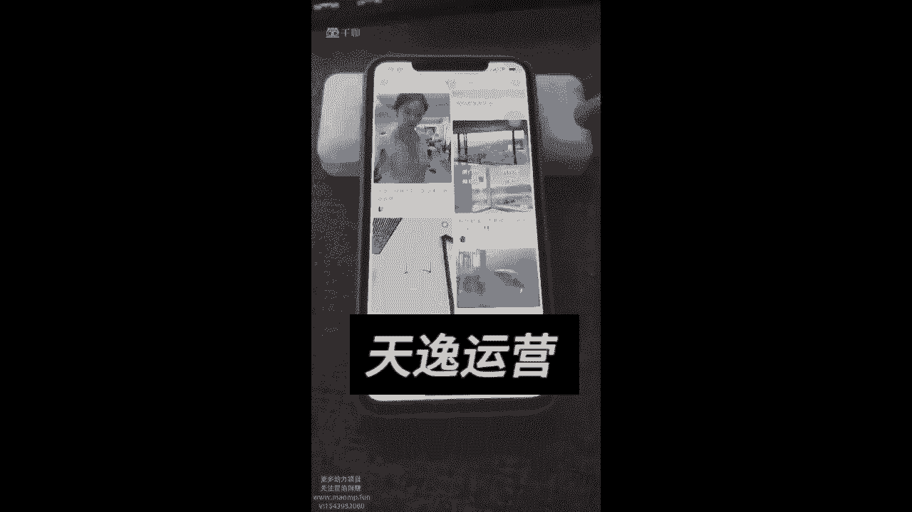

# 【2024版小红书体运营教程】全B站最良心的小红书开店运营高阶教程合集，小红书体开店起号真的快 - P21：笔记常见问题大盘点一反面案例 - 梅者如月 - BV1Z2HYeKELy

来我今天给大家去讲一下呢，就是反面教材啊，因为正面教材我们已经在前面给大家讲过了。

那之前的话呢教大家怎么去写笔记。

怎么样去写封面，怎么样去起标题呀，写文案，找素材，这些都是正面教材，但是还有很多人的话呢，他会觉得哎我的素材很好呀，我的笔记也写的很好，但是为什么就没人看呢，那我们今天的话呢就通过这些反面案例。

让大家自己去自查一下，首先第一个的话呢就是啊，我们的话去做这个笔记的时候，素材的质量，你的素材的话是模糊，它还是清晰的，这个是很多人都会去犯的一个错误，我跟你们讲啊，大家怎么样去看这些反面教材呢。

比如说的话咱们在抖音上直接去哎，咱们在那个小红书上直接去搜索包包好。

我们搜索到了这个报告之后，那我们可以看最近数据比较好的。

哎你看人家为什么好对吧，这种数据哎这个一般般啊，那这种数据为什么会好。

那我们大家可以去分析一下，它跟你的差距到底是在哪里，人家文案好还是图片清晰还是什么东西对吧，那那那我们这个东西自己要去分析一下，第二个的话是什么呢，就是嗯我们的话呢要去找这种反面教材。

我们在哪里看呢，点击最新搜索包包，点击最新，我跟你讲。

基本上都是数据不好的，基本上都是数据不好的，然后呢我们就可以去看这里边的话呢。

有哪些数据不好的，你看就像这个包，你能看得清楚吗，你能看得清楚这个包的具体细节吗。

他就一张图片，然后什么都没有了对吧，这个图片的话也展示的不是很清晰。

然后我再给你们看啊，比如说我自己收藏的一个一个图片，你们看到了你就明白了。

来你看这个风扇能看得清楚这个风扇吗，反正我是看不清楚的，如果是你，你会买这个风扇吗，基本上就不会吧，所以说这个的话就是咱们所说的反面教材，首先的话你的视频至少得清晰，你不能太糊吧。

你这么糊的素材根本就看不清电风扇，你传上去的有什么用呢，对不对。

这个是没有用的，第二个的话呢是咱们的尺寸来，你们在抖音上的话，你们有没有啊。

你们在小红书上有没有去搜过这个尺寸，我跟大家去讲过，尺寸的话，咱们的比例啊一定要记住是三比四。

对不对，很多人的比例并不是三比四。

比如说你看就像这样的素材，它是三比四吗，不是这个素材就很小。

你看旁边有这么大一个素材，这种素材就很容易被别人不点了，他就很容易把这种视频素材忽略掉，他喜欢这种大的，看起来非常清晰的，而且的话呢我们用这种三比四的比例，它旁边不会有任何的白边，那我们大家一定要记住。

其他比例都不行。

我们只用三比四对吧，你太窄了也不行，有的人用的这种很窄的这种小图。

你看这种很小的图片，大家话基本上看到了，他也不愿意去点，你看就这种就被别人都给已经给盖掉了对吧。

就非常不明显，然后呢还有一个点是什么。

就是很多人的话，他喜欢用淘宝的拼多多上的产品图片。

比如说的话我们去搜索一个啊女装也行，反正你就随便搜吧。

你搜索一个女装连衣裙，连衣裙嘛。

连衣裙，然后很多人的话他可能会去搜索，用一些淘宝上的那种图片啊。

但是这种图片的话呢，我说白了就很多图片的话。

它只是一些图片，这些图片的话并不适合拿来，你看就像这种哎这种照片的话。

它有美感吗对吧，就是还有一些人的话。

那就直接把淘宝上的那种图片，就淘宝上的一些图就直接发上来了。

你看就这种来就这种照片，你觉得它好看吗，就这种照片的话是不能用在小红书上的，你们要明白，小红书上的人群基本上都是25岁以下的，他们的话追求年轻化的产品，对不对，像你这样的素材，人家根本就不喜欢，对不对。

还有一个呢就是我要跟大家去讲啊，你们要去找到，我建议大家的话，你们可以到评论区去找一些好的素材。

为什么你要知道，淘宝有很多买家是买那个评论的，然后专门找一些模特去拍图的，那些图片反倒更加真实，另外一个是什么呢，就是你们的素材千万不要做太长，尤其是视频素材不要超过十秒。

要找十秒以内的，那我们这个时长怎么控制，如果真的时长太长，到剪映上把它剪掉就行了呀，剪映上直接把它剪到十秒以内的，调整一下，把水印什么的都去掉，然后呢前期我们找十秒以内的素材，而且你们还要记住。

咱们在配乐的时候，你可别配一个就是七八十年代的那种老歌，你们的话呢在抖音的那个剪映里面去找找。

就是抖剪映里面不是有热榜吗，我给大家看一下啊。

比如说我们打开这个剪映，然后呢我们再去剪一条视频素材的时候。

比如说我随便剪一条，就比如说的话我自己找的哎这个这个吧。

就这这不是产品啊，就是为了凑这个这个东西，然后呢我们来找一个音乐。

这里的话呢就会有一些嗯，比如说抖音的这种音乐，就这种音乐对吧。

这种音乐的话都是比较好的，然后呢或者是你平时看到好的一些音乐。

你也可以收藏起来，然后呢，包括的话你看这里都会有很多的音乐，推荐给到你的。

那你的话呢可以根据自己的情况，你们找一些这种流行的音乐，或者是呢你自己收藏的一些好的音乐，经常咱们听到的这种音乐，你不要用七八十年代的。

你说你在小红书上，哎咱们的话呢发的这些产品还都挺好看的。

比如说的话我们发的是这样的一些东西啊，比如说咱发一个这样的连衣裙，结果你放了一个对吧，牡丹或者是你放一个什么，就是很欢快的那种，七八十年代的老歌，大家可能基本上也划走了，跟你的这个内容根本就不搭。

所以说你的音乐太土了，大家也不想买，毕竟抖音那个小红书上的用户，他的年龄段基本上的话就是在25岁左右，年纪年纪偏年轻的好吧，这些的话都是大家要避开的点啊，我们的视频的这个素材啊，你的作品啊。

就是你的质量按照我刚才提的这些要求去改，你的笔记的质量会好很多，所以说以上都是大家需要去注意的点，然后如果说你实在不知道，你就多去看一看，就是这些人做得好的哎。

人家的视频素材跟你的差距到底在哪里，为什么人家有1。3万赞，为什么人有1。1万赞。

到底是图片清晰，还是说怎么样子来，你看就人家的这个视频，对不对。

为什么他好，它都是有原因的呀，比如说的话你看像展示这个它就好看呀，穿上去那有些人展示的那个包呢，甚至这种材质都能看得清清楚楚的。

就像我之前的话，我在我我在那个小红书上，我去搜索了一个包。

然后你就看上面有很多的这种包，你看像这种材质这种纹理给你拍的一清二楚。

这种视频你想不想看这种视频肯定弄啊，你对吧，这种视频的话肯定你自己的话也会去细看的呀。

是不是来你看就这样子的，哎你看这种清晰吧。

对不对，对不对，那你看像这种的，是不是材质纹理都给你拍的很清晰。

那你这种包的话，你不是大眼，你就想去看嘛，对不对，你太糊的那种的话。

