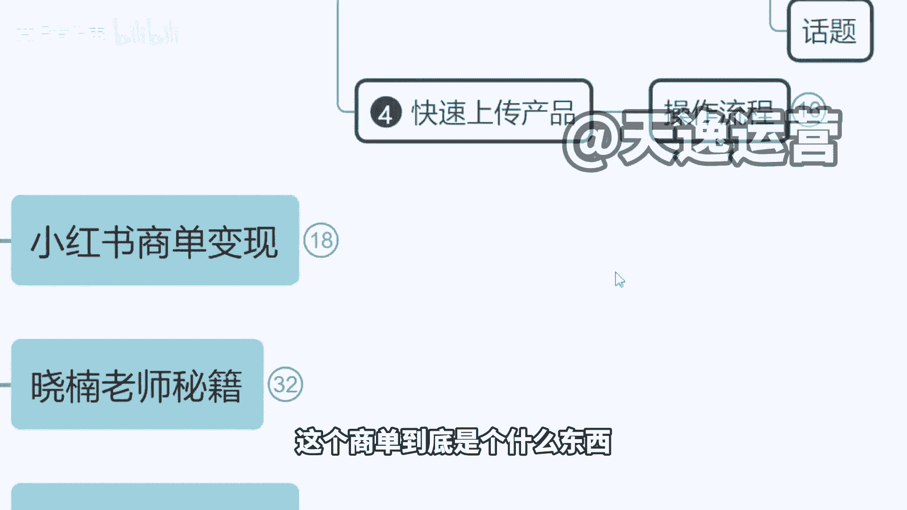
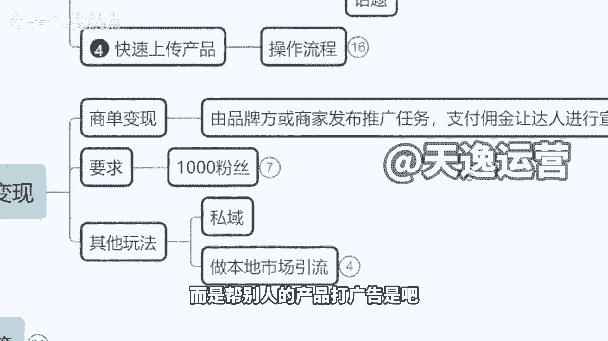

# 【2024版小红书体运营教程】全B站最良心的小红书开店运营高阶教程合集，小红书运营大佬专为为学渣研制的小红书开店、小红书体开店起号真的快 全程通俗易懂， - P19：1.小红书商单变现，什么是商单 - 草没有发霉 - BV1eepKesEV9

既然我们说到这个工具，我把商单也跟大家介绍一下。

商单的话是开店是这样的，开店是属于细水长流，你第一个月下来可能一天我就四五个订单，四五个订单，后面随着我的粉丝的增加，看到我作品的人越多了，然后我的订单慢慢的增加了啊，5100万2万。

我的收入这样去叠加它是有一个过程的，但是如果说接单，他跟你的粉丝数真的有什么几万呐，你的浏览率啊，你的这个播放量没啥关系，就是只要有1000粉就能开始挣钱，每天都是有单子的，然后像这种的话呢。

如果说你们去做第一个月啊，收入不会低于5000块钱，有多少人想了解上单，想了解的，我们扣一想了解的多，我就拿到前面来跟大家讲，跟这个AI工具我结合在一块去跟大家讲调啊，想了解吗，OK想了解是吧。

好那我来说一下啊。

商单是这样的，来我们看一下啊，这个商单到底是个什么东西。

我们带货其实大家大纲也知道了啊，商单呢就是一个广告。

你发作品给别人的品牌打广告，就不是说卖自己的产品了，而是帮别人的产品打广告是吧。

那这个时候呢它是有比如说我是蓝天牌牙膏，那么我作为商家来讲，我就先到小红书的官方平台。

叫做这个蒲公英商单，叫蒲公英的平台。

然后呢我去平台发布任务，这个时候你的任务是有价格的。

比如说他的一个价格是600，你不是说可以拿到600的啊，小红书人家分走的钱很高的，比如说他人家拿600块钱，对不对，小红书要分走300元作为平台的费用，你用我的平台宣传，我要收平台费300元。

然后你的费用呢也是300元啊，你的费用也是300元，这个就是蒲公英商单里面他那个模式，那如果我们成为了蒲公英的认证的接单，就是认证的写手，这个叫做一个写手的身份啊，给大家看一下，携手也叫编辑，你叫编辑。

其实这个模式它并不是对所有人公开去招标，公开去招募的，就比如说我今天我啥也不是，对不对，我有1000粉丝了，我是不是就一定能够开通这个普通易商单了，并不是的，他作为一个写手和编辑来讲。

相当于说是小红书平台对外招募的写手，你是来帮小红书写文章的，那他对你的要求就跟你去找工作面试是一样的，要求你是某公司在职在职，或者说曾经任职过的编辑，你是某个传媒公司的编辑，或者说是品牌的运营运营。

你是有这个工作经验的啊，然后以面试的方式，他不是不用跟你面谈啊，就微信上聊啊，觉得说OK你有这个资质，他就给你开通这个权限啊，但对于大家来讲，现在其实也没有，对不对啊，但没关系。

这个到时候我们可以给大家去处理啊，一样的，以我公司员工身份直接给他报上去就可以了，那么达到1000粉之后，你就可以在这个平台看到大量的订单，我们就可以去里面选择你想合作的商家啊，他们会对外去招募。

或者说当我们在平台有携手的身份，有认证标志以后，商家会主动来找你，他会直接私聊，你跟你去达成合作，这个都是有的。

是这样的一个方式啊，大家应该也知道了哈，对不对，那么我们看一下它的体验呃。

他的展现形式是咋样的，我们其实今天在小红书看到的很多，这样的一些达人，就好比说这种同学们看一下啊，这个曝光黑名单，热门美容仪别踩坑了，你看他跟你介绍了一大堆美容仪，然后呢告诉你该怎么选，是不是。

然后跟你讲了很多牌子，大家能看出来这是哪个品牌的广告吗。

能看出来吗。

是不是好像看不出来哪个看不出来，对不对，是这个啊，第一个陪驰啊，因为大家不了解美容仪啊，就是其他都是品牌，你们你们可以这么理解啊，其他都是品牌，只有第一个是杂牌，只有第一张图是杂牌。

他这个广告写的很好啊，就是他把一个杂牌跟其他品牌货全部放在一块，然后让你误以为这也是个品牌啊，评论区他这个互动下单了，赔驰飞驰，是不是，这就是他的广告啊，我跟大家讲一下，你们在小红书看到的所有的盘点。

不管是什么品牌，是个美容仪也好，是个剃须刀也好，是个香水也好啊，来我们看一下香水，是个香水也好，是个狗粮也好。

没有人会闲的，没事干，给你做测评，来我们再打开小红书这一个界面，你看这么多品牌，难道说真的是这个博主他自己自费掏腰包，买了这么多香水回家去闻吗，然后给你写总结吗，没有的是没有的，这就叫商单，这就是商单。

来我们看一下，就好比说这个账号啊，看过这种类型的没有情商账号，就是他的所有作品呢是在跟你互动啊，问你说啊，这个呃比如说桌上有五个领导，你手里呢有四支烟，请问怎么发烟才能让四让五位领导满意，对吧好。

这时候评论区又开始互动了，因为大家看到这个问题开始集思广益，开始回复了啊，好你的账户活跃度不就起来了吗对吧，浏览率不就起来了吗，好那这个时候你粉丝上来了，你就能接广告了，你看啊，就这样的一个情商号。

中间夹杂了各种广告，来这个烫发护理的，这是一个商单是吧，他是不是真的自己去烫发，跟着他跟他分享，没有跟他没有关系的，是不是还有呢防晒的定妆喷雾的啊，面膜的看到没有是吧，然后呢这种药的以及狗粮的啊。

狗粮的这都叫商单，他不是说闲的没事干，做了这么多测评，这个测评都不是他自己做的啊，这就叫商单，大家理解了没有，这个就叫做商单啊。

