# 【2024版小红书体运营教程】全B站最良心的小红书开店运营高阶教程合集，小红书运营大佬专为为学渣研制的小红书开店、小红书体开店起号真的快 全程通俗易懂， - P20：2.小红书商单变现要求 - 草没有发霉 - BV1eepKesEV9

那么这个单是什么样的一个情况呢，单子分两种，一种呢叫做直发订单，直发订单就是你不用写文案，不用找图片，商家全部提供全部提供，就像这个一样，来我们之前有很多新手，刚开始做的时候都接这种单啊。

因为这个单虽然很便宜啊，我跟大家讲这种单不怎么挣钱，一个单一百一百五，100块钱，150块钱那种嗯，给大家看一个哎，我找一个之前有做商单的同学啊，找一个给大家瞧一下，来这个曾林慧的，我给你们看一下。

我这个学生给我发了啊，好多图片，这是最早在接单的时候我都有记啊。

就他每个单我都会记记录，然后你们看一下，这个是之前你看这个有没有档期合作。

他这个是怎么讲的，你看下午写好图文发给你宝子啊，这种就很便宜。

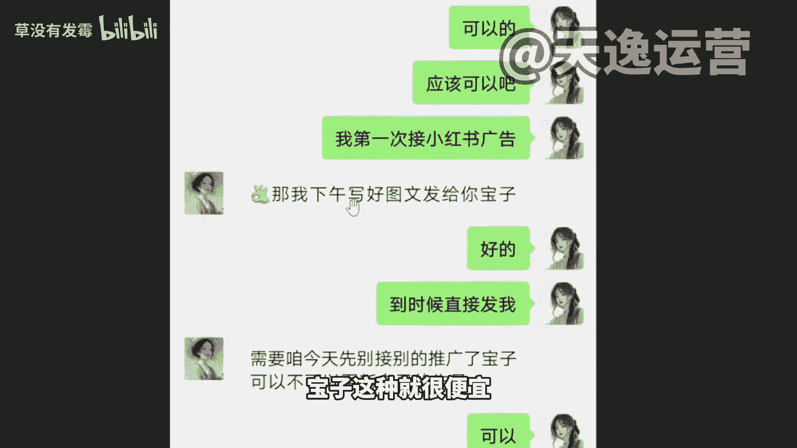

然后商家会直接给你安排好一切，因为他们有自己的这个品牌，有自己的品牌宣发。

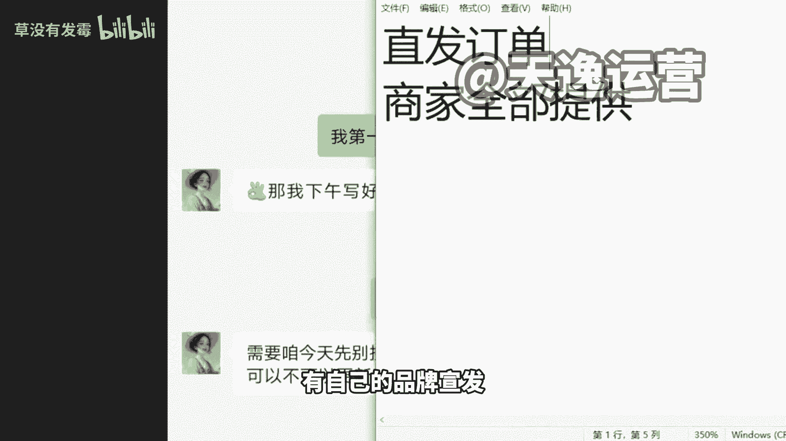

他会写好给你，你负责发就行了，但这个很便宜啊，因为你只是个工具人对吧，帮他发一下就行，100块150块钱钱不是很多，然后这个叫直发单。

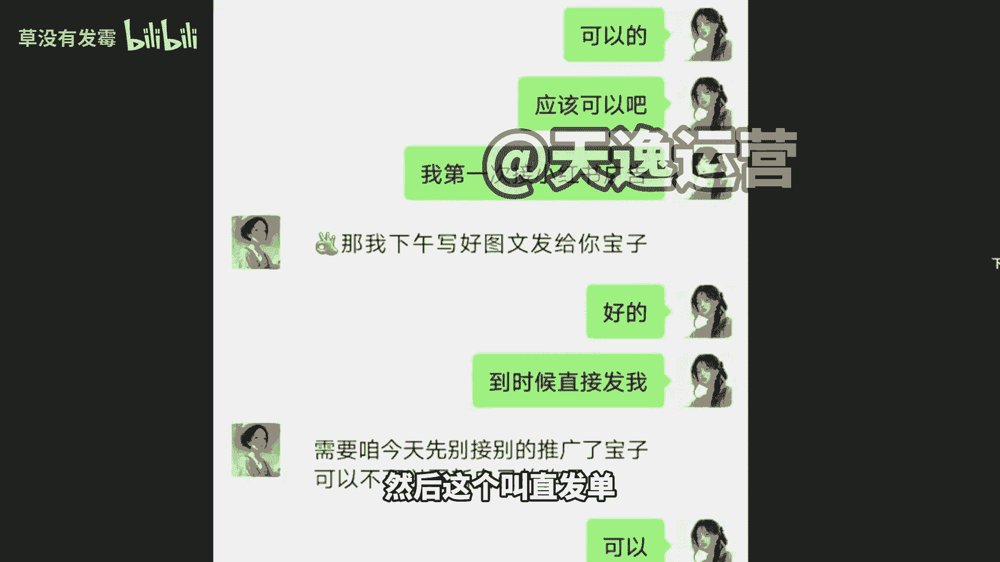

你什么都不用干呃，但是由于现在订单竞争人数肯定是越来越多了，未来做这个行业人越来越多，你如果说没有写作能力，没有创作能力，只会做直发的话，你未来是没有市场的，因为他找谁发都行，对不对。

但如果说未来我们的账号，你的认证里面认证的身份是原创达人，原创达人，那么你的价格就不一样了，你的价格就不一样了，如果咱们是1000粉丝数啊，那么你的单价最起码是3100条。

310条就是原创单是310条啊，你个别想打价格战的，你设个二百五，260，240的也有啊，但是通常300块钱是均价，那如果说粉丝越高，价格也是越高的。

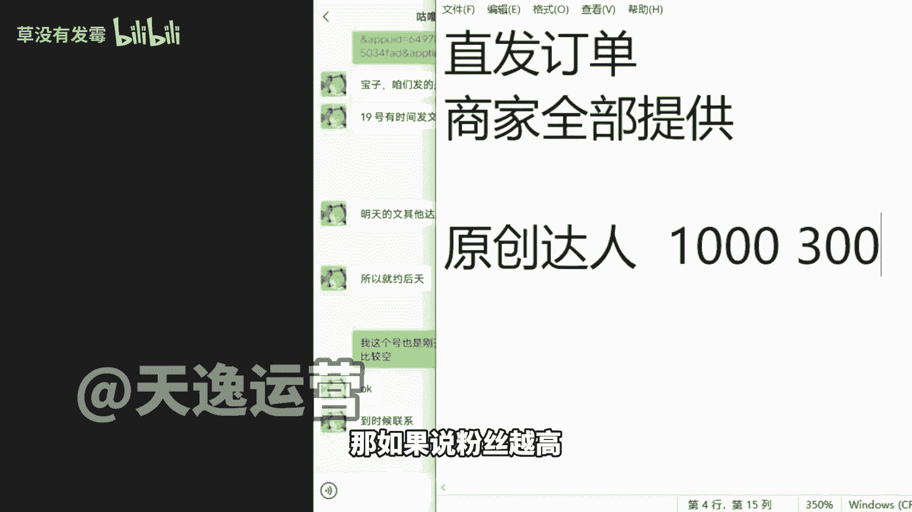

你们可以看一下它后面啊，他后面价格完全不是这个数了。

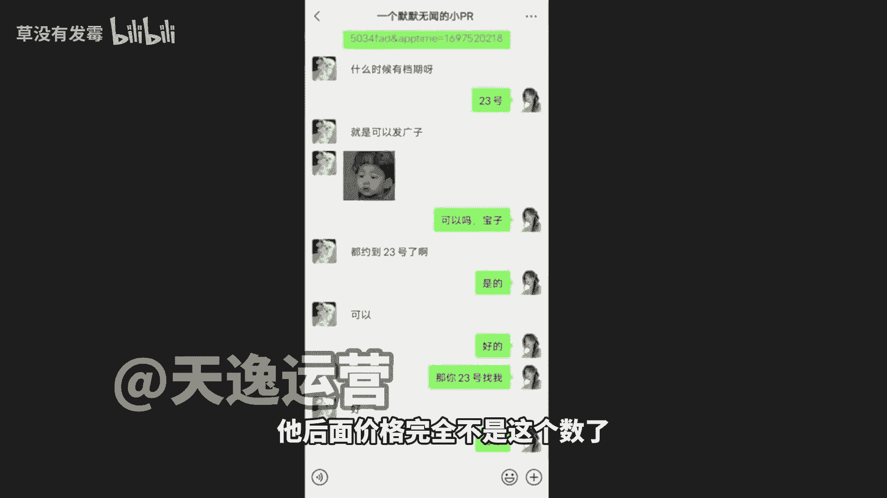

还这么多广告啊，当时跟我讲的，你看他说我跟函数运营说了，晚上给他发，他同意了，现在是接到韩束的一个订单，一个订单是2000多块钱。

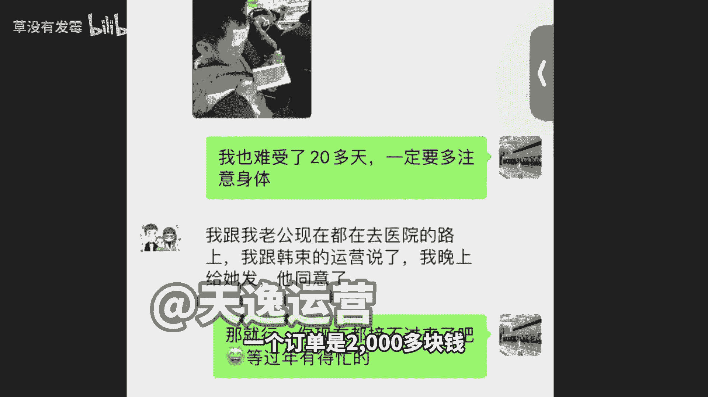

我给你们看，他从过年啊，这个图是过年前寄给我的，然后到目前我估计他单子应该还在叠加，他当时跟我讲说，过年不出去串串亲戚了，不去任何地方玩，就在家里发作品，看到没有，待接受，79条。

他那个时候啊才月初的时候，当月收入已经累积到7650了，就接都接不完的状态啊，这个就是蒲公英商单后台看到没有，普音商单后台79个代接受进行中，八个就是我算他一条四百五百来讲，510条来讲。

你们自己算一下这多少钱啊，因为现在小红书平台广告越来越多啊，我们现在手里都囤了好多，就是我们得完成，不完成的话有违约金什么的，或者说这个单子就派到别的公司去了啊，所以说我巴不得让你们去接。

有人巴不得你们来接啊，巴不得大家来接，巴不得你们来去承接这个东西，然后如果说价格高的来，我举几个例子啊，如果说做原创啥意思呢，就是图片可以找商家要，但是文章我们自己来写啊，因为商家写文章很费时间。

或者说图片我们也可以自己去找自己去做，你们看一下啊，我拿一个那个呃，这个是其他公司的，我来给大家讲一下啊，这个其他公司的一个号都注销掉的，我当时看到这个号的时候，我特别我就特别心疼我，当时我在想。

我跟我们团队想，要不要咱们花钱去收一些那个不挣钱的账号，过来啊，你看一下啊，这个粉丝数初级达人啊，魏千源这个号注销掉了，因为不挣钱，别的公司的啊，6000啊，不算，应该不能说是别的公司的。

可能就是一个小白做号啊，突然报号了，但是不知道怎么挣钱，你看啊，6898个粉丝数，截止到2月18号啊，这个18号就过去很久了，但这个数据因为他他是呃半个月更新一次啊，然后现在还没有更新。

来6898看到没有，那么他的一个接单情况是什么样的，近30天来我们看他投放评估啊，就他那个单价多少钱，150，我记得你看到没有，150，因为他没有原创能力，他只会直发，然后他是一个单都没有的。

近一个月啊，一个单都没接到是吧，你没有原创能力，别人凭什么拿单子给你哦，我凭什么送钱给你，我找别人不行吗对吧，别人还有100块的，那近60天我们来看一下，就等于说两个月以来他注销号之前接了单没有。

就接了四个，看到没就借了四个，对不对，就借了四个，150，接了四个多少钱，800块钱吗，还600块钱，600块钱啊，是不是这个很少的，但是我们看一下同样的差不多的一个粉丝数啊，来这个啊。

来我们之前一个学生这个号的话，粉丝数会稍微多一些，7000多啊，这个不是啊，来稍等这个来这个5177个粉丝数，看到没有，5000多粉丝数，粉丝数没有别人多啊，但是他单价完全不一样。

5000多粉丝数做原创，因为他这个是有原创认证的，你看央视素人，湖南长沙未签约任何公司，都是普通人是吧，自己有自己的本职工作，就副业做一下这个小红书的700元的一个报价，图文报价700块钱一条。

然后他的单子是多少个单月，就这个就这个月的这个统计，而不是说这个月啊，是从今天起，从今天往前面数30天，它是近30天数据，从今天起往前数30天，37个订单，37个订单，然后呢是700元的报价。

来我们看一下37个订单，700元报价是多少钱啊，这是他这一个月的一个收益是2万多块钱，看到没有，这完全是两个极端的这个效果，所以说原创很重要，那我怎么样去写这个原创内容呢。

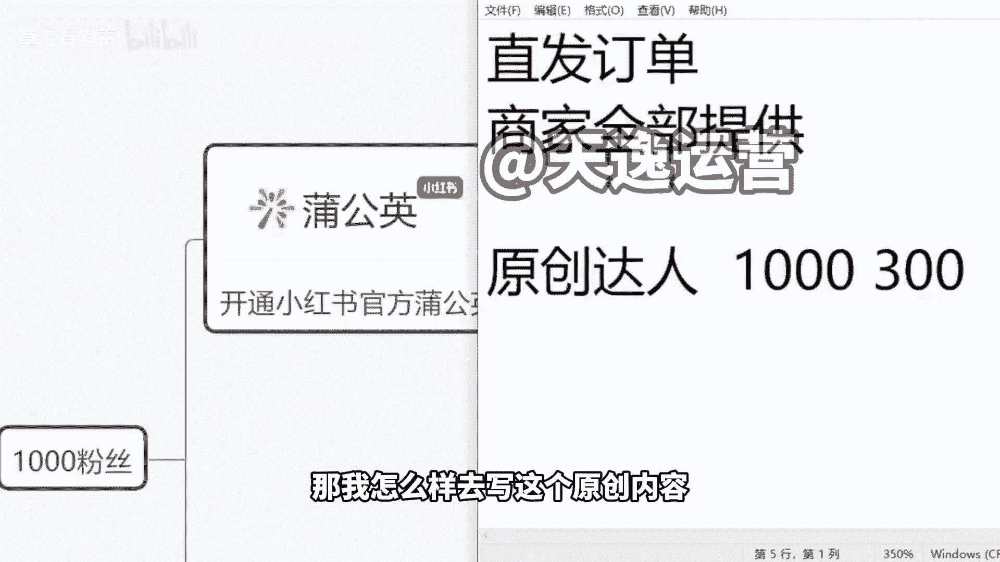

我们拿这个AI刚刚我们讲的这个AI来写对吧，你直接点开种草文案，我们就说刚才的那个美容仪，因为很多同学说老师我是男的啊，我是包括我是女生，我都不用美容仪，我根本不懂这个东西怎么办，我怎么写。

人家要求我写250个字的产品描述出来，我不会来平，那我们就选美容护肤对吧，我产品我选什么，我选来美容仪对吧，当然啊，关于产品描述这一点，你要找商家给你列卖点出来，就是你要问他这个产品的功能是什么。

让他把功能告诉你，你把功能填在后面，我们时间原因我就不写那些东西啊，然后我们来点生成。

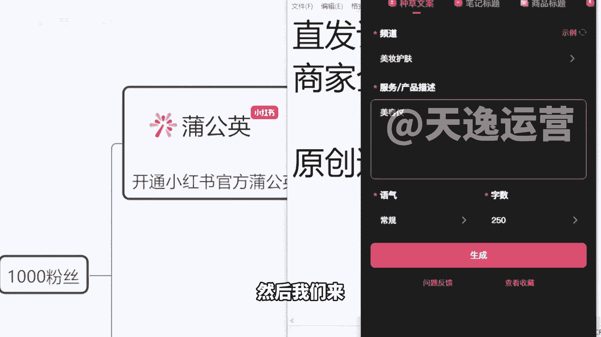

对不对，这个时候语气也是一样的，你要去根据自己的需求来选，我知道友好的还是怎么地的啊。

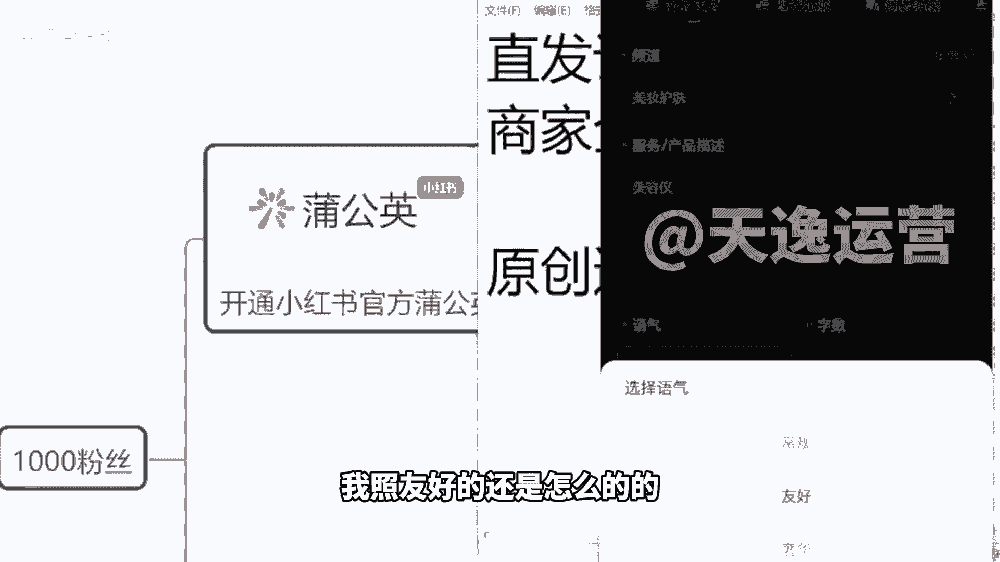

一般我选友好比较多，那么同样的我们点生成这个文章，他会在几秒钟的时间立刻给你写出来来，你看就算他就算你不懂美容仪，没事啊，你看这里，亲爱的护肤达人们，给大家种草一款超级神奇的美容仪，你是否在为肌肤暗沉。

细纹痘痘烦恼，这款美容仪可是你的啊，肌肤救星，看到没有功能直接给你拓展出来了，首先其次最后来你看啊，首先呢提拉紧致深层清洁，美白亮肤，一机搞定是吧，什么导导入导出技术啊，能帮你吸黑头，吸毛孔啊。

还能帮你把这个好的乳液，给你导入到皮肤里面去，是不是来你看我对这个不满意，我再点换一换，他这个很细节，表情那些都给你选好了对吧，卖点给你罗列好了，这个第一个好的点是什么，第二个好的点是什么，对不对。

还告诉你啊，这个采用先进的声波振动技术，红光模式啊等等，来这个东西好不好用好用，咱们扣三个六，我看一下啊，好用我们去扣三个六是吧，你不需要你说我我不懂这个东西啊，怎么怎么地的是吧，我不懂这个产品。

那没有关系啊，他会帮你洗，是不是他会帮你写啊。

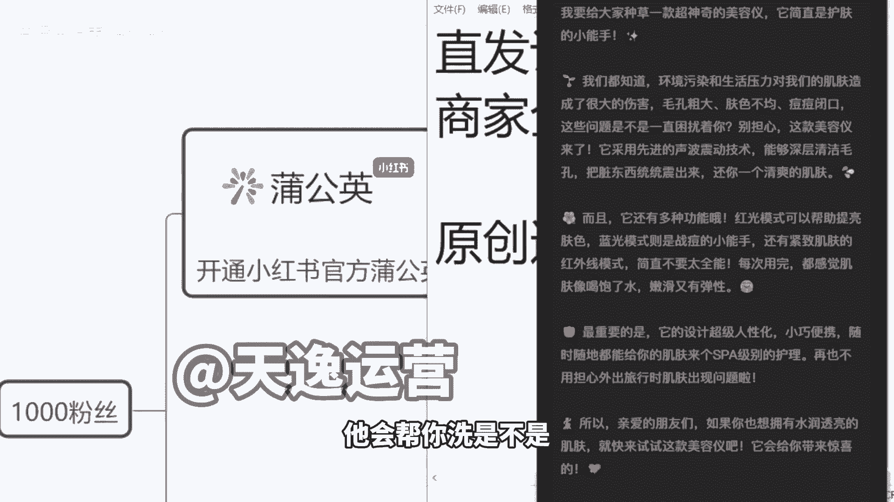

来包括像这个产品除外的话，我们之后去做其他类型也是一样的。

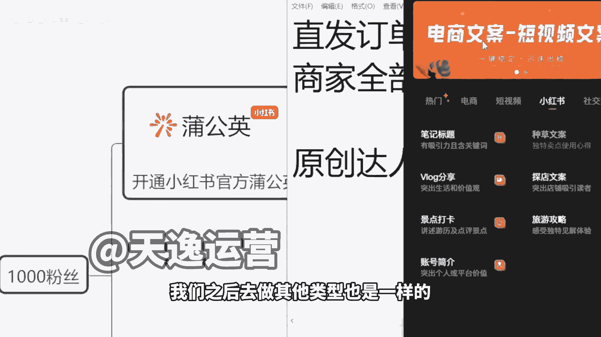

比如说我要做的是一个这个沐浴露啊，我要卖的是一个多芬沐浴露，你把牌子写上去都行，来沐浴露是吧，一样的，我直接让他给我去生成这个文章，同样的帮你来写，而且每一次我们再点击换一换的时候。

它生成的内容都是新的啊，都是完全不一样的，如果说你怕错过好的文章呢，我们每次生成之后，你把这个文章呢，先复制保存到自己的那个手机里面，保存到一个文件里面啊，保存到一个这个文档里面，然后呢再点换一换。

再生成新的，到时候生成好几天之后，我们选一个合适的啊，然后呢再去发给商家去审核就行了，然后但是这个东西呢我们不能去跟商家讲说，老板嗯，你让我来接你的单吧，我有工具，你不能这么说啊，你要接单的时候怎么说。

你拿到人家的任务之后，你等那么一个小时，一个半小时，你再把你选好的文章发给他啊，表现出一个真实咱们自己写的感觉，他如果说哪里有问题，咱们再做适当修改就行了，那如果这一篇他说不行，换一篇，我再过一小时。

我再拿片新的，立马又发给他，是不是我可以说到最最起码一点这种水平，这个文章写出来的一个效果。

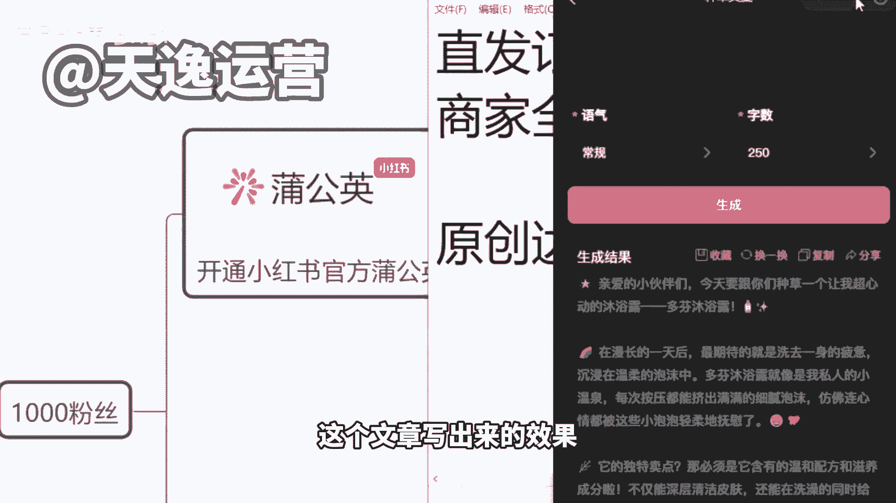

肯定是要比咱们自己去写的效果要好很多的，你这个东西写出来是要超过很多这个素人小白，自己写的文章的，而且人家效率很低，对不对，那这样的话我们接单是不是就不会担心了啊，那这个老师，那既然接单的话。

我要1000粉丝，涨这1000粉丝难不难啊，我涨这1000粉丝难不难啊，首先我跟大家说啊，我们到时候去做这个接商单的账号的话，我不用说我指定就做一个类目，比如说我这个号只发沐浴露。

我这个号我就只发什么这个狗窝呀什么的，这个不是这样的啊，你发啥都行，你发像刚才的那种情商也可以是吧，然后你去发一个什么科普的那个作品也行，你去发一个这个影视解说都行等等啊，你去发一些这个语录合集啊。

或者说搞笑段子合集都可以，就是只要我的作品是能有人看的，不管是发啥类型，只要你的粉丝达到了1000，你的账号没有限流状态，我们的播放量是OK的，那么你就能够去达到这个平台的审核要求，然后这个认证的话。

我会帮你们开啊，因为像相当于说我前面也说了，我是属于你的带教人，那么如果说这个呢，因为我们手里我们手里是有很多资源的，如果这个品牌放的一个单子，是我们派给你的对吧。

那么你该拿的那300会不会分给我一分钱，不会分给我，因为本身你跟平台的评分的，这个单价就是300跟300，你300平台300，那么如果说这个资源，这个单词是我给你提供的对吧，你这位达人是我介绍到平台的。

那么平台的300元里面会分给我50，或分给我们公司50，这个钱跟你没有关系啊，就我们不会从你的获利里面去抽成，这个钱是由平台去分给我们的啊，所以说其实我们也相当于一个合作共赢的方式，你来帮我消化资源。

你来帮我完成这个任务，完成这个额订单，那这个时候你能挣钱，我们也能获利对吧，我们是总量，那你靠多接多赚钱就可以了，是这样的，1000粉的话挺好涨的啊，1000粉的话，基本上我们到时候会给大家去做定位。

1000粉的话七天十天左右是完全OK的啊，我们基本上其实三四天左右的时间是可以的，我给你们看一个吧，啊我们之前有学生做健身教练的。

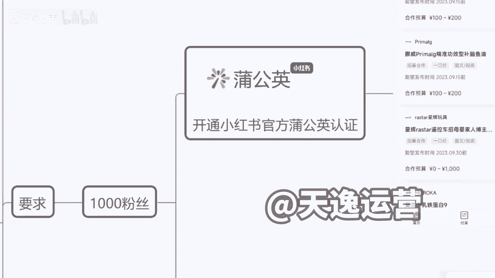

他是这样的，他是做了影视解说，但是说实在的，我不建议你们做影视解说了啊。

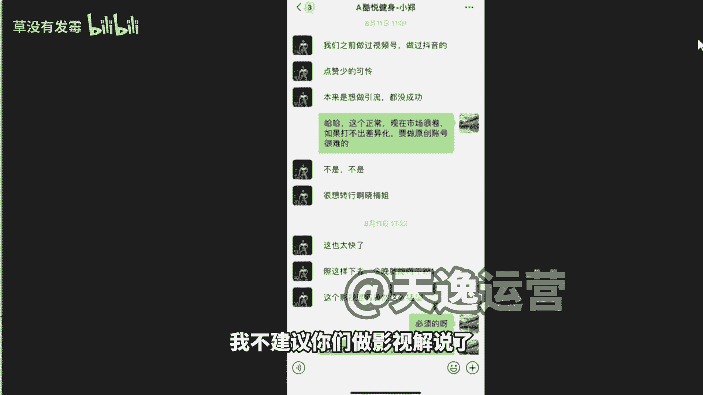

因为他是去年的，你们现在做影视解说已经市场太做太多了，但是我今天不会在课堂里面去给你们建议，说你一定要做哪个类型啊，我但凡说了，咱们今天课堂几百号人啪啪全是做一个类型，你再做也不可能了。

所以说这个我们以后私下再做定位，我们一定会把好做的类型，我们私下里给你一个人，每个人的类型是不一样的，所以说这个不要在课堂问我说，老师你推荐做什么啊，我不会回答的啊，这个东西不回答嗯。

然后但是呢这个视频视频解说，影视解说确实不建议做了，因为做人太多了，来你看一下啊，他之前是做过抖音，做过视频号没有效果的，因为他只是做给他们自己健身房引流嘛对吧。

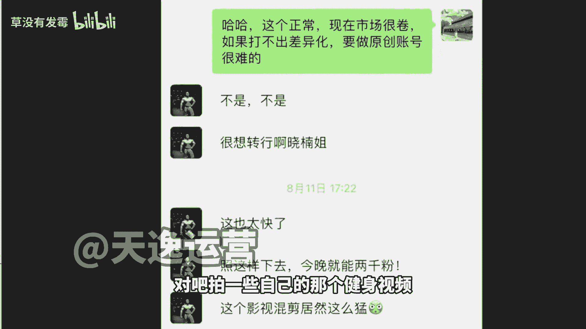

拍一些自己的那个健身视频啊，腹肌啊，这个胸肌什么的啊，然后但是呢他呃其实这个大环境的原因啊，办健身房办健身卡的其实越来越少了，就大家很很难说，再愿意去花一些额外的这个消费，去提升自己的生活品质了对吧。

更多愿意啊，还不如在家多买两块排骨，所以说其实他们生意不好做，就跟我讲说想转行啊。

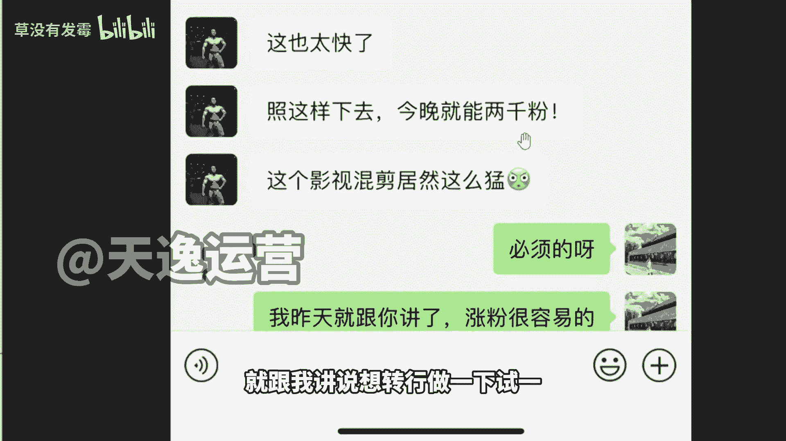

做一下，试一下别的这个项目，然后后来你看啊，他的涨粉是怎么的。

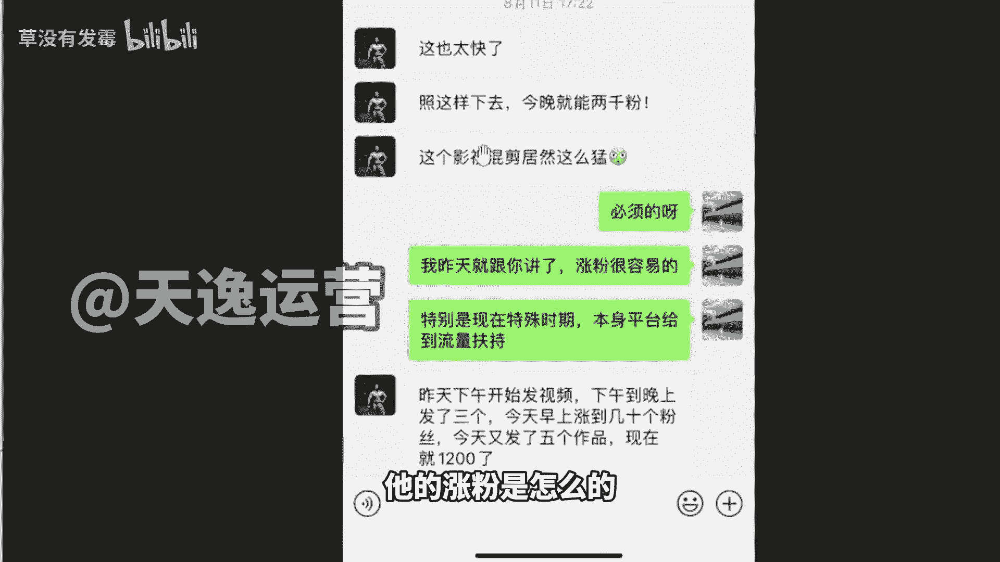

你看下午昨天下午开始发视频，下午到晚上发了三个，今天早上涨到几十个粉丝，今天又发五个作品，现在是1200个粉丝了，所以说其实我们只要去抓住流量密码，我们是知道流量密码这个东西我很隐晦啊，我不能跟他直说。

就我们知道是发什么。

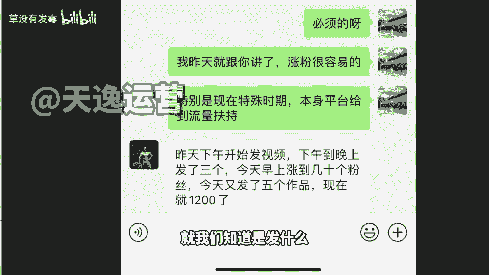

可以的，因为像我们作为平台的这个账号分化来讲，分化的运营商来讲平台，比如说他需要什么内容啊，哪个板块是缺的，他们给我们发微信的，就会跟我们讲说啊，你这边这个月或这个季度。

给我们提供几个什么什么品类的一个账号，OK他给我发了这个信息之后，我就跟我们自己底下学生讲说，你们去做这个类型，是这样的啊，我们会直接给大家去安排啊，然后这个就是属于一个商单的形式来，我给你们看。

就刚才这个人啊，就刚才这个同学他现在接单价格很高的啊，你们一定要你们可以向他看齐，人家也是在过年的时候没少赚啊，没在过年时候没少赚，7680一个粉丝笔记数量33个啊，然后单价来你们看一下，1800。

你们不用觉得说他挣得多或者怎么样啊，人家都是AI做的，都是AI工具做的，没有说他能力有多强，全部是AI生成的，然后另外还有一个就是你们之后做商单，想多挣钱的一个玩法啊，一个小的这个建议给你们。

就是我们刚才那个宝妈，她在做的，你们会发现我给大家看的几个聊天记录，她的聊天记录的头像不一样啊，对她头像不一样，人家好几个微信他怎么操作呢，首先他自己的那个小红书号啊，是有四个。

那么他今天拿这个微信跟这个商家聊完之后，签下了这个订单以后，拿到钱之后，他换一个微信再去加那个商家，说你好，我这边有个千粉号，你需不需要合作啊，拿AI反正生成又不一样的文章，对不对，又是一篇不一样的。

又找这个商家再合作一遍，再收一次钱啊，直到没号了为止，就这个方式说实在的啊，你们也能干，因为本身我们确实有号，他就是能够挣钱的，有这个资源，有这个商家的一个资源之后，把它物尽其用啊，用到最大化。

用到最大化就可以了啊，然后这个的话就是我们之后可以去做的一，个方式啊，所以说人家为什么能挣钱，对不对，为为什么人家挣得多，一个月最起码两三万的一个收入号多啊，人家是直接是一个订单。

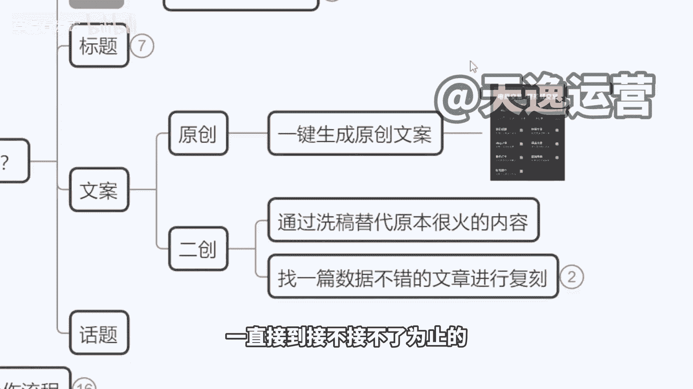