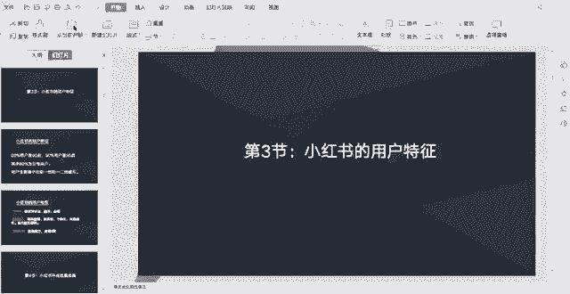
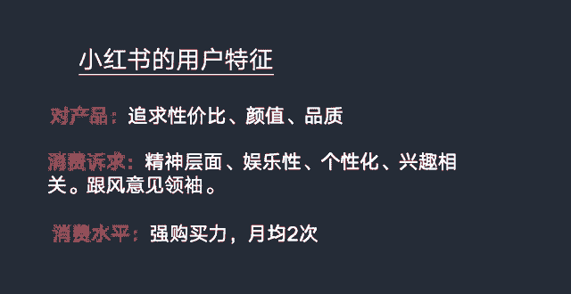

# 【2024版小红书运营教程】全B站最良心的小红书开店全套运营教程！小红书体开店 起号真的不难，拿走不谢！ - P11：小红书的用户特性 - 不甜的白开水a - BV1g3HKejEgk

这节课我们一起来学习一下，小红书的一个用户特征，相信现在比较年轻的一些人，手机上面都会安装有小红书这个app，可能年龄相较长的一些人，可能手机上不一定就有小红书这个app。

因为小红书的一个用户人群是比较年轻化的，有80%的一个小红书用户，他是九零后，然后50%的小红书用户他是九五后，也就是说现在小红书2亿的用户，有1亿的用户都是九五后，这个数据非常恐怖啊。

然后其中80%女性是八八十的用户，是女性用户，也就是说2亿的用户有1。6亿都是女性用户，所以大家可以想象一下，小红书他是一个怎样的一个社区，非常年轻化，非常女性化的一个社区。

然后用户的话主要集中在新一线和一二线城市，比如像广东江苏，浙江上海，北京等等这些城市，然后小红书的用户哈，对产品也是有他们自己的追求的，主要是追求性价比，因为小红书的用户比较年轻化。

像比如像有一半都是九五后，像九五后，九五后这样的一个年龄段，基本上都是大学生居多，所以说大学生他的经济条件也不是特别好，可能他们对买一些东西，他们更愿意去追求性价比，比较好的一些一些东西。

然后的话对商品的一个颜值和品质，是有双重追求的，现在年轻人的话，就是对产品的包装和看起来它的品质怎么样，这些是比较有要求的，所以的话我们在啊做小红书平台，挑选产品的时候，我们要考虑。

我们的产品要从哪些方便去做一些侧重，比如说我们的包装人家设计的好看一点，注重像我们包装的颜值，然后小红书用户的一些消费诉求，他是更多是精神层面的一些消费诉求，他买东西他更在乎是这个东西我喜不喜欢。

是不是我想要的，而不是考虑这个东西对我实不实用，然后消费诉求具有一定的娱乐性个性化，然后跟自己兴趣相关的，然后也会跟风一些意见领袖去购买，比如说明星推荐的一些产品，以及一些网红达人推荐的产品。

这些产品是小红书用户比较喜欢的，其实是一些比较火爆的产品，也是小红书用户比较喜欢的，小红书用户的话，他们的一个购买力也是很强的，平均一个月在小红书的消费次数是两次，还不包括在小红书看了产品之后去。

比如说去淘宝，天猫，京东等等这这些电商平台去购买，比如说小红书用户剁手能力是非常强的。

