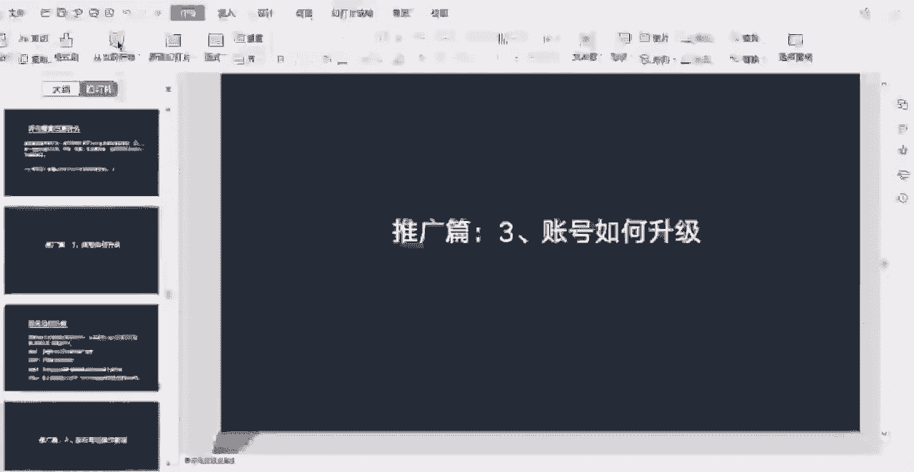
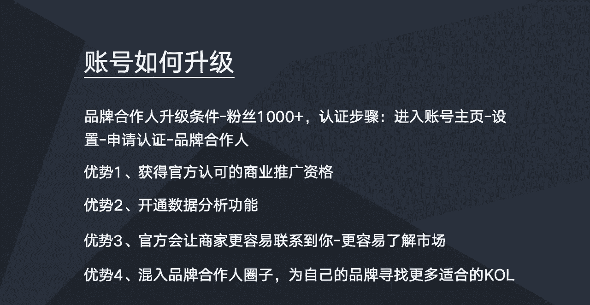

# 【2024版小红书运营教程】全B站最良心的小红书开店全套运营教程！小红书体开店 起号真的不难，拿走不谢！ - P17：账号如何升级 - 不甜的白开水a - BV1g3HKejEgk

这节课我们一起来学习一下小红书的账号，如何去升级，然后小红书的账号升级，可以理解为两个层面的升级，第一个是账号的一些等级的升级，第二个的话是账号类型的升级，然后这节主要说账号类型的升级。

那等级的升级我先简单说一下吧，就是等级的升级的话，就是我们在账号主页的话里面有一个鼠北鼻，那里点进去就可以看到一个账号等级，然后账号等级的话，每一个等级的话，它都会对应相应的一个任务跟操作。

我们只要完成根据上面的提示，完成相关的任务跟操作，我们的账号就能自然而然能够达到这个等级，然后目前的话就是官方也还没有出出示相关的，比如说你等级越高，然后你的账号权重越高，类似的一些公告。

所以的话这一个的话账号等级目前来看，它还不是十分重要的，然后接下来我们就主要说一个，账号类型的一个升级，账号类型的升级的话，就是前面有说账号类型的时候，比如说小红书账号分为素人号啊，KOL号。

还有品牌号，那么K2L号的话是可以升级为品牌合作人的，这里的话就主要说说一下，就是我们的啊普通的一个账号，怎么升级为一个品牌合作人账号，那么它主要有两个条件，第一个条件的话就是我们账号的粉丝。

必须是大于等于1000的粉丝，1000加，然要达到这个粉丝的基础要求之后，我们就去啊做一个认证就行了，认证通过之后，我们就可以成为我们的账号，就可以成为一个品牌合作人，那么认证的一个步骤。

就是我们进入账号的一个主页，然后点击设置，然后再进入啊申请认证这一栏，然后里面的话呃会有一个就是认证身份，点击之后，我们啊上传我们的一些真实的一些证件，比如个人的身份证啊这些信息，然后通过之后嗯。

通过认证之后，我们这个账号就成为品牌合作人了，那么这个成为品牌，成为这个品牌合作人有什么好处呢，就相对一般的一个账户的话，它是有一些优势的，第一个优势就是获得小红书官方认可的，一个商业推广资格。

也就是说我们呃账号认证为品牌合作人之后，我们在小红书小红书上面跟品牌进行一些合作，去推广一些品牌跟产品，这个是合法经营的，相当于是我们做生意取得营业执照一样，然后如果是正常的用户。

他也是可以在小红书去做啊，商业推广的，只不过他是非法经营，被小红书抓到的时候，他是会被限流的，所以说就是我们认证品牌合作人，相当于就是做生意拿到一个营业执照，他是官方允许的。

那第二个的话就是我们认证为品牌合作人之后，品牌合作人，他的后台就会开通一个数据分析的功能，就相比普通的账号，它这个数据分析功能啊相对更全面一点，就看到更多的一些数据，可能普通账号只看到一个阅读量。

就这个数据而已，然后的话就是品牌合作人的话，不仅可以看到阅读量，还能看到粉丝互动的一些数据，以及粉丝的一些画像，相对看到的一些数据会更多一些，那第三个的话就是呃成为品牌合作人之后。

官方会让商家更容易联系到你，也就是说呃，小红书官方它有一个品牌合作人平台，就他会把你的信息上传到这个平台，然后商家更容易找到你，比如说你成为你的账号，成为品牌合作人了，你就可以接触到更多同行的一个商家。

然后就可以从这里可以了解一下，就同行的商家，他们是怎么跟品牌和日人去合作的，这样子的话，就是呃，可以让我们更更容易去了解一个市场行情吧，第四个优势的话，就是可以混入品牌合作人的圈子。

就是我们作为品牌合作人的话，是可以去加一些品牌合作人的一些微信群啊，QQ群啊，或者一些平台，他是有一些呃这样的一个圈子的，就是我们以平台合作人的身份加入这个圈子，然后假设我们自己的品牌也要找一些啊。

找更多的一些KO2来合作，那么我们可以通过打入这些圈子，去找到更多的一一个品牌合作的，这样子我们去找一些付费的合作的话，也更容易一些，所以的话就是以上的话，就是我就是我们在小红书账号的一个升级的。

