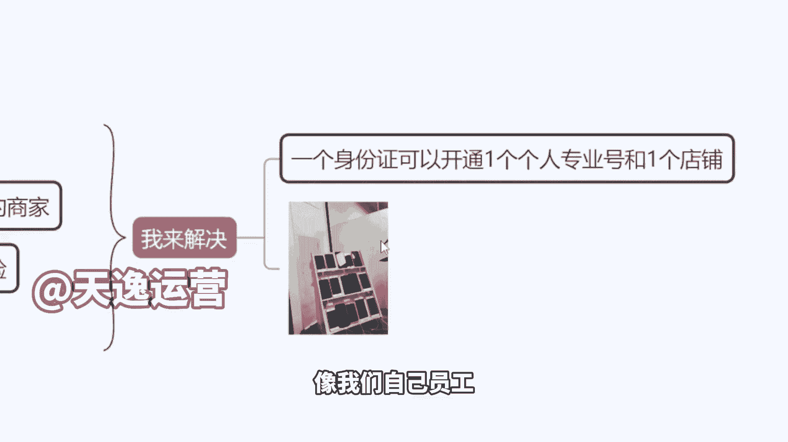
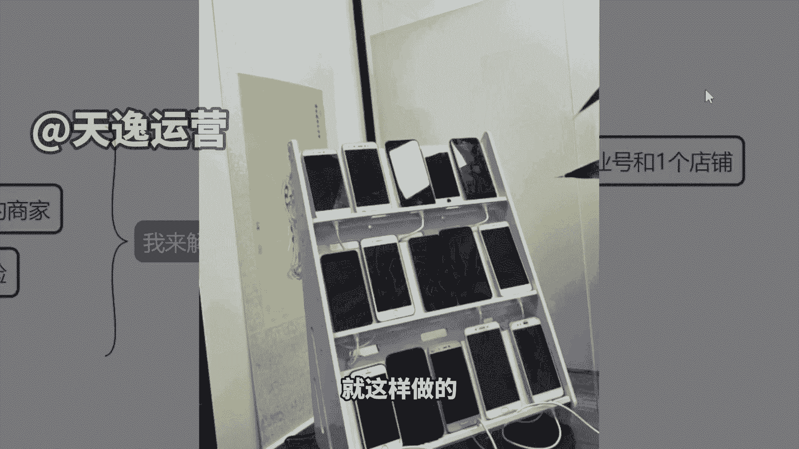
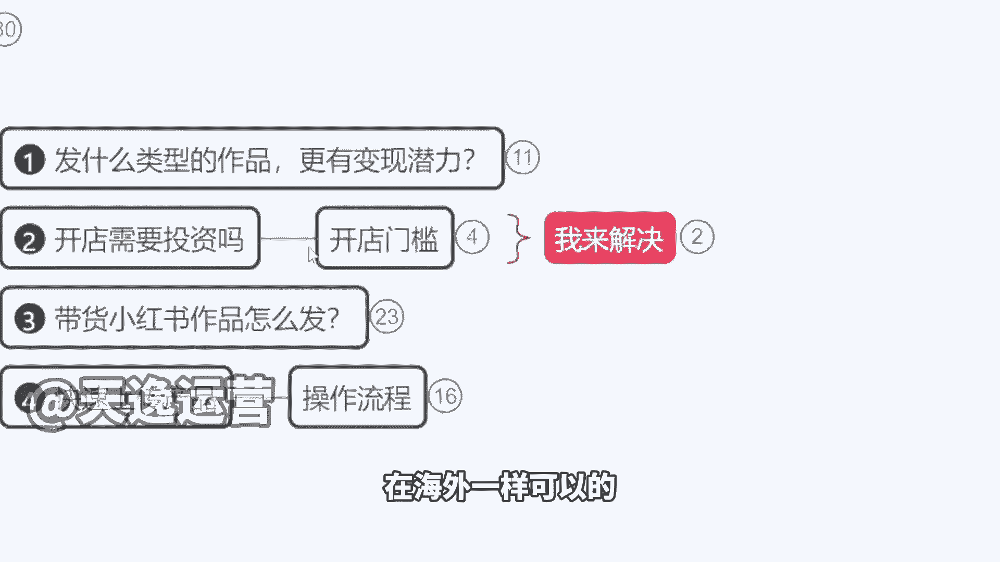

# 【2024版小红书运营教程】全B站最良心的小红书开店全套运营教程！小红书体开店 起号真的不难，拿走不谢！ - P20：2.小红书的开店门槛 - 不甜的白开水a - BV1g3HKejEgk

来，那么我们先来看一下开店是否要投资的，这个问题啊，就是我开店要不要花钱呢，开店其实是不用花钱的啊，但是因为你想要把这个店开下来，想拿开店资格，有人会花钱，有人会花钱啊，我跟你们讲一下。

就是目前开店的话是这样的一个情况啊，呃像有同学来有没有开过店的，有没有有开店的，有没有已经在小说开了店的，有没有流量啊，长腿同学说有啊，有流量没有没看的，咱们先不用打字啊，没看的不用说老师啊。

我上课很积极，我就一直配合你很少流量，对不对，有一点但是不多啊，好那就对了，来我跟大家讲啊，我跟你们说一下，就是小红书，我们不说其他平台啊，我就讲小红书，现在这个平台它的一个这个流量的一个问题。

首先我们刚说了，小红书有千亿流量扶持，我讲过一个点，我说只要你开了店铺对吧，那么平台就会给咱们推流，但是这个是有条件的，因为店铺它分两种，一种叫做普通的个人店铺，普通个人店铺呢他不需要你有经验。

不需要经验，谁都能开，但是它是概率性问题，就是可能十个人申请只有八个人下电，十个人申请六个人下电啊，他不会给所有人下电啊，但是大大概率会通过，你只需要上传身份证，那隔天就能下电，对不对，有开店的。

是不是你只上传身份证了，然后你也没有客户经理，没有客服经理，对不对，没有店铺经理，就是你没有一个专门的助理，是平台给你配的助理是没有的，对不对，那么这种店铺啊，你开了之后，你发现没有流量正常。

因为第一个平台现在要做口碑，他不确定你卖的货是不是好产品，有没有质量保证，不知道你到底有没有店铺运营能力，他不会轻易给流量给到你，因为他根本不认识你，也不信任你，这是很正常的，那么还有一种店铺叫什么呢。

叫做内腰店铺，跟大家来说一下啊，内腰店铺是哪种呢，他要求你必须有电商店铺经验，销售额单月流水是要突破10万的，单月流水要破10万，你可以是在抖音开过店，可以是在淘宝开过店，你需要向平台提交你的流水证明。

并且店铺的存活时间是在半年以上，就是近半年每个月都有这样的流水，有稍微一两万的偏差，没有关系，但是存活是半年以上的时间，证明你是有店铺经历的，有店铺经验的，那么就相当于说是平台吸纳人才的这个方式。

把你邀请进来啊，那这个时候你会获得流量扶持的店铺，你的店铺呢它不属于普通个人店铺了，就像内邀个人店铺一样的，不用营业执照啊，同学们不用去注册营业执照，小红书好就好，在你只要有身份证就能开店。

你就算是在政府机关单位上班的，你说我不方便搞副业的小红书店铺你都能开，我们有很多在消防局，都是有在做这个店铺的啊，赚一份副业收入，因为他不用营业执照，你有身份证就能开店了啊，这个是他非常非常方便的一点。

你在抖音上都要都要营业执照的啊，那么好一样的上传身份证，那么就可以下店了，像这种店铺的话才是有平台流量的一个推送的，那其实今天我们大部分人是达不到的，对不对，你说老师，那我根本没有这个经验怎么办。

现在市面上的有卖那个假资料的，就跟你买房一样，流水不够，贷款办不下来对吧，做个假流水是一个道理啊，这个店铺也能做假流水啊，然后呢给你去申请店铺，但这个封店的风险比较大，不建议你们花这个冤枉钱啊。

2000块钱也不少了，呃那么所以说我跟大家讲，其实开店的话，因为小红书它不像抖音那种啊，就我谁来都来啊，这个谁来都行对吧，我不在乎这个你的到底有没有能力，但小红书不一样，因为小红书本身它的格调啊。

他的调性跟抖音就不同，他走的是高端路线，所以说他会他会审核这个电商经验，那么我跟大家讲一个就是我能解决的一个方法，这个也是我个人啊，今天跟咱们这个公司无关，就是我个人的一个想法。

因为我现在作为我们这个企业来讲，我是去承接了这个小红书他的一个达人孵化的，那等于说我是有资格带大家来参加平台的，一个百万的一个店铺计划，我跟你们讲一下这个东西啊，百万店铺计划。

那么这个计划就是我前面讲到的，你只要参加了，那么你的店铺销售额达到10万，有奖励，现金奖是1000块钱，达到20万，有奖励，达到50万，有奖励，它每个跨度有不同的现金奖励，那么在这种情况下。

他是需要有代教人的啊，就是你是有人去带进来的，有人有人来帮你申请的，那么如果说我作为你代缴人，其实我们是合作关系啊，就是你挣多少钱，你挣100万，挣1000万，跟我一分钱关系没有，就是我不会分。

我不会分走你的任何利润，但是如果说你的店铺是我这边申请，我们以内邀的方式把你额申请过来，然后我向平台的提交资料，对不对好，那么你能有钱我也有钱，就是你有奖金，我也有奖金，是这个方式。

那如果说大家觉得OK这个我还挺挺喜欢的，我能接受对吧，我想要有一个这个有流量服饰的店铺，那到时候我可以帮大家搞定，是这样的，我会以我公司的名义，我跟平台讲，这个是我们公司运营的店，运营要申请的店铺。

然后让他去给我内邀名单，给我内邀名额，然后我把你抱上去之后，你一样的会拥有一个平台的店铺经理，然后但是呢他们一定会给你打回访电话，就是给你确定啊，说你这个是从哪里了解到我们，你要跟他讲，我是小文的呃。

比如说是我团队的人啊，或者说你是我的员工都OK啊，你要这么去讲，你不要说接了电话，说我是小白，我什么都不懂，对不对，这个就不行啊，因为平台他的要求是必须是有经验的，才能参加这个活动，明白了吗。

有多少同学是想开这个店铺的，咱们可以打个开字啊，到时候如果你们需要的话，咱们可以合作一下，我们可以合作一下，那这种开店铺的话是不用去掏钱买资料的，也不需要说用什么假资料，有风电的风险啊。

就相当于说我们直接会向平台证明，你就是一个专业的运营，然后呢给你这个开店的资格，我们是以这个方式去申请的哈，嗯那么好，OK这个我就说到这啊，这是关于一个店铺的问题，那么这种店铺的话就有流量。

像我们自己员工给你们看一下。

多夸张，过年回来以后啊，过年在家里找了七八个亲戚啊，借手机号来用，因为他们不刷小红书嘛，也不用小红书，干脆把手机号借过来说啊，借你手机号开个店，借你手机号开个账号，拿他们的实名一用挣的钱呢打你自己卡里。

就这样的，看到没有，15台手机直接摆桌上一起做的啊，手机买了好多2222手的那个手机啊，三百四百一台就这样做的。

是不是为什么啊，因为现在黄金时间嘛，流量是扶持期啊，然后一个身份证的话可以帮大家开一个专业号，一个店铺啊，一个个人店铺嗯，在海外能不能做，在海外一样可以的啊。

