# 【2024版小红书运营教程】全B站最良心的小红书开店全套运营教程！小红书体开店 起号真的不难，拿走不谢！ - P22：5.小红书的文案怎么写 - 不甜的白开水a - BV1g3HKejEgk

然后包括我们再回归到刚才讲的这个带货啊。

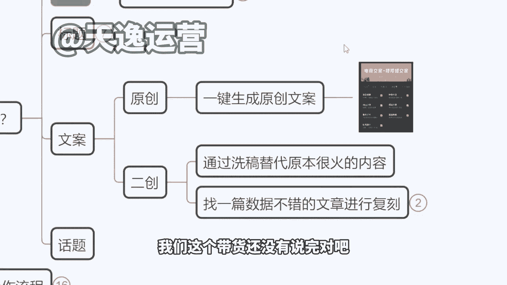

我们这个带货还没有说完对吧，我们既然有这样的一个工具之后，我们就可以直接生成文章。

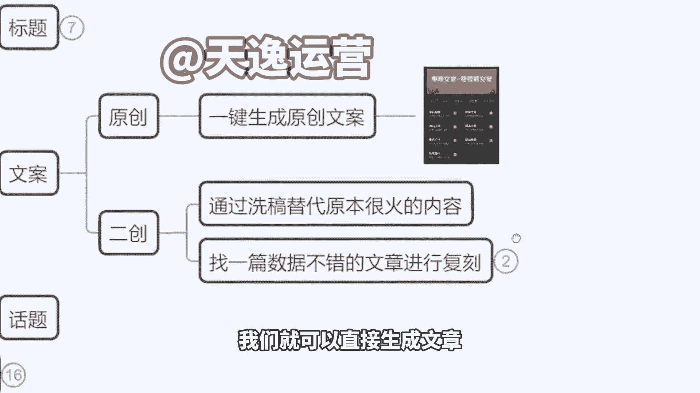

无论是卖产品还是说接商单，非常简单，非常容易啊，没有什么难度，那么同时在这个工具里面。

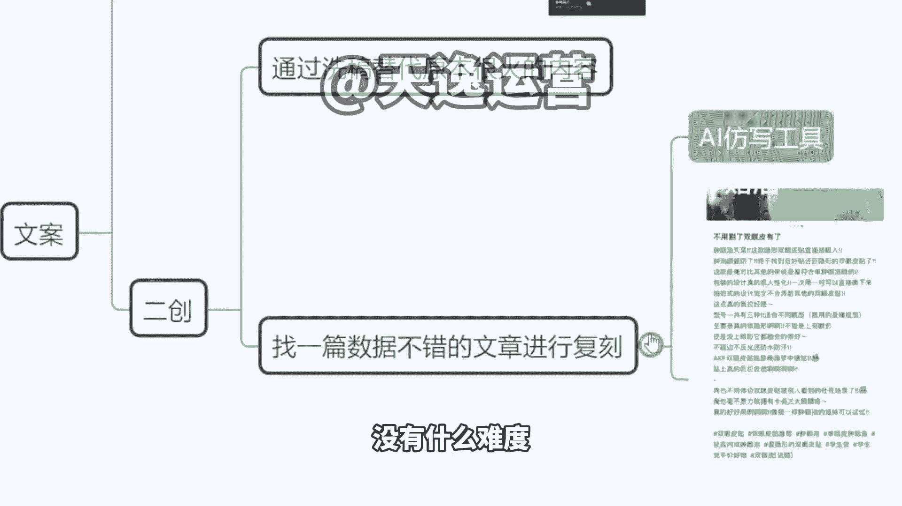

如果之后还有一个方式啊，就是我们还有一个可以去获得流量的方式，在这里也教大家一点，比如说我在小红书刷视频，我刚好刷到了某一个达人，他的这个作品呢是两个月以前的，但是他依然在推荐页。

我们在推荐页看到吧的有个作品啊，3000多点赞，你看那个发布时间去年的前年的甚至更久的啊，半年了是吧，几个月了好，那这个时候告诉你，这是个商机的，你去模仿他的文章，写一篇类似的，包括你的图片的排版等等。

都跟他做类似的，因为平台始终要新的东西，他不可能说一直推以前的老的这个东西啊，那是因为没有可以替代的，所以说只能推之前的旧作品，那如果你写一个类似的出来，平台会选择把流量划分到你的这个账号这里来。

好那这个时候我们怎么去模仿对吧。

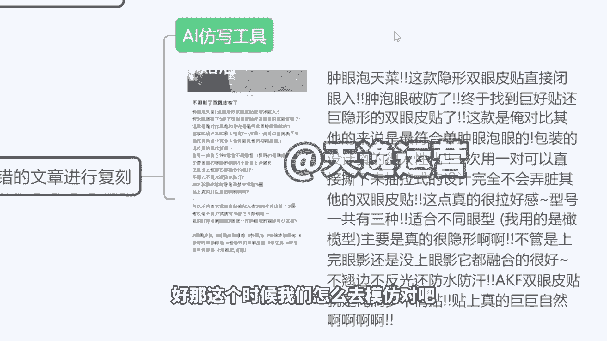

我不知道怎么去写这个东西，你把这个东西一样的交给咱们刚才的AI工具啊。

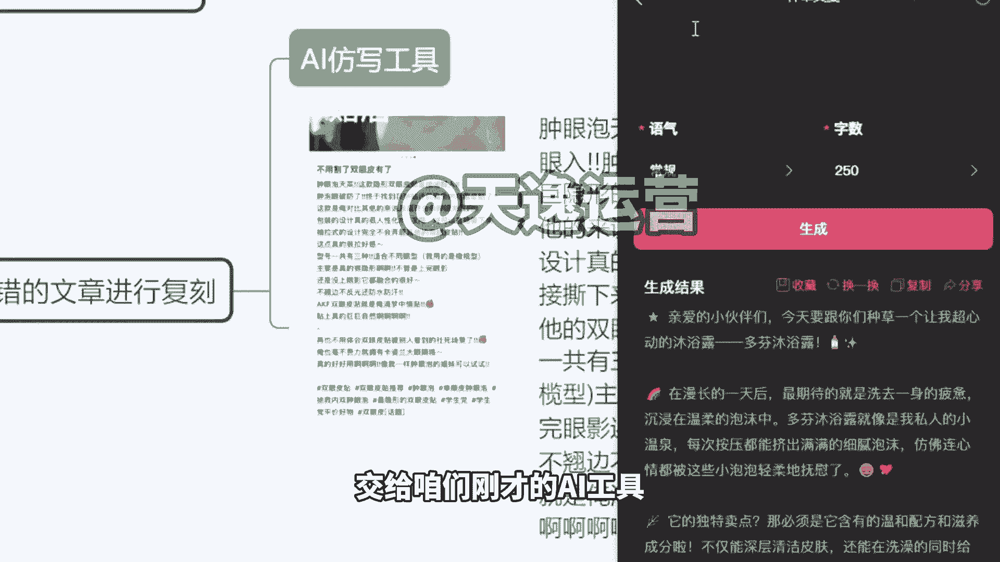

在这个位置他有一个AI聊天，来有个AI聊天，他会模拟啊。

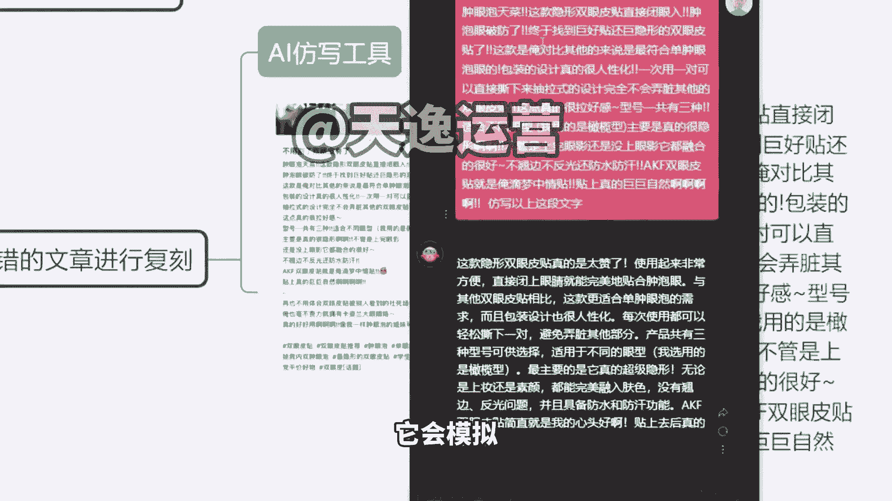

这个就是你他会满足你的所有的要求。

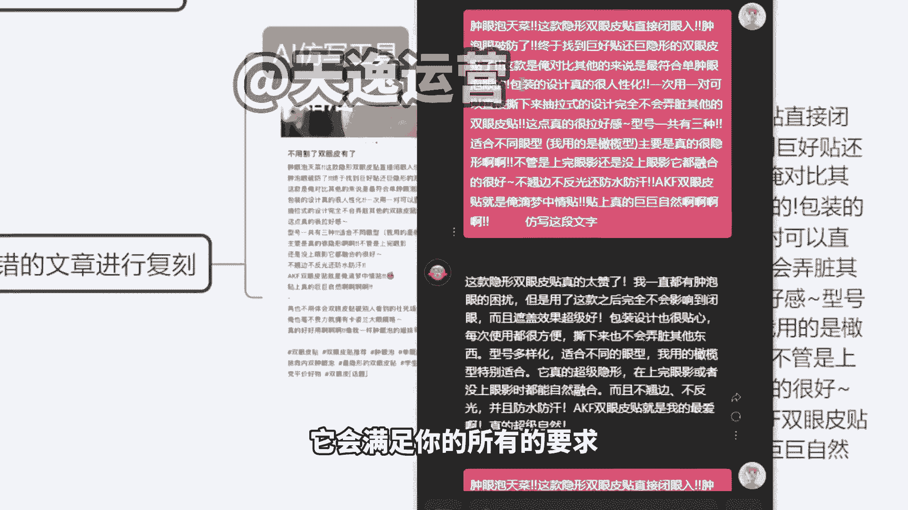

然后在这个位置的话呢，比如说我把这个文章我复制过来，对不对，我把这个文章复制过来之后。

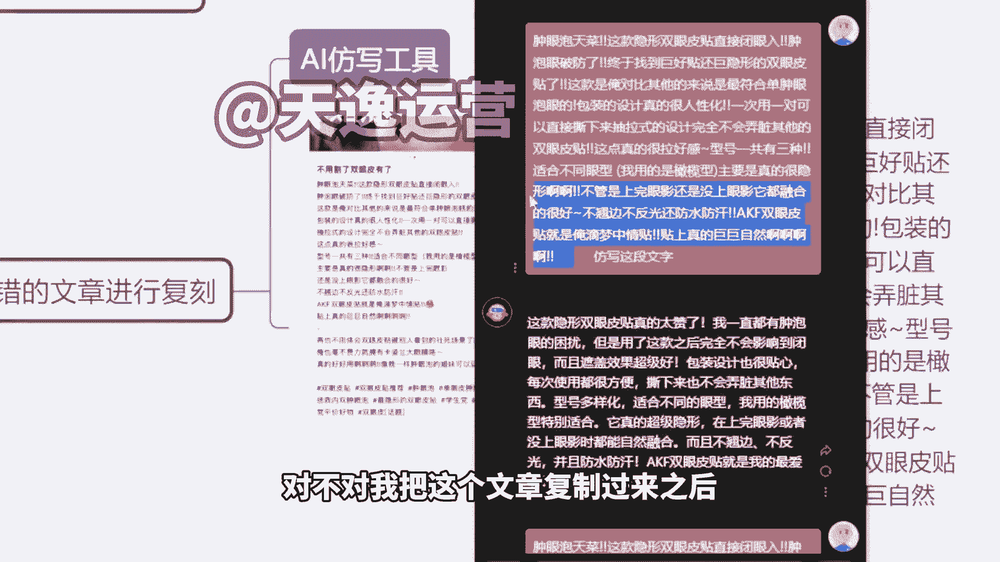

我下面带上一句仿写这段文字好，那么他就会给你返仿写。

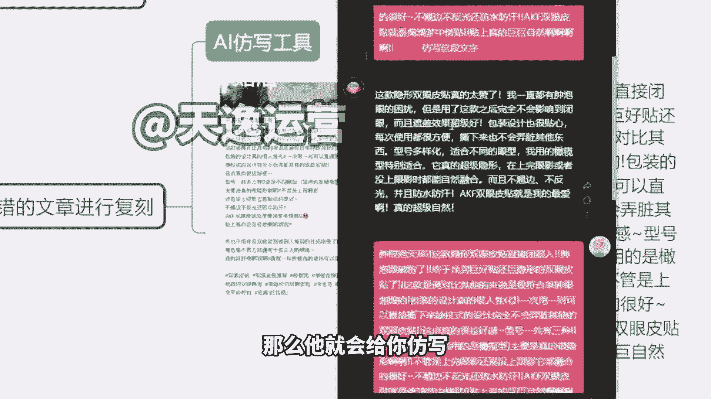

你看本身我们第一句话是肿眼泡天菜，对不对，好，他改成什么了，改成这款隐形双眼皮贴，真的太赞了，对不对，他意思没有变，但是它的文字，它的语言，他的语气是会有变化的啊，这就叫仿写。

然后包括你如果说重复再给他发，还会有新的东西，这个AI软件叫什么，目前没有名字啊，因为这个是我们自己做的，毕竟我跟大家说一个这个东，说一个这个事情啊，为什么他没有名字，因为这个技术是从国外来的。

它原版的这个工具叫串的G，但是他没有小红书的这个试用版本，我们相当于说是等于说我们用了人家的技术，然后做了小说的版本，所以说我们没有办法在正规平台上线，这个工具是我们自己私下在用的。

就是我们公司自己的员工在用的，如果到时候你们确定做小红书，比如说你从明天请说老师，我下定决心，我要开始做这个事，做这个项目了，你到时候找我来要，你到时候再来找我要好不好，如果说你真的要做小红书再要。

因为今天我们也也担心会有同行在听课，我不可能说把这个东西直接啊，我说每人一份，但这个东西不值钱，也是增加竞争对手啊，然后到时候如果你们真的要做的话，我们再考虑这个问题，你再要就找我要就行了啊。

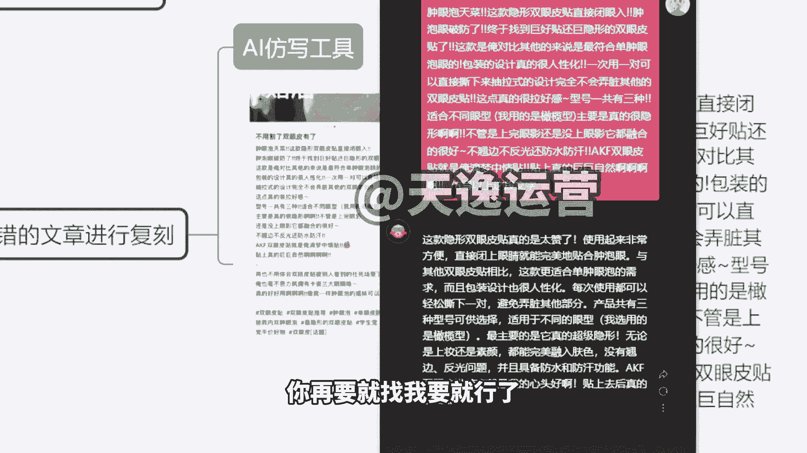

这个东西我不会说收大家钱啊，因为我们这个东西不会拿去卖，拿去卖的话。

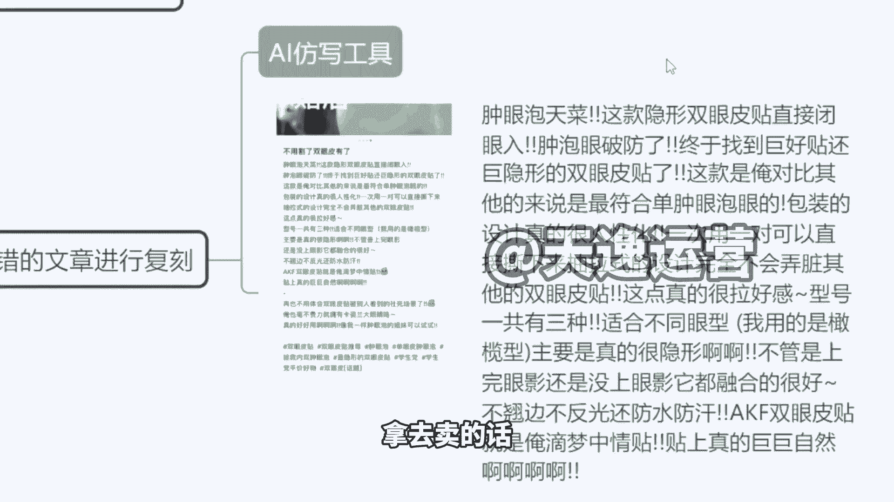

相当于说别人如果说再来抄我们的这个技术，对不对，那我们这个东西就很难搞啊。

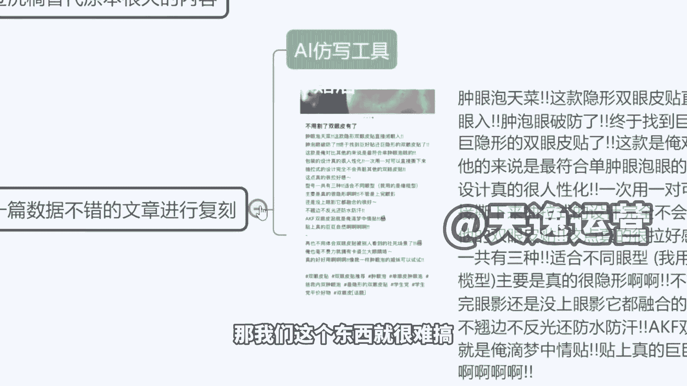

所以说如果你们真的是自己要做的，我们再说啊。