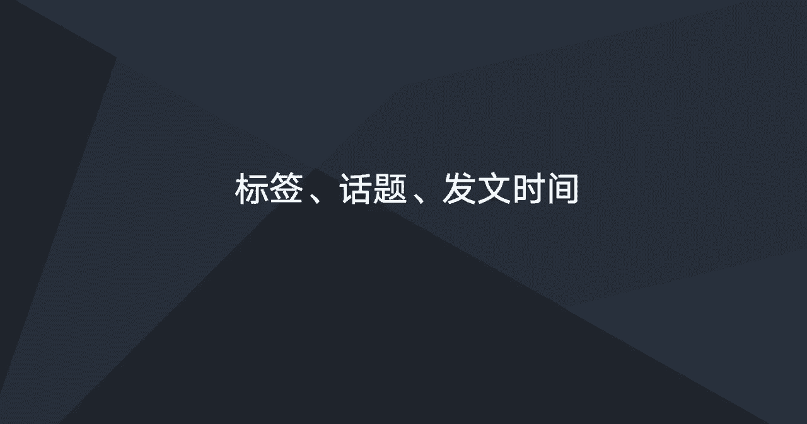
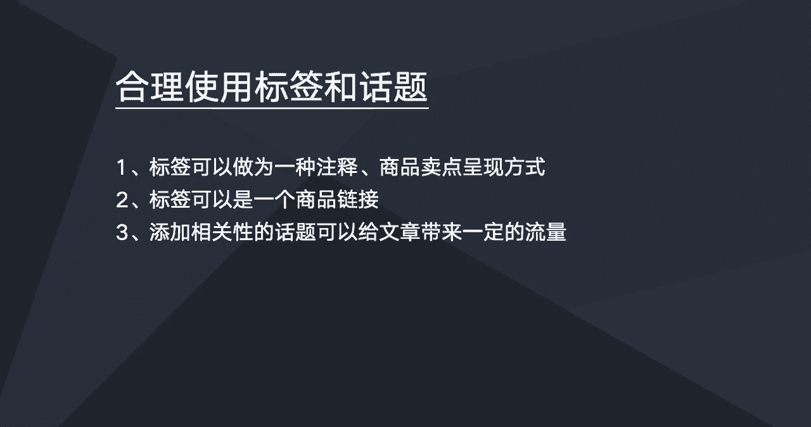
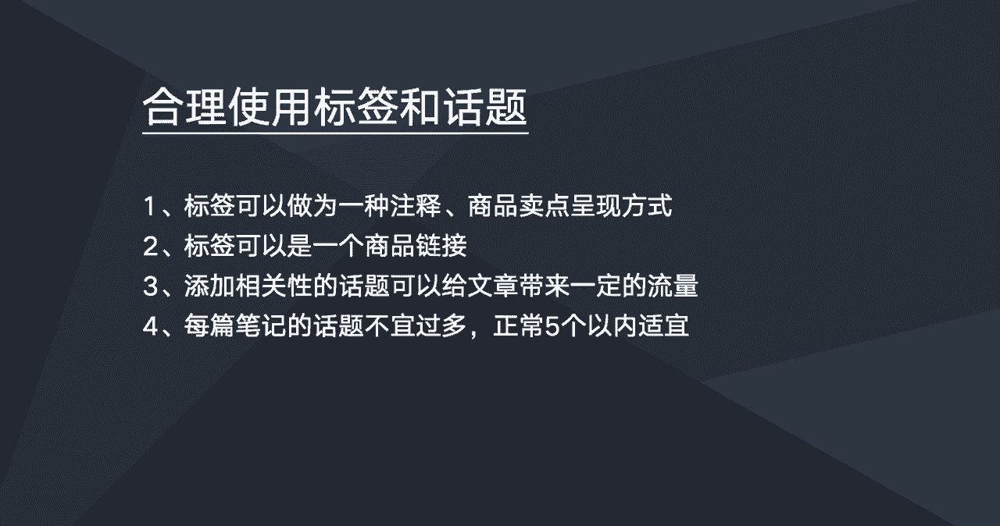
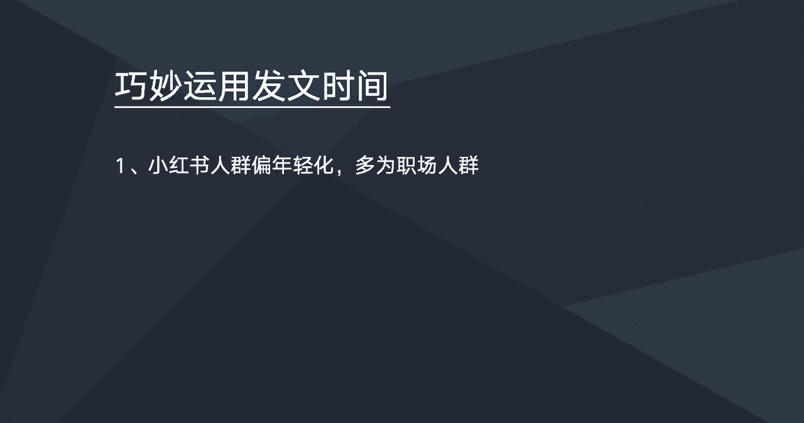
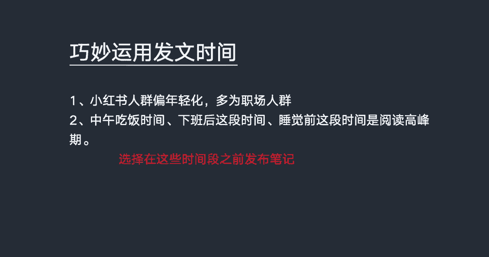

# 【2024版小红书运营教程】全B站最良心的小红书开店全套运营教程！小红书体开店 起号真的不难，拿走不谢！ - P6：标签、话题、发文时间的布局 - 不甜的白开水a - BV1g3HKejEgk

这节课的话一起来学习一下小红书笔记，标签跟话题的一个使用，以及就是什么时间段发文会比较好，先来看一下标签跟话题的一个使用啊。

这里说的标签呃，是指插在小红书笔记图片上的一个标签，这个标签的话前面有一些介绍，这里的话也再说明一下，比如说嗯图片上的标签可以作为一种注释，也可以作为商品卖点的一种呈现呈现的方式。

或是作为一种啊地标等等，标签的话它也可以是一个商品链接，比如说这个标签的话，我们如果把它换成商品链接的话，那么我们点击这个标签，是可以直接跳到相应的一个产品，的一个店铺里面的。

所以我们在写小红书笔记的时候，我们在图片上可以呃合理的运用一下这个标签，尤其是作为一种注释，或者是作为一个呃图片的一些，比如我们图片上面晒了某某产品，那么这个产品的一些卖点呢。

呃我们可以用标签的形式在上面做一个说明，做一个注释，下面说明下面说一下，就是话题的一个使用，话题的话就是嗯一般是放在笔记的最最下面，最底部，然后是一个井号键，后面会接的一些一些汉字接的一些话题。

然后话题的话是我们在笔记的下面，添加一些相关性的话题，是可以给文章带来一定的流量的，但但是这个流量它不会不会太多，只不过是它有一定的导流的效果，所以的话我们每写一些笔记的时候。

我们可以添加一些相关性的一些标签，相关性的一个话题，这样子更有利于别人可以从话题话题这个入口，然后找到我们的笔记。

话题第二个需要注意的是啊，每篇笔记的话题不宜过多，正常是在五个以内就可以了，有两三个，一个1~3个都可以，如果你的笔记涉及的范围比较广的话，你可以适当多添加一些话题，如果你只是专注写某一个领域。

某些方面的话，那么一到两个话题就可以了。

好下面我们看一下，就是啊发文时间在什么时候发文，小红书笔记在什么时候发文会比较合适，首先我们先看一下小红书的一个用户吧，就是小红书他的一个人群是偏年轻化的，多为职场的人群。

而这一类人群的话嗯，他的闲闲暇时间一般是在中午吃饭的时间，或者下午下班之后，然后到晚上睡觉之前，这段时间是呃小红书用户阅读的一个高峰期，然后笔记的话选择在这些时间段之前发布笔记，效果是比较好的。

这里的话就是呃，我觉得我们猫客的公众号是做的比较好的，呃我有留意就是猫客的公众号，他们的发文时间是在中午的11。45分，这样子，几乎很多文章应该是大部分语文章，都是在中午11。45分。

这个时间段发出来的，然后一发出来那个文章的一个阅读量是暴涨的，因为关注猫客的这一类人群，都是一些职场职场人群，那么职场人群的话，一般中午下班会会吃饭，吃饭的时候会看一下手机，那么我们在吃饭之前，就11：

45分去发这个笔记，那么精准用户就会第一时间能够啊收到这，这篇这篇呃文章的一个推送，就可以第一时间查看这篇笔记，所以我们在小红书写笔记的时候，也可以根据我们的一个人群，他的一个时间的一个分布。

然后我们选择在用户比较闲暇的一段时间。

