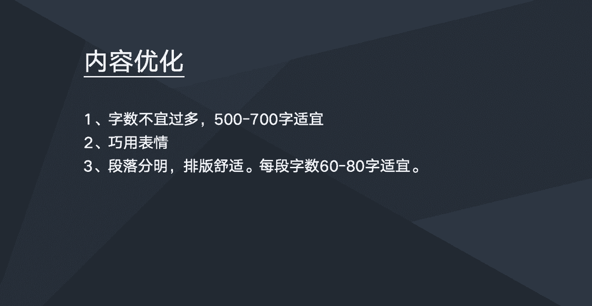
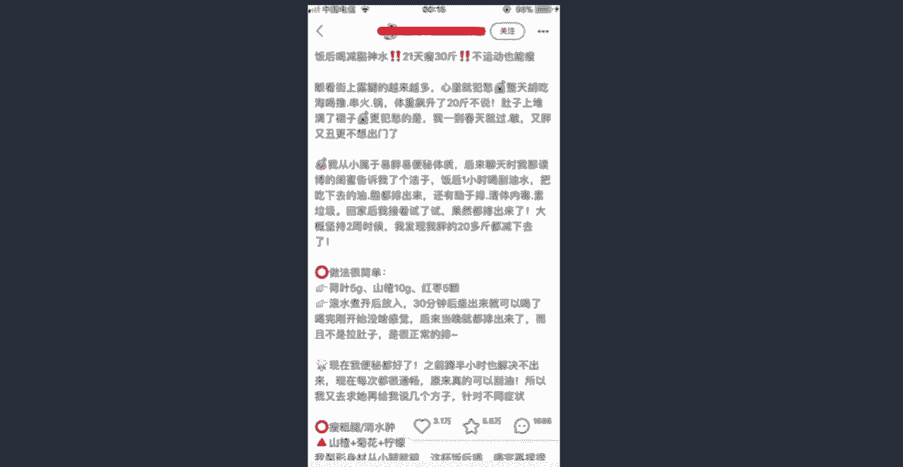

# 【2024版小红书运营教程】全B站最良心的小红书开店全套运营教程！小红书体开店 起号真的不难，拿走不谢！ - P7：如何进行图片优化、内容优化 - 不甜的白开水a - BV1g3HKejEgk

这节课我们来学习一下图片跟内容的一个优化，先看看图片的优化额图片的优化的话，需要注意以下几个点，第一个是图片的一个比例，建议是用三比四的一个数图，比如说呃三比四的一个速度的话。

在小红书用来发小红书笔记的话是比较合适的，如果是图片的比例不合适的话，到时候上传到笔记当中，这个图片它是会有一些拉伸，或者是一些模糊的情况出现，第二个是图片的话一定要使用一些高清的图片。

不建议使用一些比较模糊，看的不清楚，这一类比较模糊，看不清楚的图片是会被判定为劣质图片，会影响我们笔记的一个推荐量的，所以建议是使用一些高清图，第三个的话就是我一篇笔记里面。

最好是可以放三张以上的图片吧，因为现在还是相对于文字啊，小说用户还是更喜欢看图片的，很多人他看笔笔记的话，只是单纯去看一些图片而已，所以的话我们能放图片，尽量多放图片，能用图片去表达的。

尽量少用文字去表达对，因为用户他的关注点更多还是在图片上面，第四点需要注意，就是原创图最好都是要放原创图，然后是自己去拍摄的，比如我们要拍一些素材，或者是拍一些产品，最好是自己拍的。

切记不要用一些店铺的主图啊，直接放，比如我们啊把我们一些商品拿到小红书，去做一个推广分享，切记不要直接拿主图去分享，一定要去拍一些比较生活的一些照片，然后如果我们是用一些网图的话，呃这里需要注意的是。

就是嗯不要直接从呃网上去下载一些图片以后，就直接上传到小红书，建议是下载之后，然后再用手机截图一次，然后把下载的删了，然后我们把截图的图片拿去使用，第五个的话是图片不要带水印，不要带其他的水印。

当然当然可以带嗯，你小红书账号的一个属性，比如说你你的图片的话，你可以贴上你小红书账号，小红书的一个昵称，这些水印是可以带的，有其他其他一些水印就不要带了，第六个图片可以适当的装饰一下，或者是PS一下。

也就也就是说，我们准备要把这个图片放在小红书笔记当中，的时候，我们可以提前做一些装饰跟PS，比如放一些标题上面啊，或者是P1下图片等等，可以提前去做的，而下面看一下内容的优化需要注意什么地方啊。

内容的话的话就是第一个的话是需要注意，就是一个字数字数不宜过多，因为整整篇小红书笔记的话呃，应该是单篇笔记字数好像不给超过1000，500字还是1000字啊，反正字数太多的话也是不好的。

因为现在的一个互联网的网民都是比较懒，你写了一大堆，人家不一定会看，所以字数的话，建议是在500字到700字之间是比较合适的，第二个的话就是巧用表情，就是在笔记的内容当中的话。

我们是可以巧妙运用一些表情的，这样子可以增加你内容的一个个性化，小红书用户偏年轻，比较喜欢个性的东西，所以我们的笔记当中可以多用一些可爱的，比较有个性的一些表情，用这些表情充当标点符号。

充当一些段落的一个呃段首，段尾等等，第三个需要注意就是呃排版，就是整篇笔记看下来一定要段落分明，排版好之后看上去要比较舒适，然后每一个段落它的字数的话也不要太多，建议是每个段落是60~80次。

是比较合适的，看上去是比较舒服的。

我们来看一个啊案例，比如这样的一篇笔记的一个内容，看上去是比较舒适的啊，比如来大家看，这是他的标题，饭后喝减脂神水，然后两个感叹号，21天瘦30斤，然后加两个感叹号，不运动也能瘦，这是它标题。

然后标题下面的话它是空了一格，然后再到一他的手段，然后手段里面你看他也添加一些表情，比如心里就犯愁啊，就发一个哭的表情，这样你是比较个性，比较符合现在年轻人的一个审美跟阅读习惯，他的段落的话。

每个段落也是60~80字左右，然后断手他用一些表情来代替断手，也用一些表情来代替，像这种文章的一个排版，是比较看上去比较舒服的，所以大家在写笔记的时候，也建议是参考这样的一个笔记，去做一些排版排版。

这篇笔记的一个数据也是挺好，3万多点赞，5万多，收藏1600多个评论，图片跟内容的优化。

