# 【2024版小红书运营教程】全B站最良心的小红书开店流程详解，高阶运营教程合集！小红书体开店，起号真的快，共1000集全是重要知识点，赶快点赞收藏起来！！ - P10：第9课：如何在多多选品【小红书零基础电商运营课~全流程】 - 一盏灯的时间q - BV1eSaMeWEXf

大家好，这节课给大家讲如何在拼多多选品，然后是上传到咱们的小红书店铺里面。那么咱们用到的一个工具是榜单选品，拼多多的榜单选品，接下来带大家去实操一遍啊。

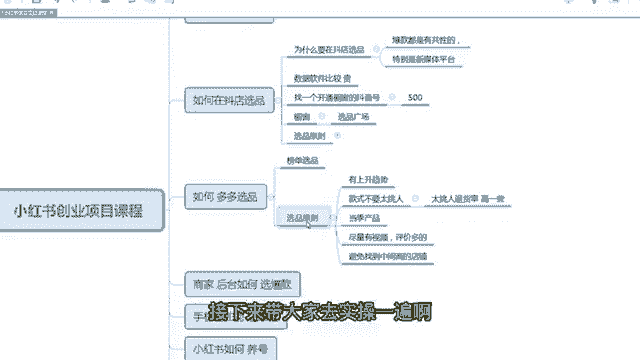

啊，首先打开咱们拼多多的一个首页啊，这个是拼多多的首页啊，是这样一个界面。比如说咱们拿女装为例，如果你做的是女装的一个店铺的话，咱们点击女装。

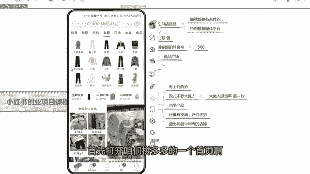

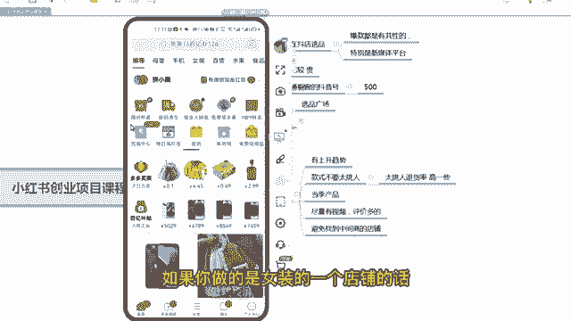

点击女装之后，这里面看好了，大家看好有一个排行榜嗯有个排行榜。点击排行榜之后，这是所有的女装的一个排行榜的一个界面啊。

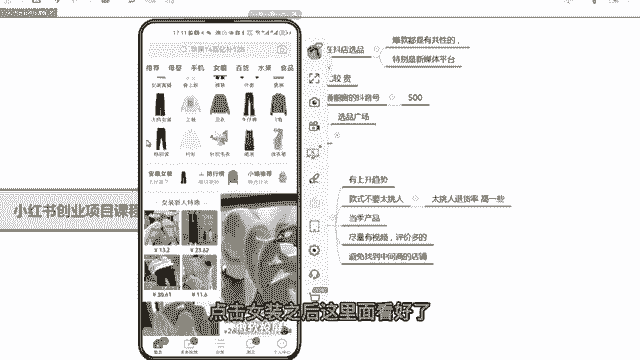

那么春天了，咱们就选一个春上新吧，这样有趋势，又趋有一些趋势品子大家可以选。你比如说第一个哎，我就觉得挺好的。那么咱们选品的一个原则，第一个有上升趋势啊，有上升趋势的话，就是得我给大家讲。

那么第一个款式不要太挑人，对吧？太挑人也能卖，就是说卖的话就是售后会比较多一些。因为他穿不上，他肯定要退回来。

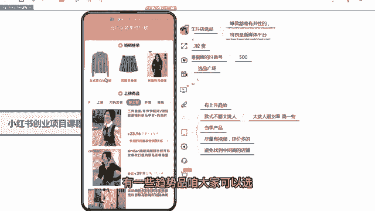

啊，那么第三个当季商品现在春季大家尽量选春季不选冬装和夏装啊，那么第三个尽量有饰品，评价也多的，这个方便咱们后期去做素材，就要做小红书笔记啊。嗯，第3个啊，第最后一个是避免找到中间商的店铺。

这个基本上咱们选爆款，基本上都是都是源头啊，都是源头，不会有中间商的。因为咱们找的。就是爆款啊，如果中间商他不会卖这么棒，因为价格不合适啊。那么根据这几个条件，我带大家去实操一遍啊。看第一个哎。

我觉得第一个款唉挺可以的，是春季春装，对不对？而且款式也可以。那这个款吧也也不挑人的，这个款也不挑人的，你看挺好的啊。嗯，那这个款咱们就可以选价格也不高，才24块钱啊。

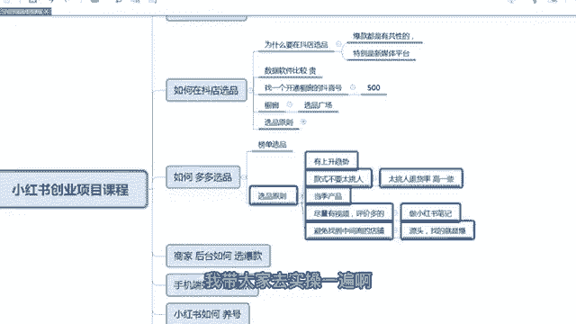

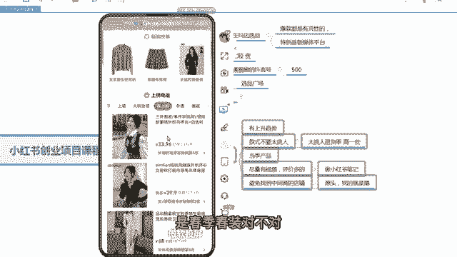

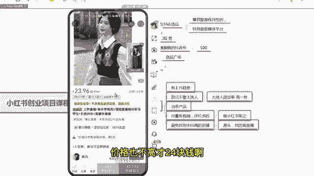

嗯，好当届的商品，我看它的评，你看它有主图视频，对不对？它也有主主图视频。这个主图视频大家看一下这个主图视频完全咱们可以发到咱们那个呃咱们小红书店铺去当成一个笔记视频去发啊。你看它的评价啊。

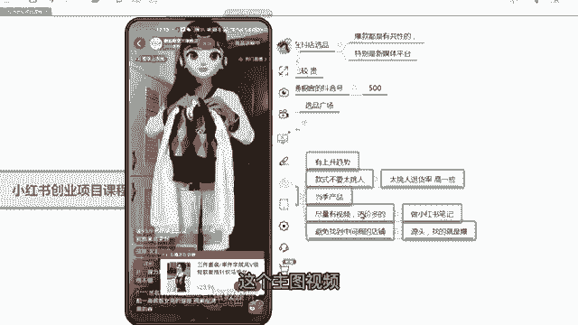

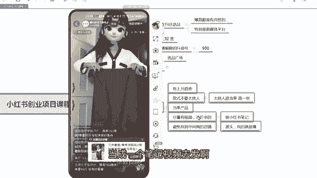

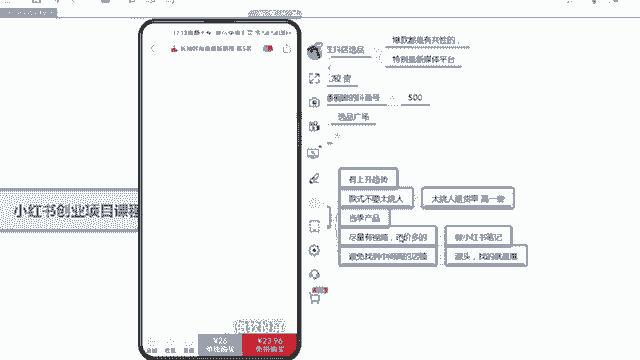

他评价里面你看有很多的买家秀，对不对？有很多的买家秀，这些买家秀，其是拍的比较好看的，怎么完全可以嗯把图片保存下来，上传到咱们那个嗯上传当笔记的图文，转成视频去发啊。

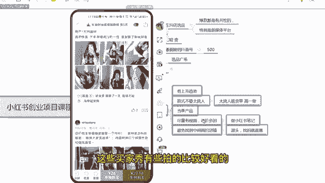

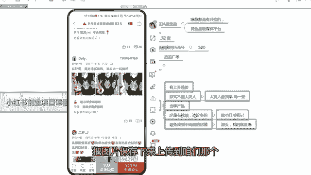

嗯呃，那么第四最后一个避免找到中间商的店铺。其实你看评价嗯嗯小红那个拼多多有一个特点，它的评价可以刷出来，它评价可以刷出来。你看这个这个它的销量1。3万件可以刷出来的，但是评价是没办法刷的。

评价2517个，说明这个品就是可以的啊。因为评价都2000多个了，这个肯定不不会刷的，刷不出来啊。

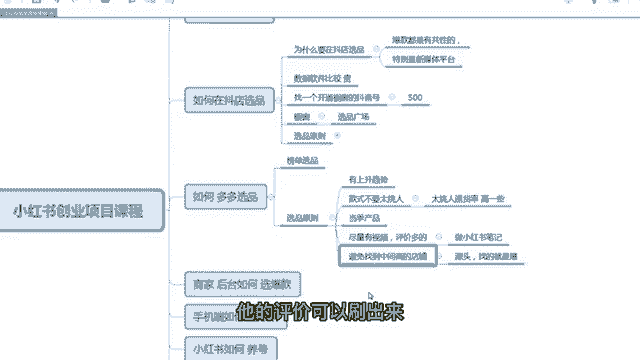

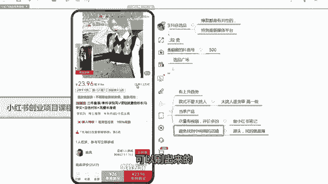

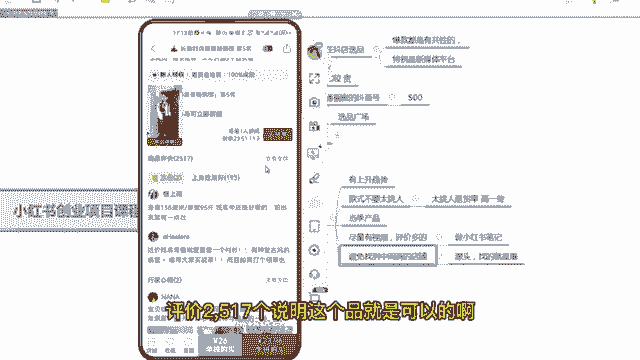

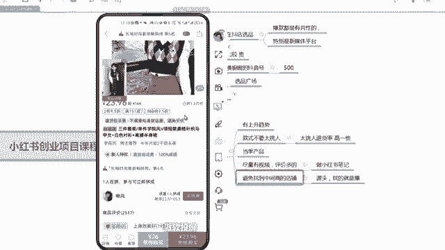

呃，那么我再加一个中差评，不要太多。咱们看它的负面评价有没有啊，负面评价。嗯，这明质量很差。嗯，其实负面评价你看这么多啊嗯。

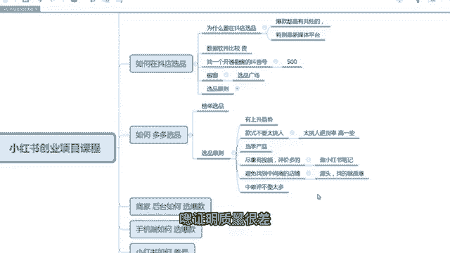

咱们打开这个，你看封面评价有2517个，其实呃坏的评价其实不多的，只有15个，说明这个产品挺好的。而且这一家的质量也挺好。如果这一家质量不好的情况下，咱们其实可以这个款再在拼多里拼多多里面再找一家。

你看这个这么多评价啊有关有关不好评价的，你看你看你看只有15个，这个已经非常不错了啊。那这个款咱们完全可以去选啊。

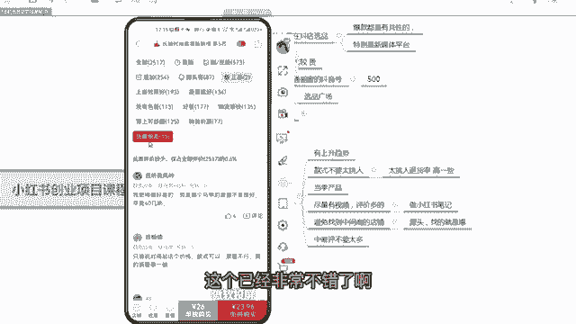

那么咱们就点击这个链接，点击这个链接之后，咱们点击啊左右上角大家看哈，右上角有一个分享这个按钮啊，有个分享这个按钮，咱们复制这个链接就可以了。复制链接之后，咱们直接通过。

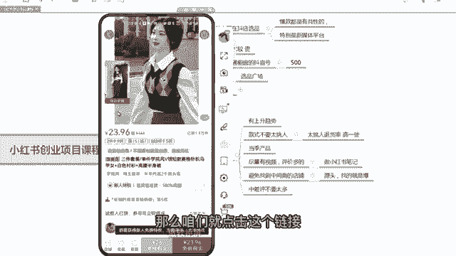

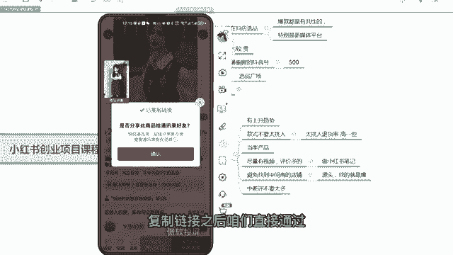

嗯。啊，通过咱们的微信，或者通过其他的呃，或者或者通过微信啊，直接发到咱们微信的电脑端，然后到时候上传就可以了啊。

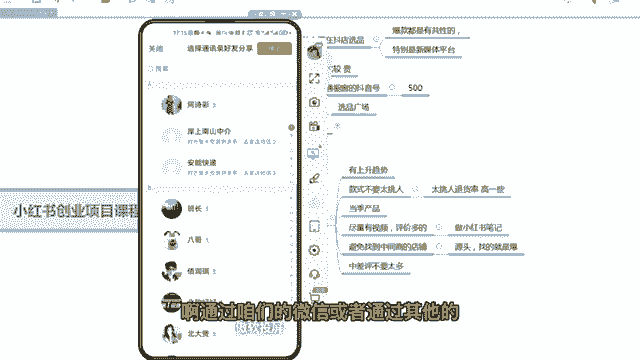

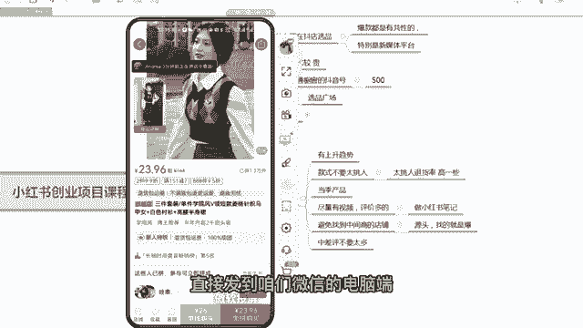

呃，那么多多是一个传统电商平台。那么比如说京东啊、淘宝呀，其实都可以按照多多这个思路去选品，都是可以的啊。

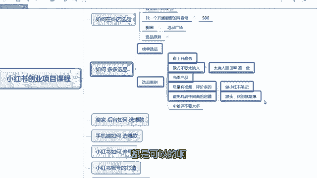