# 【2024版小红书运营教程】全B站最良心的小红书开店流程详解，高阶运营教程合集！小红书体开店，起号真的快，共1000集全是重要知识点，赶快点赞收藏起来！！ - P11：第10课：如何在淘宝选品【小红书零基础电商运营课~全流程】 - 一盏灯的时间q - BV1eSaMeWEXf

啊，大家好啊，这节课给大家讲如何在淘宝去选品。呃，那么为什么要在淘宝去选品？先给大家去那个呃去分析一下啊，因为淘宝是国内电商体量最大的一个平台啊，因为目前虽然说抖音也比较热，什么小红书也比较热。

但是淘宝还是n么 one还是第一名。因为是寿司的骆驼比马大嘛啊，所以买买买卖这个东西还是淘宝是第一啊，但是商品也是最全的，因为万能的淘宝，基本上所有咱们能想的东西都是在淘宝上能搜到啊。

第三个是淘宝的爆款是经争周期考验的，因为体量大，它的爆款它大概率咱们去超，一样也会爆啊。那么淘宝爆款其实咱们从三个方面都可以选，第一个可以榜单选品，第一个可以搜索选品。第三个可以数据选品。

那么榜单选品给大家是手机端给大家展示一下。因为这个榜单一般在手机端啊，咱们去点击那个淘宝啊，咱们直接搜索那个排行榜。

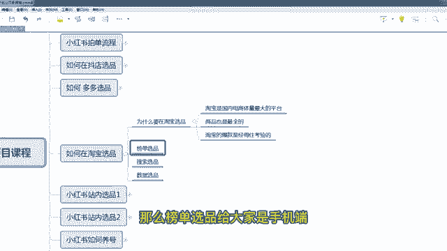

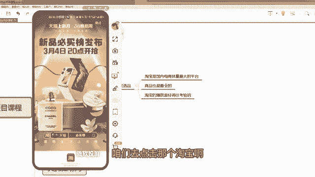

嗯，但这个排行榜一般是一般是物品类的会多一些。你看鞋呀，但是鞋也有啊，鞋有服装是有点少。但服装那个你看配饰也有这个这个大家去看啊，如果你做配饰的，你看这个运动帽新品榜啊，咱么点击嗯。

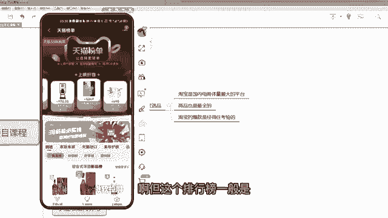

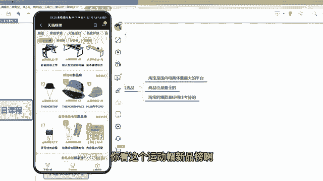

啊，就是你在那个淘宝的搜索框搜一个排行榜。

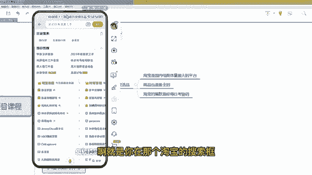

它自动会显现出来这种各种各种行业的排行。比如说咱们是。家居家装，咱们是。服饰时尚啊服饰时尚这个类目咱们看一下啊，有没有咱们要的这种排行榜。

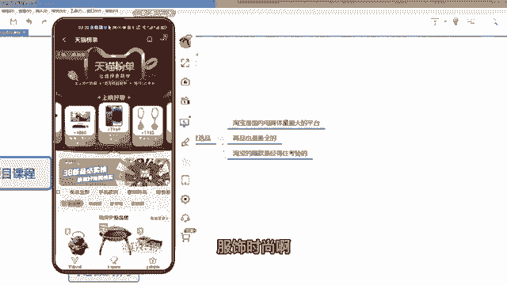

嗯，如果你你选鞋子，可以在鞋子里面去选。嗯。

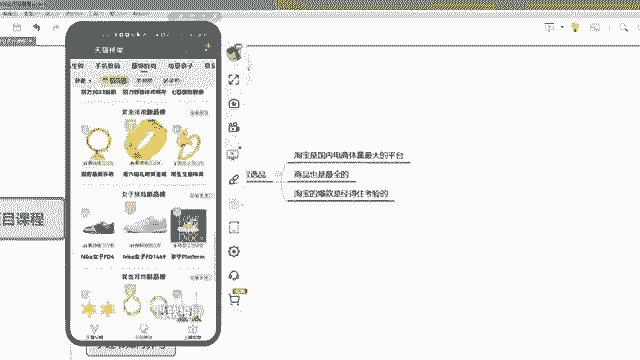

啊，鞋还是比较多的啊，上榜好物。

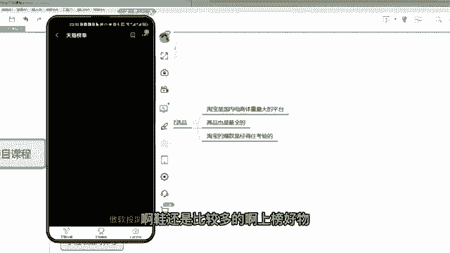

嗯，在这里面看一下啊，有一个。嗯，美妆的。😔。

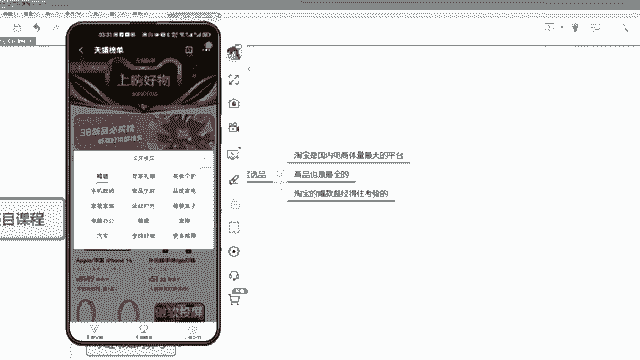

啊，对，假假如说是母婴亲子的话，这里面有很多的一个呃母婴产品啊，大家都可以看一下。嗯，母婴产品比如说是。

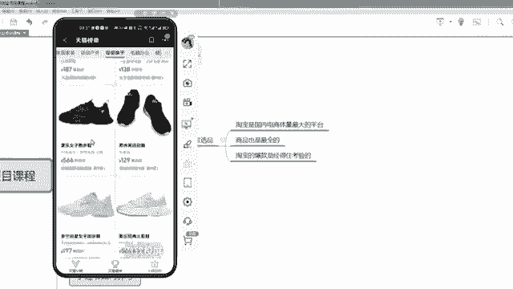

鞋子吧，按鞋子来选吧，这个鞋子就是防滑跑步排行榜第五名。那整个排行榜咱们点进去看一下啊，有这么多，这都是鞋子。

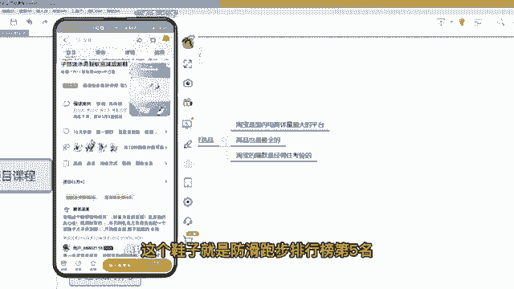

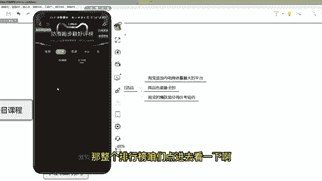

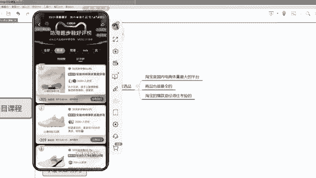

啊，你比如说咱们做服饰类的，咱们选那个服饰类的热销榜，那服饰类服饰类里面也有一些那个一些分类啊。咱们可以看一下热销榜。你看这个家居库，如果你做是家居用品的话，咱们就可以看一下这个榜单。

这榜单有这么多家居用品。那么咱们肯定是选择热销榜嘛，第一个卖这么好，对吧？第二个卖34。2块。

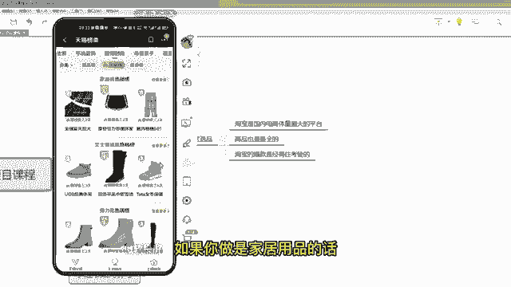

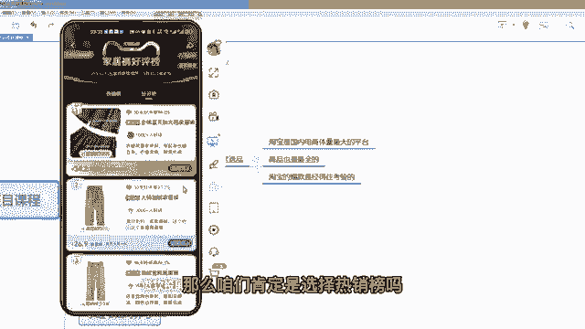

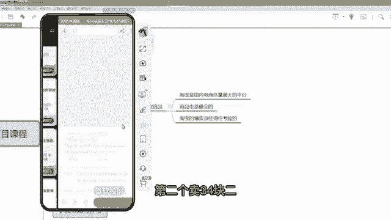

也卖的挺好，这是第一个名。那么这个品咱们就可以搬过去。那么它的评价和素材呃，咱们都用那个至尊宝插件啊。因为之前的章子已经讲了这个插件，咱们可以把这素材啊把它比较好的这个买家秀权下载下来。

然后编辑成从那个笔记发布就可以了。

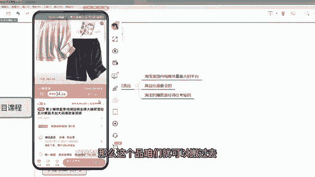

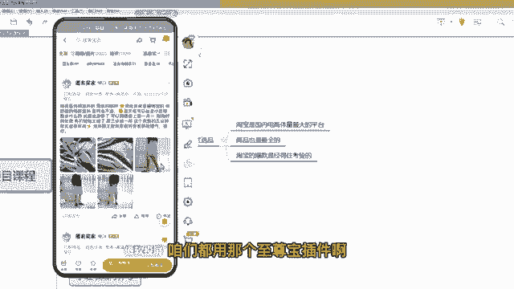

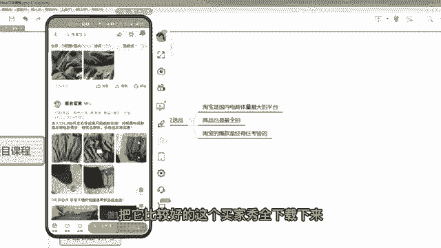

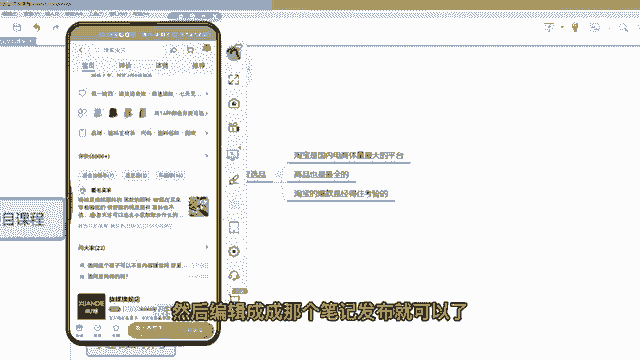

啊，这个是榜单选品。那么还有搜索选品。搜索选品的话在电脑端给大家展示啊，咱们直接打开淘宝。比如说你想嗯你现在想想那个卖什么东西，比如说连衣裙，那你们能搜索连衣裙吗？搜索连衣裙之后。

那么这个咱们就不看排行了，咱们就看它的一个。

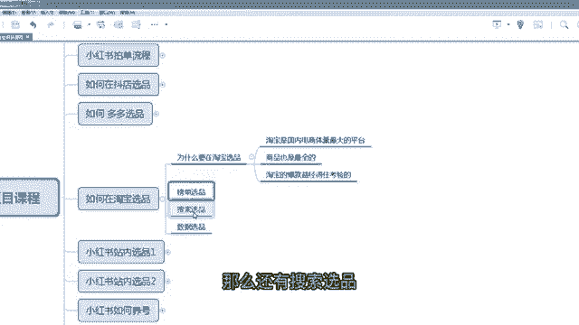

款式这个就是有一点自己个人的一个喜好的感觉，包括你小红书，你发的一个人群的定位。比如咱们是想要一些嗯中国风的吧，或者是偏休闲一类的，咱们看有没有啊。嗯，咱们通过关键词搜一下，搜一个。连裙国风。

对吧假如说咱们是做这种风格的啊，那么国风里面有这么多，咱们选一个销量还可以的。比如说1000的啊，这个359看他最近评价怎么样。嗯，最近评价不多啊最近评价不多，但销量有多少，1000个。哎。

销量1000个，评价不多，就代表它是刚刚开始卖起来的那这种款就是趋势款呀，大家都可以去。

呃，把它踩下来啊，这个款都可以去用，对不对？搜索。那么这种款其实很多的，这个就要看自己个人的一个经验的，选品的一个经验，搜索选品啊。第三个是数据选品，数据选品的话不给大家演示了。

因为很多人是没做过淘宝店的。如果你们之前是做过淘宝的啊，或者你的朋友有淘宝的，他做过淘宝，那么可以用他的淘宝账户的收银参谋去看一下最近啊的趋势产品，在收银参谋里面可以去选这个大家是备选啊。

如果是有这个条件可以去用啊。

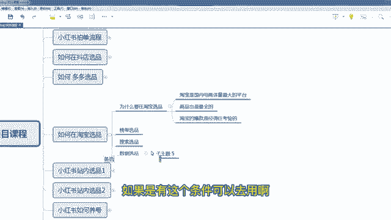

那么至于呃你选出来产品，如果你想要它的买家秀呀，或要主图视频啊，你是需要把这个链接发到电脑端，在电脑端去下载，在手机端是不好下载的。电脑端因为有这个插件啊，咱们其他的那个课程已经讲了。

直接一个至尊宝插件，你们下载下来，直接下载评论，然后下载那个主图的一个视频都是可以的。下载下之后再去编辑，再去发布咱们的一个笔记啊，包括买家秀的一些评论啊。

有些评论其实很好的那这这种评论也可以作为一个咱们发布笔记的一个文案啊，一样很好。

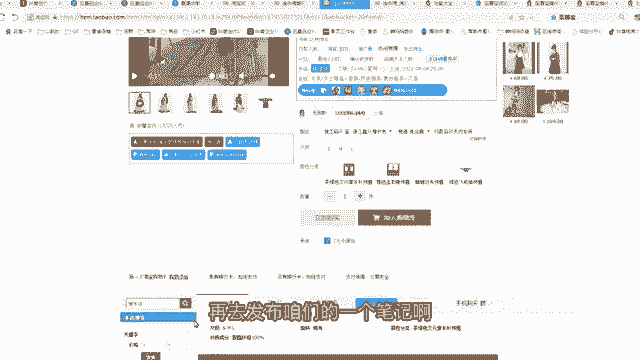

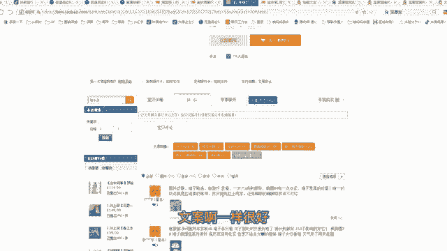

呃，至于在淘宝选品，我们就咱们的学员有一个非常成功的一个案例啊，就是去年的冬季，他在淘宝上找了一款羽绒服，找了一款羽绒服。这个羽绒服淘宝是卖500多，买500多。但是呃他最后在多多里面找。

其实这个羽绒服只有200多，只有200多。嗯，然后是嗯。所以说他就做了他就做了一个动作，他把呃他把拼多多的这个呃这个200多的，然后是加价，然后是在小红书里面卖啊，但是呃但是这个这个羽绒服又非常非常爆。

大家都知道卖多少钱，然后他的价格降下来只卖300多，中间差价差了将近200，然后他这个羽绒服卖的特别特别好，去年一天就卖了好几万，就一条笔机一天就卖好几万啊。

所以说淘宝的有些爆款是非常经得做那个市场考验的。所以说大家呃淘宝也可以选一批品啊。