# 【2024版小红书运营教程】全B站最良心的小红书开店流程详解，高阶运营教程合集！小红书体开店，起号真的快，共1000集全是重要知识点，赶快点赞收藏起来！！ - P12：第11课：小红书站内选品1【小红书零基础电商运营课~全流程】 - 一盏灯的时间q - BV1eSaMeWEXf

嗯，大家好，这节课给大家讲解小红书站内是怎么选品的。那么小红书站内选品的第一部分给大家讲，就是如何在小红书的商家管理后台有一个笔记灵感这样一个数据，通过他去选品。那么为什么要通过他去选品比较好呢？

因为它是实时更新的啊，带大家去看一下。那么具体这个笔记灵感怎么去找呀？咱们打开咱们小红书的商家管理后台啊，点击笔记，那么有个笔记管理笔记榜单，笔记灵感，点击笔记灵感啊，那么这个笔记灵感。

你看有个每周热点。那说明这个每周热点什么意思？就最近一周比较热门的话题，小红书话题，那么这个话题是热门的，那么这个话题背后的呃背后的笔记是不是也是比较好的，比较容易爆的。那么这个笔记容易报。

那么咱们根据这个笔记对应的产品去选品，这个产品是不是也是好的，对不对？啊，那么接下来带大家去实操一下啊啊，首先咱们去根据自己类目，如果你类目是女装的话，以女装为例，咱们选一个服装搭配，潮流也可以啊。

咱们选服装搭配。

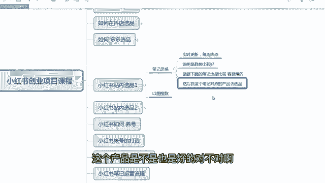

服装搭配的话选第五个吧，选个内搭啊，因为现在不是春天嘛，秋冬秋季的产品其实就是春装的啊，那么秋冬内搭咱们点击话题详情。那么这面你看很多春装是吧？咱们主要选春装，春装啊，因为现在是春季。

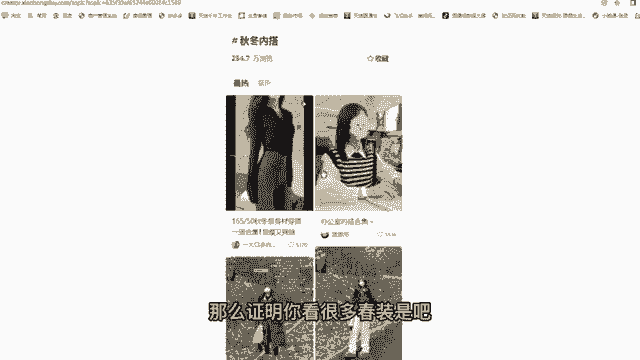

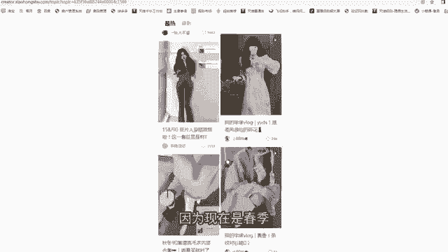

我么春装的话，哎，我觉得这个还不错啊，5000多个点赞啊，这个还不错，嗯，还挺好的啊，挺好的。还可以啊。嗯，那比如说是第一个，我觉得第一个挺不错的这个产品。那么我是不是可以把这个产品。

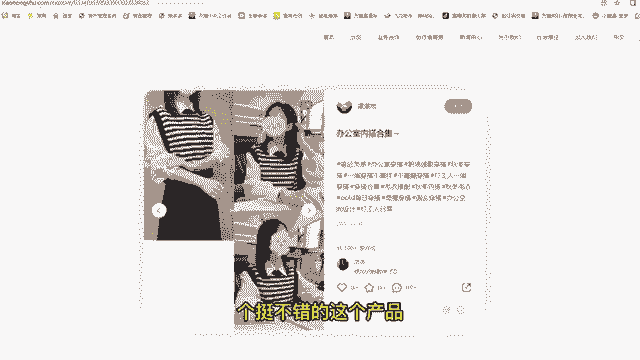

去截图在多多里面搜同款，是不是可以找到这样一个商品，对不对？这我这是第一种啊，我再看有没有其他的。

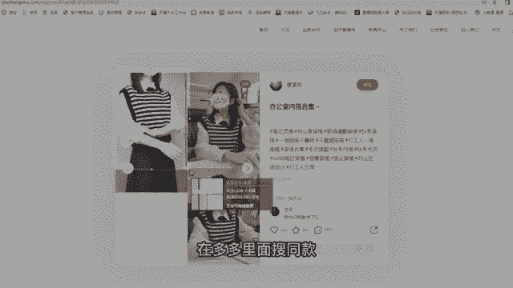

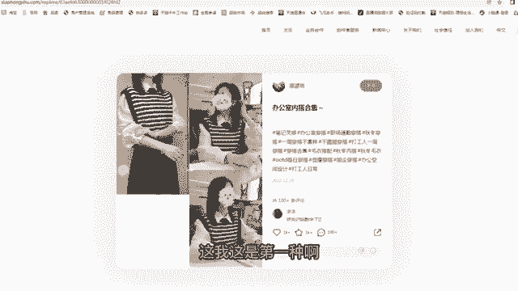

啊，你看这个也可以啊，你看这个啊，就这个长袖的一个长裙啊，这个长裙也可以。你看这个长裙很简单的，100多个点赞了。然后这评论有有十几个了也也不错。你看这个长裙全是图片拼接出来的，挺好的啊嗯。

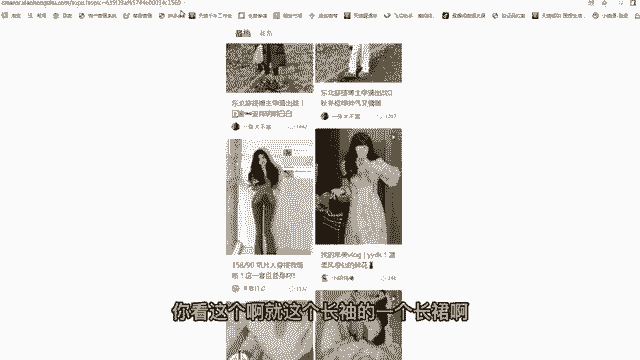

嗯，再看这个这个74个点赞啊，也还可以啊，都有图片拼接的啊。

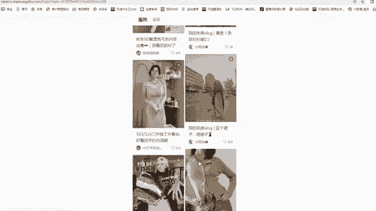

这个615的这个相对来说好一点啊，也是图片拼接的。像这种款子大家都可以去跟一下啊。

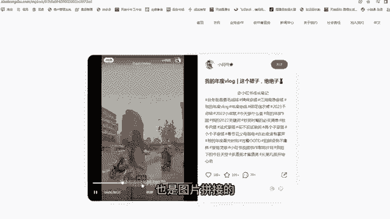

呃，那么带大家演示一下，比如说这样一张图片，咱们拿拿出来咱们的手机，然后打开拼多多，然后去扫码。啊，扫这个图片啊，咱们去扫这个图片，啊，扫完图片之后，然后出现很多这样一个同款。大家看一下啊。

咱们找咱们要找那个源头的一个商上家啊，那咱们肯定要找一个销量比较高的。你看这个一拼5万，咱们点开去看一看啊，19。8块价格也挺低的。嗯，像这个款的话，咱们看一下嗯。评价107个，那么这个评价107个。

那这个评价是没办法，100多个相对来说他相对来说比较真实了，它不是那种。恶道贩子啊饿道贩子，那么这个款就可以用了，而且价格挺便宜的，11。8块啊，不对啊，这真正的这个款式卖21啊，也不贵。

那么咱们可以翻倍可以去卖啊。

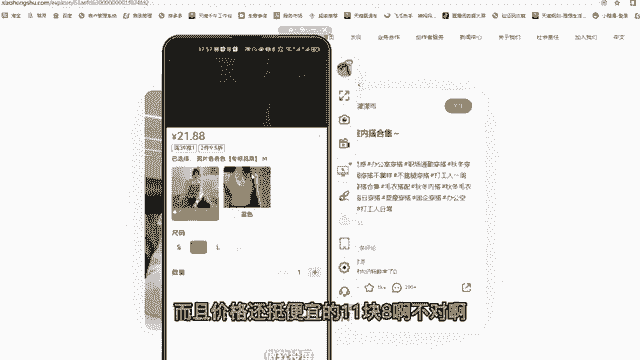

啊，那么咱们选择这个这个点赞434个人可以，它也是一个春装啊，咱们点击看一下。

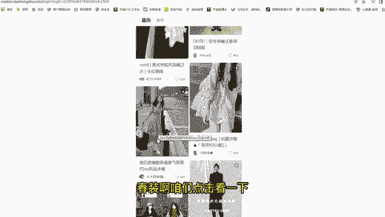

啊，然后用那个多多去扫码。啊，扫码是这样一个，我看第一个第一个销量挺高的啊，27块钱也不贵，然后是评价152个啊。那么这个评价是100多个，也是真实的。像这个素材也挺多的，它有一个主图，对不对？

像主图的话，咱们完全可以去扒下来，然后是传到咱们的小红书店铺里面啊，呃，传到咱们小红书的一个笔记里面，主图这个视频可以直接当成一个视笔记视频去发。那么它的买家秀买家秀一些比较好的，咱们也可以保存下来。

保存下来，咱们去那个当成一个图文的笔记去发都是可以的啊。嗯，但是那个服装类的，我建议大家如果是图片类型的话，也建议把图片转换成视频，这样转化率会更高一些啊。

