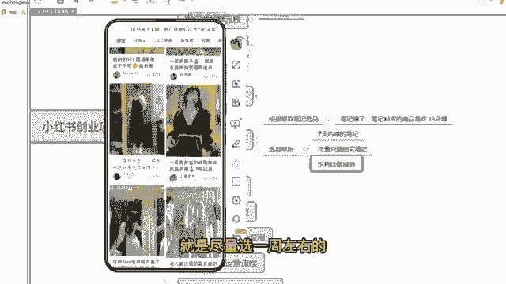
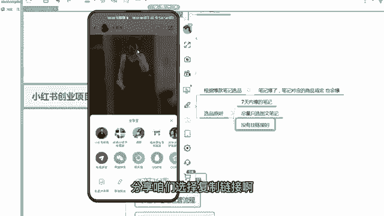

# 【2024版小红书运营教程】全B站最良心的小红书开店流程详解，高阶运营教程合集！小红书体开店，起号真的快，共1000集全是重要知识点，赶快点赞收藏起来！！ - P13：第12课：小红书站内选品2【小红书零基础电商运营课~全流程】 - 一盏灯的时间q - BV1eSaMeWEXf

啊，大家好，这节课给大家讲如何在小红书站内选品的第个部分。上节讲了如何在小红书商家后台通过笔记灵感去选品。那么这次教大家怎么样在小红书的一个笔记的页面去选笔记，然后通过笔记去选品。

那么呃为什么要这样做呀？因为。因为小红书的笔记如果报了的情况下，就流量比较大，那么笔记对应的产品它大概率也会报，因为爆款都有相通性嘛，所以笔记报了，笔记对应的产品肯定也会报啊。

那么笔记咱们首先要在小红书站里选一些爆款的笔记。那么什么样叫爆款的笔记。第一个呃这个爆款笔记尽量是最近爆的，就7天内报的，一周内报的都可以啊。呃，然后是呃尽量选一些图文的笔记，为什么要选图文的笔记。

因为图文，咱们可以转换成视频，但你选视频的情况下，你转视频都不好转了。那么第三个就是没有挂链接的，没有挂链接的，就他没有带货，那么咱们就带，对吧？他没有带货，咱们就带，那么咱们是不是竞争力也比较大了。

对吧？根据这三个原则，咱们去带大家实操一下啊。

好，嗯，大家看一下啊，咱们打开咱们小红书，然后在小红书，比如说咱们现在要要做连衣裙，要找一下连衣裙的爆款。咱们搜索连衣裙啊，搜索完之后这样一个界面，咱们要点击筛选这地方左上右上角有一个筛选。

咱们选择图文，选择图文之后，咱们要选7天内报的笔记啊，怎么选？咱们点开看一下，你看这个是1月28号，这个时间太久了啊，这报的太久了，2月4号也太久了。

啊，你看这个是1月11、2月15也太久，尽量选7天或者7天左右都可以。你看12月27号，哎，这个可以啊，刚刚报而且报了2万的点赞啊，这个已经停爆了啊。

啊，那看这样一个裙子哎，挺好啊，挺好啊，这样一个合集啊。

嗯。😊。

嗯，选完之后大家看一下啊，就是尽量选一周左右的这种半个月之内的。还后一个点赞量高的。你看这个都不错啊，微胖女生这个吊带连衣裙啊，而且也是春季的也比较应季。而且它是图文的，它也没有挂链接。

你看左下角是没有链接的，你像它点赞量这么高啊，你看有这么多点赞量，但是没挂链接啊。那么咱们把这个产品这个笔记。

啊，对应的产品找到咱们再发一套笔记上挂链接，是不是咱们的竞争力就比它大了，对不对？那么带大家去实操一下啊啊，他这个虽然后面也挂了这样一个一个一个地方，但是顾客不能直接去拍，这个就很尴尬了啊。

呃，那么咱们还是先截图用拼多多啊，截图用拼多多去搜到，去扫这个款。

呃，那么完了之后，咱们找拼多多的源头商家看第一个啊，第一个评价太少，不选。第二个看可以评价。

评价也有点少，嗯，这个可能是新款啊，刚刚开始卖的一个春装，大家都卖的不多，这个有点多啊，评价也还多一点。

嗯。嗯，啊，但是这两个都没有货，他是卖的里面的一个内搭，开衫白色。呃，所以说呃里面的一个外搭啊，外搭只卖外搭，所以这个也不选，咱们要的是一个套装啊，那咱们还是选第二个吧，你看这个都可以啊。

这个可以。那么咱们就把这个链接去发送到保存到咱们电脑端，到时上传到上传产品啊。呃，那么笔记素材怎么找，再教大家去找笔记素材。你像这个笔记怎么完全就可以去抄过来，抄过来把这个图片12344张图感觉不错。

咱们去保存下来，对不对？

呃，但是啊你会发现我保存了之后，右下角会有小红书这个水印啊，所以说咱们要用去水银工具，把水银去了之后啊，咱们再使用这样一个图片。

啊，那么这咱们要用到什么工具，用到那个青斗青抖，咱们首先打开咱们的微信啊。

啊，咱们在微信端取搜轻度两个字，有一个去水印，去水印，用青斗点开啊，点开之后咱们有一个去水印啊，去水印，咱们把小红书里面这个链接粘贴到咱们这个工具里面啊。

嗯，单调到工具里面。

啊，然后是右上角有一个分享分享，咱们选择复制链接啊，然后到去水印里边，咱们去粘贴链接，然后一键去水印。

啊，这个时候会有一个广告，广告咱们去点掉就行了。怎么看啊，去完之后这个图片是不是全部有了，而且这个图片大家看一下啊，这个图片也是没有水印的。咱们把这三张图把它保存了，这个有点少，一般会比较多一些。

这个稍微有点少。

嗯。嗯，咱们保存纸相册啊啊需要看一个广告啊，广告看一下就可以了。

呃，完了之后，咱们这个图片都保存下来，保存下来之后，咱们点击咱们的小红书。

呃，发布发布这三个三张图片啊，尽量多一点啊啊三张图片其实其实上一步啊大家看上一步其实就有一个智能成片啊，其实小红书的功能也挺完善的，有个智能成片，咱们直接点击智能成片。

嗯，呃，结束之后就这样一个效果，其实看起来还可以。如果图片多了之后，这个视频的品质感还是挺高的，咱们就可以直接这是。

啊，这个BGM大家都可以去选一下啊，看哪个比较适合都可以。

然后点击下一步，这个时候咱们就可以直接发布笔记了，对吧？啊，还是很还是挺简单的啊。

呃，还有一种情况，如果你看刚才这种情况，小红书的呃图片太少了，只有三个图片。那么其实多多里面你看它主图有10张图片，其实咱们可以把多多的10张图片的主图也保存下来。

然后用这10张图片去在小红书里面或者剪剪影里面去一键成篇。啊，去做成小红书笔记就可以了。那包括小红书的呃，咱们在提咱们在提取它图片的同时，咱们还可以问还可以提取那个文案，对不对？

你看这个小红书里面有个文案的一个提取啊，一个文案提取，咱们也可以粘贴链接。

可以直接一键提取文案都可以的啊。

