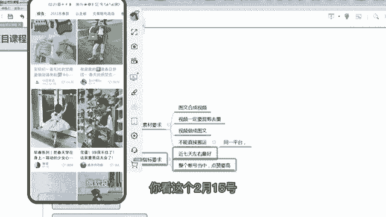

# 【2024版小红书运营教程】全B站最良心的小红书开店流程详解，高阶运营教程合集！小红书体开店，起号真的快，共1000集全是重要知识点，赶快点赞收藏起来！！ - P14：第13课：小红书如何进行站内搬运【小红书零基础电商运营课~全流程】 - 一盏灯的时间q - BV1eSaMeWEXf

啊，大家好，这节课给大家去实操小红书如何进行站内的一个搬运啊。之前讲了咱们小红书的，咱们在小红书本站可以也可以找一些比较好的一些同行，咱们班他的一个素材，然后搬到咱们的账号里面。但是呃具体怎么操作。

就是有很多一个注意的点，大家去注意一下啊。第一个就素材的要求，就素材呃分两种。第一个图文，小红书有很多发的图文的图文的，咱们要合成视频，对吧？你不能图文直接搬过来，我，然后我再图文。

这个容易去那个被判定搬运啊，然后这个笔迹会下架掉。那么第一种就是视频。呃，视频，然后我也要我我要去做成那个我也要发布视频。那么视频如果也要搬运过来，咱们也发布视频的情况下，你一定要去混剪去去重。

那么具体的魂贤驱虫，咱们有魂前课，你可以去看一下啊。然后就所有的这两个操作都是不能直接搬运，你要么图片合成视频，要么视频合成图文，要么视频去虫直接血和驱虫之后，然后发布视频，这三种都可以啊。

我们还可以视频嗯，视频做成图文。那视频怎么做成图文，就是视频对应的这个产品的主图，你直接合成图文，直接那个搬过来做成图文也可以啊。啊，反正咱们就是不能直接搬运，因为为什么不能直接搬运？

你看同样是它是同一平台啊，同一平台同一平台你去搬运，那肯定会被查的呀。你不像是你说是抖音或者淘宝，你搬到小红书，你说小红书搬小红书，那他肯定查的几率比较大嘛。呃，那么指标的要求是最近7天是最好。

为什么最近7天最好？因为因为小红书是呃它并没有更新，像抖音那么及时。像抖音的话，咱们一一般选择当天或者隔天是最好的，就是刚刚报的笔迹会更好。那么小红书咱们选择7天左右报的呃，报站的笔迹会更好。嗯。

然后这个报站不是说是那个不是说是每一个指标，它是一个相对指标。嗯，就是说如果这个账号的粉丝量非常大，有为几十万上百万，那么他每一条笔记其实它的报站率都很高。因为粉丝粉丝基础大呀，比如说都是50以上。

但是你说拿一个基本上没有粉丝的，连100个粉丝都不到的。你说他突然之间他发了一个笔记，他报咱都50了。那么这个也算是一个爆站，也也算是一个爆款的一个笔记，咱们也可以去抄啊，具体给大家演示一下啊。

啊，大家好，那个咱们还是以童装为例啊，比如说看这个童装啊。

这个童装咱们点开它的首页啊啊，首先它的粉丝量不是很高，960。那这个账号还可以看点赞量，你看几乎都没有点赞，看好了。那这个这个咱们都没法抄的啊。

呃，咱们搜个童装吧，还是搜为主啊。儿童装。嗯。

呃，桶装咱们看啊呃筛选的话是筛选不出来什么东西的啊，咱们可以筛选视频和同影单，筛选不了时间。这个咱们只能去刷了啊，所以说为什么前面让你们找对标账号，因为刷其实挺浪费时间的。找对标账号，咱们直接进入关注。

咱们直接去导出的账号里面去看就行了。你看这是2月9号，其实2月9号不是一周的啊。他虽然点赞量很高，但不是一周的，不是一周之内一周左右去报的。所以不要你看这个2月15号，2月15号不是一周左右的。

但是也还好吧，就一周左右都可以，不一定非要卡到一周啊。

哎呀，童装嗯，2月2号。

2月4号哎，2月22号2月22月1号，这个也还可以啊。

咱们看一下。

嗯。嗯，然后是哎这个点赞也可以，发布时间也可以看它是不是这个账号是不是经常出现，普遍都是这个点赞。不是的，你看它普遍是个位数，个位数的点赞，这170，哎，突然出现1个206，然后再往下。那那平时都不好。

突然之间发个好，那说明不是账号的原因让它好？是因为这个笔记本身比较好啊，大家理解啊，为什么是整体账号当中点赞量要高，为什么是这样一个指标，因为咱们。

要。找一个嗯。嗯，好的素材。并不是找一个好的账号。你看他如果账号粉丝量高，那那他所那他基本上所有的那个所有的笔记都好，都普遍来说比较好。那么我的账号权重不高，但是哦，但是我报我这个报站的概率呀。

那个报报站量还可以。那说明不是账号的原因是笔记本身可以，那这样的笔记咱们抄过来对咱们新号才比较友好，咱们新号才容易去报，对不对？大家理解一下这个含义啊。

所以说这个是不是这个素材咱们就可以去用了，对不对？

嗯，这个素材咱们可以用了，那么这个素材咱们就保存下来嘛。嗯咱们用咱们的一个呃保存过那个。

就把这个那个右上角咱们点击这个，然后是复制复制链接，复制链接到咱们的。

抖音的小程序里面一个。

把这个链接取。啊，去那个粘贴一下啊，粘贴一下。

这个之前教教过大家啊，所以说被掩示了啊。

嗯。

呃，那其实像这个账号啊，将这个账号，它是这个位置，它报了一个，是不是？但是你会发现啊，就是我会发现就他上他最近发的也报了1个170还可以啊。那么是不是我除了这个视频搬之外，是不是这个也可以搬。

这个也可以搬，对不对？因为它普遍来说比较高。那么这样这个视频可以搬。所以说我找了一个账号之后，我不一定非要搬，我找的那个笔记。那么这个账号里面的其他笔记我都可以搬。只要他符合我的条件。

比较70天左右去报的。第一个普遍来说是普遍突然之间报，不是一直报的那种笔记，咱们去把它呃搬运过来就可以了？

