# 【2024版小红书运营教程】全B站最良心的小红书开店流程详解，高阶运营教程合集！小红书体开店，起号真的快，共1000集全是重要知识点，赶快点赞收藏起来！！ - P15：第14课：抖音上如何找优质素材【小红书零基础电商运营课~全流程】 - 一盏灯的时间q - BV1eSaMeWEXf

呃，大家好，这节课给大家讲如何在抖音上找到合适的素材去搬运。呃，那么为什么要在抖音上去找合适的素材？因为抖音是国内的一个呃内容的平台的第一名，产生内容平台第一名。因为抖音的人呃用户量太大了。

每天产生大量的一个优质的一个素材。啊，那么咱们抖音上选素材的一个要求有几点啊？第一个24小时左右报的视频。那之前的章姐讲了，在小红书里面报的视频7天左右都可以了。那么在抖音上。

我建议是24小时左右的报的视频去找。如果没有的话，在7天之内或者7天左右都可以啊。大家根据自己的情况来。那为什么24小时左右报的视频可以。因为他刚刚报，如果他刚刚报的视频，怎们判断可以直接搬运。呃。

其实都不用混剪呃，因为因为你是第一你是你可能是第一个或者是前几个去拿到这个视频的，所以说它没有被别人用过，那它就可以当成个原创，因为抖音和小红书不是一个平台，是抖音上抖音搬到小红书它就是一个原创。

所以说可以直接搬。如果超过20小时，我不建议了，这个时候都需要混剪去去重一下。那具体混剪的话，咱们混剪的章节呃，会教大家啊。第一个不要用大号啊不要大号，为什么大号？因为大的团队他基本上他很多平台都做。

嗯比如说他主要是做抖音的，但是小红书它是顺带发的，所以说他在发抖音之后，他立马就发小红书了。如果你去搬运，是不是小红书，你的小红书和那个这个账号的小红书是重复的，这个笔记是重复的。那么他有先发啊。

那么这个情况下，你的笔记就容易被判为搬运。这第二种情况啊。第三个尽量不要露脸。因为很多的嗯童装很好，特别是女装类的露脸的基本上他们就容易被投诉嘛，这也是降低被投诉的一个风险？然后最后一条是突然爆的视频。

跟之前我给大家讲的一样啊。就是平时都是低点赞，那么突然之间有一个视频是高点赞，那么并不是账号的原因，这个视频点赞高，是因为这个。这个视频本身比较好，或者这个款比较好，所以他报了。

那么咱们就找这样的一个素材。那么找的方式有两种，第一个关键词搜索，第一个关注这两个都可以啊。那么接下来带带大家一步一步实操怎么样去做，怎么样去找。那么首先咱们还是打开抖音啊。

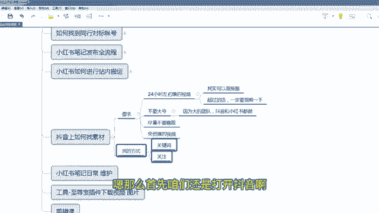

啊，比如说咱们搜索连衣裙，这个时候咱们要点击视频啊，点击视频啊，因为点击视频咱们是找视频的，肯定点击视频。然后这个地方咱们这个选项搜索的选呃搜搜索筛选的选项比小红书要多一些啊，咱们点击。

你看有这么多选项，有肯定是最多点赞，咱们先选一天内的，看有没有啊。

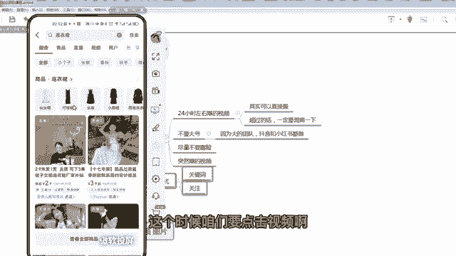

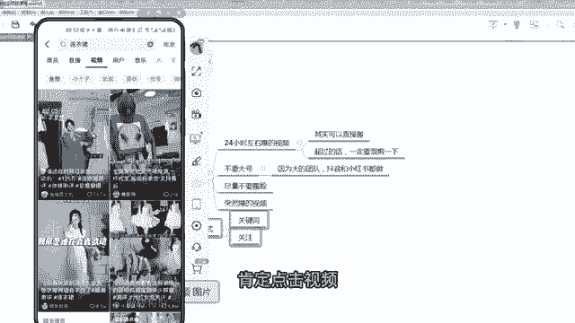

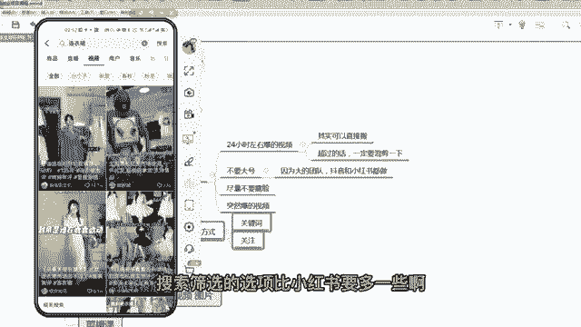

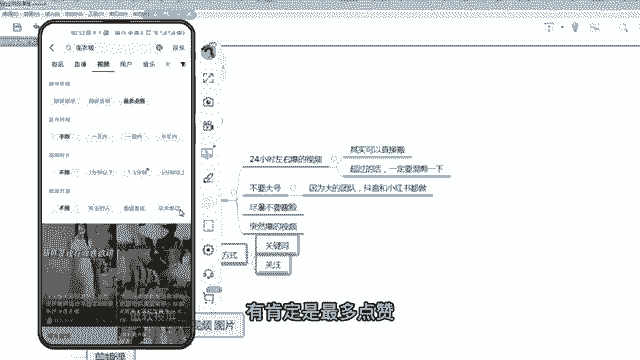

一天内的。

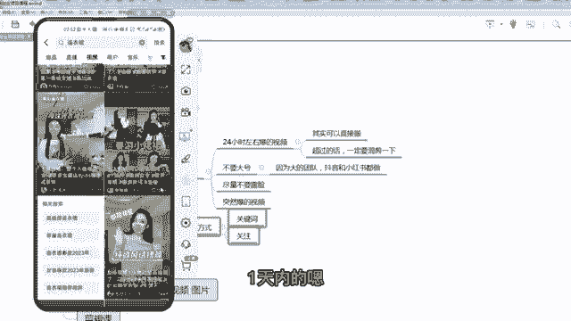

嗯。每次选啊，你比如说这个13001300，咱们看它的整体账号怎么样。

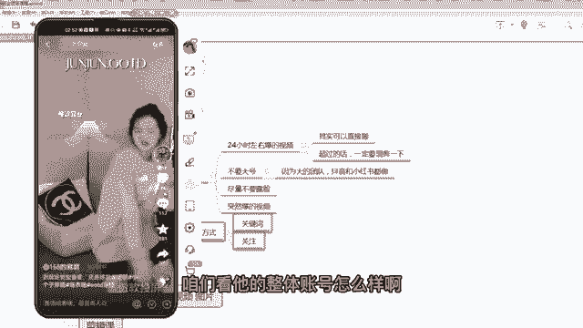

啊，账号不行，因为他平时1000多都挺多的，说明这个1000多是一般般啊，一般般看这个啊。

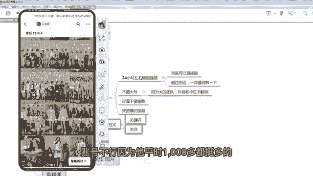

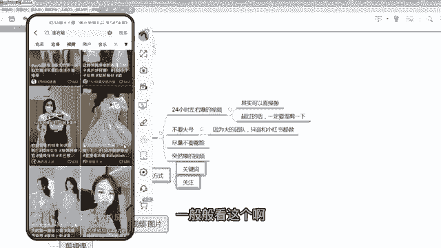

啊，都去点点看啊，18万粉丝589。但平时你看都四五千的，所以这个也不好。

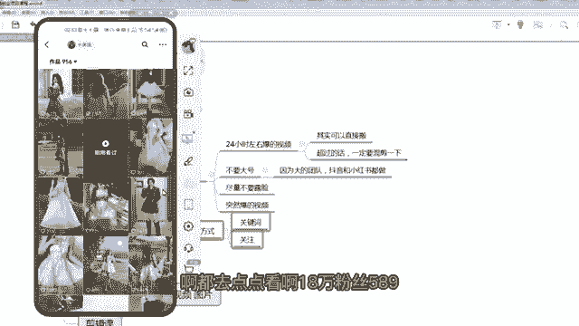

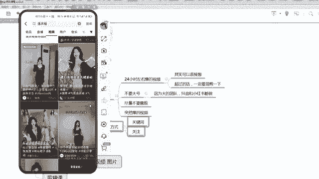

嗯，这个也不好，咱们再看一下啊这个。

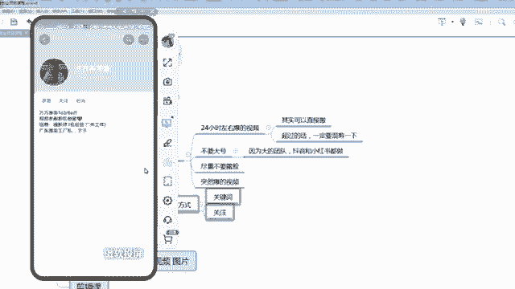

206，那平时他有3000的，几千都有。嗯，大家看一下，我我我我为了快点跟大家演示，我选个一周的啊，你们自己选啊啊。你们如果是当天的，如果找不到的话，你们一周的，你看看这个试一下啊。

它是3600两天前的啊。

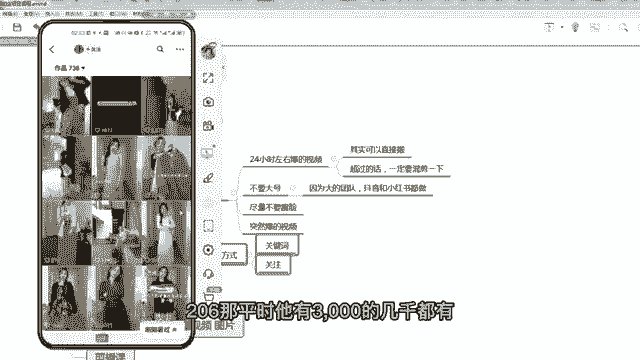

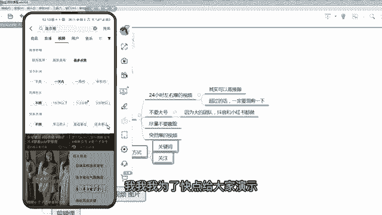

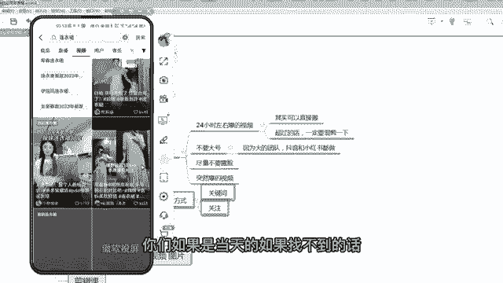

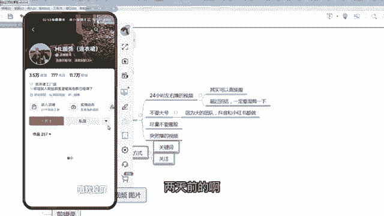

但是平时你看啊平时都是几个十几个几十个点赞，突然之间这个3000，那说明这个视频还的确挺好，或者这个款式比较好，那这个都可以用啊。

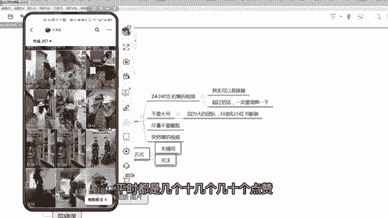

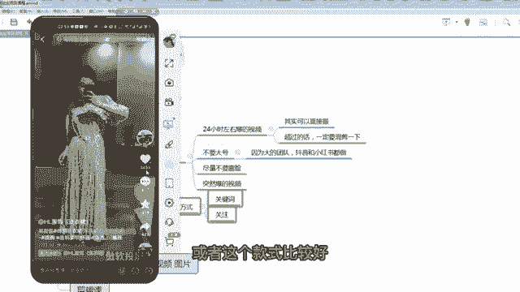

啊，这个可以11万的粉丝，也不是一个太大的号，而且他是不露脸的。大家看啊他的脸是被堵着了。哎，所以这种号的挺好啊，这个可以完全可以用。

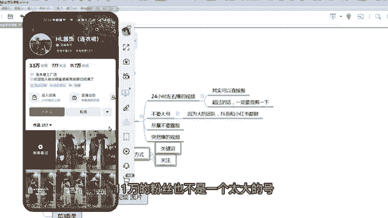

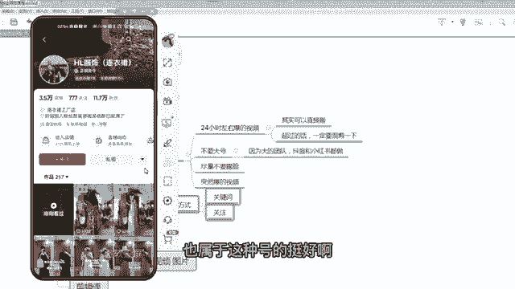

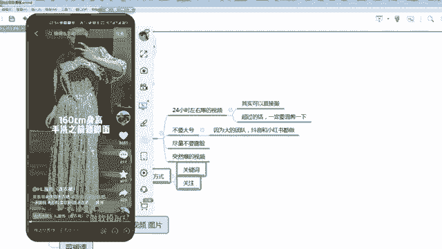

呃，那么同理如果是你是关注的啊，关注的咱们嗯按我之前给大家讲的，咱们需要在抖音上也找一个对标账号，平时去关注。那么关注的话呃，咱们就直接进入关注这一页啊。直接进入关注这一页去去刷去找就可以了啊。

去去找你的D标账号啊。对标账号如果最近发了什么样的视频，点赞量普遍比较高，那么咱们就直接搬运过来啊。嗯，那么在搜搜索这这个我再给大家说一下，就可搜索这个关键词这个啊。呃，不一定。要一直用一个词啊。

你比如说你做童装的，你不一定一直搜童装，一直搜童装，对不对？童装还有上衣，比如说呃比如说童装上衣男，对不对？童装裤子都可以，你包括连衣裙，连衣裙的话，你也可以选择一个呃女装。因为女连衣裙也属于女装。

你可以在女装里面搜一下，是不是更多哈，对吧？你可以在这个最多点赞啊，一天内啊。

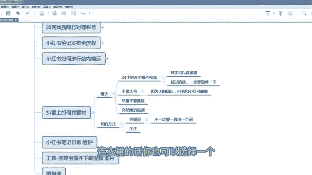

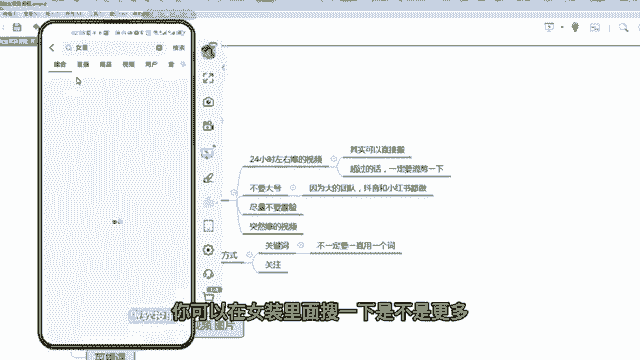

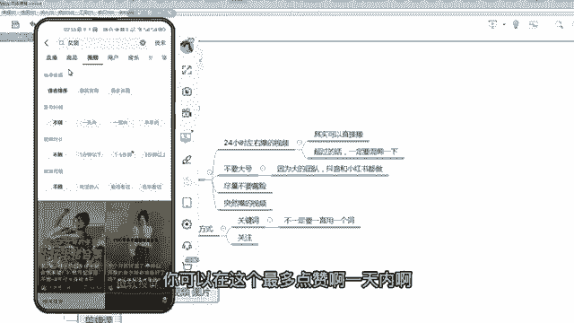

你看女装里面也有裙子，所以说咱们可以不要变着关键词，变着花样去搜，才能搜到更多的素材。那么刚才比如说这个视频咱们选完之后，咱们把它呃链接复制一下，链接复制完之后，咱们打开咱们的呃微信，打开微信。

咱们搜索微信里面有很多的软件都是免费的，可以去那个水印还提取文案。比如说拿青抖为例，咱们搜索青抖，对不对？

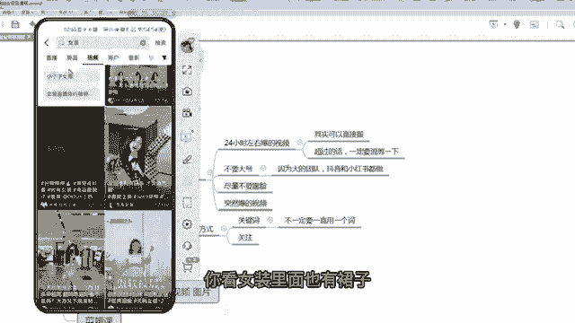

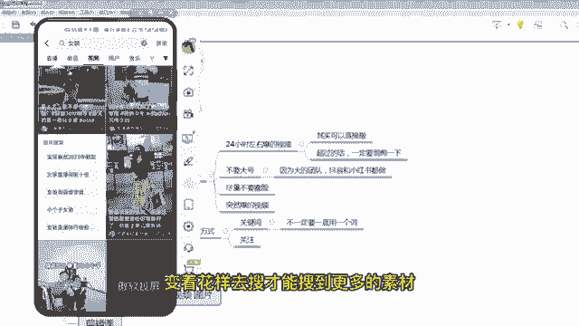

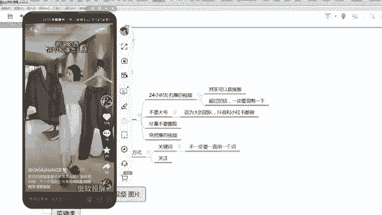

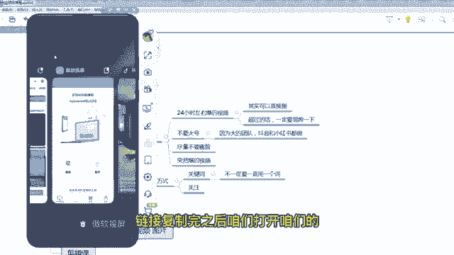

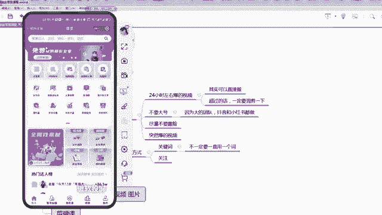

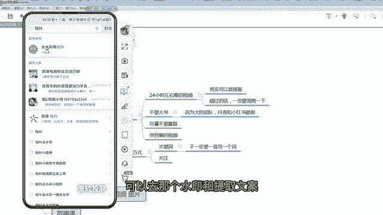

嗯，然后这里面有一个。

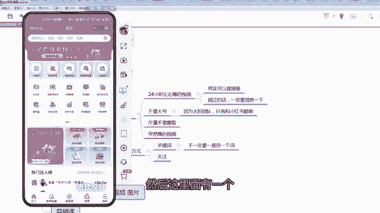

去使用工具粘贴链接啊。

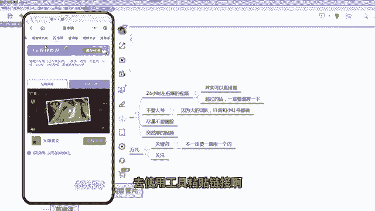

啊，粘贴完之后去水印就可以了啊。但是去的时候，它因为是免费的嘛，他需要咱们去看一段时间广告啊。

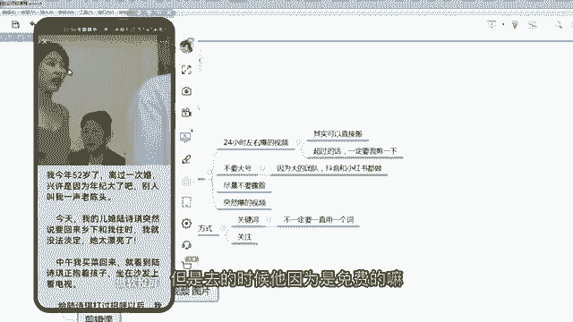

咱们去看一个广告就可以了啊。

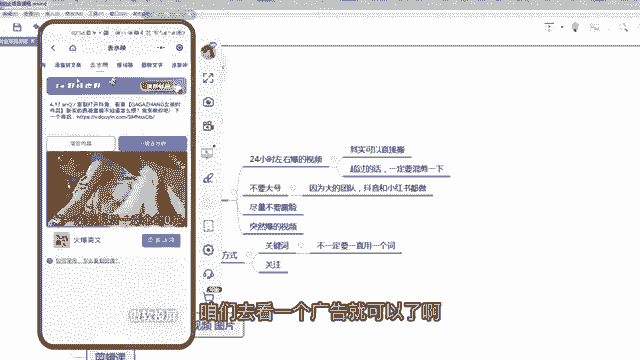

啊，这个我刚才看过，所以不用啊，直接保存到相册啊，那这样就可以了啊。那么这个视频咱们就可以混剪一下，因为不是24小时左右报的，所以这个时候需要混剪加混剪去驱重去混剪。那么混检的话，咱们用混检的课程。

然后混剪完之后去发布，然后带货就可以了。

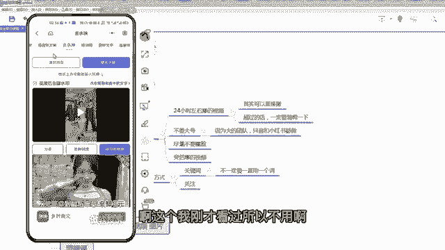

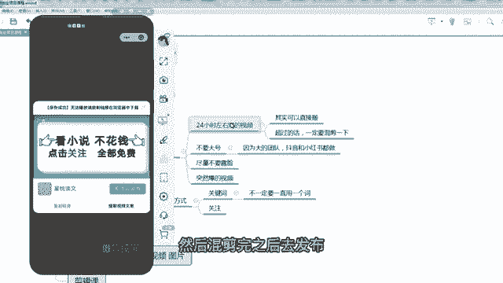

呃，其实抖音上去选素材能报的概率是咱们的呃就是咱们的所有学员里面啊，就抖音上找素材报的概率是最高的这这个大家一定要记一下啊，所以抖音是咱们选素材的主战场。

那么之前呢像小红书呀或者是站外呀或者是淘宝呀多多呀，其实都没有抖音的好，因为抖音的内容内容内容创作内容的人呃每天太多了，所以他的素材都是比较优质的啊。你像咱们这个学员咱们这个学员啊，就是。

他做了好几个店，就做一个企一个，就就这么简单。你看一天卖4000多，40%的利润，一天就就就赚了1500左右啊。他就是呃之前之前那个一直在小红书里面呃找好对标，然后是在抖音里面选好素材，然后是商家。

然后报的比较厉害，这是咱们这个学院，那么后续呃他把抖音里面的对标账号，然后是平时都都关注他发什么东西，然后是咱们也跟着发，所以说他做起来很轻松啊，那一个店起来之后都开第一家店，看这样一个学院。

所以大家呃还是还是按照我的流程来就用心去做就可以了。

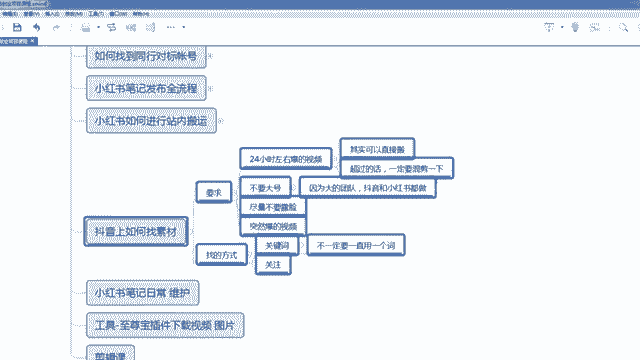