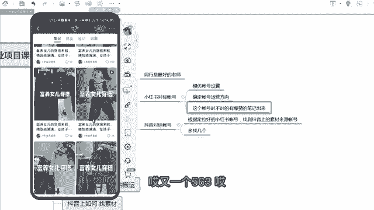
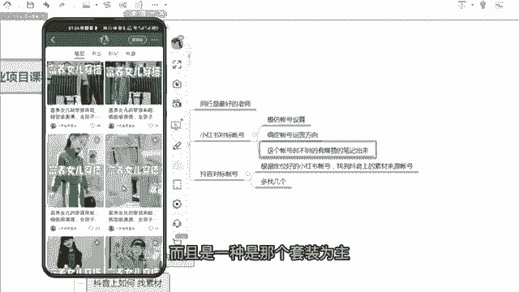

# 【2024版小红书运营教程】全B站最良心的小红书开店流程详解，高阶运营教程合集！小红书体开店，起号真的快，共1000集全是重要知识点，赶快点赞收藏起来！！ - P16：第15课：如何找到同行对标帐号【小红书零基础电商运营课~全流程】 - 一盏灯的时间q - BV1eSaMeWEXf

嗯，大家好，这节课给大家讲就是小红书如何找到同行的对标账号啊，那么咱们为什么要找同行的对标账号？有一句话怎么说呀？同行是最好的老师。

呃，特别是互联网这个时代，你能把同行模仿过来，你基本上都成功至少一倍了，至少一半，知道吧？所以同行很重要的，因为同行有有现成的结果，咱们可以去参考，咱们可以去呃模仿啊，这都是比较好的。呃。

那么呃分两部分啊？第一部分是小红书对标账号对标账号怎么样去做，怎么样去找为什么要做小红书对标账号啊？因为呃只有呃现成已经做的好的账号，咱们去模仿，这样咱们踩坑的概率才是比较低的。

那么咱们首先咱们刚才已经养养完号，上节课已经讲了，咱们养完号了。养号，咱们现在要正儿八经的去开始发笔记了。你是不是要把你的小红书账号的封面标题，呃，还有一个介绍这些东西全部把它设置好。

这样才是一个呃一个真正的就是正儿八经的，我要做的一个成。的一个账号的一个前提，对不对？呃，还有一个你呃你根据你找到小红书的一个对标账号，然后确定几个同行，那么同行大概是一个什么样的运营方向。

那么他们大概是发了什么样的笔记，咱们心里面就有有一个底，对不对？然后接下来咱们做的时候都知道知道哎怎们要往哪个方向去做，然后发什么样的笔记，然后找什么样的素材。那么这里面给大家去演示一下啊。

怎么样去找小红书的一个对标账号。

呃，你比如说咱们做的是童装，对吧？咱们搜一个童装。

嗯，童装比如说你做的是一个女童，其实男童女童不分的啊，男童女童不分的，你就做一个童装的一个穿搭类的一个账号，不是童鞋童装。那么你就你就看一下啊，大概年龄啊，那个大概一个风格啊。

你就觉得这个这个账号看怎么样，童谣。

啊，童谣的，你看这个账号。

啊，找找这样一个账号，大家要有一个点啊。第一个他的粉丝量还可以，不是特别大，也不是特别少，粉丝量可以是咱们可以去借鉴模仿了一个对象，就是咱们能够得着的。第一个就看他的一个点赞啊，可他点赞。

你看你看这个这个账号，其实点赞。

嗯，整体上比较平均整体上比较平均，但是没有大爆的，大爆的很少。你看大爆的很少，我拉拉很久才有啊。那这个账号其实一般般啊，咱们看一下这个账号嗯。

就咱们找又找一个原则啊，就他们。这个账号嗯时不时的。有。Ball。呃，有报站的。的笔记出来，嗯，你不要我我拉了老半天就没有一个特别爆的，或者过百的这样一个点赞。那么这个账号就是他的成功几率有点小。

那么成他成功几率小的模仿他是不是没有意义啊，对不对？你看这个账号看怎么样啊。

嗯，哎你看哎时不时的来个59是吧，59点赞，其实对于童装这个类目还可以啊。

啊嗯啊这个账号做的时间不不长啊。就是延不长的，你是不是来个20多，你看刚才那个是都是都是个位数，你看是不是来来个20多。

啊，我觉得发的也没多少笔记已经2000多了，这个账号也可以去保存一下，咱们可以点关注，对吧？其实其实上一节课教大家去养号的时候，同时你就把这个你刚好把把这个也做了，知道吧？把这个找对标同行这个这个动作。

刚好也做了，咱们看这个账号27，哎，你看这个也可以啊，是不是报1个636，对不对？嗯，然后再拉。

看，是不是又爆了1个143，爆咱率挺大的。哎，又1个563，其实这个挺好，这个挺好。哎，你看又1个450，那这个账号肯定是可以去非常非常可以去模仿的啊。你粉丝是22万啊。

啊，这个可以模仿模仿它成熟的一种模式啊。你包括他为什么它时不时的就爆这么高啊，那可能你看嗯标题非常醒目，就是它封面加了标题，这个标题又非常醒目，对不对？

呃，而且这个模特而且这个模特非常有标识性啊嗯。

还有一个你看它标题特别的标题特别统一，为什么？因为这个标题特别吸引人，富养女最美穿搭来了。富养富养女，你看前面都是一个富养女三个字，说明这个富养女特别能提高咱们那个笔记的一个点击率。

所以说为什么要找同行账号。因为同行是最好的一个学习对象嗯。

那比如说你找了找了这样一个同行，那么他他的一些好好的一些操作，咱们能学过来啊，比如说它的一个封面，它的一个标题，或者它的一个衣服的风格。你看你看这个店铺衣服的风格，是一种潮款。

而且是一种是那个套装为主的一个潮款。那是不是咱们往这个方向去找素彩去找品，是不是可能也也呃也更容易爆，然后做成这种账号，对不对？

，那么第一步，咱们要在抖音上也找一个对标账号。哎，为什么要在抖音上也找一个对标账号？它刚才跟小红书有什么区别？小红书的对标账号决定你的账号的方式和方向，对不对？包括你的标你的起的名称呀，那个这头像啊。

这些东西你都可以去学啊，啊，是决定了你的方向的问题。那么抖音是我方向定好之后，我怎么样去找这类素材。因为到目前整个互联网嗯。呃，整个那个网网络上嗯。能每天产生素材。每天产生。大量的短视频呃视频。

包括图文形式的，大量产生素材的。嗯，最好的。就是抖音嗯因为抖音就是一个内容平台嘛啊他有每天有那么多人拍视频发到抖音上，那么抖音的素材是源源不断的，所以咱们应该去抖音去找。

那么在抖音上找对标账号的目的是找素材。那么咱们呃咱们那个先根据上一步对标好的一个定位。咱们找小红书的一个定位，咱们找来源的一个呃素材账号啊，咱们多找几个带大家去实操一下啊。呃，比如说还是以桶装为例吧。

咱们点击那个呃打开咱们抖音首页，然后搜一个童装啊。

呃，搜童装之后，咱们点击咱们的视频，点击视频啊，咱们因为咱们要找童装的这一类嘛。嗯，那那点击这样的视频之后，咱们肯定要找一些点赞量，相对来说比较高的，而且是最近那个刚刚开始出的一周之内啊，像这类话。

咱们去看一看啊，这个第一个咱们看一看。那么同理咱们是不是也要找也要找到这种优秀的这种抖音的一个账号，对不对？啊，晶晶童装看嗯，看时不时的有没有有没有大爆的。你看每一个点赞其实都挺多的，有没有大爆的嗯。

咱们不要看他可能每个账号权重不一样。你看这个账号159万，那他说明他很多他权重非常高。那么他很多视频其实点赞量都不差的，咱们不要看这个，咱们要看。呃，它普遍是两三百。

有没有突然之间远远超过两三百的视频在，而且时不时都出来。你看这个哎两三00200啪来个1700，哎，这个是两300啪，来个1400，两三0两300啪来个4000，对不对？

那说明这个账号的出爆款的素材的能力是非常强的那这个账号咱们就可以关注关注一下。

关注有什么好处啊？就是咱们可以盯着他啊，因为他出爆款素材的那个频率比较高，咱们盯着他他他最近上什么新款，发布什么新的视频。哎，咱们就可以去抄一下，直接把它搬过来或者混剪一下。

这就是非常非常好好的一个技巧啊。但是这个这个账号不建议大家去去抄。为什么呢？因为他露脸了，他露脸了，而且是一个大号，159万，咱们尽量不要用这种网红的，就是店主自己呃，嗯就就自己拍的这种啊。

自己拍的这种容易被投诉啊，而且是一个大号，100多万了，是一个大号啊，咱们再换一个。

嗯，嗯，但是童装的童装的不是所有的，就是很多露点都可以用啊。但是刚那个账号就有点多，你看这个13。7万这个账号我看一下啊，你还来个1万的啊，我刷一下。

1万的。啊，1个77千的，哎，这个账号也可以。啊，也不是很大啊也不是很大，才13。7万。那这个账号咱们就可以去当一个素材的来源，的们关注，看平时有没有什么上新，有上新之后，他哪个账号。

哪个素材普遍有一些上升趋势，咱们都可以去把它把它扒下来啊，是那个发布在们在咱们的小红书账号里面。呃，那么这样一个操作，我建议大家去拿一个单独的抖音号来做。呃，什么叫单独抖音号？比如说你自己用的抖音号。

可能平时刷，比如说你不喜欢刷童装，你平时刷的是女装啊，因为你对童装没有需求，那么平时呃抖音也是一样的，你刷什么东西，他平时就给你推荐什么东西，你你刷的吃的都普遍是吃的比较多，你刷着刷的童装。

普遍的童装的比较多啊，所以这个时候就是你很容易刷乱掉，他不知道你不知道给你推荐什么东西，所以我建议拿出来一个单独的抖音号去刷你做一个童装店，你就刷一个童装的一个标签。

你做一个女装店就刷一个女装的一个标签，每一个不同的人群对应一个抖音的对标账号，那个对标账号，你可以为什么这样做？因为比如说你刷童装的，你随便就刷一下，推荐他一直给你推荐童装的比较多。

这个时候就咱们都比较省力，对不对？咱们不用去天去搜，它自动推荐就给咱们推荐一些优秀的一些视频，咱们可以去抄一下。啊，这个抖音的对标账号怎么去做？而且是为什么要这样做。

呃，那么想我们的一个学员，我们那个学员他就是做的一个视频，你看那个昨天已经破了4000了。那么他当初的当初的话也是按照咱们的一个方式去选好对标，后面很轻松，因为后后面的话就是我对标选好了之后，呃。

我店铺也店铺也起来了也报了。那么后面大家只只需要维护就行了，就盯着呃，你选好的对标的一些抖音账号呃，假如说你盯了有5到10个，这5到10个，每天去看一看，刷一刷，看他什么样，他每天发什么样的视频。

因为同行抖音，他们是他们是专业做的，他们就时不时的会发一些新的素材，新的视频出来。你看哪个视频刚刚出来，刚刚发出来没多久就点赞了很高。那这种视频都赶紧搬过来啊。后面就是就没事盯着他就行了。

不需要大家去到处全网的去到处找素材啊，到处去测。后面都很轻松了啊。

