# 【2024版小红书运营教程】全B站最良心的小红书开店流程详解，高阶运营教程合集！小红书体开店，起号真的快，共1000集全是重要知识点，赶快点赞收藏起来！！ - P17：第16课：小红书如何选择类目【小红书零基础电商运营课~全流程】 - 一盏灯的时间q - BV1eSaMeWEXf

嗯，大家好啊，这节课给大家讲就是小红书咱们如何选择类目，因为选择类目很重要，因为小红书是一定要做垂直的啊。

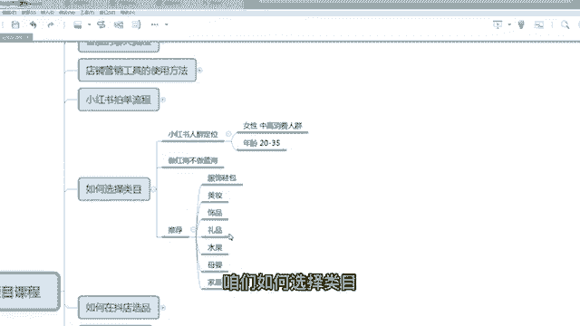

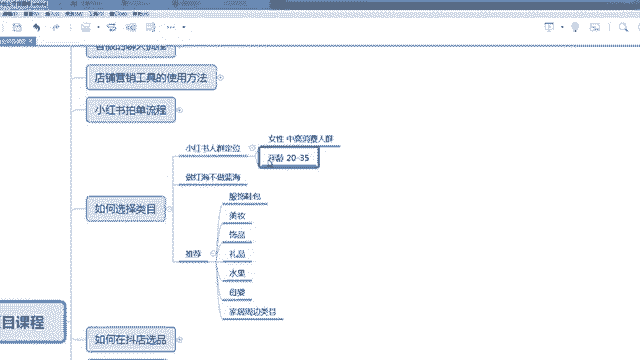

啊，这是小红书。小红书运营。一定要做垂直人群啊。那么类目一样，类目建议大家只做垂直啊。啊，你不能今天做的童装，明天做做女装，这个肯定是不合适的那小红书的整个平台的人群是女性为主。

然后中高消费人群一线二线为主的这样一些女性群体。那么年龄是20岁到35岁，是偏年轻化的。啊，那包括他们的审美啊都是比较好的。所以说咱们选一些比较呃比较好看的东西啊，就这一类的啊，大家去先了解这个平台。

那么第一个小红书的日呃月活是两个亿，其实跟抖音是有差距的。所以说咱们不能在小红书里面选太偏的东西。因为人群其实不够多，不够多，咱们选太偏的，其实没多少市场啊，所以咱们销量也不会太好，所以咱们要做红海。

就什么热，什么爆，咱们咱们选什么东西。那么。正面给大家去推荐一下，我们目前因为我们公司有几十家店铺，有那么多学员，加起有几百家。那么这些呃呃我们通过那个这些我们做这么多店。

包括我们就帮扶这么多学员去做成功的店当中，我们总结了一些呃卖的好的，相对来说大家成功率比较高的一些类目啊，像服饰鞋包啊服饰鞋包的话，就是这是呃小红书里面的一个大类啊，因为很多女孩子都喜欢衣服嘛。

都喜欢穿搭这一类的，想穿搭了。啊，想穿搭都可以啊。

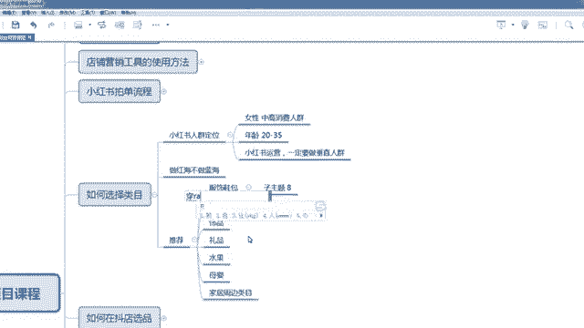

啊，穿搭好，就咱们做穿搭好啊，像那个嗯配饰啊，就是那个配饰类的，就服装配饰类的，像帽子呀、围巾呀、包包呀、鞋呀都可以啊。都可以。嗯，那美妆类美妆那个服装一样都是一大类啊。像美妆的话分分为化妆品。啊。

化妆品或还有美妆工具啊都可以。嗯，但是大家注意一下啊，不管是化妆品还是美妆类的，它里面有一些往脸上抹的那种粉或者是那个液体类的，这些都需需要自制的。在这里面唯独不需要自制的，就是美妆工具啊。

所以大家注意一下，你们要有资质，有授权才能去卖。所以美妆稍微有那么一丢丢的门槛，你们有这个条件去做。没有的话，你们还选个其他类目。但这个类目很好做，也能做私域啊。因为化妆品是一个强复购的一个产品。

就他买了意思之后，他觉得可以，他会继续再卖。

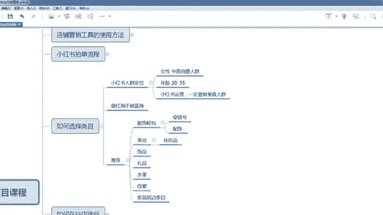

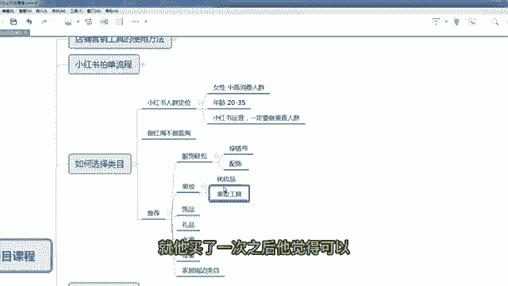

那还有一个视频。

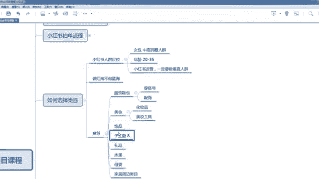

视频的话很多女孩子都喜欢那个爱美嘛，所以视频的话但是视频你们千万不要做那种拼多多的啊。那种9。9块包邮的，这个没什么意义。因为这批人群他看不起这种拼多多9。9块的这种玩意儿，你们尽量选一下质量好的。

客单高的。我建议大家是选至少在20块钱以上，30块钱以上，就这种东西啊，五六十呀，都是非常正常的啊，但是不建议你们做金银珠宝啊，金银珠宝，这个是小红书里面你们是需要资制的，还是正常的视频。

但是我不要做拼多多那那批劣质的产品，所以视频也是很好的。而且视频很容易拍呀，你自己拿到呃这个样品万一爆了，你可以把样品买回来，你自己都可以去拍啊，属于视频也可以啊。

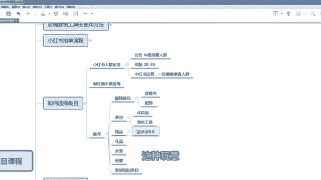

还有个礼品，因为小红书里面有很多人不知道怎么送礼，他会在小红书里面去搜一下啊。比如说呃送男朋友什么什么东西，送女朋友什么什么东西，送长辈什么东西，他会搜搜的话，这里面有一些推荐。

是礼品也是一个呃一个一个人群啊，小红书里面一个主流的人群，而且是呃礼品的话有一些新奇特的也可以啊。新奇特的也可以。

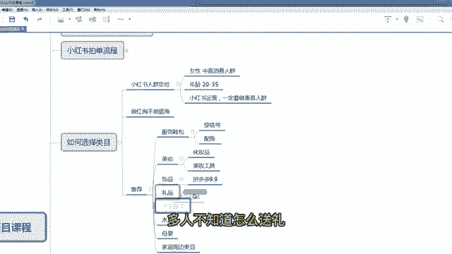

还有个水果，水果真的是在小红书里面特别特别猛，但是抖音免费机会了。小红书里面就是。呃，去年我们做水果还会学员做水果，就是能特别容易能拿到结果。而且你不需要大量的去找素材，就是那种非常真实的在果园里面拍。

或者自己咬一口水淋淋那种感觉都可以去做。嗯，我觉得水果的话，如果你们有货源做水果，我觉得在小红书里面真的是一个一个不错的一个机会啊，可以快速让你大包，而且它的体量一点都不小。它体量一点都不小。

而且这些人买了之后感觉可以，他还会回购，所以也能做私域啊。水果可以大爆的一点比跟抖音比啊，嗯一点不比抖音差啊，它可以大爆的。那么小红书里面有很大一部分宝妈群体啊嗯。

宝妈群体为什么有宝妈群体在小红书里面占比比重也比较大呀？因为宝妈群体很多，你比如说育儿经验他没有，比如说我如何给宝宝买买那个奶嘴，对不对？嗯，宝宝生病了怎么办呀？或者是我如何选购什么什么产品。

有很多宝妈是第一次做做那个。呃，第一次那个做帮妈妈，然后也不懂，他会在小红书里面去搜各种攻略。那么有一些博主他的推荐比较合适，那他就直接买了，对吧？对于小何来说还是值得花钱的啊。所以母婴人也是一大群体。

有母婴有婴用产品，包括童装、童鞋，这些都可以做啊。我们所以说我们做的童装店挺多的，童装童鞋店挺多的啊，而像童装童鞋店有一个好处，它素材特别好特别好找。

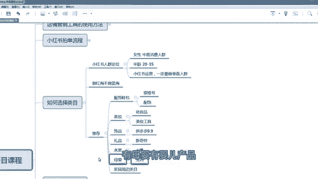

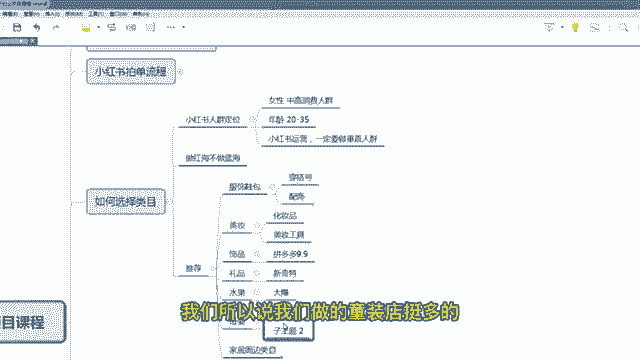

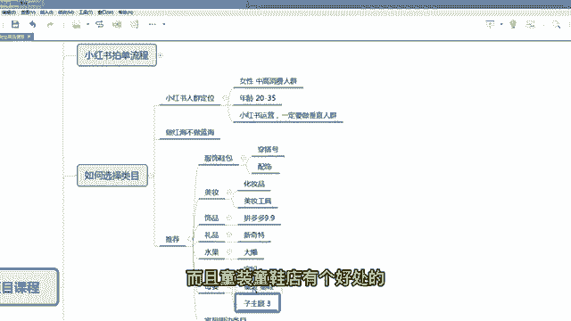

好找素材而且素材不容易被投诉，因为。它的灵活性非常强啊，色彩不容易被投诉。所以说涂装同学我是非常推荐大家去做的一个类目。还有一个类目是家居周边的家具呀，就是装修类的这种东西呃，也适合。

就是装修周边的都适合。为什么呢？因为有很多人是照着小红书里面的美图去1比1去装修的啊，这个人群也大无人在。啊，包括我自己那个家里面装修，我就会经常在小市里面去翻一翻，看有什么比较好看的方案啊。

什么东西那个装修比较好，搭配比较好，我们都会去搜一下啊。所以这类人群那么咱们可以做的类目是装是家装。

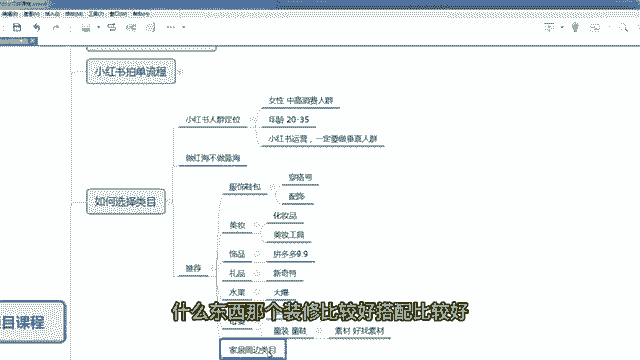

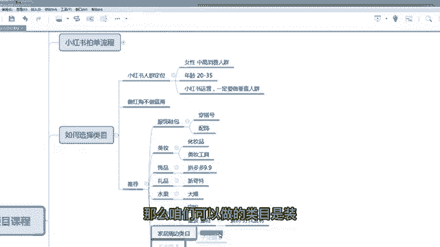

装饰类的啊加装装饰类的，还有呃加装绿植类的啊。

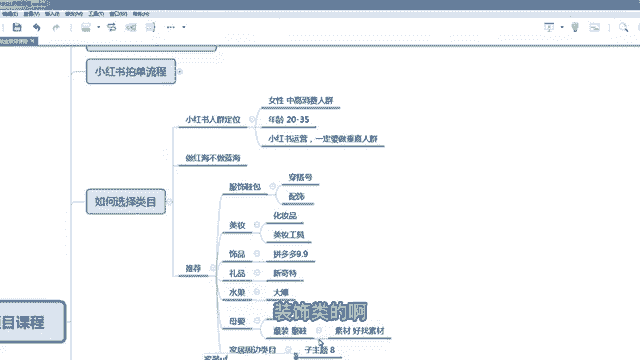

加装绿植。这这两个类目都可以啊。

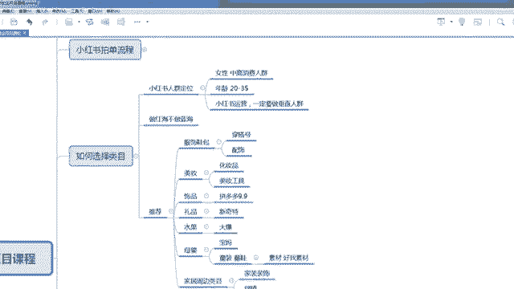

嗯，那么为了证实我刚才说的，其实咱们小红书也有一个小红书的数据软件。小红数据软件有一个行业大盘，咱大概看一下，咱们看一下行业大盘一些反馈，都知道什么类目热了嘛。因为咱们只做热门类目。

你看服装比剧互动量30天就2点2个亿，那么服装肯定做呀啊嗯。

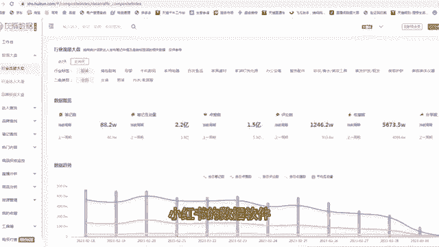

啊，服装肯定做啊，这个我是没有权限的，我看一下啊。啊，如果大家的话有会通软件的话，像服装、母婴啊美妆类的，还有一个。

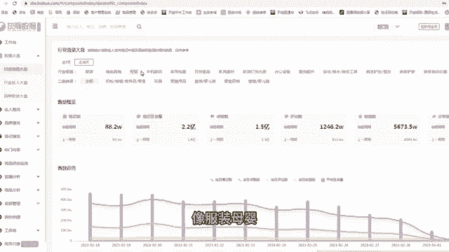

呃，还有一个宠物类的也可以啊，宠物也是比较好的一个类目啊，我没打上啊，宠物也可以，为什么宠物也可以啊因为呃小红书的人群它是一个高消费一线二线城市，像像一线二线城市的。

很多的女孩子或者家里面他们是有宠物的啊，他们有宠物有宠物就会有宠物周边的一个需求，像宠物的呃衣服呀，宠物的用具呀，这些大家都可以去做一做啊。

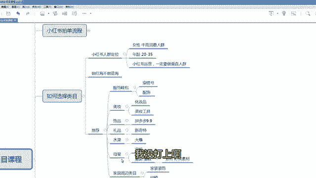

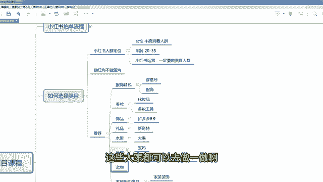