# 【2024版小红书运营教程】全B站最良心的小红书开店流程详解，高阶运营教程合集！小红书体开店，起号真的快，共1000集全是重要知识点，赶快点赞收藏起来！！ - P18：第17课：小红书帐号如何养号【小红书零基础电商运营课~全流程】 - 一盏灯的时间q - BV1eSaMeWEXf

大家好，这节课给大家讲小红书如何养号。那么在讲养号之前，我先告诉大家，就是我们为什么要养号。呃，因为我们公司是开的有几十家店铺，然后的学员加起来有几百家店铺，通过大量的一个账号反馈。

就养号后的账号权重要高，容易报笔记。那么如果你不养号的话，就是他可能账号的权重呃比较低或者账号比较敏感，就很容易咱们发的笔记就是没什么权重，拿到的流量也比较少。就就是这个也不是说不养号。

你的账号就就起不来，是不养号，你账号起来的概率变低了啊，这个大家要理解啊，就是养号能养，咱们大家尽量养一下啊，那么养号的时间哈。

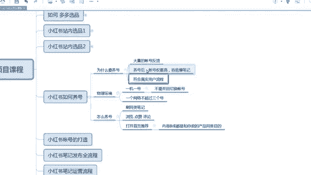

嗯，然后的时间呃大概两三天时间啊，两三天时间就可以了，稍微养一下啊，两三天嗯。

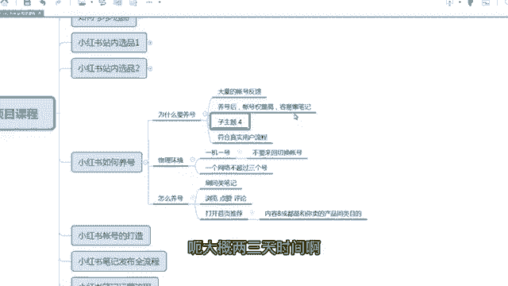

嗯，然后是还有一个哈，就是咱们养号呃是更符合真实的一个用户流程。因为你不可能就是你一个按正常的一个逻辑，你你今天注册一个新号，今天注册完之后都立马发BG，立马发带货BG，这个就是呃目的性太强了。

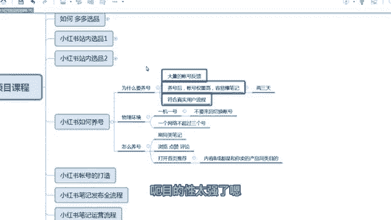

嗯，大家看一下啊，这是我们一个学员嘛，呃，然后他就是按咱们的课程去养号，然后他的笔记其实3天就可以出单了，就是出单很快，因为账号权重会偏高一些啊，比不养号的权重要高一些。呃，那么第二条啊就是物理环境。

就咱们养号的时候，咱们物理环境也要做到标准，什么叫标准？就是一机一号，什么叫一机一号，就是一台手机挂一个账号啊，那么还有另外一种情况？如果一台这个账号指的什么东西啊？指的是。

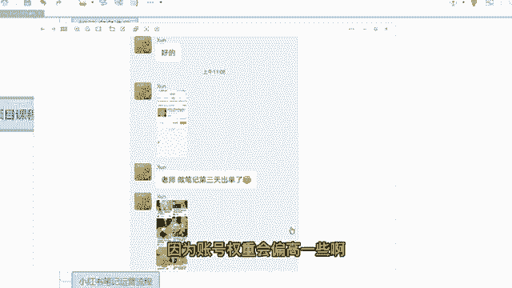

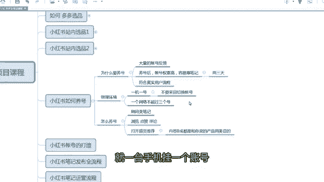

小红书啊小红书并不是小红书账并不是小红书店铺，小红书店铺是没有这个要求的，你随便登啊，你那个随随便登录啊，怎么着都行。但小红书不行，小红书是非常敏感的。那么呃不要来回切换账号。

有也有情况也可以呃呃也也可以不是一级一号，就是我比如说安卓手机嘛，一般安卓手机有分身，一般自带一个分身可以分出来两个。比如说一个手机，比如说小米手机，一个手机可以分出来两个小红书。

那么两个小红书可以登录，对不对？这个一级两号，但是你不能用。不能用第三方下载的分身。去登录嗯。啊，因为第三方第三方下载的分身去登录，这个是非常敏感的。因为因为这个太细了，不跟你们说啊，从技术角度来说。

这个就是一个虚拟的一个环境，这很容易被检测的啊。分身肯定大家都记住分身可以用，但是不能自己自己单独的到第三方去下载分身去登录。手机自带的分身是可以的啊。那么剩下网络了。

网络的话就是一个网络不能超过3个小红书账号啊，一般如果这种是针对那个团队的，像有些团队像我们公司啊，因为这样云店票比较多，有几十家店铺。

就我们不可能一个网络网络下下面全部那个全部放到全全是那个就是一个就是很多个小红书都在一个网络下面，我们不会这样做。我们是呃一个网络下面不能超过三个，最多三个号。当然如果我们是用手机的流量的话。

那个就是一个手机一个手机卡，一台手机，然后一个账号或者两个账号，如果有分身的话啊，就大家这样去做就行了。如果你如果你的家里面或者办公室里面是一根网线，那么这一根网线下面是三个可以有三个小红书账号啊。

这个一根网线，就一个户啊，一个户。一个宽带的账号啊。呃，那么接下来再给大家去实操一下，具体怎么怎么样去养号啊，刚才说了养号两三天就可以了。那么这两三天咱们到底要干嘛呢？啊，第一步要刷同类笔记啊。

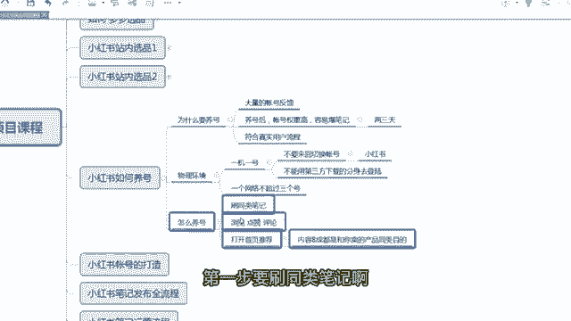

呃，什么叫同类笔记啊？比如说我做的是女装啊，大家就搜女装，比如说你做连衣裙嘛，我就搜连衣裙。那么连衣裙的话啊，就是首先咱们肯定要搜嘛。因为因为不搜的话，那个呃官方也不知道给你推荐什么样的一个笔记。

推荐什么样的账号类型。那么大家先搜啊，比如说我搜这个连衣裙，对吧？我觉得不错，然后我就有三部啊啊刷同类笔记有三部浏览点赞评论三步啊。第一个我是不是看了叫浏览啊。第一步那个我要点赞，我觉得不错，点赞。

第三个你可以更深度的，你可以去回评一下啊，回评怎么回评都行，发个表情都可以，这些都可以啊啊，那么我就感觉可以感觉可以，我继续再去搜啊女装连衣裙，继续搜浏览。浏览。点赞评论啊，甚至收藏也可以啊啊。

这个就看你们自己了啊，反正点那刷笔记啊，这个很轻松，就跟咱们平时刷那个嗯刷抖音啊，看小红书啊一样的啊，就简单看一看，那么你也可以搜搜点别的嘛。女装哎，早春穿搭套装。哎，这个也可以啊，也是女装的啊。对。

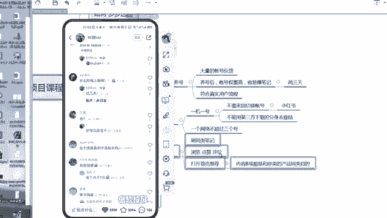

嗯，那什么样的情况下是你呃养号成功了？嗯，就是说你回到你的主页，然后是再发现推荐这一栏，你刷新一下，它80%展现的都是你关注的。你看刚才我不是刷了一个女装吗？领取，你看嗯。

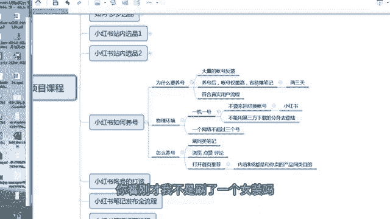

啊，那个刚才我刷了一个女装连衣裙，你看这个地方是不是显示连衣裙了，然后再刷新一下刷新一下啊，这个还嗯那表明我我养号还没有养过来，对不对？我回过头来我再去刷。啊，早春穿搭嘛，我再去刷啊。

多刷一下浏览、点赞啊，评论啊，嗯继续啊。啊。继续啊可以去评论一下啊。

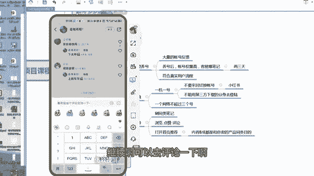

嗯嗯。嗯，这个一一时半会是刷不过来的。但是你看我刚才我刚才就稍微刷了一下，你看呃，给我给我推荐了一部分女装，对不对？推荐了一部分女装，这个都非常明确了啊。啊。

就是说咱们的结果就是呃打就是回到咱们的小红书的主页，回到小红书主页再发现这一栏刷新一下。如果展示的80%就是咱们要做的这种类目的产品，那么咱们养号基本上算成功了。每天的养号时间啊大概就是半个小时啊。

半个小时左右啊到一个小时啊，就可以，不需要太长时间，大家这模实的啊，随便刷一刷啊，点赞一下，评论一下。

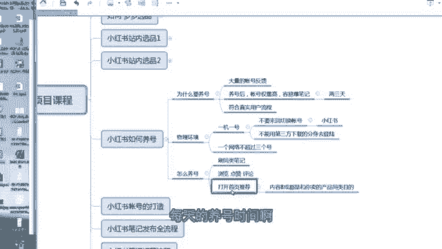

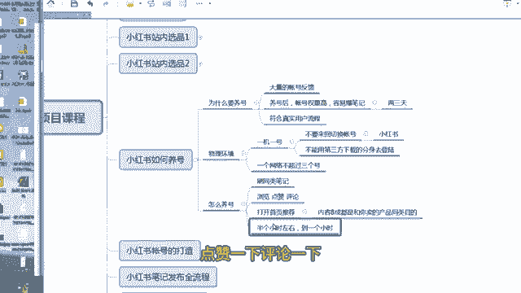