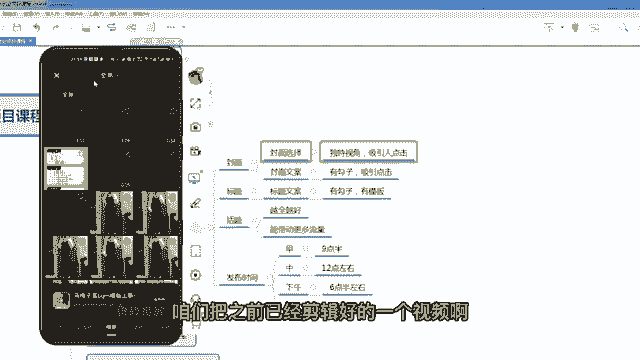
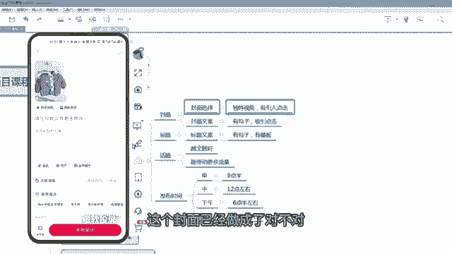
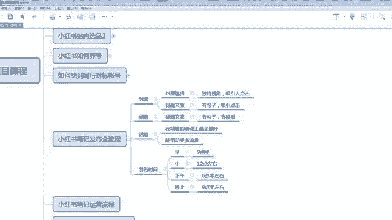

# 【2024版小红书运营教程】全B站最良心的小红书开店流程详解，高阶运营教程合集！小红书体开店，起号真的快，共1000集全是重要知识点，赶快点赞收藏起来！！ - P19：第18课：小红书笔记发布全流程【小红书零基础电商运营课~全流程】 - 一盏灯的时间q - BV1eSaMeWEXf

呃，大家好，这节课给大家讲解小红书笔记发布的一个全流程。那么咱们的呃素材已经做好，找好也做好了。然后咱们的那个呃商品上架完了。那么这个时候咱们要要发布笔记，然后挂上这个商品。然后整个流程是怎么做呢？

接下来给大家去实操。那么笔记的组成部分分为三个部分啊，第一个封面，第一个标题，第三个话题还有咱们的发布时间，这四条咱们做完整之后，咱们的笔记才会比较优质，才能拿到更多的一个流量才有机会去呃去爆发去报站。

啊，那么接下来就是拿我们的一个账号啊，一个账号给大家演示一下。你看这样这个账号是开过店的是一号一店的一个小红书账号，咱们发布笔记的话，咱们是在这个位置啊，大家看一下。

最以下方有一个加号，咱们点击加号，点击加号，咱们不管是视频还是图文呢，咱们比如说拿图文图文为例吧，拿图文咱们选好咱们做的基本上几张图片啊，咱们选好图文，就有图文嘛。如果是视频的话。

你就只接是选选择视频都可以了。那么这个时候你可以选一个音乐。如果你的模板里面有音乐，你都不用选。那么你可以选个音乐啊，啊，你看这个也可以，那咱们就选这个音乐了啊。

然后接着下一步嗯。

呃，下一步啊，不过再返回一下啊呃如果你的你的素材啊，你的所发的素材，不管是图文还是视频。如果你在提前在剪映里面编辑好，那么这个地方是不用编辑的。因为小红书本身也有一个编辑功能，它可以加文字呀。

它可以视频模板啊，你看这个都有，它本身也有一个剪映的功能。但是整体上的功能是没有剪映那么强大啊。如果是咱们后续的话，咱们那个呃做的相对来说比较多，电也比较多的情况下，咱们还尽量用剪映啊。那么开始的话。

你也可以用小红书自带的这种模板呀，这种类似剪映的功能去做也可以。你比如说把图片美化一下，这都可以啊，图片美化一下。

嗯，你看调节啊，你可以对比度呀、色温啊各个方面都可以啊。还有滤镜啊、美颜呀都有啊，都有的啊，那那我这里面我就我就不做了啊，到时候由咱们剪辑那堂课会详细给大家讲是怎么样去做一个美化呀处理啊啊。

那这个图片已经加完了，咱们是不是要做一个标题？

这个标题对吧？呃，那个呃图片这一栏再给大家讲一下。第一个图封面的一个选择，这个封面非常重要，先给大家讲封面吧嗯。呃，重新给大家举一个例子吧，比如说这样咱们点击加号，点击加号。

咱们把之前已经建辑好的一个视频啊，直接加进去，然后点击下一步。下一步它视频咱们提前剪辑好，它肯定有音乐，所以咱们不用管啊。那么这个时候咱们其实是要加一些。

嗯，好下一步下一步的话，如果是视频形式的话，视频一定是要加封面的。大家听好，视频一定要加封面的。如果是图文的话，咱们第一张图就代表封面，所以这样是有个区别的。那么视频的封面非常重要。

它的视视角要独特一点，能吸引人，咱们最终的一个呃有一个出发点就是我要吸引点击你的视频的的数据才会好。那么呃比如说我觉得我要展示一个衣服，对不对？那我首先呃这个衣服这个封面我我觉得挺还可以啊。

整体上都能展现出来。那么这个可以点击下一步，那么封面有了。那么封面上我是不是封面上加一些文案会比较好，一些钩子文案。

嗯。啊，比如说这个地方我可以加个文字。你比如说是呃在大家的认知当中，这个应该卖六七十块钱或者是八九十是比较可以的。那么我说今日他家秋季春春日伤心季，比如说我我把它标个49，是不是这样很吸引人呢。

对不对啊，就是类似这种都可以，也可以是夏格也可以是钩子。你说天哪？

这个衣服又降价了，怎么怎么着啊，都可以了啊，这个标题上这个文案我们完成这个封面已经做成了，对不对？封面做成之后啊，第二步是标题标题的文案必须有钩子啊，因为标题特别重要，必须有钩子，什么叫钩子啊。

给大家去呃展示一个啊啊，那么这个模板其实咱们所有的学员都有都会放放到咱们那个学员群里面啊，这个模板比如说各种钩子不可思议的前置好处和立项状态里边什么三分钟收了100万。

那5分钟就能写出了一条文案太神奇的，太炸了，用到这三招小店业绩翻10倍。当然咱们日常之前讲过了，咱们在对标账号里面也可以找到这样的文案。但是但是我们因为做的店铺比较多，案例也比较多。

我们把我们平时找的各种文案都分门别类的，已经统计在这个表格里面了，到时候学员去看就可以了啊。

，这是标题。那么文案咱们直接照抄就可以了，照抄，然后做一些微微微改都可以啊。呃，重点的还有另外一条就是话题。话题的话，我建议大家就是在精准的基础上越读越好啊，在精准的。啊，越群越好越多越好。

因为越多你拿到的流量越多，咱们可以多点一下。因为小红书跟抖音不一样，抖音最多添添加5个话题。小红书目前可以插可以那个添很多呃，然后最长多少，我没有试过，但是我添加十几个，一个是个是没有什么问题的啊。

但是你不能乱添加。比如说你是卖一个童装的，你去添加一个女装，这个都不合适了。反正可能会让你的流量精准啊，能带动更多的一个流量。话题的话，大家很简单啊，直接点话题就行了。

当然你的文案里面如果有或者是你的类目，如果有一些东西，有一些那个标签类的，它会它这个话题会自动给你做一些这个类目。当中的一些推荐。啊，你比如说饰品我的呃项链呢。对不对？珍珠呀，但这是个童装啊。

所以它没有识别啊，所以咱们不要再按按这个来啊。嗯你要按照你自己的产品去找这样的一个话题啊，都有，它会自动会弹出来一思啊。你觉得对跟你这个产品是匹配的那你就选项去用就可以了。呃，那么第最后一部分啊。

那么这个文案包括这个话题，咱们做完了之后，咱们要干嘛嗯。呃。啊，刚才可能这个界面是没有展示出来的啊，就话题的话，大家按我刚才说的呃，在精准的基础上能越多越好，越多的流量越高啊，能带动更多流量。

那么下一步咱们该关联商品了，关联商品就是你什么样的笔记，它背后对应哪个商品就关联哪一个这个不能错啊，一一对应的啊比如说咱们是这个衣服，那么咱们就关联这个衣服嘛咱这里面一个小技巧。

咱们尽量选择那个价格最低的第一个第一个就是咱们那个咱们的商商品尽量选主图的那个颜色。对咱们咱们SQ尽量选主图那个颜色，比如这个主图是橘色，咱们就选橘色，为什么呢？因为主图的点击率是最高的啊。

这样也能增加咱们的个笔记说挂链接的一个点击率。第一个选最低的一个价格，你看有60的，那么咱们选有56的，咱们选56，因为这样你的展示价格是56，回利于比较吸引顾客去点击嘛。

因为价格比较低，然后点击确定。嗯，这样就可以了。嗯，然后是添加地点的话，一般咱卖商品，不用添加地点。如果你是做发布一些引流的视频，比如说我要做本地生活，我必须要定为我当地的一个地点。

这样让别人能搜到我觉得我是本地的。那么这个时候你就有这个需求。一般的话我咱们是不加的啊。然后下一步有一个高级选项，高级选项里面有一个直播预告，咱们不做直播，所以不做咱们一个定时发布，定时发布就时间嘛。

所以这个是比较重要的。啊，一般大家去发布笔记要分时间的，为什么分时间？因为不同的时间用户的呃打开小红书的呃去刷小红书的时间点是不一样的。所以你在最热门的时间点去发布，它能拿到的流量大。

就是它技术播放量要大，比你在冷门的时间点发布的，拿到流量要多，所以这个也是非常重要的。但是咱不能说你看早上我建议大家一个发布时间，早上9点半中午12点左右，下午6点半左右，晚上9点半左右。

如果你是发4条的情况下。啊，这个5条和3条就是我建议大家就前期发3到5条就可以了。每天啊。那么你不能是盯着时间，到这个时间你去发这这个不是太累了嘛，怎们什么事情都干不了了。

因为很多人可能是做这个小红书是兼职的。那么咱们就定时，比如说你把4个。呃，四个笔记和商品就都上完之后，都做完之后，你就等发布了，你就定时发布。大家看看啊，定时发布。比如说我9点半，那我就选择9点半嘛。

周五的9点半。6点半。嗯。对吧完成完成我就直接定时发布就OK了。他到9点半会自动发布，不用我去盯着。所以说咱们在咱们在统一时间做完之后，然后定时发布，不用管，它会到时间自动发布，就这么简单啊。

