# 【2024版小红书运营教程】全B站最良心的小红书开店流程详解，高阶运营教程合集！小红书体开店，起号真的快，共1000集全是重要知识点，赶快点赞收藏起来！！ - P1：小红书起号 - 一盏灯的时间q - BV1eSaMeWEXf

从毕业到现在，你挣过一分钱吗？😡，🎼一个新手从零开始做小红书后，30天之后月入5000块钱，有可能吗？在小红书认真发布帖子的博主里面，月收入超过1000块钱了，占到了57%。

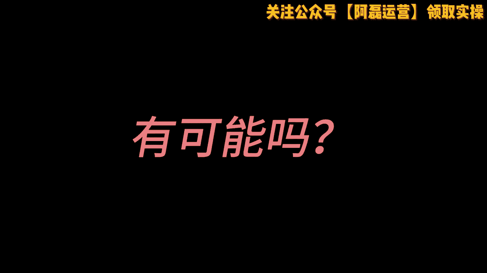

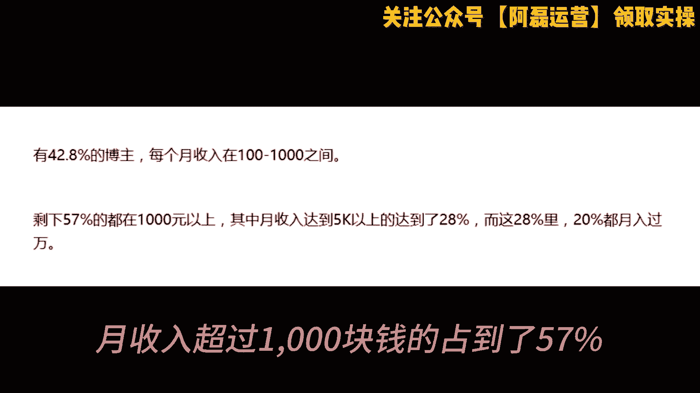

🎼别说是超过5000块钱了，占到了28%。也就是说，只要你开始做了小红书，只有28%的概率，纯靠小红书就能养活你自己。设置是先驱，我会在接下来的几分钟，里让你获得这28%的入场券。

🎼首先我们要知道小红书是一个什么样的平台，它的本质是一个社交分享型平台。我们要注意里面的社交和分享。🎼所以要为他人提供有价值的内容，是做起来一个小红书号的核心。所以有四类人是不适合做小红书的。第一。

不喜欢创作和表达，没有持续输出内容能力的人。第二，不善于检索阅读和总结信息的人。第三，心理脆弱，容易放弃的人。第四，没有执行力的人。这四条，只要你占了一条，后面内容你都不用再听了，直接评论区找到我。

先提高你的基础能力再说吧。🎼如果你一条都不占，那么恭喜你基础能力是没有问题的。接下来我们会手把手教大家解决三个问题。第一，如何从零开始起一个号。第二，如何保证持续有高质量内容的输出。第三。

如何确保内容能够变成收益。这三个问题，我会分别分为起号片和变现片两期讲励大家。本期是起号片，起号第一件事情不是起名，不是搞图像搞简介，而确定自己到底要卖什么赚钱。它决定了整个号的方向。

我们做小红书不是为了做慈善做分享，我们做小红书的唯一目的就是赚钱。有些人辛辛苦苦运营了半天，有了几千几万粉丝了，然后发现自己的方向赚不来钱。

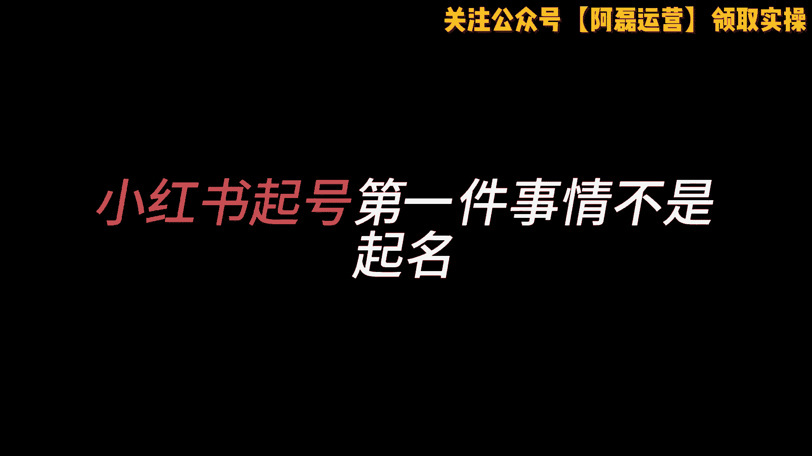

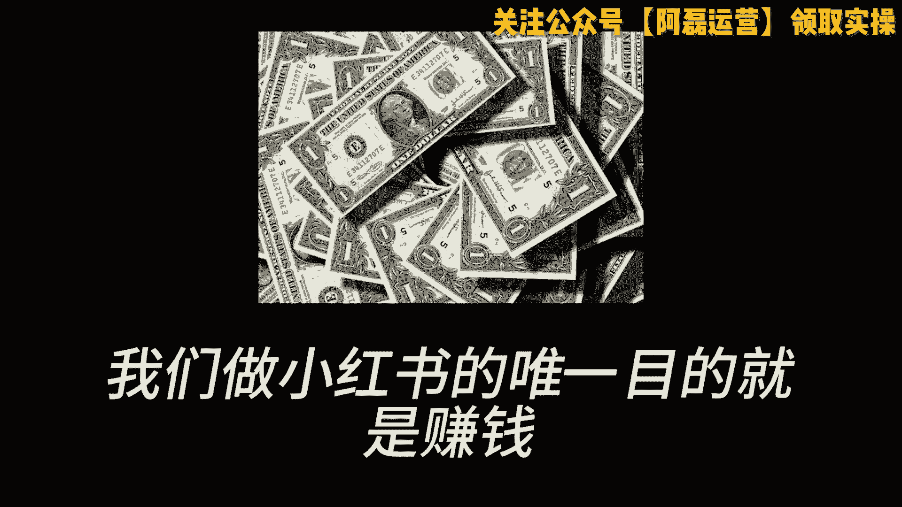

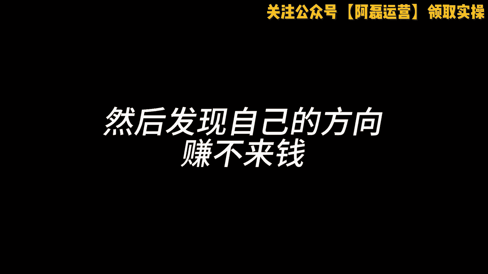

🎼比如有些人喜欢做每日好好剧分享，每日读书打卡的号热度也很高，但没有什么商业价值。这种核心的问题就在于，一开始就没有想清楚自己这个号到底要卖什么东西。

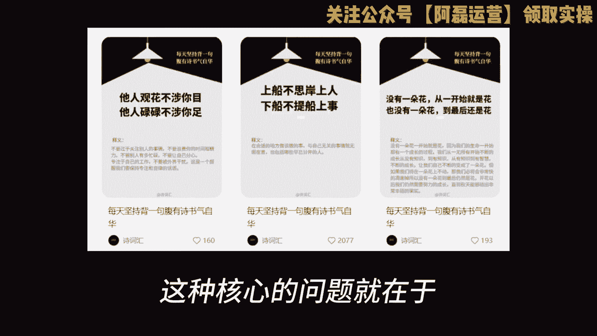

🎼所以第一步你要确定了是自己到底要卖什么产品，然后在这个方向上确定号怎么做。你要卖衣服，你就做传达号，你要卖付费课程，你就做培训号，你要卖吃的，那就做美食好。你自己擅长不擅长某个领域。

并不是你选择方向的依据。🎼选择方向的依据是你要在这个方向上，第一能够持去创作内容。第二，有产品可以交付，那就可以去做。至于擅长不擅长，不擅长，你可以学呀。

所有人刚起号的时候都不可能比这个领域的大杯更加擅长，能力都是做着做着就起来了。就算你刚开始不懂传达，你做上200个传达的帖子出来，你还不能不会吗？如果实在不知道该做什么，这里可以给你一个参考。

🎼小红书里面最赚钱的领域是家居、护肤，其次是情感、健身、健康、母婴和美食。其他领域的收入普遍都没有这些高。所以你在这里面随便挑一个，你可以做就可以了。确定方向之后是一些基础的工作。🎼第一个是起名。

给你一个万能模板，要做的事情加标签，加个人昵称。🎼要做的事情和标签之间要有一定的反差感，比如卖猪肉的转行医师生鱼玉。🎼卖烧烤的下岗基金经理曾格，抑郁的心理医生刘刘，不会穿达的女装店主。

不会做饭的美食博主，不会骑自行车的旅神旅行达人，不会穿入的烧烤摊主。这种反差太好找了。如果不会搞的话，来评论区找我，我给你起都可以。第二，头像随便弄也经常换就行，没有什么讲究。第三。

把不过人小红书改成自己的微信号，这样后面有人私信你，你就可以直接告诉他，加我小红书号就可以了。这样可以合规引流。第四，简介还是万能模板。

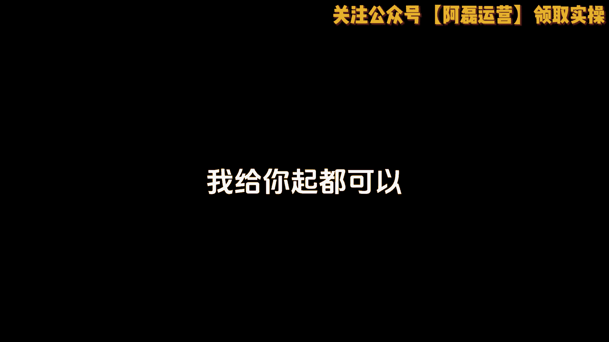

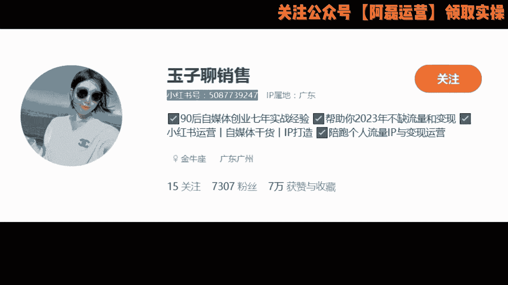

🎼身份我是谁加我在做什么，加这个号会发什么？

🎼比如说这个人身份是90后自媒体创业者，做什么帮人搞流量，搞变现号里面会发什么，会发小红数运营自媒体干货IP打造。第514下平台规则。第一，禁止炫富，不要带给人焦虑，制造焦虑可以短期有流量，但长期来讲。

既会被平台打压，又不利于人手塑造。第二，禁止直接引流。帖子中间不能出现任何微信号、公众号等信息，更不能出现二维码。合规的引流方式以后，我们会讲，也可以直接看评论去置顶就行。但是在你彻底了解之前。

千万不要直接引流直接引流对你的负面影响一定会打鱼。你所得的收益。第三，不要出现不文明言论，不良言论。

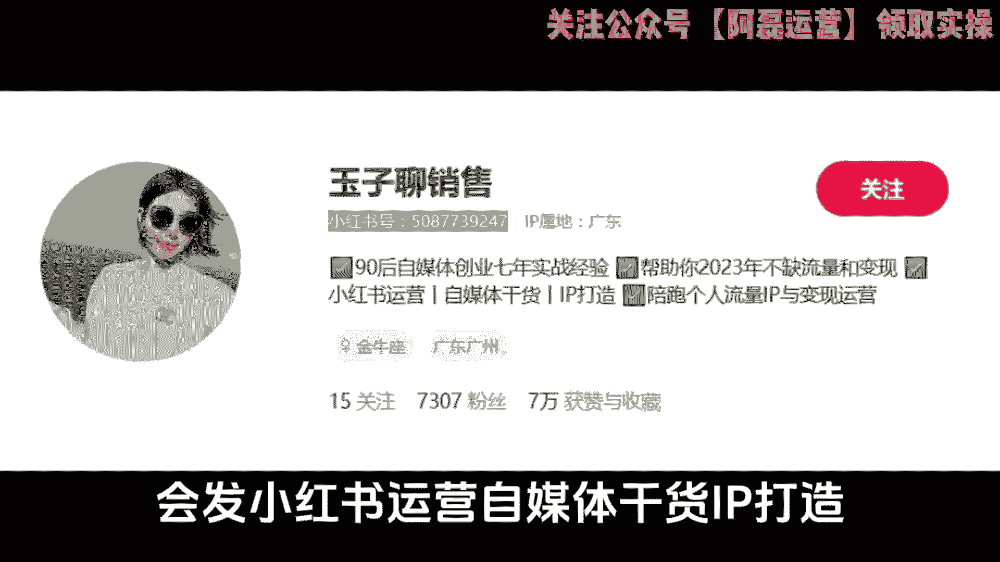

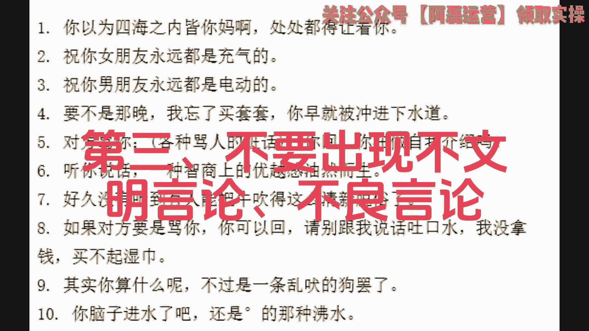

🎼第四，不要过度擦边。第五，不要抄袭大杯的内容，可以在间选题，但不能抄袭内容。第六，可以发泄负能量，但不要宣传负能量。比如你可以说自己心情不好，但不要宣传人就应该抑郁，不抑郁不是正常人这样的观点。

到这里，所有基础工作就做完了。接下来是最重点的部分，如何做出好内容，如何把账号给做起来，做出好内容，做起来，账号总共有5个方面。🎼第一，找到一个稳定的创作模式，进而找到一个稳定的素材来源。比如这个博主。

他的创作模式就是每次做一道新菜分享给大家。植物的做法显然是无穷无尽的，所以他这个模式可以保证长期持续稳定的更新。再比如这个人，你可以看到它的内容就是不同类型的衣服穿搭。

衣服的类型、款式穿搭的方式是年年都不同，无穷无尽的。所以他也可以保证自己源源不断的有输出的内容，每一个领域都有类似的创作模式，稍微研究一下对标账号，你就可以把它搞清楚。如果自己只是有感而发。

或者根据自己的经验，人生经历真是去创作，你写个样视篇，恐怕就没东西写了，所以你必须要找到一个稳定的创作模式和素材的来源，找不到评论去找我，我给你找。第二，内容必须有价值，要么能解决需求痛点。

要么能引起情绪波动。如果别人想做红烧肉，但是不知道怎么做，你教会了他，这就是解决了需求。🎼如果他晚上烧的小红叔手，肚子正在饿着，也给他提供了一个美食视频，这就能引起情绪波动。🎼这二者同时都有。

算是满足底线要求的合格内容，只满足了一条属于低质量的内容，都不满足，那就是毫无价值垃圾内容，没有发出来任何必要，发出来也没什么用。但是即使是两条都满足了合格内容，也不一定有什么流量。自媒体发展到了现在。

大家已经不是比的不是谁能合格了，而谁能考90分。

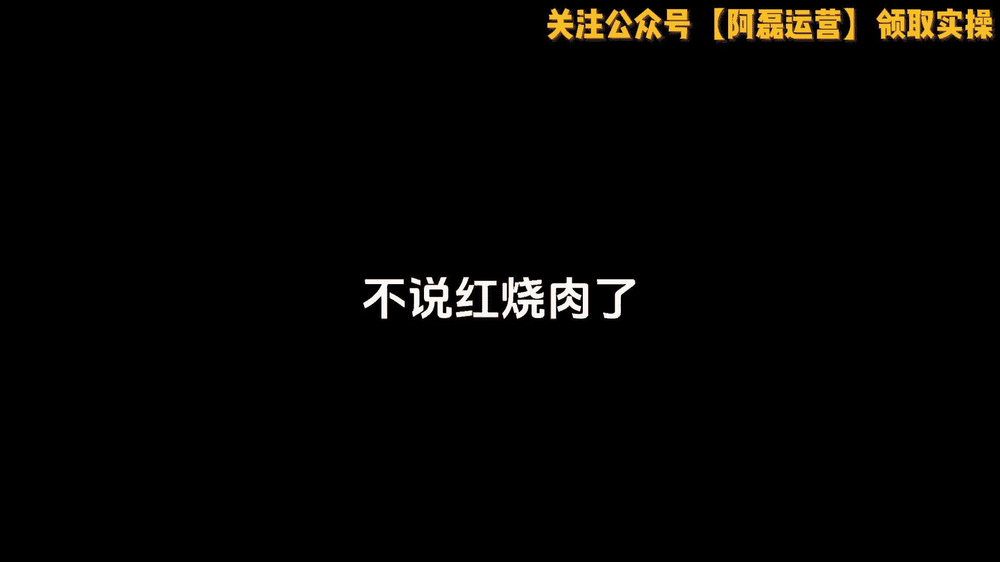

🎼不说红烧肉了，就算你想学黄焖大闸蟹，花式小龙虾，网上都有无限的教程给你看。用户晚上刷到的可能是成千上万个美食视频，根本不差你一个。所以如果你要做满足需求的内容，你必须去讲的比别人更清楚、更全面。

更容易理解，更有帮助。

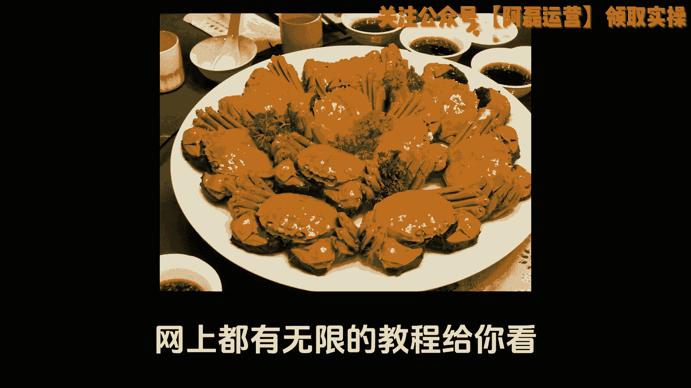

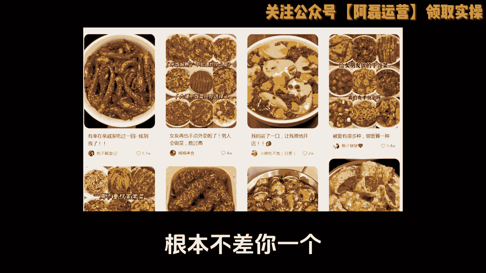

🎼如果你要做让人能情绪共鸣的内容，那你就必须更垂直，更有差异化。曾经你说自己是创业者，就能让人认同，但现在你必须得说自己是大一再度创业。985辍辍学创业有这些标签才可以。

曾经只要你的选题是小白如何从零开始学会创业就可以了。但现在卖创业课的人呢，卷题都是负债如何翻身，求人如何翻身才能引起人的共鸣。🎼在这个内容饱和的年代，情绪价值比内容本身更有价值。别人看见你的选题。

至少要有点进来的欲望，他才会点进来。比如我这边如果叫小红书运营个教程，那就没有什么爽点，也没有什么点进来的欲望。但如果叫做小红书如何从零开始，30天之后阅入5000。

看见之后阅读点击欲望会不会就更强一些。但这并不代表只有情绪价值就可以。🎼如果你的内容只是看着爽，但解决不了人的痛点需求，那他可能只是流量比较高，但你没办法变现收钱。比如张三生病了，你每天更新十0个屌徒。

告诉他，我靠，要开心，要乐观，不要难过，让他哈哈哈哈哈笑完给你点了个赞，转头就给另外一个搞医学科普的人付费了。所以好的内容一定是同时既满足情绪需求和价值需求。而且这里会有一个雷，这里做干货内容的人。

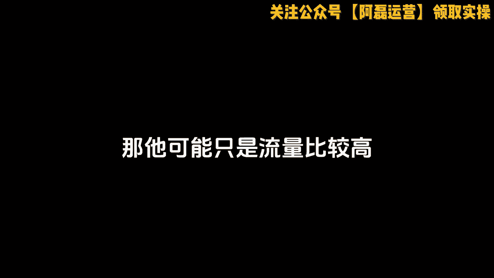

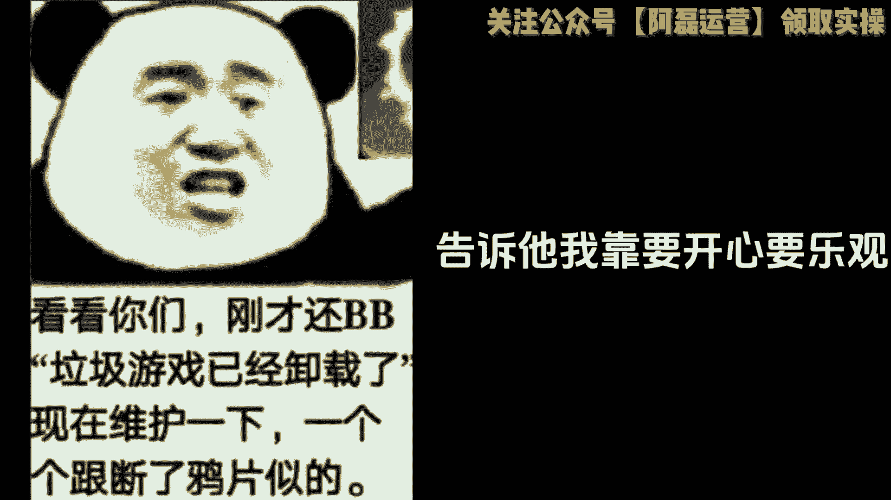

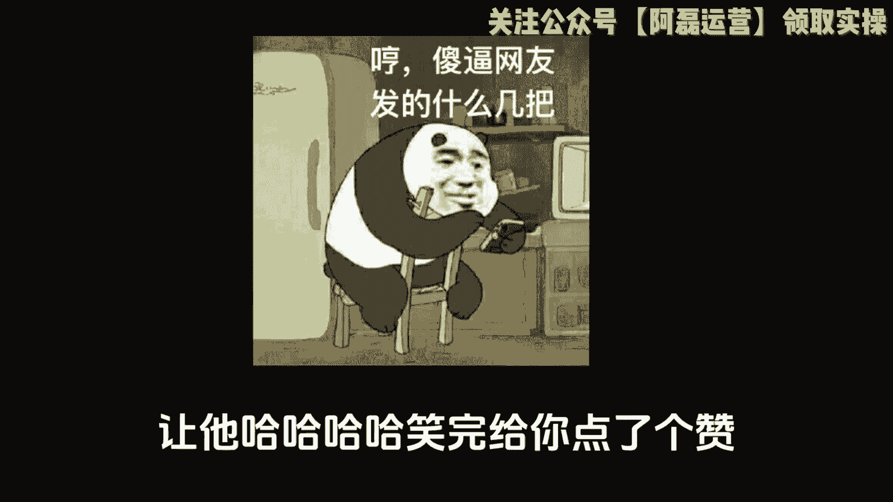

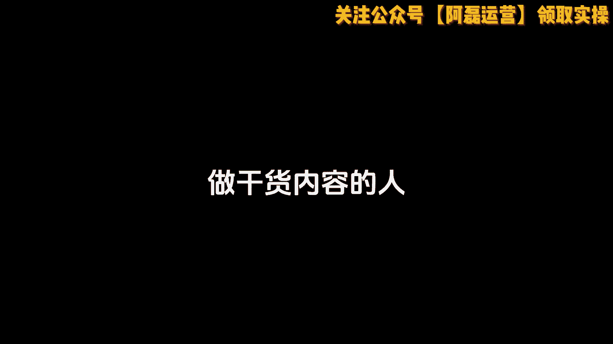

🎼总是以为自己就能解决需求了，但是内容有干货和能解决需求，它不是一个东西。🎼张三生病了，他最想知道是自己怎么治，能不能治好多久能治好有没有后遗症。你讲你为啥得这个病？你得这个病的原理是什么？

人家不关心讲的再专业，再有干货都没有用。所以准确的识别需求是很重要的这是一种网感，你要慢慢培养。如果你翻了一大堆内容，好就是起不来。那八成是因为原因内容不行，要么没有情绪，要么没有价值。

自己回去分析分析原因，如果还是搞不清楚，还是评论去找我，我给你看看。第三个是封面既要引发用户兴趣，又要解决用户问题，内容的情绪价值和痛点价值，全部都要体现在封面上，具体的操作，因为以领域而已。

比如说搞穿搭的照片要有个性，亮眼，而且要养眼，搞美式的图片拍出来有食欲就可以了。搞知识的要展示出最引人注目的观点，让别人能关注到你。如果你灵感迸发，想到了一个天才文案型的封面上，靠着封面。

说不定就能包一个帖子。这个我没有办法通过一个万能公式，去让你百分之百的问题掌握怎么做封面，这是一种感。

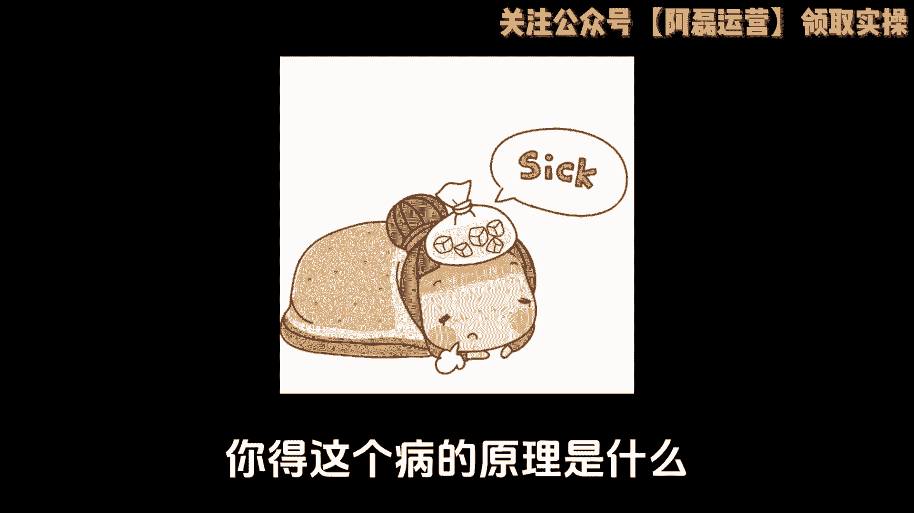

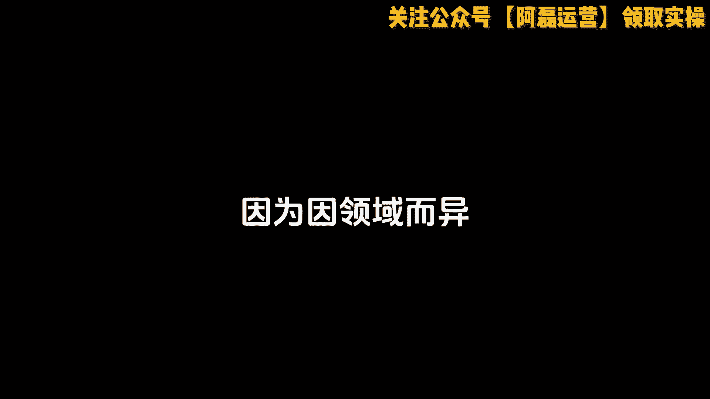

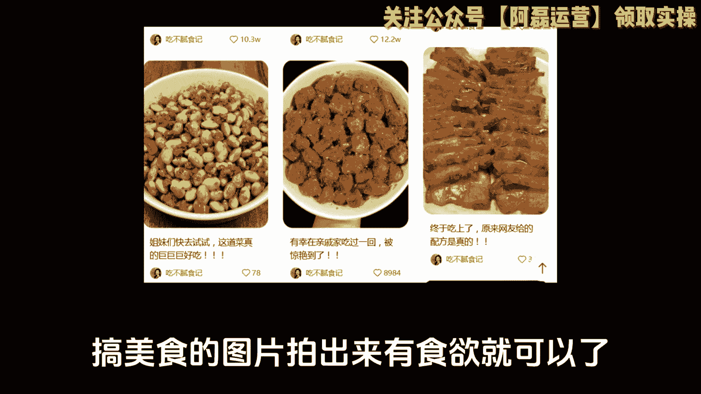

🎼只能多去揣摩统领域个大号，然后自己去试，做的多了自然就会了。如果怎么做都搞不定，还是来找我看看就可以。第四，账号你要做出个人风格，这个牵扯到个人IP的问题，后面我们会详细讲。

这里就是说说白了就是让你懒一点，不要瞎折腾。封面不要乱换，一直用一套模板就可以了。视频的片头音乐不要乱换，一直用一套就行了。说话的风格不要刻意去学别人的，按自己的习惯坚持表达下去就可以了。

比如这个人你看他所有的封面都是一个风格，时间长了，你要记住它了。第五是宁可减少数量，也要保证质量，如果能三天更一片牛逼了，就不要一天更三天垃圾了。但是你要保证更新频率稳定，你不要两个月更一个。

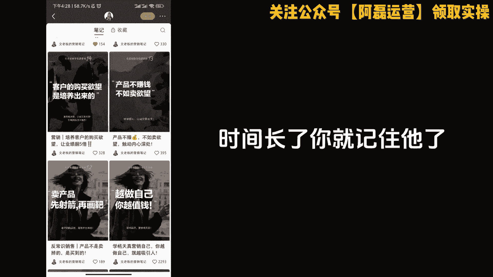

🎼一个月之内一定要更一篇，如果一个月之内没有更新，平台就会觉得你断更了，流量会少很多。🎼到这里，如果今天讲的东西全部都搞定，坚持做下去，铁号绝对不是问题。

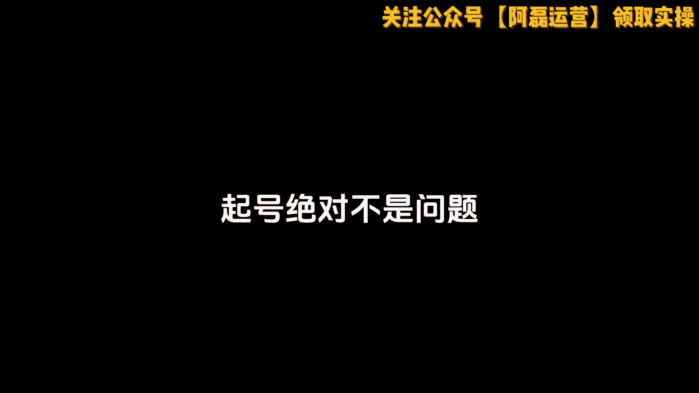

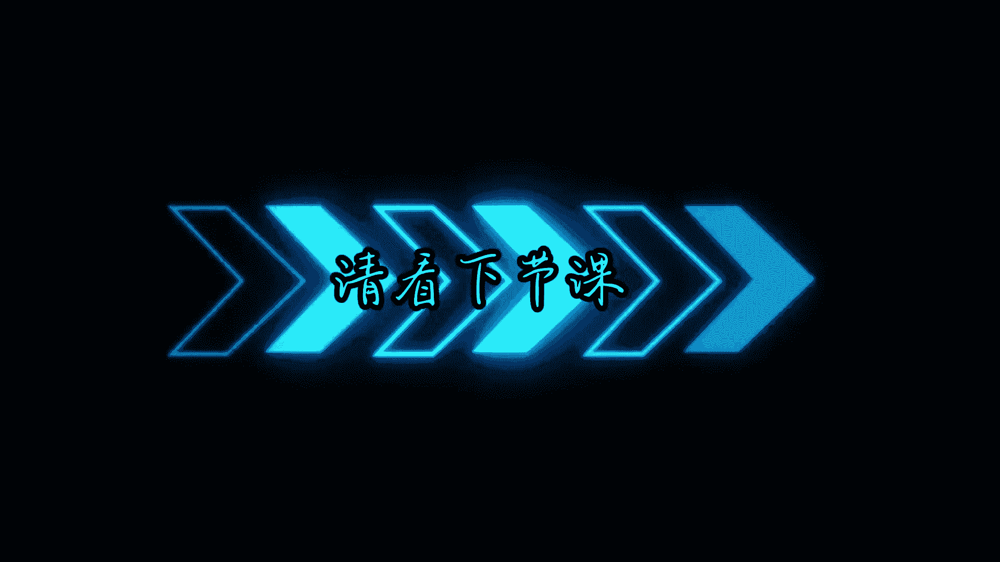