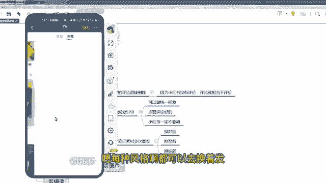

# 【2024版小红书运营教程】全B站最良心的小红书开店流程详解，高阶运营教程合集！小红书体开店，起号真的快，共1000集全是重要知识点，赶快点赞收藏起来！！ - P20：第19课：小红书笔记日常维护【小红书零基础电商运营课~全流程】 - 一盏灯的时间q - BV1eSaMeWEXf

呃，大家好啊，这节课给大家讲小红书笔记的一个日常维护。嗯，那么小红书笔记的日常维护，比如说咱们小红书笔记有一个报了，对不对？包括咱们商品也报了，那么报了之后，咱们一定要对这个报的笔记做一个评论的维护。

什么叫评论的维护，给大家看一下啊。

啊，大家看一下这个笔记啊，这个笔记，你看这个笔记是如果是这是其他的笔记，我拿一个做一个案例啊。你看这么这么多笔，如果笔记报了，它必然有评论，这个评论里面有好有坏。

那么小红书的评论啊嗯小红书的店铺里面的商品是没有评价的，它只有买家秀。

那么小红书的笔记的评论其实就相当于商品的评价啊，大家理解一下，就相当于商品的评价。因为它没有地方去展示，它只有在评论里面。你看。小红书的商品。

这次红是商品啊，它是没有评价的。大家看啊，只有评分，没有评价。

那么所以说顾客对这个宝贝去做评价，一般是做的是评论，在这个评论里面其实相当于评价了。所以这个很重要。但是有一个好处就评论咱们可以删除啊。如果是是哪个喷子，那互联网林子大了，什么鸟都有这个喷子呃。

他没买咱们东西，他还说咱们东西贵，或者说说咱们东西不好。那么这个时候你不得把它删除了，删完之后，这个评论可以直接点击有一个删除。那个我这个因为这个不是我的，所以说我是删除不了的。一般如果是自己的话。

直接点击不动，会直接删除。

那么删除完之后，你还可以把这个用户拉黑，所以让它评论不了，这些都是可以的啊。那么对于一些比较好的嗯啊，这是一个评价的维护。还有一个评论的引导。比如说哎在咱们笔记报的时候，评论不多的时候。

咱们可以稍微引导一下。比如说哎你拿一个小号说怎么购买。然后你的主账号说哎，视频左下角你做一个互动，能让下面的用户也会给你做一个互动，或者做一个引导去购物。那么这样会增加你的转化率，还有互动率。

这个也是非常重要的。大家注记注意一下啊，就是做评论区的引导。那么比如说有一些顾客哎评论咱们的咱们的衣服哎比较不错。然后是哎嗯挺好看的，怎么着了，就是夸咱们的一el一些评论，那么这个时候你可以把评论。

如果你有几个小号的话，可以做一个点赞评论，但是一定不要刷，大家记好了啊。

呃，小红书不管是笔记的评论还是点赞，一定啊一定不要刷。因为你会把标签刷乱掉。它本来报的好好的，你一刷，然后不报了，这种情况是有的啊。小红书没必要是假数据，不需要刷单，不需要刷评论，不需要刷点赞。

不需要刷粉丝量都不需要完全是靠咱们发笔记，真实的去走流量就可以了。这样是账号是最稳定，而且是最容易爆单的啊。那么比如说是咱们发了很多条笔记，然后有一条笔记突然之间爆了啊，爆的不错，商品也卖的还可以。

那么这个时候咱们这条笔记。一定要多次重发，因为这条笔记爆了，必然有爆的这个因素在，可能是视频比较好，也可能封面比较好，也可能这个款这个笔记对应着这个款本身是个爆款都有可能。那不管怎么着。

咱们一定要围绕这个款会围绕这个素材重复的多发，重复的多发。就是你们会发现啊，就是有些店啊，它可能就几个商品，特别做水果的，或者做食品的全店就这个商品一直发，一直发几百条，一直发到这个款不卖为止。

这就是说小红书的魅力所在啊。就咱们通过之前的一些呃挺每天去发布笔记去测款，测出来哪个款，哪个笔记好了，针对这个笔记一直发啊，针对笔记一直发。那么后面其实。啊，后面其实就比较轻松了啊啊。

那么如果素材重复发的情况下，咱们就是换换封面，对不对？啊，比如说第一次是这个封面，咱们再换一个封面看会不会更好。那么换换标题，对吧？咱们有这么多钩子的标题。之前跟大家讲了。

就换换每每一种钩子标题去换一换啊啊，第三种是做混剪，你看咱们如果是混剪的话，啊，那么开始是呃开头和结尾是这个素材，那么咱们再换一个开头结尾，看能不能会更好，对不对？多次去发，那么它报的概率会更大啊。

还是继续给大家展示个案例啊，你看这个账户啊，他卖的紫薯，你看威尔这个紫薯他发了多少条，一条，你看又是紫薯，又是紫薯。

啊，就是同样一个商品，它会一直发，你看又是字数，它就换一换封面啊，其实内容大差不差的啊，内容大差不差，就是换了一个封面啊，你看啊。

嗯嗯。每种风格啊都可以去换着发欢迎发。但产品其实就一个。

