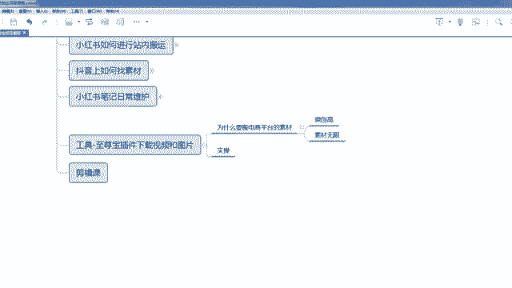
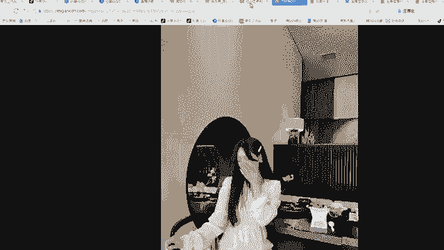

# 【2024版小红书运营教程】全B站最良心的小红书开店流程详解，高阶运营教程合集！小红书体开店，起号真的快，共1000集全是重要知识点，赶快点赞收藏起来！！ - P21：第20课：工具-至尊宝插件下载视频和图片【小红书零基础电商运营课~全流程】 - 一盏灯的时间q - BV1eSaMeWEXf

嗯，大家好啊，这节课给大家实操一下啊，就咱们一个工具，非常重要的一个工具，就是至尊宝插件。那么咱们用这个工具干嘛？就下载第三方电商平台的一些视频和图片，还有买家秀啊，所以这个工具非常实用的啊。

那么咱们至尊宝这个插件，咱们怎么去找百度搜索至尊宝浏览器插件下载，一般是第一个。如果如果这个链接不知道的话，咱们也可以在咱们这个学员的资料里面啊啊去找找不到，就是问老师去要都是可以的啊。咱们点击啊。

点击这个里面，咱们就是我一般建议大家是用那个360浏览器极速浏览器啊，虽然360极速浏览器是比较好用的啊。啊，那咱们去选好对应的浏览器，然后点击下载就可以了。下载完之后，它会直接在这里这个里面啊。

我们点击，然后打开。啊，打开完之后它会在这个地方，然后就有个添加，添加完之后它会在这个地方啊，会有会有个至尊宝这个头像，那说明是安装已经成功了。咱们去我拿淘宝为例吧，多多一样，拿淘宝为例，打开淘宝网啊。

打开之后，咱们搜索一个连衣裙啊，那么这个里面有很多个款，你不管用什么形式，反正反正搜到这么个。比比如说咱们是要的这个款啊。然后这个款咱我们点击完之后啊，有个至尊宝啊。

这就是至尊宝的一个工具插件的一个工具栏啊啊，如果咱们需要保存这个产品，这个裙子啊，这个裙子的一个呃主图视频，怎么觉得哎主图视频不错，我要发布成笔记，我要做文剪啊，那个那么这边是一个下载手机端主图视频。

对吧？这边是不是有那么如果咱们要下载这个这个产品的一个评价，哎，这个产品还没有评价啊，那咱们换一个啊，换个有评价的啊。嗯。啊，这个是有评价的啊啊，这个也有视频啊。如果你想下载视频，直接下下载这个。

如果你想下载评论买家秀，也直接下载这个呃，先跟大家讲一下啊，为什么咱们要搬电商平台的素材啊，因为电商平台的素材第一个原创高，原创度高，特别是买家秀。像小红书里面啊，其实你呃。给大家讲一下。

其实像这种这种叫商业片，这种叫商业片，就是我拍的特别好，每一张都可以当成一个杂志。其实这种片在小红书里面不吃香，小红书是一个分享种草平台。他就喜欢那种呃我自己是一个店主，或者我自己是一个使用者。

我自己的也是自拍照，一种一种够我自己的一种使用的一种分享，这种才是才是在小红书里面，用户喜欢的一种呃喜欢一种那个展现方式，呃，并不是这种大空的距离感很远的这种商业片。所以小红书里面非常喜欢买家秀，嗯。

大家听好，非常喜欢买家秀，包括买家秀里面是不是也有图片？那么这些图片是不是大家也可以搬过来，我直接发到小红书里面。所以我建议大家啊就是第一个原创度高，原程度高就代表你看之前在抖音里面。

其实是这些笔记咱们要混剪好一点，要不然会可能会出现一些搬运的行为啊，到时候判笔记搬运了，会下架会删除。像像这种买家秀是非常不容易被投诉，知道吧？因为太多了啊，它相当于一个无限素材。

你可以源源不断的在这里面找各种各样的素材。那么用到的工具就是那个至尊宝，那么至尊宝咱们下载啊，咱们可以一键下载评论买家秀点击这个就可以了啊，而且而且非常非常的多。大家看一下啊，非常多。

你可呃你你你们一定要挑选一些拍的好的啊，你像。

嗯，你像这类的啊。看一下啊。嗯，他默认是全部选中，咱不要全部选中啊，咱们只选一些好的，不好的，咱们都不要了啊。嗯，把权限关了啊。啊，咱们咱们剪鼠标移移过去啊，移过去之后它会自动放大。你们看一下哎。

怎么话呢是不是图片品质感很高啊，对不对？

啊，特别品质感很高的啊，点击一下。啊，对对对，每一张图片都还可以。那这个是不是咱们可以啊，那选中。嗯，选中。那么第一个就是嗯啊有点卡啊，因为因为这个素材太多了，有点卡。啊，你看第一个其实也可以。

第三个一般般啊，你看你看第四个呃其实都不太好了，不太好。第五个还可以嗯，第六个也可以。第七个你看不知道拍的啥，也咱们也不选。然后是我大概举几个例子，因为太卡了啊，那这才选中完之后。

咱们是不是可以批量下载，对不对？批量下载。啊，下载完之后，咱们下载并打开啊。啊，打开咱们这，你看啊每一个颜色啊，你选的每一个，你看这个图片都有啊，都挺好的。啊，包括它如果里面有视频，视频也可以下载下来。

包括它里面的评价都有啊，这评价咱们完全可以拿这个评价当成咱们买家秀的一个文案，是不是更好？因为他们有时候评价都非常真实啊，像淘宝里面评价有些都有很多都比较真实。包括呢多多也是一样的啊。

那么咱们这样操作下来是不是素材就很多了呀。