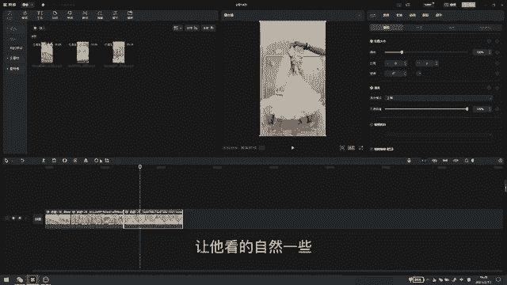

# 【2024版小红书运营教程】全B站最良心的小红书开店流程详解，高阶运营教程合集！小红书体开店，起号真的快，共1000集全是重要知识点，赶快点赞收藏起来！！ - P23：第22课：工具篇：电脑剪影混剪【小红书零基础电商运营课~全流程】 - 一盏灯的时间q - BV1eSaMeWEXf

大家好，今天就给大家说一下，就是简单的简单的说一下，就剪映啊，就是咱们混剪的时候都需要用到哪些功能啊，在剪映上。一般啊咱们混剪的时候都是都会使用剪映啊，不会不会去使用其他的工具啊，剪映还是比较简单的啊。

这是三段素材啊，咱们去先去找到素材的时候，可以通过手机啊或者微信啊，保存到咱们电脑桌面，然后点击这个导入啊，把素材把素材导入到导入到自己的呃就是电脑上啊。

这就相当于咱们的素材找来素材他现在是没有没有进行的一个混剪或者剪辑的一个状态啊。咱们先把它的原声给它关闭。这里有一个关闭原声啊，可以直接给它进行一个关闭了。然后播放的时候，它就没有声音了啊。

这相当于没有声音。咱们怎么进行一个剪辑呢。

一般的情况呃，咱们可以找1至1至3段视频啊，都先把它给拉下来，进行一个进行一个就是。呃，混检嘛进行一个混点。咱们第一段视频，咱们看一下。一般都是运用呃剪辑的时候都是掐头去尾，就是要么要么就是留开头。

要么就是运用就是留它的后面嘛，或者是使用中间啊。咱们看一下它的开头啊，它的开头还可以啊，可以跟第二段视频给结合起来，咱们就把它的开头。给留下啊，就是直接拖拽就行，把它开头给留下。然后后面这个视频啊。

咱们也可以去看一下。啊，咱们后面视频咱们也可以把它中间。中间这段。啊。咱们有开头了，就把中间这段给它留下来。就是衣服展示嘛，然后再把再拿下来一段视频。啊，他这个也是展示的啊，咱们也也留留中间这一段。

把它放到中间。可以就开始的时候可以就先随便拖拽一下，看它自然不自然。看你找的这几个素材，就这个品，它自然不自然啊，然后播放一下，就看它自然不自然。啊，如果如果看着还可以的情况下啊。

咱们再做一些其他的进行的一个修改啊。都是细微的改动啊，稍微可以看一下。看着还可以还可以的话，咱们就可以再给它进行。它这种合成的素，它有时候会时间就是比较长嘛。咱们点点击第一段啊。

在右右上边它有一个变速啊，咱们可以调调整一下。调整一下它的素材的时间啊，可以都给它调成1。2倍。然后这里还可以调调整它的音频了，还有画面了，这里都可以在这里调啊。还有就是你看中间这一段它是展示。

他是拿着衣服进行了一个展示啊，咱们可以给它。给他加一个镜像啊。就是进行一个修改，让他本来让让他本来跟那个呃就是跟原来的视频就是不一样嘛。然后咱们现在修改完之后，咱们再看一下啊，让他看看一下。

就是稍微看一下，看它自然不自然啊。这后一段是在这边，咱们也给他加一个镜像。让它看的自然一些。然后现在咱们给它添加一个音乐啊，直接点音频这里。

🎼Yeah。可以随便找一个音乐给它添加上。啊，但是这这还是看自己喜好啊，看自己看肯定是找比较好听的啊。然后音听涯音乐的时候，记得把这里。剪辑一下，给他对齐，剪辑一下，然后拉一下他的时长啊，这些。

可以看一下拉下它的时长。🎼哟原乐在苦咖啡，然后陈皮炊夜难棉被，我一个人煮咖啡，想落地。就相当于一个基础啊，一个基础的视频就已经做好了。然后咱们可以给他这个视频的封面了，或者是中间了加一些文字啊。

或者是贴纸，直接在这上面都可以看到啊。特效一般咱们不添加啊。然后它中间转场的时候，它就是有些转场有可能过度不自然啊，咱们可以给它加一个转场嗯。

可以给他随便加一个转场。然后在后面。

让他就是看起来更自然一些。🎼哟原来在苦咖啡，然后沉迷彻夜难棉被我一个人煮咖啡。然后这就相当于一个完整的一个视频。就相当于做好了，其实咱们也没有做了什么东西，就是进行了一个掐头去尾了。

还有就是进行一个换了一个音乐啊嗯其实。咱们没必要就是把把剪映，把这些东西就是搞得特别就是特别的专业啊。因为小红书它是一个种草平台，你搞得越专业的话，他就感觉那个视频不是特别的真实。

咱就呃可以就进行一些细微的修改啊，就做出来一个就是原创的视频，它跟原来的视频是有差别的啊，就可以呃，或者是比如你说把它的时长拉长进行一个抽帧了，或者什么都可以进行一个修改啊。

剪映使用起来还是比较简单一些的。

