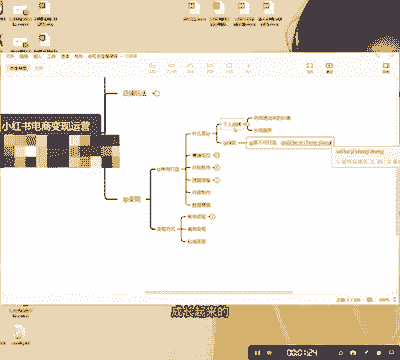
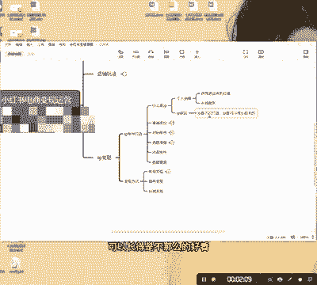
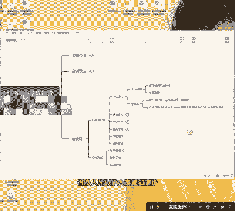
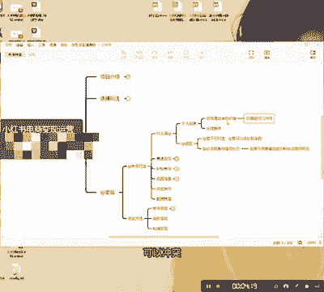
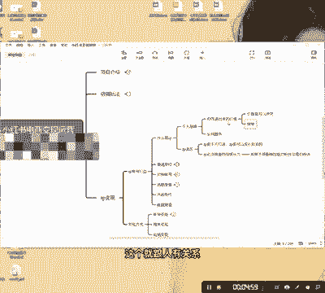

# 【2024版小红书运营教程】全B站最良心的小红书开店流程详解，高阶运营教程合集！小红书体开店，起号真的快，共1000集全是重要知识点，赶快点赞收藏起来！！ - P25：第24课：什么是IP？【小红书零基础电商运营课~全流程】 - 一盏灯的时间q - BV1eSaMeWEXf

大家好，今天给大家分享一下，就是咱们这个IP的一个变现的一个课程啊。好，首先我说一下，就是关于咱们小红书，它其实变现的流程非常多，它的变现方式特别多。像我们目前啊目前一个就是什么呢？

一个就是店铺的一个变现就是传统的电商变现。我们开店。第二种就是什么呢？啊，IP的一个变现。其实大家对IP这个这个已经是老生常谈的一个东西啊，它并不陌生啊好，这是第二个。第三个就是IP里面呢。

它还有商务变现跟思域变现啊，这两个也是独立出来的变现。还有就是IP的，我们所说的IP变现更多的是指账号本身的它一个变现啊。好，今天的话呢，我们后面的几节课都是针对于这个IP打造。

好，今天的话呢第一节课呢就是我先给大家就是分享一下是就是什么是IP很多人就是对IP是有一个什么呢？IP误区的啊，IP误区。

什么叫IP误区呢？就是IP是不可打造的。很多人就是说素人打造IP其实那是那是都是什么呢？那是那都是甜蜜的谎言啊，就是让你们相信而已。但是IP。

是可以。成长起来的。

就是IP不可打造，I但IP是可以成长起来的，就是也有一些姑娘就是长得比较漂亮的模特，她她跟我说，石头哥能不能帮我去啊，我我我觉得我我这样的，我看我有个小姐妹啊，她做服装搭配，她做的挺好的。然后呢。

我觉得她身材跟我差不多，脸蛋还没有漂亮。但是呢我也想做一下，但是我我做了一段时间就是做不好。我说我问人家是学什么专业的，她说人家是做了好几好几年的服装生意，我说你呢她说我一直做模特哦，看到没有？

就是IP她是不可打造的。其实IP跟本真的外在条件，其实关系没有那么的大大，你们可以去看一下IP啊，就是讲女装的可以长得是不那么的好看，身材也可以不是那么好，但是有一点她足够专业，她足够专业。

就像那个有一个叫什么杨天真啊，杨天真，她做大妈女装的，你们可以去看看啊，你们可以去看看她她她她是什么？就是这种做女装的也是可以的啊。

当然他这个IP比较比较比较比较宽啊比较宽。好，这是其中1个1个IP的一个误区。但是IP是可以成长起来的。好。

第二个是什么呢？IP必须具。

具备。持续成长力。

为什么呢？为什么呢？兄弟们，就是你们一定要想明白一件事儿，就是如果你想一下有没有粉丝是绝对的忠诚，没有没有大家都没有忠诚度，大家都是什么呢？啊，芸芸众生皆为利来，芸芸众生皆为利往啊，就是他关注你。

他是想得到某样东西夺取某样东西，不管是知识也好，还是一个概念也好，明白吧？所以你必须具备的成长力，不然的话就是会什么呢？啊，粉丝就会离你而去。如果如果不具备。

啊，输出能力。

粉丝会离你而去。

知道吧？这个是很重要的。很多人所以IP大家都知道IP它是一个什么呢？它是对目前而言，IP是变现价值最大最大的一个板块。但是IP它相对来说它也是比较难的。这个是个人IP啊，个人IP啊。同弟们？好。

这是第一个。第二个是什么呢？

个人IP也就相当于个人品牌，它跟两个点比较关比较重要。第一个是你输出来的价值，你的价值观好，很多人说，那我能不能做一个非常大IP，我就吸引所有的女生来看我的这个服装搭配不可能兄弟不可能啊。

你们一定要明白啊，就是你输出的价值观可以冲突。

可以冲突。你可以说，比如说你做服装搭配，你说胖就是罪恶。你可以说出这么让人很难以接受的话，但是你反观你又可以吸引那些特别特别瘦，很认同你的观点的人就是你的观点可以发生极大的冲突。

但是你吸引的人就会更精准。所以大家做服做IP一定要做窄啊，做窄。

做窄啊不做宽，一定不要做宽。因为什么呢？你只有在一个点打的足够深的时候，你才能够去慢慢的去做宽，这个就跟人有关系。好，还是第二。第二点是什么呢？哎个人品牌不具备生活化。

不具备不具备具备生活化的是偶像啊，比如说啊老呃胡歌开了那个mini也能成为热点，为什么呢？因为它是偶像，它不是品牌啊，它是比品牌更加高级一点的啊，所以。

但是。而且是那种信息，生活化的信息是不具备吸引力的。比如说啊你知道胡哥买了个min你开mini，你会去买个那个mini吗？你不可能对不对？你不可能啊，你你一个身价千万的老板。

你不可能去你不可能去买个8万块钱的车，还是敞篷的，对不对？是吧？这很难啊，这很难，所以大家一定要有足够高的认知。你所以很多人说啊，那IP天天可以发一些生活化的东西吗？兄弟。

千万别千万别你这样做就会把自己的IP给做死了啊，没有人对你的生活感兴趣。你就想一点，他们都是为了索取而来。

粉丝都是为了。

夺取而来。当你们对他没有任何价值的后，他他们就离你而去。好，第三个是长线服务。你一定要给你的粉丝有一定的长线服务。我打个比方，如果说我说我这个所有的项目都是免费的，我不给我付费，我不做付费。

我不给我粉丝做服务OK那也没有人会关注我，就就同样的一个意思啊，希望大家能理解啊，这个就是一个IP的一个基础概念。

好，这一课讲到这里。