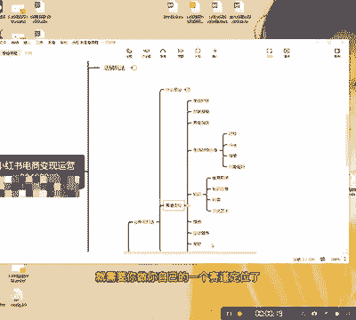
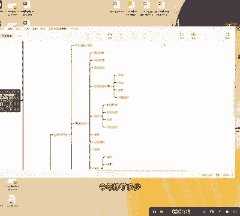
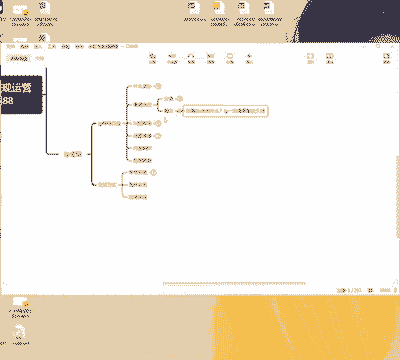
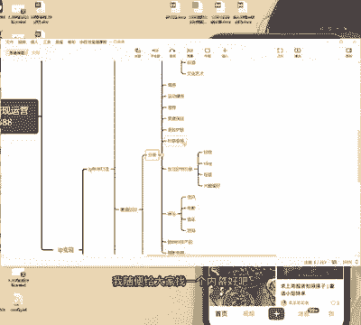
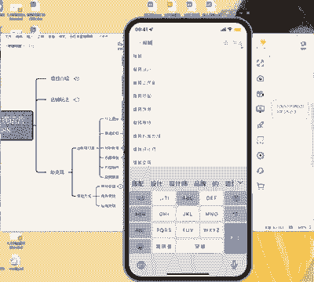
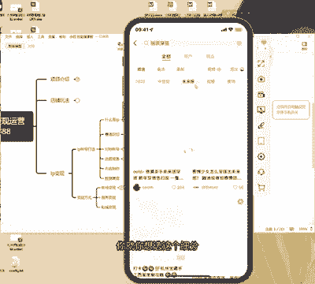
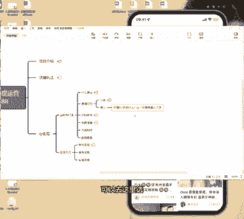
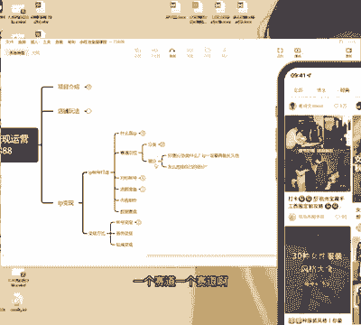

# 【2024版小红书运营教程】全B站最良心的小红书开店流程详解，高阶运营教程合集！小红书体开店，起号真的快，共1000集全是重要知识点，赶快点赞收藏起来！！ - P26：第25课：如何确定赛道找细分领域？【小红书零基础电商运营课~全流程】 - 一盏灯的时间q - BV1eSaMeWEXf

大家好，今天给大家分享就是咱们IP的第二节，就是这个赛道定位啊。赛道定位。好，我们确定了。比如说你觉得你在一个地领域，你有你自己所擅长的东西。好，那么这里呢就需要你做你自己的一个赛道定位了。

啊，好，赛道定位的话呢，产品这个板块呢其实有很多的啊类目准确来说也是类目的啊。好，目前的话呢我给大家总结了一个是美妆护肤、时装穿搭，还有美食探店生活好物类分享。然后还有一个知识类的。

像我们做的这种就叫知识类的分享，对不对？知识类分享，还有就是教育职场，或者说说知识分享，我们可能就是算是知识分享。然后第三个是情感运动健身宠物娱乐啊，粉丝就是数码，还有剪就是摄影剪辑。

这个东西看我跟你讲IP最重要的是什么？你得喜欢做这种事。比如说我我就比较享受，我就比较享受啊，我比较享受什么呢？我比较享受我自己讲课，我比较讲享受别人听我讲课，我比较享因为我讲了我讲了快十年的课了。

虽然我不是说呃受过那种职业的那种讲师培训。但是我比较享受别人喊我老师，我觉得我能够给你带遇价值，我也比较享受很多学员给我反馈啊，今年占了多少能。

啊，一年挣了多少钱，我我这个我是非常享受这个过程的。所以。前提是你得热爱你有了热爱，你才知道你才有足够的驱动力去把这个事儿做长久。好吧。好，今天的话呢就简单的跟大家说一下。

就是关于这个咱们的一个赛道的一个定位定位。首先第一个啊关于定位啊赛道的一个定位啊，定位一个就是什么呢？等一下，我先把这个东西给。一个是这个赛道的一个分类啊分类。好，一个是赛道的一个分类。

一个是第二个是什么呢？一定要细分一个赛赛道的一个细分。我们我们注意啊，就是我们在这里面其实这些赛道我跟你们讲啊，其实都可以做。你们可以在小红书你们自己去搜啊，特别特别多。好，首先你要区分好。

你关于你这个赛道这个你热爱什么，你自己你擅长或者是。或者是热爱。因为IP一定要。具备长久性，你不能说你更了，你更了一个月，你又不更了，你断更了，千万别千万别兄弟，千万别好，我给你们看看我们自己的。

我给你们看看我我我自己的。或者我给你们看看啊，我给你们看看，等一下，我先远程一下手机。그 응。哎。

好，呃，来同志们，你们看一下呃，IP是什么呢？我打个比方，我这个现在已经呃其实也不算IP啊，但是也能算我这个IP你们看一下，就就发了这么点东西，就发了这么点东西，我我无非就是把抖音上的东西全搬过来啊。

文字不动的搬过来啊，看这个流量其实也不高吧，对不对？看这个流量也不高吧，这个这个1600，其实我之前做了一个号啊，流量特别高，但是被封了啊，被封了，因为不懂小红通的规则啊，被封了啊。

我这个账号目前也快变了有两三万块钱了吧，两三万块钱了啊，知识付费类边。为什么呢？我自己热爱这个东西，我自己热爱这个东西，就就很简单，我喜欢就做这样的东西，仅此而已，知道吧？

所以所以大家一定要知道自己喜欢什么啊，好，这是其啊IP一定要具备长久性。第二个我随便给大家用我随便给大家找一个类目，好吧，我们就找时装穿搭好吧，服装穿搭，服装穿搭好第二个，比如说你是个女。😊。

女孩子啊，我建议小红书上小红书对女孩子会比较友好。兄弟们对女孩子超级友好。服装。

穿大好。我们可以看一下服装穿搭。好，第一个呢，你看它有一一共有922万条笔记是这样的。然后你们看一下，这下面这下面就是什么呢？它的延伸词，它很多延伸词，看到没有？它很多延伸词啊，你们都可以去点开看。

如果说你们自己在下面找可以下面找，然后呢，注意OK这里有了，看到没有？这里就是什么呢？下面这一下面这一栏，就是你的方向，比如说你想OK你就你想选这个细分。好，你就以后你在这里面去看明白吗？

这里就是让你们选细分的一个方法，你们在这里面一定要选IP细分的一个领域啊，就是怎么选细分。

是。大家可以去这里选啊可以去这里选，你们可以在这里面选择你们的细分。你看很多啊很多啊，你可以找一个细分领域不断的去尝试。那比如说这个博主，这个博主是什么意思，就是教你怎么做服装穿搭，明白吧？

教你怎么做服装参的。比如说你自己身材比较好，或者说你自己OK有这个啊做服装，就是你自己特别会做的话呢，你可以在这里面一直拍啊，根据他这种模型，你自己找找找点对标一直拍，基本上就可以了啊。

就是找教你们如何去找对标啊，一个赛道一个赛道啊赛道定位，你们确定好自己的定位之后呢，再找细分啊，好。

