# 【2024版小红书运营教程】全B站最良心的小红书开店流程详解，高阶运营教程合集！小红书体开店，起号真的快，共1000集全是重要知识点，赶快点赞收藏起来！！ - P27：第26课：对标账号精细化运营【小红书零基础电商运营课~全流程】 - 一盏灯的时间q - BV1eSaMeWEXf

大家好，今天是给大家分享咱们就是IP打造课的第三课，就是对标账号。这个很重要啊，我们都知道我们都知道就是什么呢？有有一句话叫什么呢？就是账号就是账号IP。账号。就是我们都听说过一句话，账号不是做出来的。

超出来的对不对？是抄出来的。是超出来的。抄出来的对不对？好，我跟你讲啊，这句话有一半是对的，就是账号它是不是做出来，确实不是做出来的，是需要什么呢？你一定要抄会抄会微原创，但是你纯抄，那你不行。

纯抄就不行。兄弟们，你们要懂得去怎么呢？柔和柔和，就是就是查缺不漏。就是你们一定要在你们自己的领域里，你们知道这个IP它做的账号哪里，你觉得有一丢丢的缺陷的。明白吧？然后呢。

你自己一定要去用自己独特的眼光去找好，这个是啊查缺不漏。那么这里的话呢。我先说一下账对标账号怎么找啊。第一个你先找出20个对标，20个对标，然后把人物特点、文案结构、笔记选题。

还有封面、拍摄风格全部给他，所有东西全部给他一一去做笔录，一一去做对标，一一去做对标。好，我们这里嗯还是以我自己擅长的吧。我我我我打个比方，我给你们看看那个我给你们看看，先看看我们自己的这个账号，好吧。

我们自己的小红书账号啊。第一个就是什么呢？比如说我这个选题就很简单，我这个选题就是教大家做小红书。然后呢，注意啊，我教大家小红书是从什么时候是用什么点子开始圈入，是用无货源的点，无货源的点。

这就刚开始就是跟大家说的无货源点，就是刚开始起步的时候啊，刚开始的起步的时候，就用一个小的选题去切，然后慢慢的把话题切宽切宽宽泛一点啊。因为这个需求会一直慢慢变大。如果你一直做很窄的类幕的话。

你会把账号做死的。因为没有一个很窄的类目里没有那么多话题切，没有那么多内容输出好。

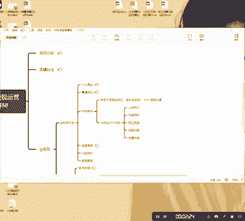

我就给大家以服装为例，好吧，服装为例，比如说服装搭配好吧，服装搭配好，呃，大家如果说你们看一下，如果说这就细分，比如说我们要做一个服装博主啊，如果说我们要做一个服装博主。首先我们点击博主。好，点击什么？

点击博主之后，第一个点击最热啊，点击最热，我们直接点击最热好，在下面直接找啊，找出这种你你看得上面，觉得你适合的你喜欢的这种好，这是其中第一个就是然后呢你分别点个视频，点一下这个视频啊。

点一下最热点一个视频，点个视频，你再找找。然后再点图文，在这里面你再找找，就是在这里面你们一定要找出20个对标，最少最少找出20个对标。为什么找20个对标呢？兄弟们我都说了，做IP。

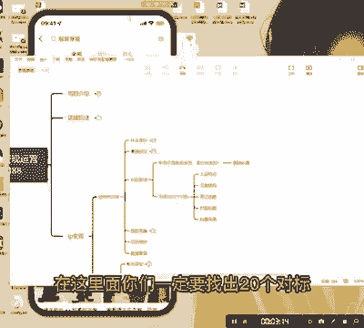

IP先学习。你们一定要。抽出最少啊1到2个月的。实践学习基本功。什么叫基本功能？我打个比方，我讲课，讲课也是要基本功能，也是需要知识面宽，我必须要把整个平台摸清楚。然后账号摸清楚。好，我跟你讲。

我们是做了一我们是做了一些就是最简单最简单的这个这个服装搭配的，最最简单最简单的一些服装搭配。后面的话我会给大家分享，就是我们做服装搭配的一些账号啊，因为现在粉丝还不多。

目前呃最好的一个账号就是目前最好接广告啊，接广告，就是接广告最好的，有一个账号就是一天现在能接啊三件广告吧，三四件左右，但是已经拍不过来了啊。啊，但是所以我们有一些号，我们直接拿出来拿出来是做置换的。

这种的就很简单的，这种就你他们商家的衣服给你嘛，你直接拍了就行嘛。好，但是你也不是什么衣服都接，你要去注意一下，你有一些风格。好吧。好，因为我后面我会打造呃，我因为因为我为什么做这个服装搭配呢？因为因。

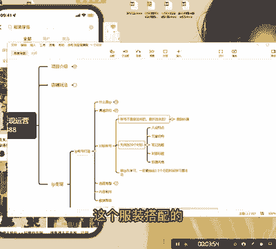

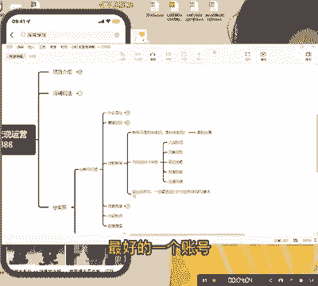

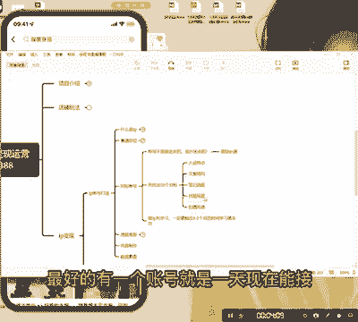

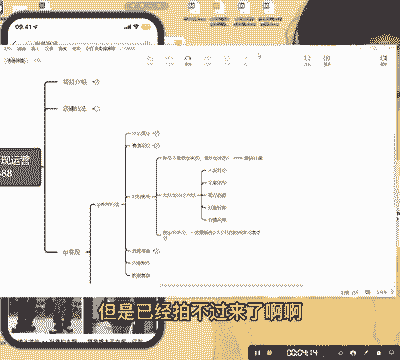

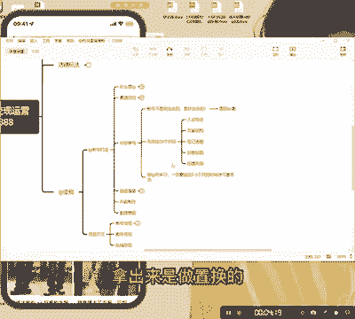

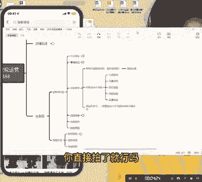

那我后面会打造一些就是什么呢？就是啊知识付萃的，就是就是这个这个博主啊，我我因为我我后面还要就是培养一些老师来做这个博主，然后导流导流做思域去做变现的。啊。好，大家都懂的这个东西嗯嗯。好，我继续讲啊。

就是首先我们要搞清楚，就是比如说一个人人设特点。我我是我先给大家讲个案例啊，做个案例啊。第一个嗯我们随便点开一个。好吧，随便点开一下。首先我们看一下人设特点。好，我们就知道他是什么人设。

首先好他的人设就在这儿啊，兄弟们，它的人设就在这儿，人设一般在哪里呢？兄弟们一般就在就是主页介绍，主页介绍，第一个是主页介绍，你看资深服装设计师，这就他是人设，明白吗？

然后啊然后你们可以看一下它的封面基本上就是什么呢？设计的衣服服装设计的，对不对？好，你看一下它这种就可能变现方式就比较多了，变现方式它可能就是哎有没有想学习来跟我学习做那个服装设计的，明白吧？啊。

就很正常的啊啊，这种就是一个人设特点。第二个就是文案结构，我们随便点开一个，我们随便点开一个，好吧，我们随便点开，就这个吧。

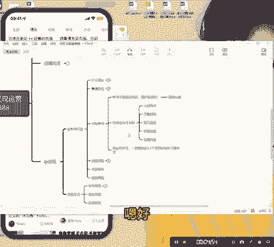

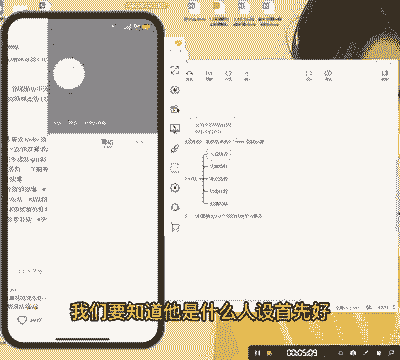

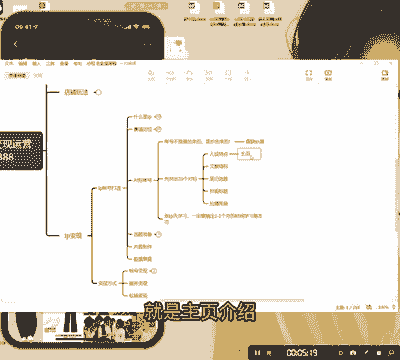

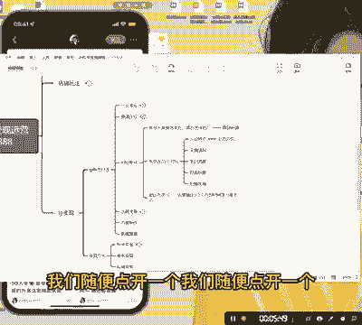

文案特点就是文案结构。你们看一下，这就是文案，它就是文案。文案。第一个产品就是就是这个啊这个这个标题分标题跟这个文案，然后这个就是什么呢？这个是话题。明白吧？话题这三个你们自己多去这个东西。

因为服装我不是太懂啊，但是我我基本上可以跟跟大家聊一下，就是第一个我们一开始呢做一个产品的基础介绍啊，做一个基础介绍。第二个呢就是它的使用场景跟它的功能。第三个呢就是哎呃给大家一些场景预期。

比如说哎那我我假如说我我这个直男只会给大家写，哎这件衣服穿起来回头率特别高。明白吧？就就这个意思啊，大家大家一定要去大家自己可以去多看看啊，多看看。具体你们做哪个行业啊，第一个是产品，第二个是功能。

第第一个是产品介绍，第二个是功能，第三个是使用场景啊，然后话题的话，话题的话嗯尽量的就是跟我们这产品越贴切越好话题的话，跟我们产品越贴切越好啊，这个是文案结构，这是笔记选题，笔记选题，这个就比较重要了。

兄弟，笔记选题就比较重要了啊。就比如说我打我打个比方，咱们。笔记选题啊笔记选题一这个我写一下文案结构。文案结构。首先第一步就是什么呢？就是产品介绍。这个很简单，第二个就是什么？第二个就是那个功能性介绍。

功能介绍。

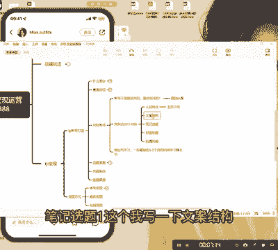

第三个就是使用场景。啊，使用场景啊，然后笔记笔记选题这个就这个就很突出了，这个就很突出了。兄弟，这个非常突出。我打个比方，我们如果选选就是服装穿搭好，okK啊，服装穿搭，然后选选这个服装穿搭。

然后呢你可以可以选什么呢？就是。

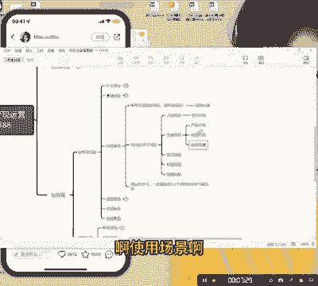

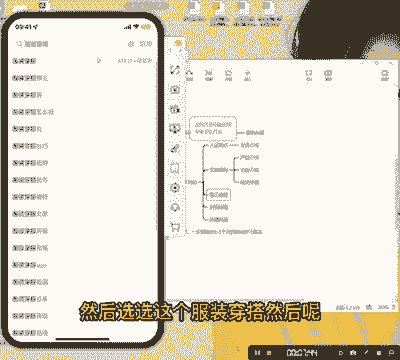

就是核心标题的。核心标题的往就是核心标题的越后端越好，就是什么长尾词。搜索。常尾词搜索对啊，比如说啊我们自己做小个子的啊，我们自己小个子，唉，看到自己喜欢的啊这种的。然后啊我们直接点击这热。

直接点击这个。哎，你们自己看一下，在这里能不能找到你明写，为什么呢？因为这种选题啊刚开始就是。

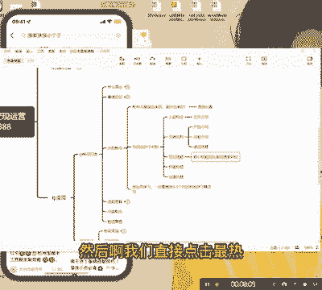

这种呢。刚开始我们做笔记的时候，我们做笔记的时候，我们做IP的时候。选题。选题越窄。好，我打个比方。

我打个比方，我跟你讲，你们觉得我一开始讲无货源，为什么会我一开始会讲无货源呢？我给你们看一下，你们看一下嘛呃，小红书。你们看你们搜小红书会员，小红书为什么呢？小红书无会员是没人讲，刚开始它是没人讲的。

知道吧？啊，刚开始这也是我们的IP我们刚基本上刚开始都是我们的号，这也这个也是就是这个也是我们的IP啊，你看。这也是我们的IP就是我都没关注啊，随便搜索的搜随便搜索的，随便搜索的。

你看我们基本上就把首页给霸占了。他那个账号流量特别好，你看我这个账号69个赞，明白了，就是一定要就是一定要先从先从这个市场的蓝海选题开始选，说题要，先把自己账号的流量给做起来。啊，好。封面标题什么呢？

我跟你讲，小红书，它是对它不像是视频一样，视频我你们看视频啊，你们看等一下，我选。

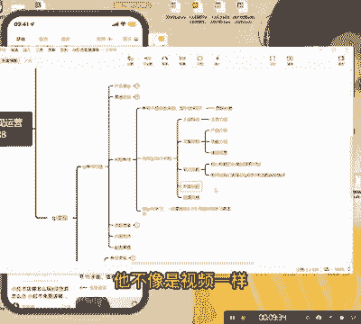

这个服装搭配。然大概要选锅主。好，你们看看你们看看。你们看看啊，兄弟们，你们看我选最热，好吧，选最热。好，你们看。这些东西这些东西这些不像啊，这选选选最热其实有点不对啊，因为为什么呢？

他可能是教你没那么明显，我建议大家直接，因为这个博主这个有点特殊，为什么呢？因为大家都是来教你做服装穿搭的，是对不对？大家都是来学服装穿搭的啊，大家都是来学服装搭的，穿搭的。你看。啊。

都是来学服装穿搭的，等一下啊。好。性价比。你瞧一下。你看这个就比较精准了，这个就比较精准。为什么你看。😡，她是靠图片的这姑娘啊，这个这个姐姐也不漂亮吧。然后呢，你看但是她流量特别好。

长期主浴流量密码一周涨粉7万，她就是写给这帮啊，就是什么呢？做知识博主的，做这个想做博主的人看的，看到没有？明白吧？所以标题比内容相对来说更重要。你的内容是决定了你的停留。但是你的标题决定了你的点击啊。

哎封面。据。封面决定点击。标题。内容。决定。就是停留。啊决定停留时长啊，停留时这这两个东西都很重要这两个都很重要啊。好，第五个拍摄风格。兄弟，就是你们一定要看看你们这些对标，他的拍摄风格是什么样子的。

我打个比方看这个呃，大家会不会平时在网上好，我们可以看这个他就是一个在在那个就是坐着框快而谈的这种啊，但是他的场景会特别好。所以我们可以看看这这这个啊他这个场景会比较高端，比较高高级一点的啊。

然后呢呃为了方便，因为那个有声音，所以我给大家设计这个图文，我找一个博主，好吧，找个博主。

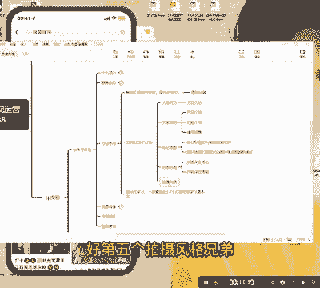

还有一个啊就是如果说你们对服装比较感兴趣，如果想做博主的同学，你们可以考虑跟我们合作。我们这边会有长线的一个呃女装博主这一块的一个需求啊，我们我们会做长线的一个。

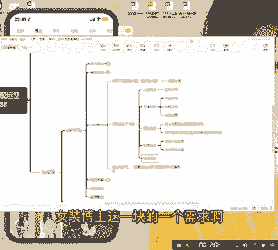

啊，一个服务的这个东西大家可以合作啊，我们都可以从零打造的这个东西你们自己去看啊，你们自己看，你们自己可以去找一下啊，你们可以去找一下好吧啊，就这个这个对标账号是特别重要的。因为你对标账号找的好不好。

决定了你这个IP啊，IP它的一个生命力，一个生命线。好吧。好，行，那就先这样啊。😊。

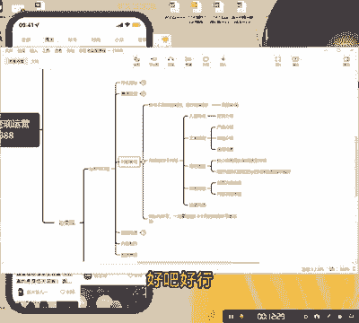