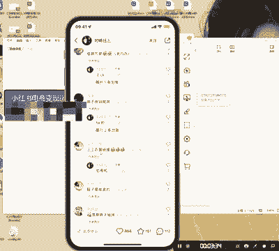
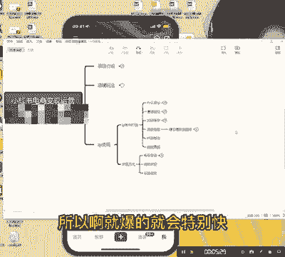
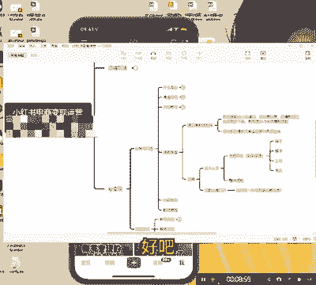

# 【2024版小红书运营教程】全B站最良心的小红书开店流程详解，高阶运营教程合集！小红书体开店，起号真的快，共1000集全是重要知识点，赶快点赞收藏起来！！ - P28：第27课：ip如何精准选题？【小红书零基础电商运营课~全流程】 - 一盏灯的时间q - BV1eSaMeWEXf

hello，大家好，今天是来到咱们IIP账号打造课的第四节，就是选题准备啊。确实有很多小伙伴在就是纠结，就是哎，大哥，我这个账号也找了一些对标。然后赛道呢我也精准了。但是现在我不知道写什么题啊。

就是我该拍什么，我首先我应该拍什么样的内容。好，我跟你讲啊，你之所以你没有这种选题，或者说你刚开始哎拍了一个星期啊，没了又没题目了。我跟你讲啊，你们能出现这种情况。

全部是因为你们的没有建立一个爆款选题库。报款选题库是什么呢？就是。你们了你们要了解啊，你们要了解，就是这个东西它是市场筛选出来的，大家关注的东西好。小红书的账号它什么？小红书它的逻辑是你跑一段时间啊。

然后跌下来了，肉住跌下来跌下来来慢慢没了。为什么呢？因为后面一定会有人比他创作的更好，他们会把流量承接过去，明白吧？没有一个什么啊账号能一直报十年啊，这个不可能，对不对啊啊官方也不会把所有流量全给他好。

今天的话呢，我就给大家做干，我就给大家详细分享一下，好吧，我打个比方，就是咱们是做服装穿搭，还是还是以服装穿搭为例。然后呢，我们说小中版。那，就是说哎我我准备选这个题目去去分享了。

然后我我现在要找一些好，你点击对热点击对热。好，这是第一步。然后你去看一下这些流量比较高的。但是有一点啊，有一点你们要确定好，你们是怎么变现的，你们怎么变。比如说如果说你们是做服装穿搭的。

那就下面就看下面回复，我打个比方吧，这个啊图片，英国买的那小众品牌。好，他们下面就是什么呢？能不能挂链接啊，能不能挂链接啊，好看啊，我看看有没有这是啥牌子，国内可以买吗？看到没有？这个就种草的。

这个就是它是做商务变现的，它是商务变现的这种如果说你们也想做商务变现。OK这个就可以做到你们选题库里面去，选题库里面有几个，第一个是图片，第一个是图片，第二个是什么呢？就是文案了，文案。

你看有毛衣羽绒服质量，然后码数啊，这些东西都可以写都可以写，你们可以按这。这个就很比较简单了，看到没有？它这一个啊第一个啊产品介绍。第二个是什么呢？就是细节啊，毛衣羽绒服。

这三是一个产品整体产品的一个细节嘛。第三个质量是吧？这个就可以做一个产品库了。然后你们拿过去好，你们能不能在这个产品基础上，你看看你能不能也自己根据自己的一些领域里面的一些要求，一些呃。

能不能写出跟他这种一样的文案出来。啊，就很简单了嘛，对不对啊？当然这种的话它是做种草的，它是做种草的，我再给大家看一个其他的。找一个其他的啊，看这个2万多好服装穿搭小众品牌。那个你看啊这个品牌。

那基本上这也是种草的对吧？嗯，我看看啊有没有种草的。大衣怎么买啊？这个这个这个一般把品牌写上去的啊，把品牌写上去的基本上就是种草的。好好，我们看看这个。评价一下这个穿单。这个这个就有点那个这个不行啊。

这个裤子有链接吗？

嗯，这裤子有链接吗？这个这个不一定是啊，这个不一定是我们找个明显一点的，好吧，给大家找一个明显的。提升气质。哎，20岁左右买。好，这种的我们就可以看一下它的一些变现方式啊。

它这个应该不纯粹是那个法服服装穿搭。好，这种的好，你看搭配是分享啊，这个就比较简单了，这个就如果说你们是做这种类目的啊，你们就可以把这种选题库选进去。好，当然啊刚刚看的这个视频，你说能选吗？兄弟能选啊。

这个视频是可以选的。但是你一定要把它的文案给抠出来，给抠出来，明白吧？给抠出来。好，我今天我再给大家分享一个类目啊，就很简单，就是比如说你你们也知道就是我我不可能所有的文案都是我创的。

所有的文案都是我自己写的。我一定是做过一些微原创的，我打个比方吧，我们自己我自己之前我自己有个文案就是学学谁的？我看一下啊，我找一下。嗯，我给你们看一下吧，我给你们看一下啊。我给你们看一下啊。嗯。哦。

学的这一家的。你看就是很简单，我我你们可以看一下我最近的在抖音上发的这个视频，你看是不是一上架就爆款最最新的全平方。你看我是不是超他的，我是不是选他，但是我中间是做了一些很自己很多自己的见解啊。

因为他这个视频就是文案比较好，文案比较好，开头比较好，很吸引人。看到没有啊，就是就是就是什么呢？就是大家一定要自己知道自己怎么样去把这就是我自己就是那个选品库里面的一个。所以啊就报的就会特别快。

报的会特别快。你们可以看一下，我这个抖音的这个，我看我给你们看一下我抖音的这个数据。

啊，报的特别快，应该是。

嗯。这个目前27000的流量上架就能卖到单的800多啊，800多点赞。所以说它这个数据还是很快的啊，兄弟们很快的，所以爆款选题库特别特别重要啊，一定要但是我跟你讲啊，搜索和这这是这里有一个方法。

就是搜索和一快系就是一一口气全部给它弄出来。然后第二个是把对标全部收录进来，把对标账号的一些爆款全部收录进来。但是有一点啊，就是。范畴。啊，就是从小入手。从小入手，什么叫从小入手呢？主题细分。

我打个比方嗯，我打个比方，如果说大家啊我打个比方，如果说大家是做服装搭配的，那么好，我一定会选，就说裤子我会选一级，帽子我也会选一级。明白吧。服装上呢我帽子也会写一集，然后还有什么写一集呢？😡，衣服。

上衣协议级。对不对？我会根据逐个我去找这种文案，然后就是从细分穿搭细分之后错主题写写完细分，然后写整体搭配。整体搭配兄弟，就是你们做到刚开始细分开始拿到流量，你说这个上上衣特别特别就是搭配什么什么样的。

就是质量特别好，你就只推荐上衣，明白，然后你再写整体搭配衣服，什么样的衣服配什么样的帽子，对不对？这样的话题慢慢就宽了，对不对？慢慢宽了，你这样流量会宽很多。好，第一从从小入手之后，话题。话题也要打开。

就是你们很多人就说哎我只讲帽子，我只讲衣服，只讲裤子行不行行行，但是你这种只能做带货，而且你的成长性并没有那么的高，明白吧？啊，如果你只发帽子，只发裤子，那种就适合什么呢？你们做电商面现，你们衣服。

你们店铺里有卖帽子，有卖衣服。好，你你就只做帽子，只做裤子都可以啊，这个很重要啊，兄弟，这非常非常重要啊，话题也要打开，兄弟，话题也要打开啊，你们要把自己什么呢？好。😡，如何服装？就是。如何用一件毛衣？

我我随便举一个，我说一个大家如何用一个毛衣穿出高级感。看兄弟们是不是就是我说的话题是不是就越来越宽泛了。我不是现在已经该给你们讲一件毛衣了，而我是讲一个整体的话题。这样的话你的粉丝就会越来越宽泛。

而且你的粉丝粘性会粉丝也会觉得你趋向于高级，他们会对你的粘性就会越来越高。明白吧？啊，当然还有人说，那我直接一开始选这个行不行，可以也可以也可以。但是这个可能对基本功的要求就有点高啊。兄弟们。

所以你们一定要在选题的时候，一定要就开始把这些东西准备充分，好吧。

