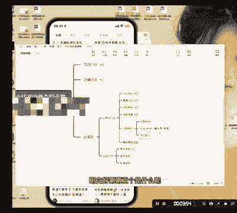

# 【2024版小红书运营教程】全B站最良心的小红书开店流程详解，高阶运营教程合集！小红书体开店，起号真的快，共1000集全是重要知识点，赶快点赞收藏起来！！ - P29：第28课：内容制作【小红书零基础电商运营课~全流程】 - 一盏灯的时间q - BV1eSaMeWEXf

啊，大家好，今天来到咱们就是IP变现的一个第五课，就是内容制作。好，我先跟大家说一个来一个整体的复盘啊，因为我们自己是在啊我们抖我们在抖音上，我们是打造了很多IP的。

就是做一些我我自己在抖音上我是做了一些账号的。就是我们自己做了一个14万的号，然后现在又做了1个3万的号啊，我们账号的流量都特别大啊，你们可以通过平时看我直播也好啊，或者说我在抖音上的直播也好啊。

你们都可以看得出来。我们的流量是特别大的啊。好。

这还是这还是其中之一啊。因为我们之前确实做了很多知识知识类的账号，都是我自己做的，封了一封了一些啊，几万几万粉丝这种账号。但是我们整体在我们目前整体的就是这种电商的这个粉丝啊。

在抖音上也能差不多将近5万吧，精准粉，我一个人就是我一通过我一个人做的。所以我在这个做账号，还有做内容上，我觉得我是具备一定的发言权的。今天我就跟你们分享一下，就是咱们我在小红书上。

我们自己是怎么样通做一个什么样的内容的啊，我们自己是在小红书上是有做账号啊，就是这是我们自己的账号。当然啊目前做的一般，就是因为什么呢？就是。

呃，我还没有太多的时间去经去去很用心的去来经营我自己这个账号啊，我们基本上都是什么呢？我我现在基本上就是用那个就是我们在抖音上发的，直接同步过来啊，直接同步过来，这比较简单啊。

目前还没有目前还没有太大的精力去生更。因为我们目前呃更大的精力是放在小红书就是一个电商变现上，在IP变现，我们还目前还比较少。但是就通过我这样加啊，就通过这样我这样的一个变现模式就很简单。

就这样每天都会有一些直接会有人来申请啊。然后。

啊，你们看一下，就我这种的话呢，基本上就每天都能够导一些人进来。我们目前应该是导了有四五十个人进来了吧，然后变现也将近差不多变了2万多啊，这这这很简单的这个啊，当然我是做知识付费的。

可能跟你们做的一些不一样。但是呢我呃。

大道理都是相通的，知道吧？啊，流程都是相通的啊，所以我今天给你们讲一下，首先小红书上的啊小我我给你们举个例子，还是举服装搭配吧啊还是举服装搭配，这样的话大家熟一点。

啊。然后比如说内容上内容其实是分三个板块。第一个主图主图它跟那个它跟抖音不一样，抖音是开头三抖抖音是开头的啊3秒钟啊，抖音是开头三门3秒钟，小红书，它的展现形式不一样，你看到没有？它是不放视频的。

它是直接看到没有？它是第一张主图的，它是第一张主图会比较重要。

明白吧？第一张主图，所以第一张主图基本上占了40%的权重，这个占了40%的权重。

啊40%。然后第二个是什么呢？就是开头。

啊，开头呃3秒钟。开头3秒钟啊，但是我跟你讲啊，就是他跟开他这个开头3秒其实跟抖音的开头3秒不一样。小红书上的开头3秒，它是讲究什么呢？

进口感。

加审美。相对来说。

小红书上的人群会比较精致一些，他对于他对这个要求会高一些。

明白。好，第第三个是什么呢？就是。

能啊。老文案或者是说。标题。加文文啊，其实准确来说，标题也占了10%啊，标题占标题一个就占10%。

标题一个占10%啊，这个的话差不多占个40%。如果是视频的话，占40%，然后文案占10%。

啊，这样子基本上是这样的搭配啊，基本上这样的搭配。好，我详细给大家讲一下，标题就是首图，就是主图。

主图的话。主图的话兄弟啊主图主图的话呢。第一张图它一定要表现什么东西呢？第一张图它一定要表现就是信息传递。啊，行，就是你第一句话一定要传递一个核心信息啊，是吧？比如说呃。

我给大家举个比功能性那目前是有我总结的是有功能性，还有就是你是什么身份？第三个主题啊，好，我来我给大家看一下啊。随便找一个吧，就是第一个好了，我们就以第一个为例。好，功能性是什么呢？

它是告诉你他这有什么功能，他就是送给就是送给一品差的男生，是不是？然后他是什么身份啊，他是什么身份呢？就是。17秋冬穿搭，他的身份就是秋冬穿搭的一个博主，对不对？他是介绍的，对不对？好，主题是什么呢？

男士秋冬穿搭韩系。明白吗？看到没有？它是一个整体的，因为它这里很有衣服穿搭背景图，他就告诉你们他的一个整体穿搭穿搭穿搭，对不对？明白吗？所以我们一定要清楚啊。

就是第一张图能表现出好多我再看这个这个第一个一个背景图是一个女生拿着一件大衣，对不对？米白色的大衣，它的主题就是一件米白吧色的大衣。好，她的功能性就是什么呢？

有多百搭百搭的大衣是不是然后身份看一个姑娘啊，她这里没有写没有写，可能如果说是我的话，我就些啊就是啊就是搭配师教你怎么穿搭，就是搭配师啊，搭配师搭配师，然后他这里还是表现的是功能性。

标题这里写的是什么一衣多搭，对不对？啊，意一多搭。然后呃它的主题也是这个啊，这这个表现的比较明显。好，我们再拿下面来分析学穿搭短羽绒服，一件多穿，看一会儿穿搭就好了。好，第一个以前二，这是对比，对不对？

这是不是功能性对比，对比就是功能性啊，对比就是表达一个功能性，第二个身份，小个子是不是主题是什么呢？小个子一衣多穿，教你穿搭。是不是是吧？好，呃，镜头感这种东西嗯我我们看这个吧。

你在哪里如果在说动发生不同步的呢，一起来看吧，你看。第一句话他的第一句话就是什么呢？直接说怎么穿搭，就是用问句最好问句开头。又或者啊问句开头，又或者什么呢？教你直接就是直接。点名。你能获取什么？

获得什么？知道吧？这个很重要，就是你给个理由，就是你要给一个理由，别人让别人停下去看你的理由，懂吧？懂我意思吧？兄弟们啊，这个就很重要了啊很重要了。好，第三个标题加文案，标题加文案。好。兄弟们呃。

关于标题跟文案这一块啊，其实这个内容就会特别特别多了。我我就想我就简单讲一下吧，标题的话呢是。第1个20个字。标题是20个字。20个字啊20个字，然后它的组成部分。第一个就是什么呢？功能词痛点词。

功能词。啊，这个我不写了吧我不写了吧。好，我不写了吧。你们我直接我直接用那个案例给你们，我直接用这个给你们看吧。服装穿搭啊，第一个。就是20个字嘛，组成部分啊，意义多大，功能词对不对？功能性这是功能性。

然后是什么呢？背景使用场景是吧？背景使用场景那我就不说了，背景使用场景。然后第二个是什么呢？就是我为什么要用这个东西。啊啊，或者是说痛点词，痛点词是什么？一品差的一品差的啊啊，在这里来看吧。

看这个明显一点，就是小个子痛点，小个子是不是很难选衣服啊，我不知道啊，但是我知道他这个是痛点词。是不是？啊，特别多。然后第二种还有就是什么呢？就是第一个是呃，就是那个痛点词场景词。功能。或者是说。重点。

第二个是什么呢？第二个就是场景词。效果。啊，你看。你看嘛啊，功能词，然后场景场景看看啊场景有没有场景啊，我看看有没有场景，场景词有没有。啊，你看嗯。我找一下啊。场景有没有场景是有的场景。嗯。怎么在杭州？

啊，特别多啊，这这我就不找了，漂亮衣服根本买不完啊，你看这个就有身份了，38岁穿搭30加是不是这就是一个很明显的身份了，对不对？你们自己多去看啊，越你们会越找越有感觉的。好吧。好，那这个有点拖堂了啊。

这节课就到这里。