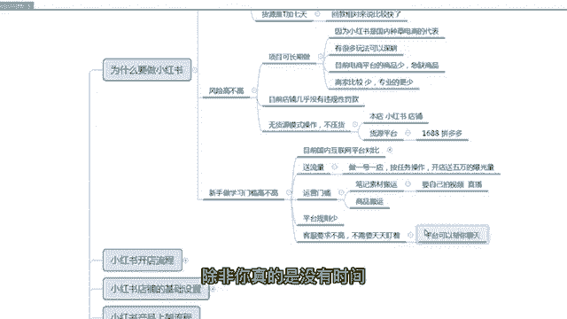

# 【2024版小红书运营教程】全B站最良心的小红书开店流程详解，高阶运营教程合集！小红书体开店，起号真的快，共1000集全是重要知识点，赶快点赞收藏起来！！ - P2：第1课：为什么要做小红书【小红书零基础电商运营课~全流程】 - 一盏灯的时间q - BV1eSaMeWEXf

嗯，大家好，这节课给大家讲那个小红书的创业项目课程。然后首先带大家去了解一下，就咱们做任何事情之前，咱们要知道哎我为什么要做这件事情。那么咱们为什么要做小红书呢？啊，首先从几个方面给大家聊一聊啊。

第一个咱们要认识小红书。呃，我相信有有一些人可能也没有手机上没有下载小红书啊，也不知道小红书是什么东西啊，但大多数人是都是知道的啊。嗯，首先小红书它是一个相对来说还是在国内的一些平台里面量还是挺大的。

它的月活有两个亿了。那抖音目前才六七个亿，对不对？它月活2个亿了，相对来说那个流量还是可以的。它的一个slogan是2亿人的生活经验都在小红书。那那说明小红书是一个分享经验类的一个平台。

就是它是一个种草类的平台。那么小红书平台也有电商就是也可以在小红书这个平台买东西，你们不要认为小红书，哎，我就是只是看看笔记啊，刷刷视频啊，不是的，在小红书站内也可以直接购物。

那么它也是一个购物决策平台。比如说我我看了每一个博主的一个生活经验，然后我觉得不错，然后是通过他的推荐，我也买了他用过的东西，这是购物决策平台。

那小红说的人群是20岁到35岁的年轻的中高消费人群是女性的他的城市大概是一线、二线、三线城市啊。那说明小红书这批人是活的是比较精致的，而且是消费力还可以。而且这个平台也是种草的。

所以咱们嗯很有必要在小红书里面去做电商，这就是目前这样一个状态啊。

第一个投资成本从投资成本去聊一聊。小红书目前我们做的话是不需要刷单的，也不需要花钱买流量。目前我们的模式也不需要压货啊，压货也不需要啊。不要压货。就不要进货嘛啊，所以说这个投资成本几乎是零成本啊。

然后小红书店铺大家都知道店铺都有保证金嘛，那小红书店铺有没有保证金，有80%的类目，咱们卖什么东西的话，80%的东西都是只需要100保证金就可以了。而且这个保证金。

前期小红书为了鼓励大家开店它甚至可以不用交啊。等你想提现了啊，或者是那个卖的比较多的时候，你那个这个时候你再去交也没关系，不影响你卖货赚钱。呃，那么第三个是小红书的呃开店不要钱，运营也不要钱。哎。

那么我去周转资金要钱吗？这个肯定是要的，任何一个平台都要。但是这个小红书的周转资金也挺快的。它不像抖店呀，其他平台动不动一个月。小红书是T加7，提使确认收货时间。比如说顾客从收到货。

签收之后一天啊么就是再加7天，7天之后，这个款钱回到你账户里面，那就是他签收之后一天去确认收货，那么你的到账时间就是8天，啊，可以这样去理解。那回款回款的周期相对来说比较快了啊，这个就是降低减轻。

咱们去周转资金这样一个压力啊。

呃，那么第三个方面是风险，就是咱们呃把小红书开店当成一个项目来说，任何项目都是有风险的。那么小红书这个平台的风险到底高不高呢？嗯，首先那个前面已经跟大家说了，投资成本。你看前期几乎是零成本投资。

那就代表咱们本来也没有出钱，咱们不可能就亏钱了，对不对？那么咱们的货款是在小红书平台的，那货款有没有什么风险呢？那么一般任何一个电商平台，它扣货款，那么肯定是你违规了，对不对？或者你侵权了会干嘛呢？

那小红书这方面的违规罚款多吗？

呃，目前我们呃我们公司有那个呃做了有几十家小红书店铺，但是我们学员有很多，有加起来有几百家小红书店铺，我们这边的反馈是几乎没有违规性罚款，少之又少，几乎可以忽略不计啊。

几基本上大家都没有违规性的一个罚款，它仅仅是有一些违规呀，或者你那个地方编辑不好呀，或者图片用了别人的图片了，干嘛的，他是提醒提醒你下架，你或者是你修改删除就可以，但是不会动不动给你来个违规罚款。

那就是表明咱们的保证金啊，咱们交到小红书平台，那些货款，那周转那个货款是很安全的，而且小红书这么大一个平台，这个是非常公平的啊。目前我们基本上就是没有什么违规性罚款。嗯，还有我刚才说了。

就是咱们操作的模式不是有货源，咱们是无货源操作。什么叫无货源？嗯，就是咱们去在小红书里面去上架商品，上架商品，然后是通过发笔记卖出去之后啊，卖去之后，咱们去多多或者1688去把这个货去拍给买是拍了。

就是付款了。那么地址留那个顾客的，然后是那么多多和1688会直接把这个商品发到顾客手里面。那么然后顾客收到货之后，然后确认收货，确认收货，咱们钱是不是回到咱们口袋里面。那。

所以整个流程下面咱们是不接触货的，这个模式称之为无货源啊。

啊，大家再理解一下，第一个这是你的小红书店铺啊，本店就是小红书店铺啊。那么顾客啊在你小红店铺拍了一个商品，对不对？拍了商品，他肯定留的有地址。你通过这个地址，你到货源平台。

1688拼多多把这个商品拍下来，拍下来地址留顾客的。然后是那拼多多那边是不是直接发给顾客了，对不对？发给顾客之后，然后是顾客收到商品之后，他会确认收货，然后钱到你的口袋。然后在这个过程当中。

你是不接触货的。然后是你从拼多多上架到拼多多的商品的价格，你是翻了两倍上架到咱们小红书里面。所以这个当中有一个差价，这个差价就是咱们赚的钱，这个就是无货源的一个不压货的一个模式操作啊。

这个已经很流行了啊，如果大家之前不知道的，可以去呃了解一下啊。嗯，那么小红书有没有什么违规性罚款，你压你那个呃你拍单呀也不需要压货，没有压货的风险。那么我觉得这个项目就是完全可以去做的啊。

投资成本又非常低。呃，那么这个项目能做之后，大家去想一想，哎，是不是做了几个月都不能做了，是一个风口性项目。不是的，小红猪这个项目可以长期做，你前期可以兼职。那么慢慢的你赚到钱之后，可以全职。

比如说你在上班啊，或者是你在家里面带孩子干嘛，你可以先做一做。哎，我有效果要出单了，我赚到钱了，哎，你可以全职去做。那全职做完之后，如果这个项目能不能持久，可以持久，你甚至可以把它当成一个事业来做。

你像我们公司就把小红书完全凹 in小红书了，我们就完全整个项目盘子都在做这个项目啊，我们公司的运营啊和所有的人员。嗯，为什么这个项目可以长久啊？因为小红书是国内电商平台种草类电商的代表。

你像之前像我不知道大家有没有听过小红书一起的有小红书，有那个美丽说有蘑菇街啊，哎，这些呃开始他们都有一些种草的一些特性。但是像美丽说呀蘑菇街呀，像折80百这些，他们他们转换成一个导购的一个电商平台。

那么只有小红书哎慢慢的发展成一个种草类电商平台，它是国内的number one，就是种草类电商的一个代表。

那么它里面有很多的玩法可以深更，而且小红书目前它要在它的平台也要做一个呃，也要加上电商平台，也也他也希望做那个流量的一个闭环嘛。但是这个平台目前的商品特别少，因为开店的人不多，但是流量又很大。

所以说急缺商品。他特别希望咱们去在小红书开店啊，那么商家也比较少，商家比较少，就代表咱们竞争不大，竞争不大。所以说不需要特别特别专业的东西。所以特别适合新手干紧去切入啊。

嗯，我刚才讲了，就是适合新手去切入。那么新手去学习小红书运营的门槛到底高不高呢？

呃，那我首先给大家去讲一讲啊，目前国内的互联网平台的一个对比。目前大家我就聊我就大概给大家那个呃讲一讲，就目前国内的电商平台，包括一些互联网项目，大家能接触到的一些，我给大家去聊一聊。

第一个像电商类平台，有淘宝啊，抖店啊，拼多多、京东这是这是四个比较大的啊，这些都是电商类平台，就咱们可以在这个平台去买东西的，称之为电商类平台。

那么像这四类电商平台基本上占了整个国内的电商的80%的一个体量。那像淘宝已经存在快20年了，什么概念？它该有的规则又非常非常完善了。它而且他的很多玩法都相对来说比较专业。如果你是个新手，你刚开始做。

真的不建议去做啊，像拼多多也一样，拼多多淘宝也就是一个一个木子啊，京东也是一样。

啊，抖音抖音小店就抖店相对来说比较新一些。但是我们之前也是做的抖店，我们做了有三年了啊，我们做了三年的抖店这个平台已经三年了，它也非常专业了。而且它不需要咱们这些小白。

他需要更专业的人去做更大的供应链去入驻它的平台。所以说抖音小店现在已经非常卷了啊，就是对我我们目前做抖音小店违规罚款。嗯。

非常多啊，不我真的不建议大家去做抖音小电脑，特别新手啊。那么抖音的项目，抖音项目，比如说抖音有很多，我给大家随便说几个中视频对不对？中视频短视频带货。

短视频带货还有什么那个短视频带货呀，达人啊，什么直播呀，这些这些模式在抖音里面已经是一个不是一个朝阳的一个一个操作模式了。它相对来说比较专业，比较内卷了。你们新人在这里面，我就打个比方吧，中视频。

中视频能做出结果的真的很少，能就是能赚赚的可就是稍微可以的，他只能说是你赚一个连个零花钱都那个都算不上。一个视频再赚几块钱啊，真的是这样的。你说有啥意义，天天去飞机巴拉的去天天编辑，也没什么意义。

嗯说着电商平台，像国内的主要的电商平台能占80%提量的，其实都不适合小白去切入了。那么抖音的一些小项目干嘛的，这些项目又拿不出手，大家赚不了几个钱，而且非常耗你的经历，成功概率也不高。

那么我这边分析下来，我觉得小红书真的是当代就是目前为止真的是新手可以完全去all in的一个项目啊，真的是天时地利人和。

这是平这是整个那个国内电商的一个大环境，是这样的。那么呃其他方面呢，对平台来说有什么福利吗？就是咱们开店哎，平台有没有有没有什么鼓励大家开店。你像你像这些平台啊，平台是不鼓不是说不鼓励大家开店。

他已经过了那个阶段了啊，他不需要那些垃圾的商户进去，他需要优质的品牌的，有很好的供应链的人去进去。所以他不鼓励咱们这些小白啊去动不动去开个店。但是小红书是鼓励大家的？你看有哪个平台，你开店送你流量。

那也只有小红书了。目前你开店做一号一店的这种店铺按照任务去操作，前半个月会送你5万的一个爆放量，5万爆放量是什么概念？你账号早起了，是不是啊？你也赚到一波钱了。

那么第一个运营门槛运营门槛怎么说了？货源是。无货源模式操作被压货。那么运营就是咱们怎么发笔记啊，商品怎么去上架呀，完全都是搬运的，不需要咱们去原创啊，所以说并不是说大家去干嘛的，要要自己。

要自己拍视频是吧？嗯要自己拍视频直播，不需要完全不需要所有的素材玩法都是搬运就可以了。因为这个是这个平台特别缺商家，没有多少竞争，现在属于空白阶段，大家入住都能拿到很多红利啊，这是运营门槛。

还有一个平台规则少，刚才说了没什么违规罚款性的一些规则啊。

嗯，那么又有人说了，哎，你这是电商呀，电商不是顾客要买东西，是不是要跟你聊天，你需要解答。对啊，一定的肯定是需要的。那么小红书需不需要。那那我客服我没时间。

我在带娃或者我是上班兼职的那我没课没人聊天怎么办啊啊，这个平台给你考虑的非常非常完善啊，平台甚至可以帮你聊天啊，但是会收一个聊天费用，这个我一般不太建议啊，除非你真的是没有时间，但是你不用平台的怎么办？

你自己聊行不行？完全可以，你只要一天当中回复人家就可以了。你我你甚至可以不回复，而且你超市发货也没关系，没有任何处罚？

是客服要求这个门槛非常非常低啊，嗯这个就是大家去做做兼职，非常适合，不需要天天听盯着客服，像淘宝呀，多多一样，你挽回人家一下啊，就是立马出个罚款，出个违规干嘛的。小红书没有啊整体来说嗯大家去做任何项目。

大家做任何项目，从呃投资成本啊，从风险啊，从学习门槛啊，大概这三个方面去判断一下小红书呃，我觉得是现在这个国内的一些商业互联网那个商业项目当中算是非常非常适合新手去切入的。而且能拿到大结果。可。

这个非常重要啊，能拿到大结果。呃，可以。当成一个事业去做的一个项目平台啊，真的是这样的啊，我们公司基本上就是。

80%的精力就是all in小红书了啊。

嗯，所以说我。嗯，我给大家去总结一下啊，你比如说是像宝妈类人群，你看如果是一个宝妈，比我做了十几年的一个电商，我做12年的电商。如果哪一个宝妈在我这问哎，老师我能不能做淘宝做多多。

我肯定会给他泼一点冷水。但是小红书是真的只是宝妈问我能不能做，我唯一一个特别推荐，而且是非常笃定的说可以做的一个项目，就小红书开店卖货。那么像宝妈像上班的上班族呃，下班之后的一个兼职都可以。

因为他对客服要求不高，不需要你天天盯着你上班时间你还聊天干嘛的，还有目前没有项目的一些失业人群，还有一个手里没有多少资金的人群。因为他前期的运营啊，不需要刷单呀，开店有没有什么成本呀，这个资金量非常小。

那么甚至甚至我可以说它可以当成一个翻翻身的一个项目。为什么？因为它可以拿到大结果，它不像一个什么东西，就个过家家的一样，那个什么啊抖音的一些项目啊，短视频带货呀，你一天赚几10块钱。

能赚大几百这个已经门槛已经比较高了。就这种项目，他没办法让你正儿八经的去做，它就不是一个项目，他最多算是一个玩一玩啊，是这一个东西，随便随便赚这那个看不上的那点小钱啊，就这种东西所以他几既可以。

做小也可以做大。呃，这是我对小红书的一个大概的一个分析啊，大家可以去嗯真的可以去完全去可以了解一下这个平台去做一做啊，去用心的去做好。

