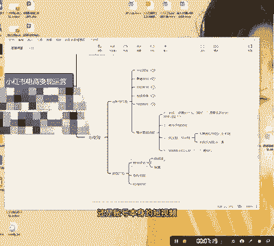

# 【2024版小红书运营教程】全B站最良心的小红书开店流程详解，高阶运营教程合集！小红书体开店，起号真的快，共1000集全是重要知识点，赶快点赞收藏起来！！ - P30：第29课：整体复盘流程【小红书零基础电商运营课~全流程】 - 一盏灯的时间q - BV1eSaMeWEXf

大家好，今天来到咱们IP打造课的第六课呃，第六课，这个是一个整体复盘流程。好，我今天就简单的跟你们讲一下，做账号啊，因为刚刚已经详细的给你们分分享了每个点。好，这里面我就跟大家讲详细就是分享一下。

就是复盘一下，就是怎么在小红书上做IP好吧，流程首先我们做流程第一步干嘛呢？兄弟们第一步干嘛呢？就是。早点。就是你擅长什么？这个你问啊，你擅长什么？好，然后愿意花多长时间。学习。这是第一点啊第一点。

你先把这个东西找好找准。第二个第二个第二个问题是什么呢？就是好，你愿意花多长时间，这个很重要，你擅长或者说你感兴趣啊或者兴趣啊，这个也是因为有很多同学说哎，我做这个呢对。嗯，可能有有很有一些人啊。

我是真的介绍一些，他可能就是说我对这个我本身有我很大的基本盘，我电商一年卖几个亿。我做小红书，我仅仅是想就是把它做一个增量，我没有靠这个吃饭，明白吧？这可能更有一些爱好的成分。爱好的成分对吧？是吧？

或者让自己升升阶啊升阶啊，那么这种呢就有一些爱好的成成分。好，第二个第二个就是。第二个就是什么呢？就是。这就是咱们的一个账号。开始定位。定位好，定位定位之后，定位这个就比较简，定位就这个很简单嘛。好。

第三个就是找主题，对吧？第三。找主。对标。兄弟们，我们找对标，不要泛泛而谈，一定要把它的素材全部抠下来。我给你们看一下啊，我给你们看一下，我在我我我给你们看一下，我在我们自己做账号账号的时候。

我自己就复盘了无数次。你们看这是这只是我一个这只是我其中一个手机手机账号的一个一个一个文案模板。我其实写了特别特，我自己写了非常非常多的文案模板啊，这个一定要自己去找对标，然后找主题，找文案。

自己写文案，一定要有这个原创能力啊，一定要有创作能力啊。小红书我跟你讲啊，其实小红书上。

他对抄袭或者他对那个。他对那个图片啊这个东西，他其实你看这个其实很普通啊，我不知道你们看的怎么样啊，可能在我看来，我这个审美可能不行，我确实看着他看不出，但是我相信他的文案一定不错。

我相信他的文案一定不错。你看因为还看了一本怦然心动的人生整理法则，重新认识到自己物自己与物品的关系。所以大家一定要懂得，就是文案能让你的人生丰满。这个东西这个其实我也有一些书能推荐大家的这个东西嗯。

但是我不知道看书能不能对你们有用啊，反正我我我自己是我给你们，我给你们看我我我你们可以有些，我这是我刚看完的一本书啊，叫叫那个证件啊，叫证件啊，叫证件。

然后如果说你们有兴趣的话，你们可以去看一下我书架里面，我我自己书架。因为我是我看了我我差不多，我算是这个忠实粉丝啊，我看了已经看了有200多个小时啊，我自己看的。所以大家如果说你们对嗯这个文案啊。

还有这些东西，我觉得你们多可多去看看书还是有用的。好啊，多去看看书还是有用的啊，这个东西不是一蹴而就的，就像说看书有没有用，我告诉你，如果1年前你告诉我看书有没有，我我10年前看书。

我没有想过它有没有用，我只是觉得嗯很多时候我需要去做这样的一件事，我我。还有一个就是什么？我的一些人生偶像，他们一直在看书，所以我想我也看书。但是十年后的今天，如果你告诉我，我让我告诉你看书有没有用。

好，我只能说，如果你们着急挣钱，着集生活的话，对生活压力比较大的话，好，那你们自己直接去抄找对标。如果说你们自己已经有了一定的沉淀积淀的话呢，我建议你们去多维度的去看书啊，多看书。

不管是呃呃哪怕是最看最没用的哲学也好，或者说心理学也好，这些东西都是不是工具型的书啊，这种书其实。是书本中的奢侈品啊，什么叫奢侈品？我听过一句话，学而无用啊，学而。是维修啊，这个东西。这是一句话啊。

这是我自己学的一句话，学而无用嘛，就是学了没什么用啊，没鸟用奢侈品啊，就像奢侈品一样好吃多了好。😊，第四点第四点啊，兄弟们，那好，很核心的问题了，找到细分切入点。

我一时觉得我的我的抖音账号或者我的小龙账号为什么能够快速变现跟这一点很重要。如果说如果说我一开始就讲IP变现的话，我跟你讲啊，没有人来报我的课，没有人来看我。为什么我讲不过那些。

我是讲不过那些已经讲了很久的人了。他们的文案库，他们的就是这个知识面是比我要丰满一些的，懂我意思吧？但是我是找到一个电商的一个切入点，这个切入点至关重要。兄弟们，这个至关重要，这个是最核心的。

决定了你前期你能不能报。如果你前期能报的话呢，你是不是做这个事儿更有自信了？是吧这个是非常非常重要的啊。兄弟们还啊这个基本上如果说大家按我这个流程来做，我我可能讲的并不是那么用用什么很很多官方的词汇啊。

我都是教你们用。

就是最直接。因为我自己也这么做的，包括我们自己下面的一些IP也是这么也是这么做的啊。呃可能按我这么做，它不会让你正就是不会让你有一个很大的那个起飞，或者让你挣很多钱。但是你自己想我这么做。

一定是刚开始一定会慢慢的有所沉淀，有所沉淀啊。兄弟们好，今天IP课的话，呢，IP的一些打造的内容就啊就到这儿了。然后我们后面的话呢嗯我还会给大家IP的一些变现啊，IP的一些就是我们账号。

比如说哎我们是要做知识付费账号，还是知识付费变现，还是一些就是思域的变现，还是账号本身的短视频，还是直播的变现啊啊，敬请期待，应该不会几天。

