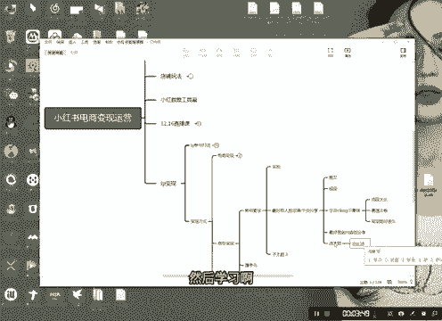
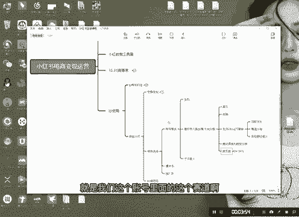
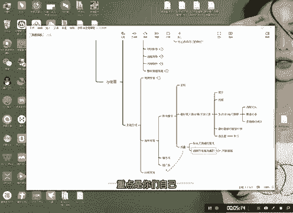
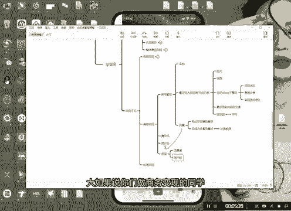
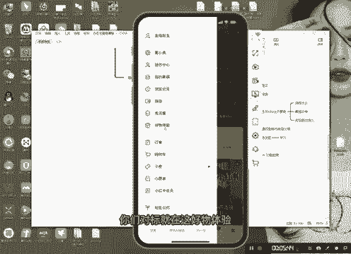
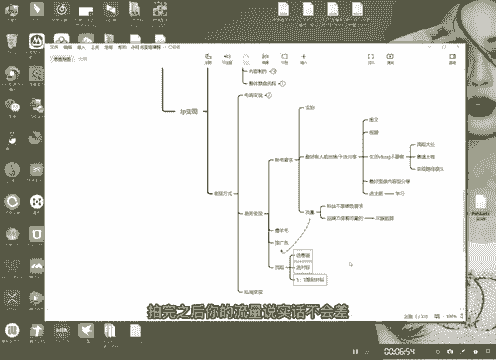
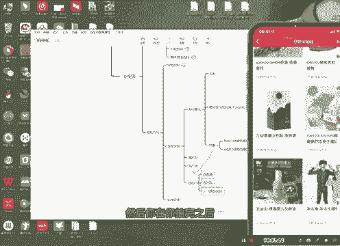
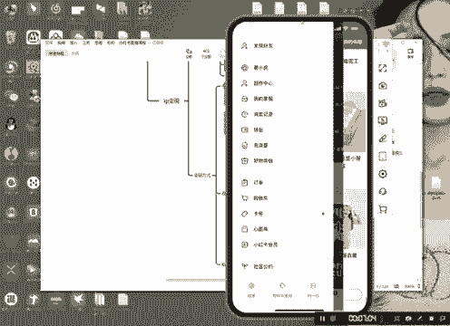
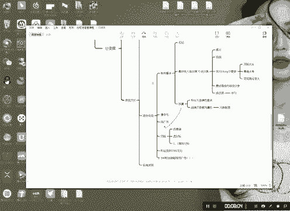

# 【2024版小红书运营教程】全B站最良心的小红书开店流程详解，高阶运营教程合集！小红书体开店，起号真的快，共1000集全是重要知识点，赶快点赞收藏起来！！ - P31：第30课：帐号如何做商务变现【小红书零基础电商运营课~全流程】 - 一盏灯的时间q - BV1eSaMeWEXf

大家好，今天给大家分享就是咱们的IP变现里面的商务变现啊，就是账号变现我就不说了，账号变现就是这个电商变现啊，就是电商变现啊，这应该就是。电商电。电商变现就是我们开店嘛，电商变现。好，然后第二商务变现。

兄弟们商务变现呢它的流程什么？简单来说就是一个就是撸羊毛啊，撸羊毛撸羊毛什么呢？就是一些平台方的平台方的一些羊毛，比如说什么试用啊，这些东西，如产品啊什么。第二个是接广告。啊，接广告这两种。好。

我应给大家说一下啊。啊像这种呢就是单纯的接广告的号啊，像这广号呢，也既可以借广告，也可以薅的到羊毛啊。这种的话首先我们要把这个他的联系方式要封在这儿，知道吧？这里有个商务，然后呢有个电话在这。

或者说有个邮箱啊，注意啊，私信不要回啊，兄弟们私信回的话，很容易被封。好吧，但是其好，其二的话呢，就是在这儿啊，还有一个地方就是呃薅羊毛在这儿薅的啊，就是你们可能很多人都不是首先呢。我们打开这个首页。

然后这里面有一个什么东西呢？有个好物体验在这啊，这里面基本上都有一些试用的，你看没有？这些都有你的账号，你的账号越高，你的账号的这个呃流量越高。注意啊，不是粉丝啊，跟粉丝没有太大的关联性。

就是你的账号流量越高，他你越容易薅到这里面的样品啊。好，我今天就给大家分享一下，怎么样去就是做这种类型的电现。好。这种。电商变现这种商务变现啊，首先我们要对这个更重要的是账号啊，对账号的要求。

首先第一个一定要实拍，这个是这个是最简单，这个是最基础的，一定要实拍。你剪辑的混剪的，你没有露脸的是不行的。第二个就是最好。最好有。人脸出镜。或者是干货分享。什么叫干货分享呢？兄弟们什么叫干货分享？

就是呃今天就是呃就是有一些是有一些是可以走图文的啊，图文跟视频都可以的，图文跟视频都可以的。这里我就不给大家举案例了啊。因为我建议大家是做人脸，因为这个是最简单的，但是有一点啊。

兄弟们很多人就做到一个误区。目啊做Vlog去了，就是生活vlog生活vlog我建议大家不要做啊。生活Vlog我建议大家不要说，为什么呢？呃就是流程太长太耗时间，这是其。第二个变现呃，赛道赛道太卷了。

知道吧？这个这个赛道太多人坐了，太卷了。啊，下道太卷了，下道太卷了，我不我我不建议大家做啊，而且什么呢？变现路径变线路径。很长。要很久要很久时间很久时间要很久，为什么呢？

因为vlog它的本质是IP知道吧？本质是IP你想你养一个粉丝，你想一你你养一批账号出来啊，太难了。我建议大家不要做，最好是做什么呢？有内容的干货分享，最好是做内容型。内容行分享。那有的同学说有的同学说。

那我什么都不会，我什么都不会，那我怎么样呢？怎么样去做这个东西呢？好，注意选主题。然后学习。

啊，你你可以选你可以选就是我们这个账号里面的这个赛道啊，我我我不是把赛道就给大家看了吗？大家可以在这里面去选赛道，选赛道之后，然后去学，明白吧？选选选主力选赛道去学好。

这是第二个账户要求。第三个就是流量要求。怎么样？注意啊，呃，就是就是接广告，粉丝不是硬性要求。粉丝不是要求，它更多的是就是平台品牌。是看流量的。平平台方是看品牌方是看流量的，知道吧？啊。

然后所以我们在这里呢，兄弟们，我们在这里面是嗯我们这个广告啊就是这个这个是要看这个的啊。好，那个流量那怎么看呢？兄弟们，一般来说他们就是用那个灰尘数据啊。如果说你们我们都有灰尘数据嘛。

灰尘数据我们用灰尘数据啊。我们用汇尘数据。用汇人数据去看，把那些账号点进去。你们这个这个很简单，你们自己后台去看好吧啊，然后我我我说的是就是重点是什么呢？重点是你们自己可以在这里面啊。

你们自己如果说你们很多人说，哎，那我不知道，我建议大家呃流程吧，我先跟大家说一下流程吧，流程啊。

第一个就是选赛道。选选文菜道对不对？好，第二个。选对标注意啊。如果说你们做商务变现的同学，你们的对标就在这里选就行了。你们对标就在这毫无体验。然后呢注意你往下拉啊，往下拉，这里面有什么呢？看到没有？

这里就有检测报告了，你在比如说你是做美妆的，OK你就去看他的检测报告，27篇检测报告，你去看一下他哎，这个点赞比较好，然后你去看一下他怎么拍的，懂吗？然后呢，哎如果说你能露脸的话呢，你你按他这么拍。

这样子拍，用直接在这里面去选对标，选对标，然后一比一的去对标它，你这样的话，你更容易拿到流量，你更容易接到广子，理解我意思吧啊，大家不要去盲目的看谁那个流量好就切，不是的，你们一定要切合实际。

因为他选到这里来说明他是平台是认可的，有一定的要求的，有一定要求的，知道吧？啊，你们根据你们自己的赛道，然后你们自己去选，看到没有啊。

好，那选完代标选完对标之后，然后。1比1复刻1比1复刻1比1复刻啊，对标。一比一复刻对标啊，注意可以一比一复刻对标，但是一定要实拍啊。拍完之后你的流量说实话不会差。你这种流量拍出去是不会差的啊。

然后你在你拍完之后，你发个三五篇，这种之后，然后你再到里面来申请你再到这个好物体验这里面来申请你的你的同类目的商品，你这样更容易过一点啊，但是我建议大家什么呢？就是。

先做这种的先做这种的，把是粉丝涨到1000左右。1000左右是最容易接到的1000左右是最容易接到的。好，怎么涨粉丝？兄弟们，你们自己去涨粉丝的保证啊，想涨粉丝的保证，你们直接去灰存数据里面去看。

去灰存数据，去灰存数据里面去选一些。这里面我是讲了IP里面讲了啊，然后选一些热点标题去做文案，涨粉的，看看涨粉哪种涨粉比较高的。你去你去你去选那种选题去拍到到1000粉丝左右，你基本上就可以去做光。

而且啊兄弟们，我们基本上都是在100粉丝左右100粉丝都能接。到广告啊。100粉丝左右都能接到广告，你们不要想的很复杂啊，对粉丝没有什么太高的硬性要求。

好。