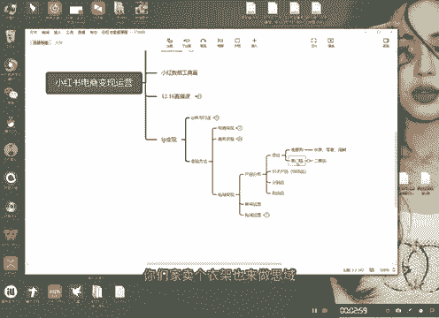

# 【2024版小红书运营教程】全B站最良心的小红书开店流程详解，高阶运营教程合集！小红书体开店，起号真的快，共1000集全是重要知识点，赶快点赞收藏起来！！ - P32：第31课：私域变现——产品分布【小红书零基础电商运营课~全流程】 - 一盏灯的时间q - BV1eSaMeWEXf

大家好，今天给大家分享的就是咱们的1个IP变现里面的一个私域变现啊，这个是很重要的，这个是很重要。这也是目前咱们小红书最具价值的变现方式啊。好，首先今天的话呢我先给大家分享一下，就是咱们的一个产品。

因为我们对能做私域变现的产品啊，是非常有要求的。

产品定位。首先你的产品我打个比方啊，你说你一件衣服适合做思域吗？一件衣服，衣服肯定是不适合的，为什么呢？衣服它没有任何的这种，就是客户是没有忠诚度的，客户是很难，就是或者说这这个赛道里面啊。

客户的需求多样。比如说我今天买了一件黄色的衣服，我还会在你那买一件黄色的衣服嘛？不可能特别特别难知道吧？客户可能对一些品牌或者说一些材质有一定的忠诚度，但是客户对产品本身是没有太高的忠诚度的，明白吧？

好，那么什么样的产品适合做思域。第一个高复购。

高富购。

第二个。高门槛。啊，什么叫高复购呢？比如说水果。

临时。这玩意儿是什么啊？快消，然后呢可以无数次重复。比如说我我们现在我们现在就是做了一款赣南脐橙的那个思域啊，特别特别好。为什么60%以上的复购啊，60%，就上呃客户买回去一吃，哎。

水果味道还可以挺好的啊，就直接会来复购就知道吧？这个就是能复购，还有什么呢？海鲜。

这些都是可以的，这些食品类型的都是具备一定的复购能力的啊，这些东西是很适合高复购的。第二种，高门槛什么叫高门槛呢？就是一般资源就是这种资源很少能拿得到。比如说。

啊，这个我不能说啊我不能说啊，我只写给你们。

或者是二奢啊二手奢侈品嘛。

20品。明白吧？这种产品它也是适合做高高高那个的，但是啊这个这个这个不写了啊啊，你你们自己懂的就行了啊，高门槛的，比如说二手，因为这种品是很难拿到授权，很难能有货源的这种的或啊，一一般人是拿不到的。

他们想买，比如说你一个LV的手包是吧？在专柜卖2万，然后呢，你去买个二手的也就4000，对不对？那就那就很划算，拿出就有面子，能满足人的一些呃虚荣心是吧？这个就是高门槛的东西。

所以你们一定要明白产品的定位很重要，你们不要拿一件随便你你们家卖个衣架也来做思域，那没有用啊，那那那种思域是没有任何意义的，知道吧？好。

产品分布，这是首先是产品的定位。定位好了之后呢，首先我们要把产品有一个分布的啊。兄弟们产品目前是一个是影子产品，就是导流品，第二个分销品，第三个是利润品。注意啊，我这里有个分销啊，分销机制。

分销机制品啊分销机制品分销品是分销品是私域变现里面最大的一个变现模式。你们不要想着啊，我跟你们讲啊，兄弟们，你们一定要想明白一件事儿就是。

小小红书就是呃私域变现啊，私域里面这种分销是最大的思域变现。你们不要想着，哎，我就把人倒到我私域里面卖他们东西就行了。不是的，兄弟，不是的啊，不是的啊，分销才是最大的。

因为它能够把你的用户转换为你的分销商啊，这个是特别特别重要的。好，说一下导流品，比如说我们比如说呃我举个例子，我们水果，我们水果的话呢是呃有个9。9啊，五金试吃。

试吃装对吧？啊，但是呢。

但是呢你并不是能够直接拿到的啊，你并不是直接拿到的，你需要去怎么样子呢？啊，大就是加我的微，然后呢啊给我试吃试吃之后注意啊，我们在小红车是这样做的啊，我们在小红车这样做的，就是9。95斤试吃装。

然后啊收到货之后必须。

懂不啊？必须发小红书，帮我们在做二次导流，做引子产品，知道吧？这个是很重要的。很多人就是因为这个不会去，你们像水果其实类目特特别特别多啊，当然我也我也不是说一定要水果，海鲜也可以啊。

我们我们目前在做一个海鲜以以一个海鲜品为私域啊，就是以以引子的一个思域，其实这些都是相通的，水果零食啊，海鲜这些东都是相通的。这些人群都是很人群都是什么人群都是人群大多数都是相通的，大家不要去纠结啊。

不要去纠结。好，这是一个引子产品，饮子产品具体的你们自己去啊，你们自己平台上找哈，第二个是利润品，利润品为兄弟们，利润品呢，注意啊，你们可以这样，我们规划的是礼盒装啊，礼盒装礼品装对不对？好。

第二个呢就是什么呢？

啊，打一些概念的啊，这种是概念的时候，比如说有机啊有机或者说呃零添加那种的啊，打一些概念的一些利润品，这些东西你们自己都会做啊。如果说当然我说的是你们一定要对这种对你的产品足够了解。

看看你的品能不能做私语。如果说大家是做无货源的话呢啊那就做不了私语，不建议大家做私语啊，最好是。

除非你找到一些就是产品啊，有人对产品比较熟的啊，一定要对产品熟啊，不熟的话是没办法做的啊。好，分销鸡制品是什么呢？兄弟，分销鸡制品，你们一定要不不要把这个拿去做分销，这个是给你自己导流的。

影子产品是给只给自己导流，分销品就直接拿利润品。比如说呃我们现在是20斤。

是吧20斤，然后是呃是是那个120啊120120。

然后呃分销优惠是分销优惠是20斤啊，100。这样子啊，他们这样子有个什么好处呢？相对来说给相对来说，第一个他们可以给了你一部分钱，知道吧？然后我们是分销是有门槛的。

分销门槛。

是。事实的。啊，是4纸巾啊柿纸巾这个啊这个大家可以去这个大家可以去做一下啊。呃，就是你你一定要你设置一个呃简单的最基础的分销啊，简单最基础的一个分销的一个一个一个机制，让他们来更多的来参与好吧啊。

这个就是一个产品的分布。这个我需要需要什么很懂产品的来去规划啊，很懂产品的人来规划啊。

