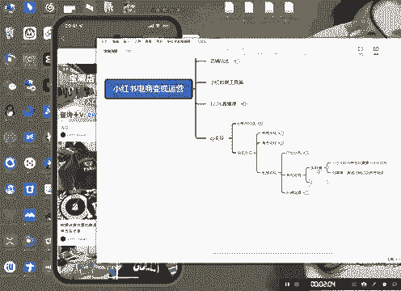

# 【2024版小红书运营教程】全B站最良心的小红书开店流程详解，高阶运营教程合集！小红书体开店，起号真的快，共1000集全是重要知识点，赶快点赞收藏起来！！ - P33：第32课：私域变现——如何导流私域【小红书零基础电商运营课~全流程】 - 一盏灯的时间q - BV1eSaMeWEXf

大家好，今天第二节就是咱们这个思域变现的第二节课的账号运营啊，我先给大家看个案例啊。

来看看这个啊，这个就很很露骨了，很露骨。你们可以看一下，直接把导流形式直接挂在这儿啊，直接把导流形式挂在这儿。然后你看这个是二奢的，你看它没有到发妆笔D，我跟你讲，它全是纯自然流啊。

没有没有没有投过广告，没投过广告啊，你们可以看一下，你们可以看一下，而且它全是发的是图文，酒图装的。然后你看。很多人很多人在下面评论，我跟你讲，有一部分是他自己的控屏啊，有一部分是他自己的控屏，知道吧？

好，首先说一下账号定设置啊，第一个就是账号的一个基础设置，什么呢？

当然啊当然兄弟们呃呃，当然他在我是呃，他在我是有过那个认证的，他这个二手奢侈品是认证的，所以。呃，所以他这个就比较好。啊，然后我们自己平常没有认证的话呢啊需要一些认证，我们不需要认证。好，第一个举证。

什么样举证做呢？一个小红书账号。需要。手。🎼就是不需要实名认证就可以发笔记了，知道吧？小红书是不需要发笔记，不需要呃，不需要实名认证就可以发笔记的，所以这个是可以举证做的。明白吧？它是可以做举证的啊。

这是第一个。🎼啊，对于账号的一个要求。第二个是什么呢？就是导更重要的。第二个是什么呢？就是。对。第二个是什么呢？可重复。啊，可重复什么意思呢？比如说你有账号被限流了或者怎么样子的，你直接去注销啊。

直接注注销之后养号继续啊，养号我我们都讲过，对不对？好，这第一个第二个导流模式。

啊，像他这种我不建议啊，像他这种我是不建议的，我是不建议的。我建议你们做什么样的类型的呢？兄弟们，像他这种的，我不建议啊，我建议你你们做什么样的类型的呢？

第一个就是呃像我这种的直接把这个导留在这A在这上面，这是第一种啊，这是第一种，就是A在这这上面的啊。你们看这个啊，这个也是A在这儿的。还有第二种是什么呢？直接啊像他这种的也可以也可以啊，把它A在这儿啊。

这些都是导流方式。注意啊，私信一定不要回，私信千万不能回啊。回的话呢，有问题的啊，回的话有风险，明白吧？如果说你回复的话呢，就就很容易被限流，私域一定不要回，你直接在这，你看到没有？

人家都全部都是私信不回的，全部都是私信不回，专门有个小号啊，专门有个小号是是专门回复私信的啊。啊，第一个就是艾就是直接在首页艾特小号。第二个是在个性签名这啊，个性个性个人签名。签名上把。

把那个小号签上去啊，把那个签小号签上去。还有一个叫什么呢？就是咱们控屏啊，控屏评价啊，控屏。用小号导流。啊，这个这个应该懂我意思吧，就是控屏。就是因为你比如说你每你发的产品里面，你你的产品。

你的产品肯定是有一些就是负面的评价，或者同行在下面回复的这个产品很垃圾，不要去那个那个啊，你要用小号，你要你要你要直接去控屏，你把大号，你把你大号，然后把删了，然后把小号的那个评价置顶，知道吧啊。行。

这就是我们的一个账号，这个东西主要是做啊，兄弟们没有什么太大的一个技巧啊，没有什么太大的一个技巧，或者说没有什么难难度啊，你产品是核心啊，产品最重要的账号运营是其次啊，账号运营产品因为有了好的产品。

你的思域才有可能做，好吧。

