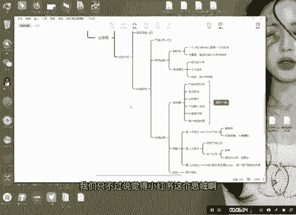

# 【2024版小红书运营教程】全B站最良心的小红书开店流程详解，高阶运营教程合集！小红书体开店，起号真的快，共1000集全是重要知识点，赶快点赞收藏起来！！ - P34：第33课：私域变现——私域运营【小红书零基础电商运营课~全流程】 - 一盏灯的时间q - BV1eSaMeWEXf

大家好，今天是咱们思域变现课里面的私域运营。其实这个啊兄弟们，你们的产品好啊，然后导流足够量足够大。其实这个都是呃就是加分项啊，加分项里面啊，当然思域运营也很重要，不然你把账号导流量进来呢？

你没有运营好，那不那不太垃圾了嘛，对不对？好，行，呃，私域私域运营里面啊，最重要的是什么呢？就是咱们的朋友圈啊。好，我我跟大家说一下，思域运里面的朋友圈，主要分到哪哪哪几个呢？一个就是产品的自用分享。

第二个是生活观点。第三个是认知平时产品自由分享，就是你自己用了产品之后，这个产品之后怎么怎么样的？生活观点是什么呢？你要有自己的，让客户感觉你是一个人不是一个机器在发朋友圈，第三个是认知提升。

你每天都在进步，你是积极向上的，对不对？或者说你自己用对于这个产品的认知是什么样子的。

啊，第四个是什么呢？产品融入生活，这个产品在生活当中起到什么样作用？第五个价值观引导啊？我这样的吧，我我一拿一拿我们自己就是做课程的一个思语给大家分享一下，简单的分享一下。好。第一个小数电商。

第一个是什么呢？引子产品。第二个为什么付费避免为什么这个就是什么？

这个就是认知提升，这个认知提升，或者说这个就是观点啊，这个或者是观点啊，观点或者提升认知，对不对？好，融入生活是什么样子呢？啊，哎，这个就是比较生活类的呢，是不是羊群是不是最近发生的一些事儿。

这就是什么？这就是融入一些就是基本的一些生活，让客户感觉到我们这个不是一个机器，而是一个实实在在的人，明白吧？好，客户使用反馈是什么呢？就是哎我们有一些学员做的比较好啊，这种就是客户反馈，明白这种的啊。

基本上啊基本上都要有主要是分这大大类。如果说大家做产品的话啊，做产品的话呢，每天一条。

每天一条，或者是说你看看你的产品注重于比如说你是做礼盒装的水平。你比如说你我打个比方啊，你们是做礼盒装的水果，你们是做水果的话啊，你们做水果，第一个产品自用，就是什么呢？用了吃的这个水果啊。

维C特别补是吧啊，怎么怎么样的？好，生活观点是什么呢？一定要积极向上是吧？生活积极向阳，然后在果园拍张照片是不是认知提升，就是这个继承不仅仅是能够补充维C还能等等怎么样的，是不是产品融入生活。哎。

我们拿个礼盒装啊去送礼啊，也是比较好的，对不对？是吧？价值观引导，这种等等的。这个东西其实大家一定要去这个大家一只要去理解我这个观点，然后你们自己结合你们自己的产品发就行了。这个倒不难啊。好。

客客户客户比如说第一次我们基本上会有三次跟客户主动沟通的机会啊，如果说超过三次，这个客户还没有。下单的话还没购买呢，这个客户基本上就短期内他就不会承担了。好，第一次接洽，第一次接洽，注意啊。

一定要是影子品。啊，影子产品。啊，我们会跟客户说，你你亲你你你买了这个水果之后呢，你收到货了，跟我说一声啊，我我们这边啊会教你具体啊还有橙子的几种吃法啊。比如说比如说是哪种吃法，第一个就是直接吃啊。

第二个还有呢就是如果说有个发烧感冒的发烧感冒的，可以水煮着吃，水煮着啊方法吃，到时候呢不懂得吃不懂的啊，不懂的话呢，可以问我们对不对？好，第一个是饮食产品，第一次接洽，然后第二个是什么呢？

第二次接洽是什么呢？第二次接洽。

啊，收到产品之后，是不是有个正反馈了？收到反馈之后，第一个就是让他发小红书。在那发小红书，哎，清你们能不能帮我发小红书，这一单给你免了。免单第一个免单。第一个是免单，第二个呢，你的口感怎么样。

感觉感觉怎么样？能不能提点意见，有没有？提意见对不对？好？如果有正向反馈，马上去发朋友圈，是不是懂吧？这就马上我们既然有朋友圈的内容，客服也能够及时沟通，知道吧？好，这个第二个提提意见。第三个是什么呢？

第三次接下。

第三次接洽什么呢？就是。我们现在啊我们现在啊有优惠。有优惠怎么什么。之类的就直接推销产品就行了，直接推销产品就行了啊。好，买了之后好，回访注意啊，回访兄弟们，回访就特别重要，重关专门只注重客户体验。

客户体验。😊，啊，回访的话，你可以在微信里面直接给人家回就行了，或者是打电话回都可以啊，都可以。主要是什么呢？第二就是第一次接待跟第二次接洽。第三次呃第三次其实呃基本上客户他你在呃第二次做完之后。

他如果说okK的话，他直接会返单啊。然后如果说你自己再做一些产品的组合优惠啊就是。做一些产品组合。优惠让客户真的感觉到优惠啊，不要说那割韭菜的，不要说做那种割韭菜的产品啊。好，回访的话，那就不用说了啊。

根据你们自身的产品。好，这就是咱们呃一个完整版的一个私域运营。私域运营我可能讲的讲的实际上会有很多啊，实际上会有很多呃，我可能讲的稍微简单的点啊，大家具体的自己去结合你自己的产品啊，结合自己的产品去做。

然后如果说大家对私域运营感兴趣的同学，大家可以跟我合作啊。我们这边是有做的比较多的一些产品。然后说实话我们这边主要还是缺产品，缺产品啊。

因为我们这边呃你你我们包括我们现在做的这个概念基层都是别人的供应链，都不是我们自己的啊，我们只不过说觉得小红书这个思域啊，做的太有价值了，所以我们就去做了啊，仅此而已。好呃，今天的课程就录到这了。😊。

