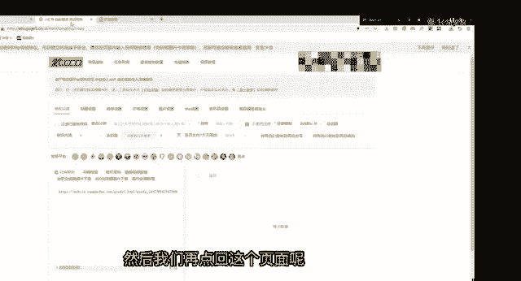
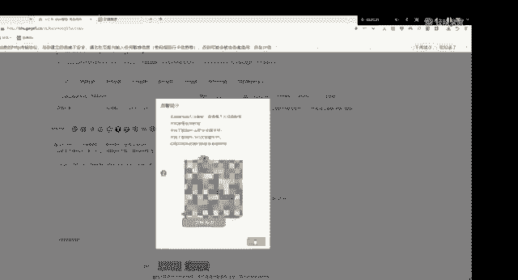
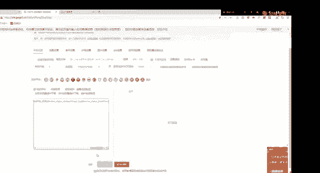
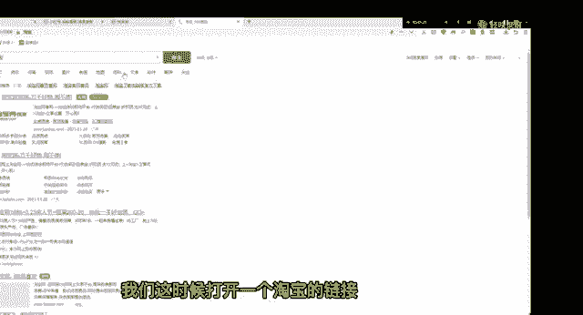
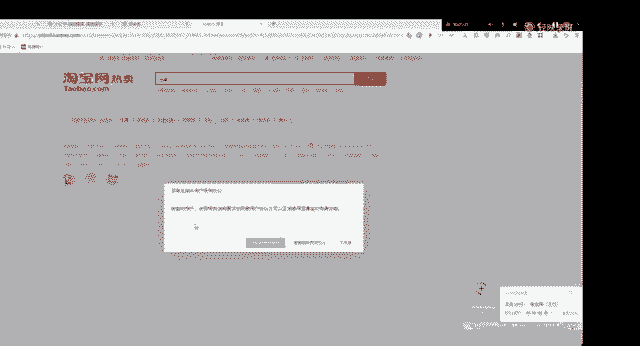
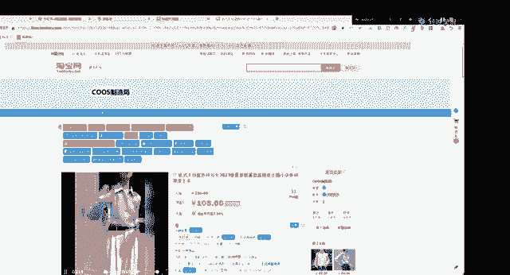

# 【2024版小红书运营教程】全B站最良心的小红书开店流程详解，高阶运营教程合集！小红书体开店，起号真的快，共1000集全是重要知识点，赶快点赞收藏起来！！ - P36：第35课：电脑插件下载安装【小红书零基础电商运营课~全流程】 - 一盏灯的时间q - BV1eSaMeWEXf

今天给大家来带来一个就是怎么去下载一个插件啊，就是插件的话，其实像至尊宝、蚂蚁搬家，还有呃达克宝这一些软件，它是需要下下载插件的。呃，它其实下载插件的一个流程，它其实都是一样的。

就是要把我们下载好的插件放进一个扩展程序里面。呃，大家可以看到，我现在已经是打开了一个蚂蚁搬家的一个入口，就是搬家路口，这里已经是有一个拼多多的链接产品链接了。它是它复制的时候是复制不上去的。呃。

这时我们就是需要下载一个插件，我们这里用到的会是1个360的浏览器，360浏览器绿色的那个就可以了。然后我会点这个下载浏览器插件，对吧？它就已经是下载入口了。打开可以看一下。呃。

他现在已是下已经是下载好了。那我们现在怎么安装呢？就是在这个扩展程序里是在这个地方，右上角这个地方，然后点这个管理。然后这里我已经是我已经是弄好了，我停用一下。我已经挺用钱。

然后我们把这个下载好的这个插件拖进去。它会弹出来一个这个蚂蚁搬家的一个扩展程序啊，我们添加一下就可以了。它就是这样子的。然后在右上角地方，它就会显示一个这样的插件显示，它其实就是可以了。

然后我们再点回这个页面呢，就可以就可以去搬家了。

哦，这时候重新刷新登录一下，重新刷新登录一下就可以了。我的开连接。

然后他会登弹出来一个登录这个拼多多链接哦，这里已经是登账号登录了。登录的话，他就可以直接复制出来了。哦，你看可以这样子直接复制出来了，它就可以了。

呃，接下来就是一个至尊宝啊，至尊宝的话它其实是同样的原理啊，大家可以看一下啊，我这里也是1个360浏览器，然后呃至尊宝的那个网页复制进去。呃，这个我们是有发在一个群里的，就是呃。是呃。

就是可以找我们的运营联系一下，要一下就至尊宝的链接。打开之后呢，我们需要点这里有一个安装插件。安装安装插件点进去，这里有个插件下载插件下载。然后这里就是你看当前浏览器。

这个其实第一个就是我们的1个360浏览器。第最下面这个就是极速版的一个浏览器，中间的是一个小伙伴，它是不同浏览器对应不同的啊，大家可以看一下，所以它的一个这个是有区别的。我这里点，因为是360浏览器。

点第一个就可以了。然后把这个。下载的这个。下载的这个至尊宝，它打开。从这里打开，然后。也是一样的原理啊，我们从这个管理里面点进去，然后把这个下载的至尊宝的这个呃插件拖进去。然后点添加，然后它已经有了。

会在右上角这个地方显示，它已经是可以使用了。呃，然后我们这时候去打开一个淘宝的链接。我们这时候打开一个淘宝的链接。

呃，随意点一个产品啊，可以看一下。呃，稍等一下。这里登录一下这个淘宝账号啊。扫码登录就可以了。然后它会弹出来一个呃商品链接嘛，正常不是购买的一个页面嘛。但是如果它是呃开了至尊宝的。

它这里会有一个这样一个框框的显示，它其实就是一个至尊宝怎么去使用的呃一个弹框了。呃，这里就是可以下载一个主图视频以及SKU图，然后还下载买家秀。那它这个至插件就已经下载好了。

然后主要用途的话就是去找一些呃买家秀啊，主图视频啊，可以下载。

