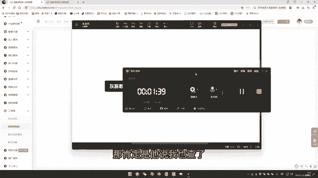

# 【2024版小红书运营教程】全B站最良心的小红书开店流程详解，高阶运营教程合集！小红书体开店，起号真的快，共1000集全是重要知识点，赶快点赞收藏起来！！ - P41：第40课：灰豚软件的使用方法【小红书零基础电商运营课~全流程】 - 一盏灯的时间q - BV1eSaMeWEXf

大家好，今天呢是给大家分享一下，就是咱们拿到这个手里的这个汇通数据之后，如何高效的使用这款工具来指导我们做店铺做笔记。好，首先第一个就是呢呃很重要的一个点就是我们刚开始去发笔记的时候。

我们编辑的笔记是否合格合规啊，新手宝子可能不就是不是很清楚。所以呢这款工具工具给大家开发了一个非常有用的功能，叫做违禁词的一个查询。

这个查询违禁词基本上行业里面所有的违禁词全部啊都涵盖在内。那么违禁词查询的方式也是特别简单。首先我们就是只需要把我们的笔记复内容复制在这里面，然后点击查询即可，我给大家演示一下。

比如说像这个啊是我们的笔记。那么我们这个时候呢，我们注意啊是所有的全部复制，所有的全部复制，包括咱们这个标题啊，然后复制进来之后呢，直接一键检测。好，它的违禁词是0，敏感词是0，那说明什么？

那说明我们这个笔记的内容是合规的那我们就可以正常去发了。好，这个是咱们一个就是。违禁词的一个查询。第二个呢就是笔记的一个收入。有很多宝就是啊我就说一发笔记第一条笔记就只有8个播放量啊，十0个小眼睛。

那肯定是他说我也查了，就是就是没有，那这个具体你的小眼睛很少的原因，其实有特别特别多。那么像一些比如你的剪辑不过关视频，这个质量比较差，或者是已经被检测到搬运等等等等啊，包括你账号标签没有打等等。

那么好，那么这里面就给大家一个很简单的方法，就是你只要去查一下你的笔记有没有收录进来。你的笔记有没有收录进来。如果说被收录进来的笔记，基本上会有上百个小眼睛的，这是基础的。知道吧？好。

那么具体的方法是什么样的？首先第一个最简。

简单的方子就是我们直接把笔记的这个链接丢进去，直接查询。第二个就是什么呢？我们可以直接把笔记收藏放入到我们灰屯数据的收藏夹里面去，然后在这里面一键上传，我给大家演示一下，点击我的收藏，然后在这里面点啊。

比如说呃这里是可以批量的啊，这里是可以批量批量上家上家就是批量添加之后，直接点击查询。好，呃，这里面会如果说大家是新号的话，这这里面的数据可能要等个几小时或者是10小时啊，啊，需要一点点的时间。

它才能够检测得到。如果说。

大家的账号比较老，就是已经做了十来天半个月，那么基本上是立马就能够查询得到你这个账号有没有被收录进来。好，比如说啊我已经确定好，你看啊这个你看啊大家可以看一下，这是我的查询记录。然后这个显示都在查询中。

然后这里面你看到没有，这笔记已经被收录进来了，查询到了，就笔记已经被收录了。然后呢这些就没有还在查询啊，好，如果说这里面显示没有收录啊，显示没有收录的视频宝子们，你们就把这个视频给删掉啊，因为没有收录。

说明你的视频有有一定的违规倾向。如果说因为违规的原因可能有特别特别多，那我们就不要去钻牛角尖，就直接把视频删掉即可。好，今天分享就到这。

