# 【2024版小红书运营教程】全B站最良心的小红书开店流程详解，高阶运营教程合集！小红书体开店，起号真的快，共1000集全是重要知识点，赶快点赞收藏起来！！ - P42：第41课：灰豚数据-快速打标签【小红书零基础电商运营课~全流程】 - 一盏灯的时间q - BV1eSaMeWEXf

大家好，今天教大家一个如何快速养号打标签啊，我们账号啊我们的账号，比如说账号注册完，很多人也就是按正常。流程刷笔记。好，这是一种养号方法。这是一种养号方法。但是这个这种方法会稍微慢一丢丢。

而且只是养成了账号，只是养成了账号。养成了账号。标签。标签准不准不清楚。好，这也是我们之前没有讲的一个东西。所以今天我给大家讲一个快速把咱们的一个。

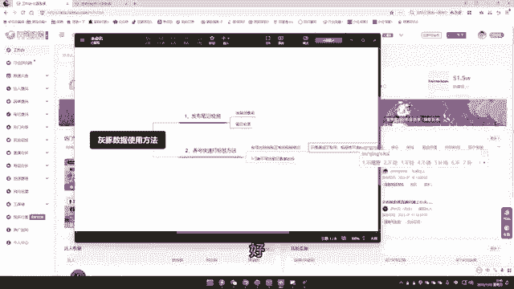

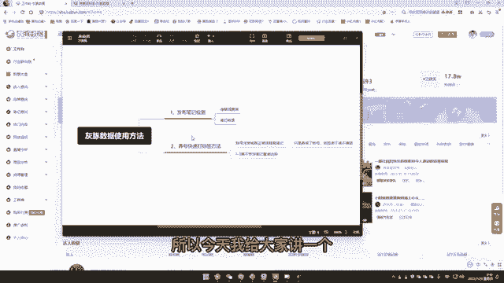

产品标签跟咱们的账号标签，也就是店铺标签跟。也就是啊。店铺标签。打标等于啊账号标签。啊，我们的目的是这个好呃，通过前期啊方方式就是通过1到3天不带货的笔记直接达标。好。

那么今天我们这个方法要用到这个工具。好，首先我们找到这个笔记查找。然后查找里面有个笔记搜索，我们点击这个笔记搜索。然后注意啊，注意我们在这里面首先我们要确定好，就是第一步先。

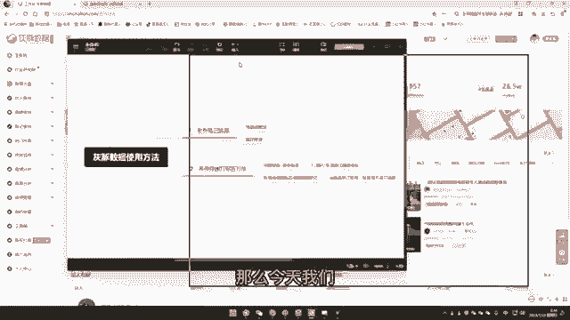

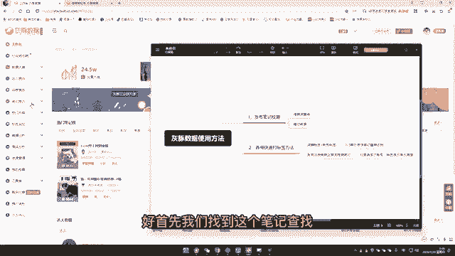

啊，流程。第一，先确定好我们的产品核心关键词，这是很这个是很重要的啊。有人说我想做女装，那女装你要收女装吗？其实这不行，这样不行，这样还不够精细啊，什么样的才叫精细呢？短袖女这种式的。短裤。呃。

连衣裙女，这个也是的，这个相对来说也是精选。所以啊大家能理解一下。然后我们这里的话呢啊比如说短裤女啊，因为我们最近在做我们最近报了一款短裤啊，报了报了有个店做短裤啊，一天出了有三四千单吧啊。

所以啊我我们今天就以这个短裤啊为例子。好，我们搜索之后，注意这里面有一个笔记热评什么意思呢？这个一定要勾上啊，这个也是之前没有讲的，之前没有讲的，为什么要把这个笔记勾上呢？因为笔记热评是什么呢？

笔记热评是咱们笔记就是账号笔记上面的一些真实用户的一个诉求反馈，热评越高，说明咱们这个对标账号找的越精准，对标的笔记找的也精准啊，所以大家能理解一下啊。好，这是第一个。第二个就是相关搜索，注意一下。

如果说咱们比如说我是短裤女，对不对？我们做的是牛仔短裤女。好，这里面其实可以延伸为牛仔短裤女，精准更加精准一点。如果没有，比如说你收连衣裙女可能在乱七八糟的啊啊，大家其实意思都是一样的，大庭相近的。

大家能理解一下。好，然后这里面因为我们刚开始就是我们刚开始做是不需要那不需要带货的，对不对？所以第二个不用挂车。

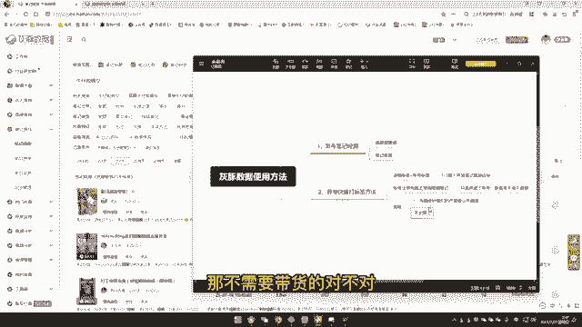

啊，第二个是不需要挂车不需要挂车。然后我们直接啊这里低粉报纹也其实可以不用点啊，这里面不用点啊，其实不用点的啊。然后呢我们在这里面注意重意重点是这啊，这里要点个穿搭确定好类目，还有一个是什么呢？

这里面风格风格可能会更加更加精细，我们应该一开始呢就找这种什么呢？找越精细的标签，先让我们账号越精细。好，比如说我点个纯玉，然后点个90天吧。90天太长了，最近三四天吧。好。

最下面所有的视频都可以参照我们的一个拍摄也好，还是一个做笔记的一个方式，这里面都可以，这里面就是我们的对标，这里面都是我们的对标，这里面全是我们的对标啊，我们可以我打开我随便点点开一个笔记啊。

这个是我看看啊，这个是视频。好，这个是视频，我们还是按流程来把它所有的都复制进去去剪辑什么乱七八糟的，还有一个是什么呢？我们可以看一下它是不是混剪的。哎，看到没有？宝子看到没有？这个视频它也是混剪的。

看到没有啊，我们就可以去把这种视频素材拿到从某音上去搬到搬过来，搬到小红书上来，这就是很成型的一个啊短视频，这就是一个很成型的短视频啊。然后为。

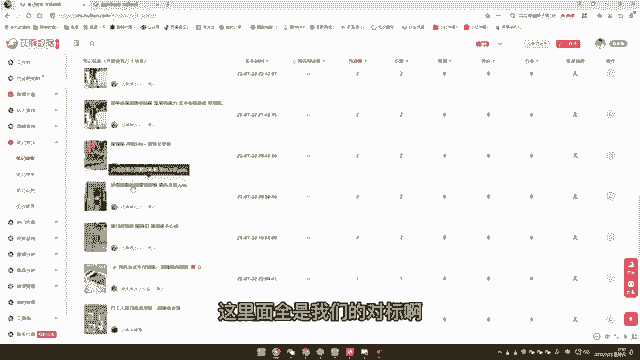

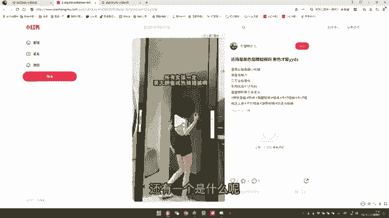

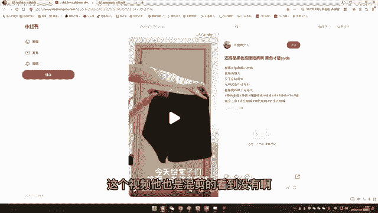

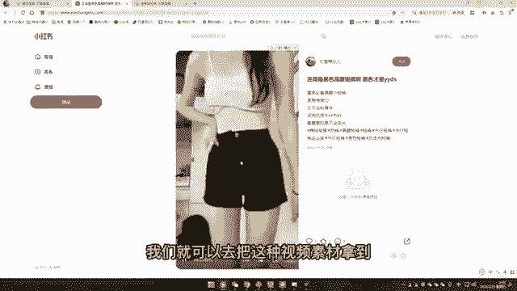

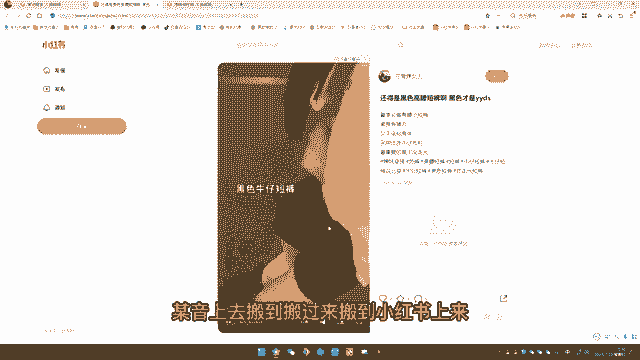

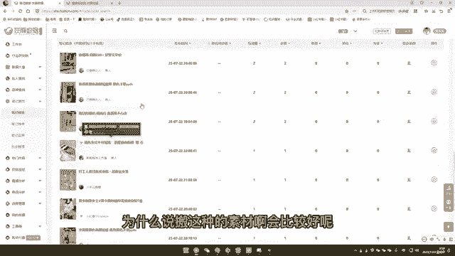

什么说搬这种的素材啊会比较好呢？因为他这种笔记他下面的客户下面的用户是非常非常精准的。用户的标签直打你的啊，就是这个逻辑是什么呢？用户标签。直达。决定了账号标签。从而影响你的店铺标签啊。

这个方式是最快的。我们基本上前期会找一些比较热门，更加适应。是如果说啊啊如果说更牛逼的啊，更牛逼的。如果说我们是有货源的话呢，可能稍微还有麻烦一点，各个点开去找一下我们相对应的风格。

如果说大家是做无货源的那更简单了，就直接抄第一个抄第二个抄第三个啊，就是前提是什么呢？能抄不要违规啊，能抄直接抄下来啊，直接抄下来直接标签打他的然后呢，我们直接去这个账号里面去看他搬什么品，他做什么品。

我们也做什么品啊。好，今天这节课就到这里。