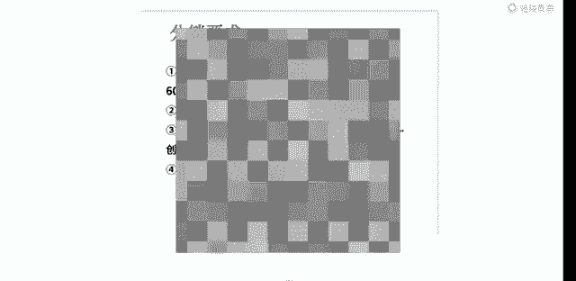

# 【2024版小红书运营教程】全B站最良心的小红书开店流程详解，高阶运营教程合集！小红书体开店，起号真的快，共1000集全是重要知识点，赶快点赞收藏起来！！ - P43：第42课：（新）拍单流程操作【小红书零基础电商运营课~全流程】 - 一盏灯的时间q - BV1eSaMeWEXf

根据我们平台的一个规则啊，最近的话呃大家其实可以在1688上面去下单。16688对比其他平台，它可能会有一些呃不好的点，但也有优势嘛，优势的话就是现在就是能解决一个拍单的问题啊。

那后续对接厂家发货也是更加简单的那他的劣势什么，就可能价格会贵一点哦，但是整个平台的情况它都是这样的话，那这个价格它其实呃相差的不会特别大哦，拍单的话，我们主要可以通过这个嘛。

那这边他其实你判断它的一个标准啊，就是呃主要是看他有没有一个就是7天无理由能退货的，对不对？那能7天无理由，因为能保证我们的售后嘛，这个售后才是第一位的嘛，然后这是第一个点嘛。

呃后第二点呢就是这个厂家他能不能跟我们一起合作嘛，对不对？他这里其实也有联系方式，那我们可以直接联系到他的一个情况。然后我们去跟他沟通嘛，或者是客服端。

跟他沟通，看一下能不能呃搞定我们这个合作的一个模式，就是可以签署一个代发合同嘛，代发合作合同。呃。然后第二就是刚刚说过的这个7天无理由运费呃，无理由退货嘛，这个是必须要有的啊。因为还有对。

还有一个发货时效，这是对我们自己自身的一个保证嘛。因为呃在其他平台上它都是一个这样子的一个规格。但是有一些他店铺在16688，有些店铺它是没有这个呃这个7天无理由的，所以大家一定要分清楚看清楚。

然后还有最后一点呢，就是呃这个工这个这个一般就是在1688上的工厂，就可能偏向于工厂店，他这种应该都是给给我们开到一定量的合同，他们每个月都可以开呃，哦不是不是合同，是发票，就发票。

然后我们这边也是有申诉成功的一个店铺申诉成功都，就是被被被平台检测到的。然后申诉成功的一个店铺。然后这边给大家看一下我们这个。就是发票的模板啊，其实大大致的发票模板呃，大致的发票模板就是这个样子的。

就是主要是能证明这个。呃，能证明这个产品从他家进了这个货，对不对？从他这个产品呢从他家进了这个货，那我们就可以去呃把这个上传去申诉。啊，这是一个点啊，还有一个点就是我们有一个代发合同啊，代发合同。

代发合同的话，他的一个。呃，要求点就是我们后台产品后台的那个物流发货地址，就是我们从产品从哪个地址发出去的那这个发货地址呢，和我们这个上面代发合同签署的是属于一致的情况下，它才是OK的。

就是属于一致的情况下才是OK的。然后这边我们已经优化了这个产品的呃产品的这个发货发货产品名称和这个代发货仓库地址啊，呃把这个填写上，然后保持一致，然后还以以及一个盖章。我们这边就是操作的一个这个呃。

也是一个签署的，就是。呃，这个也是一个牵署的，就是可以去操作一下，然后去申诉对应申诉。这边还有一点是需要大家注意的，就是我们呃刚刚不是说了那个。

1688我们去拍单嘛，对吧？对？那前期能解决一个这样的问题，但是我们量大了怎么去操作呢？那我们量大了，其实主要操作的话就是通过呃导表格的形式，或者是对接厂家呃，用软件嘛，也是用软件的一种形式。

但是但是呢就是我们呃就是比较常用的肯定是导表格的形式嘛，导表格的形式话呃。哦，不对，这这这是这是我们电话，比如你现在有几十单了，对不对？那我们几十单的情况下，我们就可以去联系嘛。

或者是二三十单这种都可以去联系一下，问一下嘛，对不对？然后问一下对接上厂家能不能把微信加过来，我们导表格的形式去给他发。这边给大家演示的是那个怎么去把表格导出来啊，就是比如我是这个店铺嘛，对不对？

我这个现在是没有单的呃，它是待发货里边嘛，会展示我们所有要发货的订单，那我就是全部导出啊，呃，导出来的话，他这边是在这边呃，我这是呃导出来的然后像这种啊。

就是呃第一个区分它的就情况就是我们从上面这一排我们去筛选嘛，对不对？数据去筛选出来。然后我们通过产品的一个名称去筛选呃，我这个店我这个地方呢，它是呃有已经完成的。

就我导出来的订单它已完成的那你们导出来的，它都是未待发货的嘛，对不对？那待发货的，你有他的。

电话地址呃，然后省市区那我们这这几排肯定是要去复制到另一个表格的。比如我这边。插入一下新洁表格。王白文答。那我正常发货呢，我就是通过复制它对应的这个，比如我先筛选，就产品筛选完之后。

那我先呃比如这是20个嘛，对不对？这是20个20个订单。那我哎那我把我得我得把对应订单号也得复制下来啊，对应订单号也得复制下来。那我订单号加上这个对不对？然后再加上我们这一排的呃姓名、电话地址、省市区。

对不对？那我们也给它对应复制下来，然，粘贴到这个地方。好，那我们现在后面后续还有规格，后续还有个规格，就是。呃，在这里在这里啊就是一个规格，就是我们课程的一个。

然后他这两个规格我们都其实都是要复制对应的。然后到这个这个地方复制到这个地方，然后我们呃还有最后还要确定一件事情，就是大部分的1个SQU件数。有些人他会买两件，所以需要额外注意嘛，对吧？需要额外注意。

然后我们再把它复制到这里面，然后导出来，导出来发给保存，然后发给那个厂家，对不对？发给厂家。呃，发给厂家，然后发给厂家之后呢，他会回馈到你一个这样的表格。比如呃他的姓名电话，然后一个订单号。

然后再一个快递地址，对不对？快递地址，快递地址呃，不快递单号，快递单号。然后然后你需要怎么操作呢？就是我们通过呃对应下载下载这个地方就是发货工具这边啊。发货中通局这边，然后这里有一个下载发货模板呃。

下载发货模板，我们对应打开这个发货模板，我们把对应的快递单号订单号它填写嘛。比如我把这个快递订单号填写上去，对不对？那我呃对应的快递单号我可能是已经复制了一部分了，复制上去了。好，那对应了。

这是我们对应这个快递单号，这这个一定要去查看一下。好，其次呢，他比如他发圆通的，对不对？那我们在这里找圆通嘛，这个下面快递公司对应的编码关系，对不对？啊，可以怎么搜索呢？圆通。

圆通我查找呃，查找全部，然后填把这个圆通的这个我给它复制到这个地方。

不知道这个地方。然后再保存，然后我们呃保存在桌面，我们就把它拖到这个地方去，那就是形成了一个发货。那这样子它就是能呃发货了，也不会有二次单号的问题啊。然后呃这是一种形式啊。

还有一种形式的话就是呃其实很多人他是不知道的，就是怎样的形式，就是呃他是通过那个他是通过那个小就是小红书一服市场，就是用店管家，店管家的话，他呃是可以绑定到厂家的一个店铺的。呃。

但是前提是厂家必须有店铺啊，厂家必须有店铺。然后他那边开通了，你这边也开通了，呃，他厂家绑定了你的小红书店铺。那他是小红书厂家呃，就是那个厂家是能直接看到你小红书店铺的对应产品的一个。呃。

产品的那个就是订单的，然后能直接给你打单的，这个是其实是最方便的。但是现在小红书它对应的厂家其实并不是特别多。所以后续的话如果量比较多的话，差厂家也比较多的情况下。

那是可以去入驻这个呃厂家的这个信息就是。店管家去对应打单的，这个会比较方便啊，他订单能直接给你从后台打掉了。呃，这是最方便的。呃，还有一个就是呃通过这个把这个子账号进一个子账号给给给那个厂家嘛，对吧？

厂家帮你去打单，但是他的弊端就是厂家能直接看到价格呃，这这这几点的话，就是我今天想分享的一个内容。就是前期解决我们前期一个拍单的问题，以及我们怎么去对接厂家呃，怎么去选择的一个问题啊。

