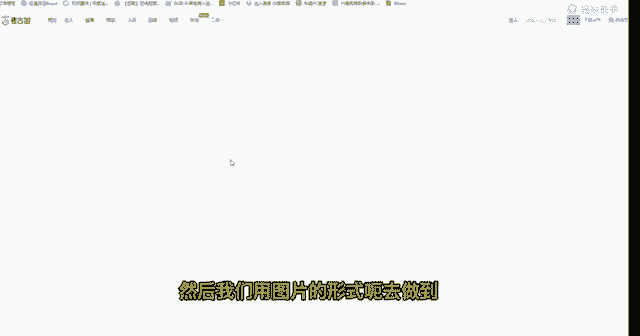
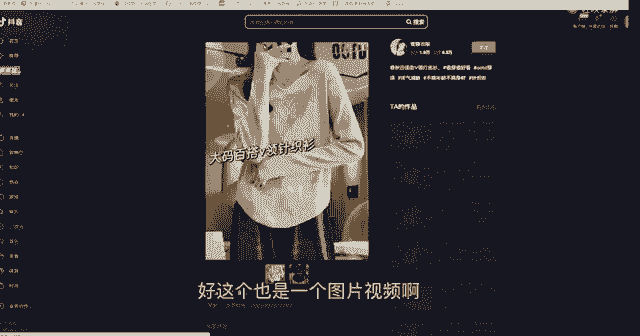
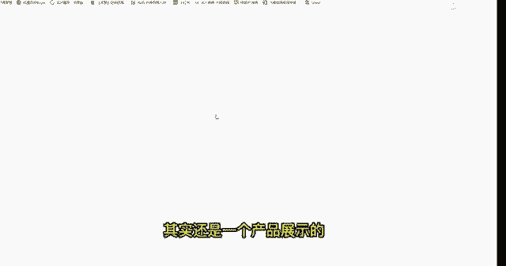

# 【2024版小红书运营教程】全B站最良心的小红书开店流程详解，高阶运营教程合集！小红书体开店，起号真的快，共1000集全是重要知识点，赶快点赞收藏起来！！ - P45：第44课：考古加操作流程【小红书零基础电商运营课~全流程】 - 一盏灯的时间q - BV1eSaMeWEXf

今天给大家带来一个就是我们考古家的一个选品和呃找素材的一个方式啊。呃，首先我们是这是一个考古家的页面啊，可以看一下考古家页面呃，百度上也可以搜索，或者是你直接百度里面呃，网页里面直接搜索考古家呃。

它也是能跳出来的，然后我们进入到这个。然后这个是需要会员的，就需要会员的。然后收费的话还是呃可以大家可以自行去看一下呃，200多一个月。嗯，然后像我们找产品的话，第一我们先从这个地方去搜索找产品啊。

然后搜索我们关键词。那么这个关键词呢呃可以是从呃各个平台的榜单或者是。呃，直接去搜索你要操作的类目就可以去找到一些产品。呃。这里比如如果你是做女装的，你可以先搜索女装嘛，对不对？搜索完女装之后。

它会弹出来整个女装的一个呃类目产品。呃，这是针对性，它是不是很强的一个搜索，那如果我们是要做呃因为我们是要做细分类目嘛。那做细分类目呢，我们就是其实是需要去做单点的一个产品搜索。呃。

比如呃我们做类搜索毛衣。哦，对毛衣毛像我们现在其实应该是做一些比较应季的产品，以及往后呃我们会比较热门的产品。比如我们可以做冬季的毛衣开衫裤子呃，这种百搭类型的，或者是呃呃大衣风衣这些外套呃。

这些后面可以持续去操作的。而且现在就已经可以开始操作了的产品，那我们就是要季节点。去提前或者是当下应急的产品，咱们去搜索。然后这里如果是搜索毛衣的话，它可能找到的产品就不会特别多。因为。因为像抖音里面。

它基本上偏向于这种比较呃热门的产品，它其实是应急产品为主。像如果是那种呃刚出的或者是刚上新的它的一个短视频啊，产品它可能会少一点啊，这一点是大家可以先去搜索看嘛，对不对？然后我们搜索完之后呢。

我们是点到这个呃这个代货类型嘛，我们主要是以视频为主嘛，视频为主。因为我们为什么不以直播为主直播为主的话，它肯定是没有短视频的。因为我们肯定要做混剪嘛，对不对？我们肯定要做混剪。

或者这里还有一个就是我们可以选择商品卡为主。因为如果我们是做。我们是做产品去做呃上架，然后我们单独去做这个产品的，再去找产品的视频。商品卡为主，它就是呃能就是直观的反馈我们这个商城流量。

那它的自然权重呃，它的曝光是会比较高的因为它既不靠短视频，又不靠直播，它就直接在商城里曝光。那说明这个产品它其实是比较OK的，它能吸引到大部分的一个人群，然后在商城里曝光。那我们小红书里它也会有商城。

但是我们小红书的商城，它的曝光其实是比较小的，我们主要还是靠笔记嘛，那我们这个产品它其实也是可以选择的。然后我们这里先以视频为主嘛。啊视频为主啊，这里视频为主之后呢。好。

我们往下我们去找呃这个找产找这个产品。好，那个它这个新增销量啊，我们这里可以选昨日或者7日，其实7日会比较好一点。我可以直观看出它的一个销量趋势是怎么样子，比如我是从呃从一点点上来，对吧？

然后它就下去呃，一波爆发，这种有可能是头流的嘛，像这种情况的，呃，有可能是头流了一波。然后像这种的，它可能也是头流结束的啊，然后像这种的，它就有一种持续上涨的一个趋势。

这种可能就是比较稳定的一种呃比较全面的一个款式，然后像。像这呃像那种，如果是比如像这种。这种有起一点点起伏的还是比较好一点的。如果你是呃比如下上去下滑，它比较那个。呃，就比如是像走这种走下坡路的。

其实不是是不建议了，就不建议操作了。但是也可以操作看一下。因为呃有些平台它就比如你搬运到小红书上，它其实是有延迟的嘛，就是呃抖音上的产品，它和小红书上的对标产品，那它虽然爆款是肯定是相同的。

但是有些人他搬运是有延迟。为什么我们要操作近期的爆款。因为就是因为我们是为了能去提高这一部分的搬运的一个时效性，然后去做到这个产品的节流嘛，对不对？然后找到一些热热销产品，就近期热销产品。

那其实这种其实会更好，这种产品其实会更好。然后但是我们这里也是需要去看一下前面的这个款式的。比如呃我们看到一个这样的款式，对不对？还是也是要以产品产品和对应那个曲线嘛。它突然上涨有个。

这个有点像头流的款式，但是它也确实能转化。然后像这个我们从这个地方我们点进去去产品。好，我们点击到这个里面，它会有个关联产品。我们下面能看到很多的这种。很多的这种呃短视频嘛。

那我们可以点进去看一下它的短视频展示的一个情况嘛，对不对？我们也可以去做一个多视频素材的混剪。然后。

可以看到来一个视频情况。啊，好，这个它是一个呃是一个图片的图片的形式啊。那这种其实我们的参考点其实会比较少一点，用的可能会比较少。不过这种呃这个可以去做封面啊，就也可以去选择。像这种的话。

也是可以做封面。

好，那我们这边呃再点回到这个地方，然后再看一下他呃有没有一些视频可以呃可以使用的。

呃，他这一个就是一个呃短视频的形式呃，这个短视频它其实是可以用的，但是只能作作为一个素材啊，像后面这种呃它带有一个漫画这个大头大头贴的形式，其实不推荐。但是像刚刚那个动漫点的形式，它是可以的。好。

那这就是一个素材吧，对不对？然后我们再点进去看一下还有没有其他的素材。好，这个好像应该是图片。

对，这个是图片的形示。

这图片的话就用不了了。

这个也是一个图片，这种也可以作为一个封面。

也可以做一个封面，而且它是多色的嘛，对不对？也可以做一个封面。呃，像这些图片，我们比如如果这个产品它起量了好，那个这个图片呃它也是可以作为一个就是多视频素材，然后我们用图片的形式呃去做到一个文件的效果。

图片传视频文件的效果，它其实也是可以的。但是我们得让它起量再去操作，效果会好一点。因为如果你单一去操作的话。

第一，它的素材素材图片素材它是很容易直接被搬运的，直接搬运的话，它的效果就会差很多。所以这个大家需要去注意。如果直接搬运的话，它的效果就差很多，所以就很容易违规。大家都是用这个视频素材的话。

它就特别容易违规嘛。所以大家一定前期是去操作多视频素材文件的形式。

啊，这个也是一个图片视频啊。

图片图片素材啊，那他这个没有这个方法其实能找到的会比较少一点。所以大家找的时候需要去注意一下。他是能筛选出很多呃素材的嘛，但是我们也要也要去筛选款式，或者是筛选他的那个呃就是素材。

就是视频素材和图片素材，我们需要去筛选出来。那我们首先肯定是找款式嘛，对不对？找完款式，我们再去找素素材。像他这里面其实比较。呃，也是比较。比较广，就是其实比较杂的，就是这个我们是自需要自己去筛选的。

呃，比如如果是我们之前呃，比如你找的时候，你可以是宽松版型的。呃，毛衣好，我们找的可能关键词。就是可以把它带的带入的时候更细分一些，他就找的会更加精准啊。呃，找完了之后记记点这个。就点这个地方。

就是视频为主，主要是以视频为主，或者是点商品卡，商品卡去找产品嘛。啊，像这种产品其实都是可以的，这应应该是一个新品，而且关联只有关联了一个视频。啊，销量也是刚涨的，刚推广的，首以这种是新品。

完全是可以去操作的。呃，点开看一下它的。

呃，视频素材是怎么样子的？

好，那这种其实就完全可以操作了，这种是呃一个视频素材了，而且是一个多色的。都是的，然后他其实里面也好几个视频素材嘛，那我们可以去做一个混检，而且他你可以发现他是一家的那就说明啊这个人呃这个人的账号。

他就发这发了这个产品去做报的。而且你看这边后面视频是有带销量和小销量进点数的点赞互动销销售额。好，那这个就是我们参考的一个方法。呃，还有一个点呢就是呃可以点这个商品卡为主，对不对？呃，商品卡为主。

那他商品卡为主呢，我们。去找那种销量就是靠前的嘛，就是筛选完销量靠前的。好，那这种款式我们可以做就是作为参考嘛，就作为作为参考，我们把产品选过来。然后我们再单独去找这个视频，单独就是我们课程里呃。

就是找老师额外要一下呃，单独怎么去找视频的一个方法。呃，单独去找一下这个款式找素材嘛。对，也是就是手机抖音里面去找，就是我们以图搜物的去找呃，这是一个方法。然后然后我们还有一个进进阶版。

进阶版的话就是呃它是在找视频里面找呃，找产品的话，就是可以直接点产品点进视频。那。好，那他找视频他就有点一点点区分了。这找视频上，他能直接找到很多短视频。那找到很多短视频它是怎么操作呢？呃。

这里我先搜索，比如搜索宽。搬做毛衣好，然后呃搜索完之后呢。一般哦最开始的时候我们是其实会在电商视频里找，它是能找到很多呃商品。对应它这个产品能看到销量。其实这是一个方法。它是直接有一个短视频的。

他这个短视频其实还是一个产品展示的一个短视频。所以这种其实是会比较高效的。

呃，这种就可以直接拿来用了，直接拿来用。然后呃稍微再代入一点混简吧，稍微代入一点混检就行。呃，然它下面还有一个同款产品相相同的视频。看它这里好，我们而且是对应不同的一个不同的一个这个账号的。

然后我们可以直接去操作，那这是一个就是可以直接找到的。但是呢就是我们在电商视频里面下面，它其实有很多它不对的信息。那它不是这个衣服款式的信息，那它会有很多很多这个是需要去筛选的嘛。

筛选的那但是它也是对应很多产品呃，这是一个方法啊，还有一个方法就是在内容视频里面。内容视频里面好，我们去找也是找到这种产品和对应的对应的这个视频。那我们也是直接点进去视频啊，它这个下面会显示商品嘛。

那就是有没有挂车，对不对？那我们直接去找的时候，我们找到，比如找到一个。呃，找到一个。呃，这种商这种这种产品嘛。

然后然后我们点进去之后，一我们可以看到这个产品，对不对？我们可以看到这个产品啊，也可以看到这个同款的视频。

好，那那还有一个方法就是就是我们可以看到他这个账号。那我们点进去他账号，他能看到对应的很多。就很多他的穿搭产品，那穿搭产品它其实呃就比如。

相类似的款式和相近的款，它其实都是拿可以拿来用的。比如他这些款式好，它只要符合你的小类目标签的，我们都可以拿来使用。那这一个方法，它其实能找到我们在抖音上的一个对标账号，呃，也是一个比较就快捷的方法。

其实这些也可以用，都是做开山呃，比如它这个开山版，那我们可以做一些多视频素材文件嘛。然后它这有个对标的一个通关视频排行，对不对？那我们可以其实能能用的就其实是比较多了。好。

就是我们在考古家是就是找找款式找素材，视频素材就可以用到我说我说到的这几个方法。那我们再回顾一下，总结一下，就是呃第一点就是在找商品这边啊，然后我们是主要是以视频为主和商品卡为主的呃去搜索啊。

在这个地方这个板块。然后还有一个就是找视频的板块。找视频的板块呢呃内容商品和电商商品其实呃内容视频和电电商视频其实都是可以的那它的区分呢就是呃电商视频会比较杂，可以包含很多内容。呃。

内容视频呢它就只直接对标到产品，然后我们可以去通过这个方法找到账号呃，然后呃其实这两个方法其实都能找到视频素材嘛。那像找产品呃，说到的那个点，它其实也能找到素材。呃。

但是我们回就是回归到呃回归到本质我们其实呃找产品找素材，它其实都是可以通过这个抖音平台。那我们用到最快捷的方法，我们去筛选到一些比较呃热销的产品，其实是近期比如刚起销量的产品，它近期有销量。

它近期有评价好，那它就是一个近期比较热销的产品呃，他推不管它是什么的样式的出单方式，比如是它是推广的或者自然流的或者短视频的那他能能推得动的，说明他这个产品，它其实是在大众的眼光里。

它能有一个不错的一个销量，它就是属于一个爆，所以我们就可以选择。

好，今天的课程呃，关于考古加的课程就讲到这里。