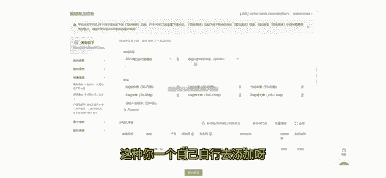
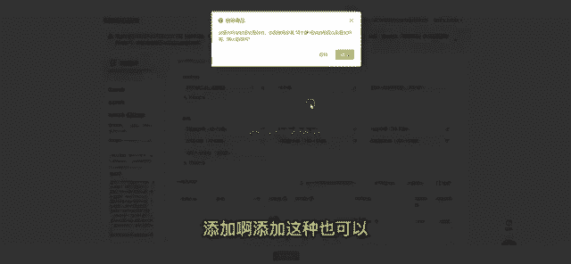
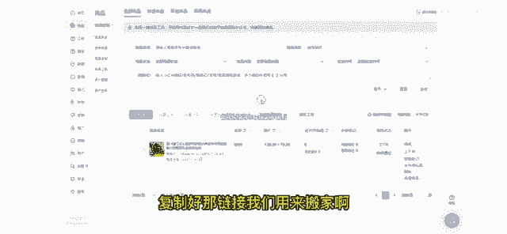

# 【2024版小红书运营教程】全B站最良心的小红书开店流程详解，高阶运营教程合集！小红书体开店，起号真的快，共1000集全是重要知识点，赶快点赞收藏起来！！ - P46：第45课：（新 ）产品上架流程及产品优化【小红书零基础电商运营课~全流程】 - 一盏灯的时间q - BV1eSaMeWEXf

今天给大家带来一个咱们上架产品的一个流程啊，就是很多学员会问到就是蚂蚁搬家呃，然后达克宝，还有一个欢乐逛这些呃等搬家软件嘛，就是有什么区别啊。其实他们的就是区别性其实是不大的。

咱们进入到这个服务市场啊呃，一键搬家呃，像这么多其实都是可以用的。但是现在就是蚂蚁搬家，他会对一个就是搬家是需要一个店铺授权的嘛。所以他现在是用不了了。所以我们现在就是全力推荐大家用这个。呃。

蚂蚁搬家嘛，就达克宝用不了，达克宝用不了啊，还有一个就是呃欢乐逛网这些其实也是可以的，也是可以的。就是因为我们现在就主要上的是1688的产品链接嘛，1688产品链接其实多个平台都是可以使用的。呃。

不不光是就因为你们现在拼多不是搬家，搬家，我们拍不了，拍单，拍不了嘛。那我们主要就是1688嘛。所以像呃全部的这些产品链接其实都是可以的。那我这边用的比较全的就是一个呃蚂蚁搬家。😊。

我点进去给大家演示一下啊。呃，首先我们蚂蚁搬家呢，我们这里其实需要改动的地方啊，呃，就第一常规设置里面我们就是一个不实用品牌。我们要点上啊不实用品牌。然后下面就选择一个非偏远地区包邮。

非偏远地区包邮模板。呃，然后还有一个就是这个物流模板，这是我们自己在外面填写好的啊，在外面填写好的。好，第呃下面一个呢就是一个时段预售和一个非时段预售。😊，呃，就这个就这个区别就是呃非时段预售。

它就是48小时发货嘛。那这个时段预售呢，它可能改成3天、4天、5天、6天、7天。呃，当然我们的发货时效肯定是48小时更好嘛，因为有流量扶持会更高一点。商商城的啊商城的那呃三天发货的，它是一个相对的时间。

相对来说会比较保保守一点，会更更好一点，为什么呢？就是它能让我们去就是有更充足的时间去发货。呃，不会吃到呃那个发货超时的违规啊，其次是发货超时还会扣钱，对吧？这是我们都是需要前期去考虑到的啊。

然后这里设置好之后，记得保存啊，然后还有一个设置就是库存可以直接设置为1万个或者是10万个。😊，也是一样的，就是保存，然后价格这一块呢就是200加5。2000分加5。2000分加5。

这个就是我们所说的两倍加5嘛，两倍加5我们也是一样的保存设置。好，那我们全部的保存设全部的一个基础设置设置好了。像这个几点，我们就是在这个。😊，在这个其他软件里面也是通用的，全部都通用的。

我们只要设置好这个价格，然后像这个物流模板发货时效，然后还有一个运费模板。然后其他地方的话，这个品牌的话好像其实是不需要选择的呃，就可以了就可以了。然后我们就可以去半价了。

然后我这边呃直接给大家去百度里找吧，比如搜索淘宝，对不对？我打开淘宝。😊，我直接淘宝网。我随便点击一个衣服嘛。然后我们复制是上面这个产品链接啊，复制上面这个产品链接。然后我们到这个蚂蚁搬家里去呃。

这是一条，对不对？呃，像蚂蚁搬家，它是比较全面的。它抖音呃小红书呃、拼多多、1688这些都可以。但是我们现在主要就是呃1688产品链接嘛，对不对？那我们呃我再打开1个1688嘛，对不对？😊，1688。

我找到一个。呃，也是女装吧，然后也是复制上面的一个长链接啊，复制之后，然后这边是可以换行到第二行。呃，那我这是两个了，对不对？我两个其实也可以去识别的，就用软件的话，它是可以多个去识别。

那我这里就可以直接复制出来了。呃，点复制下一步就可以复制出来了。然后然后还一点这里需要注意，就是我们讲到的，我们现在为什么上架产品链接都是通过1688呃，就是我们我们现在。😊。

不是我们拍单只能走1688吗？那保证我们自己产品利润能确定好呃，不会亏本，然后以及呃你能清晰的找到这个产品链接，那就直接上1688链接就好了。呃，但是我们这边其实上淘宝的什么的，其实也是可以的。

但是我们得对标的最终价格得对标1688，我们拍单的拍单的价格嘛，我们不能保证自己亏本嘛。然后这里第一步搜索完，我们第二步就可以复制了嘛，复制呃，然后可以在这个任务列表，上面上方有个任务列表。

这里可以查看到它正在处理啊。然后我这个店铺它是一个正在。😊，然后我们这个任务列表里面点进去可以看到我们的一个产品的一个上传状态啊。然后我这边的我这边的一个店铺，它是一个正在关店的店关店的店铺。

但那就看不到它的一个产品信息了，看不到它产品信息了。呃，上架这里比如它执行成功之后呢，它就会直接显示上传成功嘛，上传成功之后，我们点开这个想入千翻的一个首页嘛。然后左侧一个商品里面，这里就会上架成功呃。

上架成功。然后我们上架好之后呢，这只是上架到我们的仓库。那我们是不是点上架架去呃去把产品上架呢啊，那我们在上架之前，我们是需要去编辑点编辑，我们是需要去做产品优化的，就不能直接去上传。呃。

像我们这第一板块嘛。第一，我们要看产品标题，对不对？我们第一不能带其他平台信息呃，相对来说一个完整的一个标题呃，肯定是越字数越多越好嘛。😊，呃，根据你的一个关键词，它能增加更多的这个搜索流量啊。

这是第一点。第二点的话就是一个商品属性。商品属性涉及到的就是可能货货号，然后或者是你的材质面料等等。呃各种各样的呃，根据你的产品类目来产品来的呃。

那我这边呃其实已经填写的其实是比较一个全面的那呃可以根据你的对应的产品去填写。然后可以先就是如果是比较着急的，你可以只填只填写这个红心的嘛，就是带红心的填写，那是必填项。那像这种它不是必填项。

那是选填的。😊，这种其实填写上的话，它能增加一个产品的一个权重，更增加产品权重之后，它会得到更多的一个产品曝光嘛。呃，这也是呃相对来说呃有优势一点嘛，就是能上传就上传。然后下面的就是你的产品规格嘛。

产品规格，比如我这样子对应一个规格，这样规应一个规格，它等于一个一个SKU嘛，对不对？这种你一个自己自行去添加呀添加呃添加这种也可以呃也是可以的，呃，但是得根据你上家的一个情况去添加。

然后一个产品里它SQU不要特别多，因为这个会考核到你的一个呃售卖的一个情况，就是转化率嘛。嗯，然后下面这个就是一个价格和库存嘛，然后库存的话就是在这一版块，这里呃更改增加库后库存和当前库存。

然后改价格就是在这个地方改在这个地方改。因为我们是搬搬家过来的价格嘛，所以价格就不需要改了。这个大家应该能明白吧。😊。

呃，市场价我们刚刚也是一样啊，设置一样的那它这里就会显示一个呃就没有显示了，我们这就不需要动了啊。然后下一点下一点呢就是呃我们的产品图片嘛，主图，然后一个商品视频呃，要求也是一样的。

就是呃不要带其他平台信息然后产呃产品展示的话就是清清晰的一个产品展示图，然后商品视频这块也是用来增加权重的，就是正常来说可以不去上传。但是你在上传了，它能增加你的一个产品权重啊，就这一点。

然后还有一个就是。😊，详情页也是同样要求，不要带有其他品牌信息或或者那种原创的图呃，都是一样的。然后像向下下面就是物流物流配送，然后然后像这个内贸，这个就是我们在外面设置好的一个呃物流模板呃。

然后呃这个发货的发货的预售时段，这些你设置好就不需要改动了，就编辑优化好呃，就不需要改动了。然后然后这个也是一样的，选择飞片员呃，就是我们搬家前都设置好的。

然后最下面的就是有一个售后服务支持7天无理由退货。呃，像不同类目的话会有一个不同的标准，啊呃水果类目的话，它是可以可以不支持这个7天无理由退货的。呃，像女装啊一些类目，它都必须支持的。

然后完善好我们整个信息然后如果有有错误的情况下会有违规的情况下，它左侧这个这个地方发布助手这框里面都会有提示你的。然后我们弄好之后，我们再去。😊，提交啊提交提交之后呢。提交之后呢。

我们就在这里它会在一个审核中，但是也是一个下架状态。然后我们这里边点一个上下架，点一个上下架，产品就上架了，产品就上架了，对不对？产品上架了。那这样我们呃就是已经在售卖中的一个价格了呃。

上售卖中的一个产品，我们就可以在店铺里搜索到啊，这是我们产品上架的一个完善流程啊。呃，然后我们现在拍单的话，主要是1688嘛。那我们尽量用1688链接啊，直接去搜索好手机端电脑手机端电脑端都可以去复制。

复制好那链接我们用来搬家啊，就可以了。😊。

