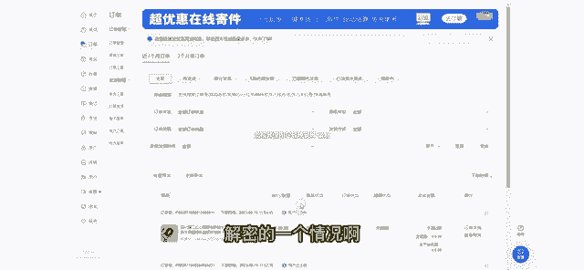
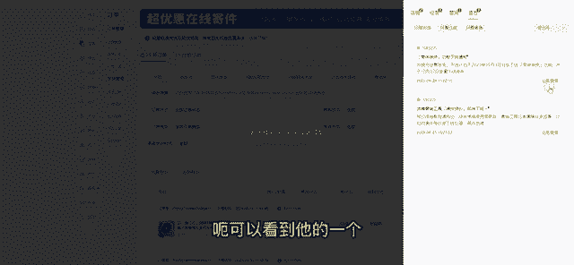
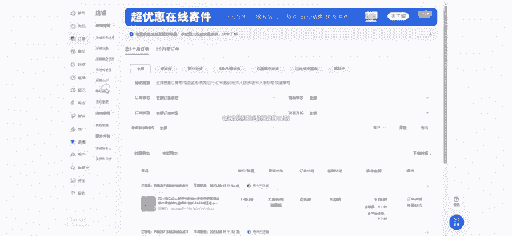
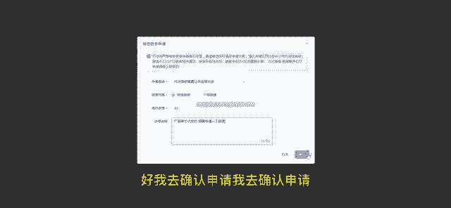
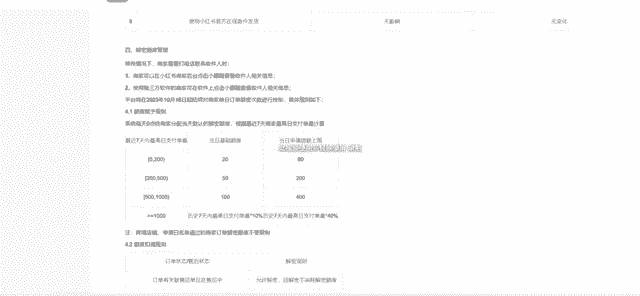

# 【2024版小红书运营教程】全B站最良心的小红书开店流程详解，高阶运营教程合集！小红书体开店，起号真的快，共1000集全是重要知识点，赶快点赞收藏起来！！ - P47：第46课：小红书订单解密额度申请（规则解读）【小红书零基础电商运营课~全流程】 - 一盏灯的时间q - BV1eSaMeWEXf

Yeah。呃，好，今天给大家带来我们这个一个新规的一个解读啊，就是我们10月16号更新的一个信息解密的一个问题啊。就是针对这个问题呃，其实很多人他不理解，就是什么叫隐私加密信息。

那呃他的其实就是对于针对我们这个产品。针对我们这个产品有订单之后。好，那我们有订单之后，它会有一个呃就是保密的一个状态。呃，就是为了防止你的客户的一个订单信息泄露，所以他有一个解密额度出来呃。

这个解密额度呢呃他是这样的，就是一个固定的一个额度，然后像这个像这个我们这边已经去申请了，比如申请了60单，对不对？多申请了60个额度，那他一天就其其实是有呃80个额度。

80个额度就是用来我们去订单里面去查看他们一个订单信息，去查看客户一个订单信息，点进去。然后在这个里这里可以查看到呃对应的一个订单信息，对不对？这个是我们的一个额度解密的一个情况啊，然后这边。

呃，可以看到他的一个。

就是额度的一个大概情况，就是。就是在这一板块啊，就是我们呃一个规则的解读啊，就是其实就是针对这个订单解密的情况的一个解读。然后这边它是有一个标准的，就是7天内最高日支付定支付单量。比如我0到200单。

对不对？0到200单，0到200单的话，它就涵盖了是呃，就是基础的额度是20个，然后当日申请上限80个，他其实是可以申请100个的，就一共100个一天，一一共100个1天，当日申请额度上线。

一共100个是吧？20个加80个，是不是100个呃，然后我这边刚刚也给大家看到了，我这边是呃去申请了一下，就申请了一下。其实。

都是都是可以去申请的。比如我这里点这个，然后20个，对不对？选择20个，然后说厂家代发模式，对不对？厂家帮忙代发。嗯。厂家帮忙代发的。🎼呃，需要申请一下额度。好，我去确认申请，我去确认申请。好。

那我是不是就可以呃再多1个20个额度？那如我今天已经有20个了，我可以再申请80个。啊，就是这个意思，就是这个意思。

呃，然后像下面就就是比如你大于200单了，到500单，那它就是一个增加了1个5一天50个，然后200个呃，就是后续的一个一个都是这样子一个查看订单信息，他的一个额度上限以及额度的一个基础标准。

那正常来说呃，你发货情况，他都可以根据这个去调整嘛？那如果你的额度是在呃，比如我是100个。那我的订单是在呃200多一点点单量，那怎么办？好，那这种情况下，我们去对接一下我们这个发货的厂家嘛，对不对？

我们去联系他，你说能不能咱们电管家电管家去对接打单。好，这是一种形式。😊，这是一种形式。那他对接打单的要求是什么呢？就是他必须有要有我们这个呃小红书的电子面单，或者是他有小红书的店店铺。它店铺里面呢。

我们可以去呃在这一版块订单里面有一个电子面单，他得去有一个店铺去申请这个小红书的订电子面单，我才可以去申请这个小红书的快递面单，然后才能同步帮我们发出货。然后刚好发这个小红书的小红书的订单。

就是等于我的店铺绑定了在了他的店铺下面。😊，然后他那边申请了电子面单，他可以统一帮我打单。那这个电子面单他是申请是什么一个要求呢？就是呃我这边作为一个商家，对不对？商家我需要去发货。

那我去申请这个电子面单，我是需要去联系对应的一个快递网点，比如我是中通对不对？我去申请好，他那个对应对应网点，我需要去跟他沟通的呃，我说呃这边我需要发快递，当然我们这个可以去呃就是要提前谈好的。

是厂家那边他也得提前谈好的，就是大概每天多少单，对吧？单量，然后其实是你的一个快递费用，一单多少费用，因为我们现在是走这个，如果要走这个平台升请这个面电子面单呢是去申请一个电子面单的一个额度。

他是需要去充值的那我这个时候是不是呃联系厂家之后，厂家那边去联系好对应的快递，我厂家再去对应的充值面单，然后同步的时候，然后就能打出订单了或者。😊，是你把你的子账号提供给厂家呃。

看厂家愿不愿意帮你充值一个面单，然后去帮你打单发货。啊，这个前提是你单量比较稳定且还不错的情况下呃，不要你单量少，你去找联系厂家，那厂家呃也不会愿意去帮你发呀，因为他是需要去充值面单额度的呃。

这个意思能明白吗？好，如果如果遇到你单少的情况下，你该怎么去操作啊，因为我们是1688拍，那我们直接去找1688那个商家去直接拍单就好了，也不用去联系他。因为我们这边店铺的话，走1688拍。

他其实呃还没有违规。因为它相对来说就是比较对比拼多多对比淘宝会好一点。因为拼多多有呃拼多多有那个拼多多面单嘛，他还会发短信，对不对？😊，还短信他是肯定会违规的那淘宝的话会对比拼多多呃。

对比那个拼多多会好一点。但是对比168还是会呃相对来说差一点。呃，最好的话还是1688，所以直接去拍单呃，拍单就行。然后单量多的情况下，直接对接厂家呃，就可以了。呃。

这个是我们一个电子面单以及我们的一个额度额度的一个范围讲解啊，就是呃大家就是不要过度去解读这个呃这个规则信息，一定要看齐全之后再去再去判断。因为很多人他说啊无货员怎么做不了了，对不对？😊。

这个其实他对他就是对于这个额度，它有一个增加有一个限制，就不让我们查看更多的一个额度。限制的是那些把订单信息呃，就是会有一个贩卖的一个情况。所以他会有一个这个额度的限制。嗯，所以针对这一点呢。

平台有这个规则出来。

