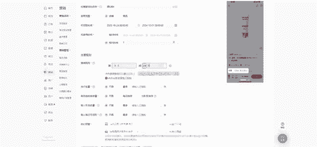
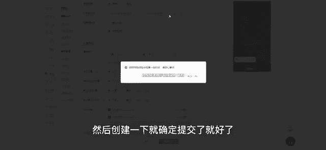
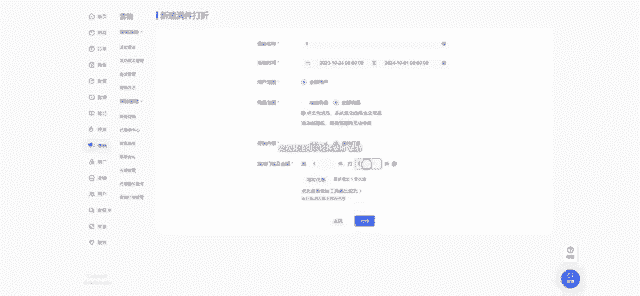
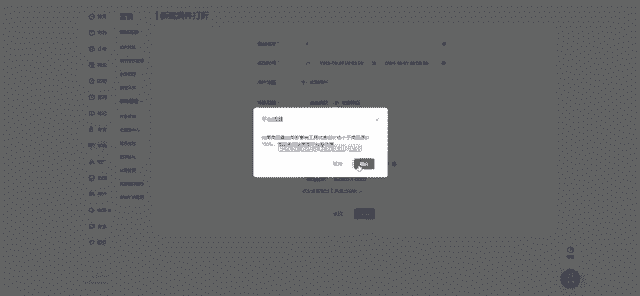
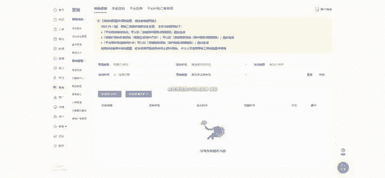

# 【2024版小红书运营教程】全B站最良心的小红书开店流程详解，高阶运营教程合集！小红书体开店，起号真的快，共1000集全是重要知识点，赶快点赞收藏起来！！ - P48：第47课：优惠券 折扣设置和如何参加活动【小红书零基础电商运营课~全流程】 - 一盏灯的时间q - BV1eSaMeWEXf

楚。然后我们下面一个板块就是讲我们的一个优惠券和活动啊，就很多很多呃就是小伙伴他们会对这个优惠券和折扣，不知道怎么去设置啊。其实很简单。呃，我们的优惠券就是在这营销优惠券中心里面，对不对？

它就是分为两种。第一种就是全网自动推广和一个新的券，就这两种。然后还有一种就是他的一个粉丝专享券，呃，还有一个就是直播间优惠券，呃，这种会比较用的比较多嘛。那我正常就是全网自动推广券和一个新人券。

这个是我们用的最广的，而且是最普通的一个券。然后像这个设置其实一点也不符杂。我们根据对应的去设置就好了。优惠名称名称很多小伙伴问我这名称填下。其实名称是不需要在意的。

就跟我们上面之前收到的一个物流模板名称，只要能自己区分就好了。那这边我因为我优惠券设置我可能是要对应的嘛，我蛮无检测。那我这里写蛮无检测。然后下面这个店铺试用的范围，试用的范围我会选择店铺啊。

店铺的话是整个店铺都能用商品的话就是单张的单张的话，你要一个一个商品去设置，除非你产品比较少，设置不同的一个利润，然后可以去额外调整。那我这边整体的话设置一个店铺的券店铺券的话。

后续可以设置单个调整的一个。😊，商品券。单个调整商品就就比如我这个产品我做一下降价，比如我现在是满5减4，我后面可能是满5减满6减5啊，我给他多减多减1块钱，我单独去控制它的一个价格。

那达到的目的就是给这个产品降价，我去做一些优惠，做一些活动。那我去做一些看看能不能转化提高，我们可以用这个来控制。好，下一点就是可领取时间。那这个时间点其实我们一定要长一点啊，一定要这样长一点。😊。

就是我会直接设置差不多近一年的时间嘛，近一年的时间为什么呢？就是不要设置太短的，因为一下就过去了，万一你什么时候优惠券没了，你都不知道啊，那你转化率低的，对不对？这个也会影响，所以直接尽量设置长一点。

呃后下面这个点就是可使用的时间，这一般都是选择相对时间，一天或两天。呃，绝对的时间是什么意思？就是。😊，就是。比如我设置今天到明年的呃，10月1号，对不对？他这意思是我万一是明年的9月30号领了。呃。

不对，就是明年我今天这个时间段领了10点10月24号，我现在这个时间段领了，对不对？我明年的呃9月30号他还可以用。那这个时间点呃，我们期间万一变动了我们的一个产品价格或者是呃就是做了一些折扣什么的。

那它的一个就是利润突然变低了，那怎么办，对不对？所以呃且还很容易亏本。所以我们这边选择相对的时间一天就是我领取了。比如我今天领取，我明天就到期。明天这个时间点就到期，就不能使用了，所以尽量选择这个啊。

然后呃规则就满减满满5减4嘛，呃满5减4。然后像这个地方啊就是有一个就是可以去自己增加嘛，就是自己去增加它一个呃优惠券的一个形式，比如我可能是满30减5啊，或者满50满60减多少，满50减多少。

满60减多少，对不对？😊，这种形式也是可以的也是可以的，就是一个P就是阶梯式的一个优惠券。这种是适用于呃，你到时候我报名活动的话，会有一个阶梯式的优惠券可以去参考。就是为什么呢？因为呃这种阶梯式的。

它可以去刚好也可以控制到到那个产品价格。但是会有一个弊端，就是我们的产品价格如果是偏高的话，它的利润率可能肯定会偏偏比较上面不会像我设置的满5减4，以及我设置的一个呃那种折扣来的更清晰一点啊。

好，下面的话就是不动了不动了，然后创建一下，就确定提交了就好了，提交就好了。然后我们的优惠券模板就设置好了，有优惠券模板就是啊这是一一这是优惠券的板块。好，还有一个就是商品促销，那就更简单了。

多品促销里面点进去有一个满件打折好，一样的。呃，这个是名称是自己做区分了，填个一都可以好，时间段时间段就是呃也是一样的，长一点，稍微长一点。😊。

差都是我都是选择一年的，然后这里选择是全部商品，设置满一件打7。5折。好，这样就可以了，我们去给它完成。

去给他完成。哦，我这已经设置过了，这里已经设置过了，这里已经设置了一个。然后这个活动的话都是可以编辑去调整的，去调编辑调整的。买一店打7。5折，7。8折都可以啊。

那这是一个正常的这个利润都是在30%到40%之间嘛。啊然后我们这样子去控制的话，更好的控制好我们的一个产品的利润嘛。然后也可以调整。然后下面就讲一个那个就是有一个活动的报名啊。

就活动报名的话呃全部活动就是我近期一个双十一嘛，双十一的话，它其实。😊，就是报名的话，它是有要求。第一，你肯定要有运费险嘛，就是我们缴纳保证金才可以开通运费险。所以这个呃保证金是一定要缴纳呃。

之后才可以去报名活动的啊，所有活动都一样啊。然后这是第一点。第二点就是。😊，他的一个他的一个活动要求就是你的售后率，还有一个就是发货率，这些其实都是要呃就是呃有一个百百分比标准的，就不能超过他那个标准。

然后才可以正常去参加活动的。好，接下来我们讲讲活动啊，我们活动该怎么去选择。然后我们这边正常来说啊正常来说，比如我现在店铺我没有营没有开单的情况下，我是可以去报名一个呃就是第一个。

但是我我报名第一个我一定是要去调整好我们的折扣的，调整好折扣的。条款好折扣的，就不可能是买满一件打7。8折，那种肯定不行嘛，7。5折肯定不行，就很容易亏本。因为我们还有一个折扣券嘛，对不对？😊。

我们还有一个优惠券折扣券。那这样打下来的话，我们其实我们的利润其实会比较少的。因为为什么呢？我这边给大家算一下我们的整体利润是怎么样的。比如我一个产品现在卖100块钱，对吧？100块钱。

那它的一个呃商品单品直降立减15和我们的折扣叠加，它是其实和折扣能叠加的呃，我现在打了一个统一8折，万一我统一打了一个8折，就是满一件打8折，那我是不是80块钱，100块钱变80块钱好，808呃。

80块钱然后们还要立减15%，我们是不是要再打一个85折，那就是68块钱，对，68块钱好，那我们再减去一个满5减4就是优惠券，那我们是不是就只有64块钱了？那64块钱，我们比如我是两倍加5上架。

我就是4042。5块。😊，啊，不对，50。呃，47。5块上架的47。5块上架的那现在的利润其实是比较低的，就是一个很低的一个状态了。64。然后我们还扣除平台扣点，然后万一开了运费险，还扣除一个运费险。

那我们的成本其实利润率已经很低很低了。但这种我们肯定很容易亏本的话，对不对？所以我们一定要调整它的折扣可能打个9折，我们再去操作立减15%。这样这样其实还是比较合适的。但是。😊。

但是呢如果如果是你没有调整好他这一个产品去报名去报名的话，好，那你很容易就亏本了。啊。其次，你这里一定要注意它的一个商品要求，小红书近30天最低价格。怎么说呢？就是。

他这个产品我们在小书上之前设置的折扣，它已经出过几出过这个单了。好，比如他之前是呃之前是100。呃，就是我刚刚比录的100块钱嘛，对不对？他是出过单的。😊，出过单的，但是他现在呢我要给他调整价格。

我给他调整了。好，那我报名肯定报名不了这个活动嘛，他会报名了，就按照100块钱的价格。那他现在就是按照100的价格来报。那我去报名的话，肯定是亏本了。因为我们调整折扣已经来不及了。

所以这个其实就上面这个活动，它其实是适合没有报名，没有出过单的，且可以调整折扣的一个呃这个呃活动。呃，下面这个呢就是其实比较常见的，就是300减50。呃。

它是可以和多店叠加的一个呃一个就是呃就是多个店铺它可以跨店来去消消费使用的。呃，其次是它这个折扣是互斥的。就是呃我报名了这个活动，我店铺的那个9折那8折的没了就没有了，就不叠加，这意思能明白吗？

就是比如我这个产品我一开始是卖100块钱的，对不对？但是我打了一个8折，我打了一个8。😊，我是不是要除以80呃，除以除以0。8？除以0。8，我算一下啊，100除以0。8。125块钱。

那他他就是125块钱嘛，对不对？那125块钱再去报名这个活动，他是减了一个优惠券，然后又参加了满300减50，对不对？那我们这个价格呢其实就会偏高了。

那这个时候就是我要用到我们之前说到的那个阶梯式的一个优惠券。😊，好，阶梯式的优惠券它是怎么去操作的呢？就是呃比如我呃也是一样的，就是可以根据我的一个产品去控制好我的一个价格，我去额外调整我这个利润呃。

再加上我们这个满300减50的利润，我可以微调我们的利润。但是我们不可能去大幅度调整，我们做到呃亏本或者是只盈的一点点，这种风险其实是比较大的。因为小红书的爆发流量其实是很猛的。

所以一定要注意好你的一个利润，一定要留有空间啊，就是折扣券可以呃就是那个阶梯式的优惠券可以设置成比如我300呃，就是30减8或者60减12，像类似于这种嘛，呃保证自己根据你的利润去调整。

呃后上面这个就是下面这个可以去报名出单的嘛，上面这个可以报名不出单的嘛，或者是统一报名下面这个活动呃，其实会好一点。但是两个活动。😊，记得不一一定一定一定要不能同个产品同时去报名，那你肯定是亏本的。😡。

肯定是赔亏本的，所以一定要注意一下。然后还一个就是。你去发布的时候，一定要去带有双十一的买买节的那个话题啊。话题的话它是增加推流的。然后有那种呃流量券啊，送你的，就是直接给你推到笔记上的那种。

其实对呃来说就是一个优势嘛，就是一定要去活。呃，对，曝光券曝光券呃，不是有呃，不是流量券，就是曝光券。它的一个流量会给。会给这个笔记去做一个增呃增加嘛。但是它上面写的比如它是2002万。

它不是一定对对额的小眼睛的次呃，个数，就是增加2万或5000。它那个只是一个曝光啊，这个大家一定要去好好理解一下。然后像现在新出的一个商品抽签，其实这也是一个新玩法啊，大家都可以去尝试报名这些活动嘛。

呃可以得到一些流量扶持的机会呃，都可以去操作。😊。

