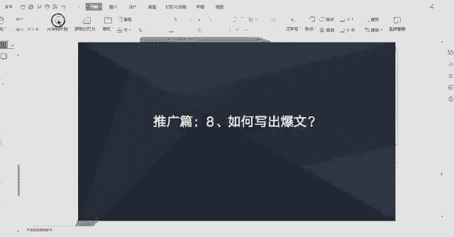

# 【2024版小红书运营教程】全B站最良心的小红书开店流程详解，高阶运营教程合集！小红书体开店，起号真的快，共1000集全是重要知识点，赶快点赞收藏起来！！ - P49：如何写出爆文 - 一盏灯的时间q - BV1eSaMeWEXf

这节课我们来学习一下如何写出报文。我们做小红书的一个笔记推广的话，其实追求就是豹文。范文就是数据非常好的一个笔记。那么写出豹纹的话，它是有一些技巧的。就这里就分享几个就是。啊，可以写出报文的一些方法。

第一点就是模仿跟沿用豹文的一个写作套路。呃，大家可以去搜索自己类目的一些笔记啊，比如说大家做的是一个美妆类的一个类目，然后做的是化妆水这一个产品。那么大家就可以去搜索化妆水相关的一些关键词。

那么找到一些呃数据比较好的一些笔记，大家可以去看一下这篇笔记它的一个写作套路是怎样的。然后呃我们可以去模仿这类笔记的一个写作套路。或者是自己在写的过程中的话，呃，发现哎这自己这篇笔记爆了。啊，数据报了。

那么也可以继续沿用这篇笔记的一个写作的一个套路。就是我们可以去模仿跟沿用沿用。然后的话第二个的话是可以直接套用一些豹纹的一些手图。比如说一些笔记他的一个呃文，它的一个笔记数据之所以好，肯定是有原因的。

比如说很很可能是他一张。他一张手图非常的吸引，点击，那么我们也可以。去找到这样的一个笔记，然后我们去套用它的一个手图，不是说完全搬过来。也就是说我们比如它首图里面主要宣传的一些点。

那我们也可以找一个相似的图去。也一样宣传那个点。就是套用豹纹的一个手图，不是完全搬过来啊，完全搬过来是不行的。我们可以稍微做一些。啊，改动优化调整，或者是模仿你图片的一个创意。图片的一个宣传点。

第二个的话就是我们可以去追一些热点和官方发起的热门话题。比如说用一些热点话题以及官方发起的一些热门话题来写我们的笔记。这样子的话，我们的笔记的话也是比较容易爆。第三个的话就是用心去写了。

用心去写有价值的一个原创笔记。因为写笔记它是一个做内容的过程，内容它讲的是一个价值度。如果我们不不去用心去写的话，那么。去哪去模仿这么多。好的一些豹文呢好的豹文它迟少有一天会被写烂。

那么的话还是最终还是需要我们自己用心去创作。但是小红书的话适当的模仿是在短期内是效果是比较好，但是模仿一段时间这个东西肯定会被写烂，那写烂了，用户他会看腻了，看腻了就不感兴趣了，他就他就很难再去抱起来。

那么最重要一点还是用心去创作。关于追热点跟官方发起的一个热门话题的话，怎么去找呢？嗯，这里简单介绍一下。

比如在我们小红书有个搜索框，我们点击搜索搜索框之后就跳到这一个页面。而这个页面这里的话就是这里有一个热门的搜索。热门搜索下面的话有一些关键词，大家注意看有些关键词前面有一个火有一个火的符号。

就带火的符号，这一些话题是呃官方发起的一个热门话题。比如说大家可以。结合自己的内目跟产品，看看是否跟这些话题。有相关性，如果有相关性的话，可以用这些话题去去写笔记，也是比较容易爆的。

那么想了解更多的一个热门的一个话题，我们可以点这里热门的榜单，然后会跳到这里。热门榜单这里有热搜热。热门的话题，我们可以在这里去啊挑选一些适合我们类目，适合我们产品的一些话题跟呃热点去写笔记。

也是比较容易爆的。