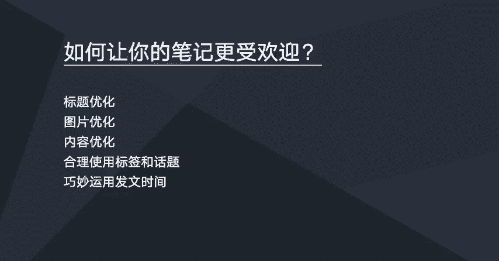

# 【2024版小红书运营教程】全B站最良心的小红书开店流程详解，高阶运营教程合集！小红书体开店，起号真的快，共1000集全是重要知识点，赶快点赞收藏起来！！ - P50：如何让你的笔记更受欢迎 - 一盏灯的时间q - BV1eSaMeWEXf

这节课的话，我们一起来学习一下如何让你的笔记更受欢迎。

呃，想让自己的笔记在小红书上面更受欢迎的话，我们是需要做一些优化的。那么首先要做的话就是标题优化。其次的话就是图片优化，还有内容优化以及合理的使用啊笔记当中的一个标签以及话题。然后巧妙的运用发文的时间。

我们只需要做好这5点的一个优化，就可以让我们的笔记在小红书当中更受欢迎。那么下一节下一节课会重点去说一下标题优化怎么去做。

