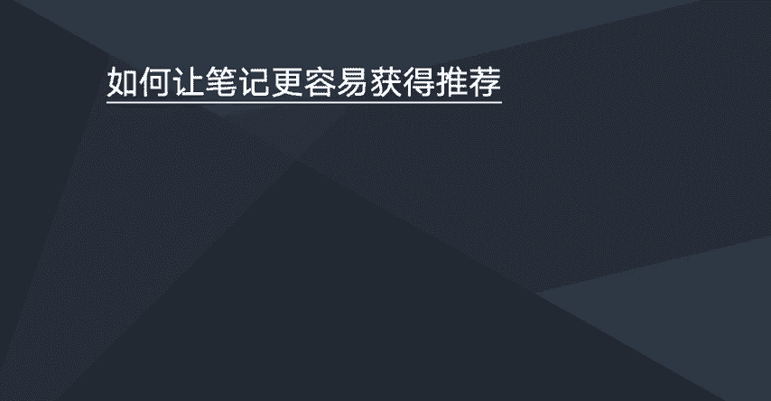

# 【2024版小红书运营教程】全B站最良心的小红书开店流程详解，高阶运营教程合集！小红书体开店，起号真的快，共1000集全是重要知识点，赶快点赞收藏起来！！ - P51：如何让笔记更容易获得推荐 - 一盏灯的时间q - BV1eSaMeWEXf

这一节我们来学习一下，如何让让笔记更容易获得推荐。

笔记获得推荐的话，就是呃这个推荐是官方给你推荐一些真实的读者来看你的笔记。比如说官方给你推荐的越多，那么你笔记的一个阅读量也会越多，那你笔记的数据也会越好。那么如何。如何做到这点呢？

那他也是有一些技巧了，这里分享几点。

第一点的话就是注重一个账号的一个标签。比如说种账号的标签要养好，然后内容要垂直。就账号的标签呃，也需要垂直，就是养号这一个前面有说过，就是这里就不多说了。因我们账号的标签养好以后保持内容的一个垂直度。

然后我们在发布笔记之前，我们最好是能够先去阅读呃该领域。比如我们要写一篇。减肥的一个笔记。那我们在发布这篇减肥笔记之前，我们先看看个十几篇减肥。减肥的一些相关笔记。然后在这些笔记下面我们去做一些互动。

比如说去点赞、评论啊，收藏啊这些笔记。然后做完这个动作之后，我们再把自己的笔记发布出去。这样子的话是呃能够获得更多推荐的几率会更大。

然后第二个的话就是我们的笔记发布出去之后，呃，我们发现唉好像没什么数据。那这个时候的话也不是说我们笔记发发布出去之后没数据，那就结束了的。那再选出，它是可以去修改修改笔记的。然后修改笔记。

然后再重新发布，它它可以重新去计算。就是说如果你修改的好，你重新发布之后，他会再给你推荐一些流量过来。所以说我们当我们笔记发布之后，发现没什么数据。

大家可以尝试去修改一下主首图修改修改一下我们的标题或者是我们的一些内容，修改之后再发布。但呃怎么改呢？大家可以就是。根据这篇文章的一个。受众人群的一些关注点，关注点或者一些一些细节的东西。

我们去做一些微调。然后改了之后，我们再发布，看看有可能他会有数据。如果没有的话，可以尝试再继续改。或者是把这篇笔记，就是你觉得这篇笔记你自己写的比较满意的，你觉得应该是一篇好的笔记。

那么你可以那如果是好的笔记发布出去，又没有推荐，没有数据，那你可以把这篇笔记复制一下，然后然后把语音笔记给删了，然后你再重新再呃再写一篇笔记就重新再呃。再进入那个发布笔记的环节。

然后把这篇笔记再复制进去，然后也是稍微做一些改动，然后再重新发布，以这样的一个操作手法来呃重新获得一个推荐。

第三1点的话就是需要我们把我们的首图跟标题优化好。也就是说我们我们的笔记也要注重一个搜索点击率。比如说我们笔记的一个点击率越高，那么官方会给我们的推荐能量也会越大。所以大家呃。

要多放点心思在呃笔记的首图跟标题上。优化好我们一个搜索点击率。其次的话就是认真做好内容，就是让我们的内容嗯价值度更大。比如说让读者是发自内心。看完我们的笔记之后，他是自愿参与一些互动。

比如说看完我们的笔记之后，他自愿去点赞。哎，觉得这文章好，觉得这个文章有价值，他自愿来点赞收藏，或者是来做一些评论或者转发，或者是觉得哎你写的文章很有价值。我关注你的账号。

想看看你下次再向想看看你下次写的文章。然后这几个互动的一些维度，比如点赞、评论、收藏、转发，关注账号，它是有权重的说法的。

然后他群众比例是这样子的。点赞收藏群众是一，评论转发，群众是4，关注关注的群众是8。这个群众怎么理解呢？呃，你可以把它看成一个群众看成是一分。比如说你发了一篇笔记。你的笔记有100个赞。

然后你这边笔记就可以加100分。啊，你的笔记有有50个评论，那么你的笔你你这边笔记就可以加个50乘以4，就是200，就加个200分。那么你这篇笔记为你带来了10个关注。那么你这篇笔记又可以加80分。

那这样子的话，你这篇笔记的话就是380分。也就说你一些笔记啊，按照这个算法，你的分数越高，那么官方给你的一个推荐流量就越大。这个群众可以这么理解，但这个呃这几个维度嗯，官方他有自己的一个算法。

就就说我们去刷，有可能是无效的。但官方怎么怎么去算，那肯定是不知道的。那么我我们在呃写笔记的时候，我们可以去用内容去引导啊，引导大家去做一些互动，或者做一些呃比如点赞收藏、转发、关注等等。比如说呃。

我们可以在文章的末尾觉得大家觉得笔记。呃。有价值的可以收藏一下之类的话。或者是用一些。呃，比如说点赞的点赞的小姐姐都是漂亮美丽的小姐姐。类似这样的话就是。

它一定程度上是可以提高一个笔记的一个呃这些数据的。然后这里的话就注意不要去嗯。出现一些诱导性的一些一些东西。如果诱导性比较明显的话，呃，官方发现的话，他也会。

也会给这篇笔记或者给你的账号进行一个限流的一个处罚的。所以这里的话大家可以了解一下。