# 【2024版小红书运营教程】全B站最良心的小红书开店流程详解，高阶运营教程合集！小红书体开店，起号真的快，共1000集全是重要知识点，赶快点赞收藏起来！！ - P5：第4课：小红书商品上架实操【小红书零基础电商运营课~全流程】 - 一盏灯的时间q - BV1eSaMeWEXf

大家好，这节课给大家讲解小红书的商品是怎么样上架到咱们的店铺后台，只有上架到咱们店铺后台，咱们才能去卖货，消费者才能去购买，对吧？那么首先这个操作啊，我建议大家哈是必须用到电脑的，如果不用到电脑。

我觉得这个项目你很难干下去。就这个很多的新手可能之前呃，他在问我，他说老师我必须要用电脑嘛？我说还真得必须用电脑，如果不用电脑，你就真的是不是正儿八经干项目的一个人，就是效率太低的。

你说手机上能不能上也能但是那个超级麻烦，效率太低呃，但是电脑不需要一天一直用是吧？就上货的时候用那那那那几个几十分钟就可以了啊，就时间很短的。所以这个东西还是很有必要的啊，按你什么样的电脑都行。

其实就能打开网页不卡就可以了啊，基本上都能用配置配置要求不高啊。呃，那么第二个就是咱们怎么样去操作给大家讲一下，首先咱们还要订购订购一个软件上架的软件。因为呃我知道大家想象中的上货。

可能是手动一个一个添加图片，对不对？但是给大家想的不一样。咱们这个上货非常简单，一键复制。你就把链接一点一啪一下都上传了，所以非常方便，电脑非常方便的啊。那么咱们需要如果这么方便去操作，所用到的软件。

就是这些软件摸鱼助手搞定商品，蚂蚁蚂蚁搬家打扫宝，这四个软件是一样的啊，你们只需要订购一一个都可以了。这个看看大家只是给大家推荐，这四个都可以啊。

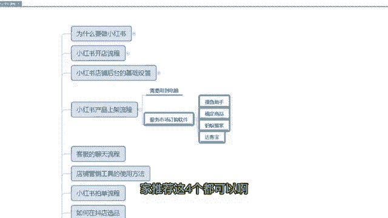

呃，那么我今天给大家演示一个就是刚出的一个软件，就是目前是免费12周啊，就是时间挺长的，就免费让大家用。我觉得这个给大家去演示一下啊，这个达卡宝。啊，那咱们点击呃呃从头开始给大家演示吧。

先进入咱们店铺商家的一个后台，有个服务。服务点了之后有个服务市场，咱们点击前往服务市场。啊，点击完之后，这里面有一个一键搬家，咱们点击一键搬家啊。嗯，那么这里面全是一键搬家的软件啊，你看又这些。

你看前期都是免费的，软件都给咱们免费啊，免费用一周，咱们用这个时间长的啊达卡宝。啊，然后是点击前网获取。啊，授权。

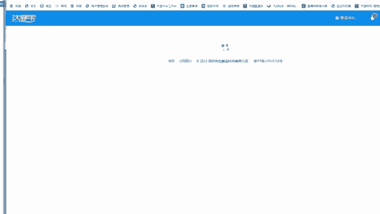

呃，完了之后点击这个商品搬家啊，点击免费试用商品搬家。啊，这里面免费使用90天，需要咱们订购这个服务，这个服务也是免费的啊，0元啊，先订购完之后返。

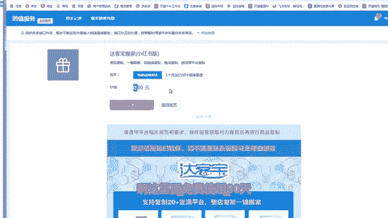

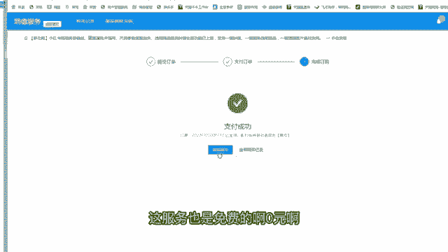

关闭啊，这里面点击试用。啊，这个就可以了啊。点击签署啊。哦，咱们订购完之后进入那个小红书的搬家界面啊。第一个按商品链接复制一般是用这个功能。

你看啊这功能里面能复复制很多这么多网站的链接都可以搬到咱们小红书店铺里面啊，但咱们一般用到的是1688啊，拼多多这两个因为是货源网站啊，咱们在这里面去找比较方便一些。那么基本上咱们都是用到拼多多啊。

因为拼多多价格没办法，实在太便宜了啊，而且售后还可以48小时发货，这个服务很好。那么咱们比如说我在拼多多里面搜一个桶装两个字啊，我比如说这个产品是我想上的，对吧？那么点击更多啊。

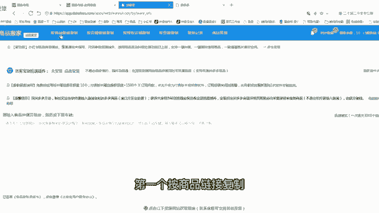

啊，然然后是咱们把这个链接复制下来啊，把这个网址啊，拼多多这个网址，然后点击复制啊。点击复制，复制完之后，然后粘贴到这个这个浏览器这个界面里面。因为我建议大家啊，你可以一个一个复制也行。

如果你方便的情况下，比如说你今天要要搬那个已经把品提提前选好了，你选了10个品，对不对？或者你选了三，你做了三条笔记要上架三个产品，你提前把这三个链接全搞上去，它一键啊全上了，这样比较方便一些。

然后咱们点击这个啊，点击呃，点击那个开始获取。

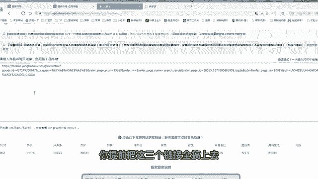

啊，这个按钮开始获取啊。啊，那么咱们在复制之前啊，咱们首先要对咱们这个要点击这个地方啊。确定啊要点击这个搬家设置，大家看好啊，先把搬家设置设置完之后，然后咱们再去搬运啊，先点击搬家设置。

这个搬家设置的话，大家可以按照我的操作去做啊。啊嗯里面有几个重要的点，我给大家去强调一下，第一个立即复制，这是试啊，这个不用改。然后这个里面是一个强大的一个点，默认运费模板，默认运费模板啊。

这个默认品牌大家不设置就行了，选不设置运费模板默认的是全国包邮，大家一定要选择非偏远地区包邮模板，要不然你新疆西藏也有运费，很多人把这个东西去忽忽视掉了啊，到时候你万一卖出去了，新疆你加30块钱运运费。

这个就有点坑了啊。所以这个要选上去要换了啊。

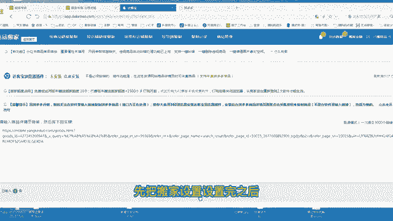

啊，这个库存可以填多点啊，999都可以啊啊，其他全部默认啊。然后是呃这个页面默认价格设置里面，大家按我的来市场价要3倍，就是300。那么售卖价要200啊，这是我们一般的一个习环设置。

就是我咱们要至少卖2倍的价格去卖啊，加价两倍去卖。

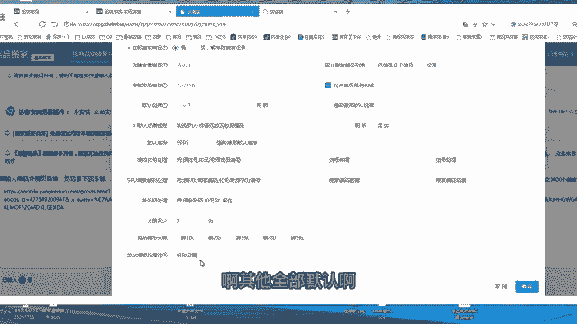

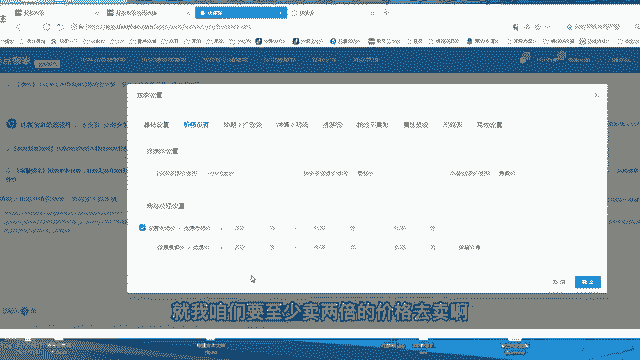

标题的话，过滤品牌，其他的默认详情的话呃详情的话。基本上都是默认啊基本上都是默认，然后是运物流模板，选选好物流模板就行了。相对时间发货，咱们发货时间一般是两天后发货。如果后面的话。

你想三天尽量是不要三天发货，还是48小时内两天发货就可以了啊。这个是默认违禁辞职里面嗯这个软件自带的啊，挺好的啊，跳额不复制啊，不用管属性预设，不用管尺码表不用管其他设置。

其他设置里面咱大家把这个东西去选一下啊，要支持7天无理由的啊，你不支持7天无理由没人买的啊。嗯这个要支持啊，然后点击确定啊，这是后面所有的复制的链接都会按照你这个搬家的设置去搬家，这样方便。

不用咱们每一次都设置了一遍啊。

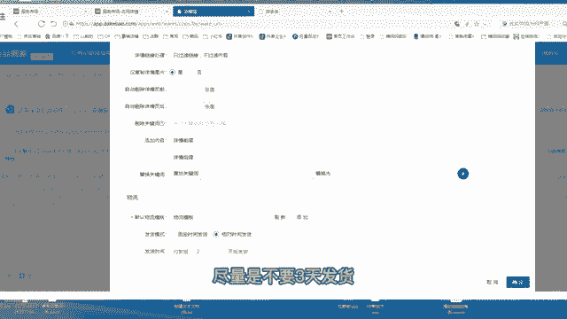

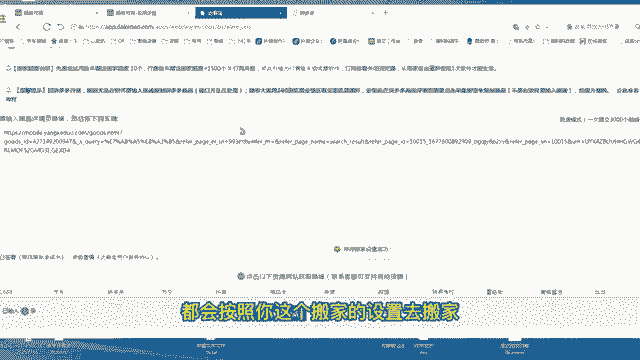

啊，然后咱们点击那个开始获取商品之后就会直接去这样用啊，这里面跟大家讲一下啊，因为最近的话是拼多多这边升级啊，然后升级的话这是一个呃之前是不需要的，推荐大家用360浏览器。

先安装这个插件这里面点击安装啊，给大家演示一遍，点击安装，然后点击这个360极速浏览器，因为我用的这个浏览器，你们什么浏览器就用哪个啊，然后下载完之后在这个地方啊，点击我刚才下载的。

点击打开打开这个插件就安添加完成了，在这个地方啊，有个答这个界面啊。

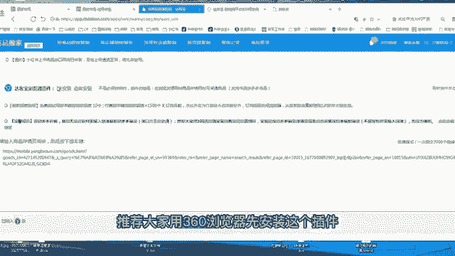

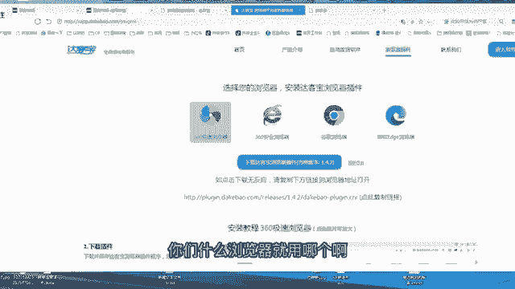

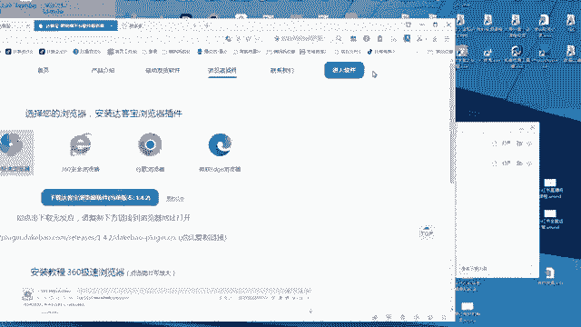

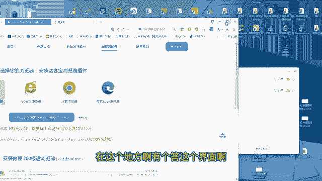

啊，添加完之后啊，比如说这是你的拼多多的链接啊，刚才咱们讲了拼多多的链接，你刷新一下，刷新一下，这里面会有一个采集该商品，采集该商品，咱们点击采集啊，对吧？已经采集了，采集完之后会在它的复制记录里面。

咱们再回到复制记录里面看它是不是正在复制啊，对不对？有个复制中，那么这个会更简便一点啊。因为最近是拼多多那边是有一些呃风控问题，大家按这个步骤去操作就可以了。

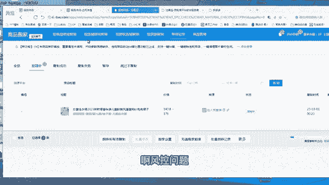

呃，然后是嗯达克宝上传完之后，它会在咱们商品列表当中点击后台的商品商品列表，你会看到这样一个商品，看到一个商品是开始是不是上架的一个状态啊。如果是这个时候咱们需要看一看商品有没有什么问题呀。

类目有没有对呀，可以点击一下编辑啊，这样比较保险一些。因为有时候它类目可能匹配的不对。如果你这是你看我这个东西是一个童装儿童的连衣裙，那么它匹配的儿童连衣裙，那这时候对的，如果它匹配不对。

咱们把类目再修改一下啊。啊，比如说他是开始衬衫，那么修改成连衣裙，然后下一步就可以了啊，非常简单啊，然后再去再次。点击这个提交就可以了。那这样咱们一个商品就已经复制完了。复制完之后。

咱们需要把它去上架啊，点击上架全部SKU那么这个商品咱们就可以去售卖了。

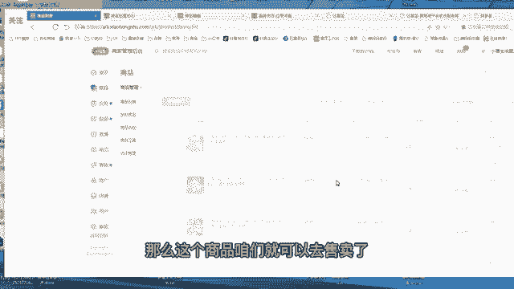

呃，这里面建议大家啊建议大家，因为你复制商品的时候啊，注意点啊嗯。啊，第一个上架的时候。呃，如果当天上的产品多。啊，尽量一次性。啊，都放进去啊都放进去。复制啊，这样这样就咱们不不用一个复制完了之后。

再等另一个这样节省时间啊。啊，第一个就是。上传完后，如果内目都不对。把类目改一下啊。啊，这样就可以了。

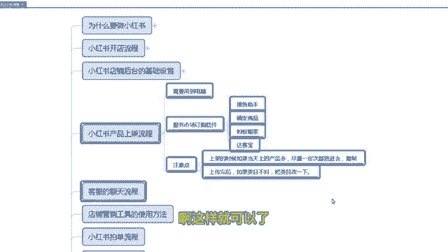